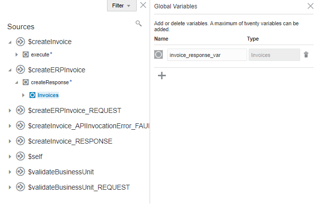
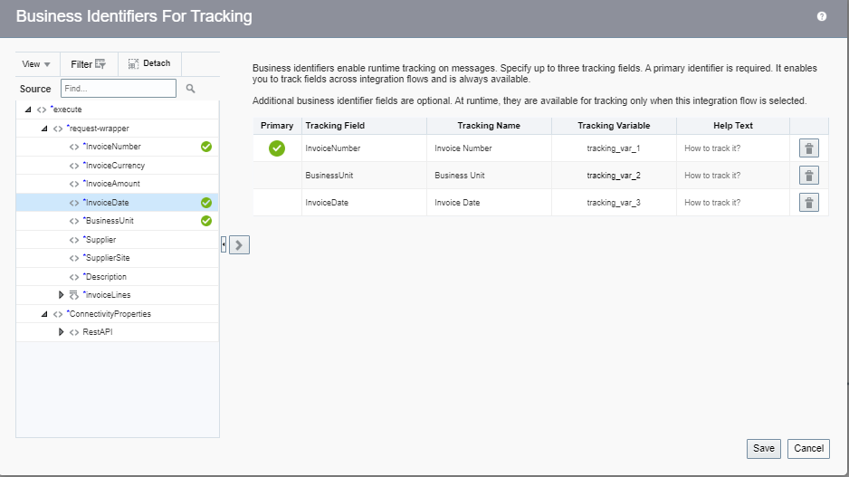
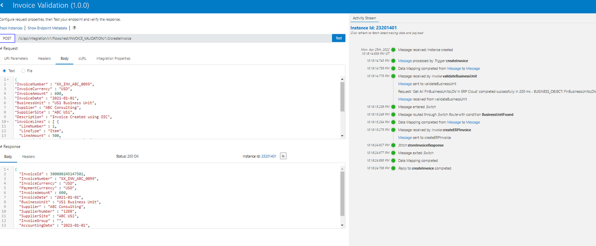
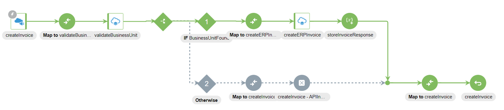

# Real Time Business Services Integration

## Introduction

This lab walks you through the steps to create an Integration flow which invokes ERP Cloud REST API.

This Lab explores the use of Oracle Integration to invoke Oracle ERP Cloud Business Services which
validates the data on the fly and creates a Payables Invoice in ERP Cloud. As part of the lab you will build the following use case scenario:

1.  You create and activate an integration that invokes Business services for example Financials Business Unit, Suppliers LOV and Invoice REST API. The Integration flow validates data from source Request and conditionally creates Invoices after Validation.
2.  You then trigger the Integration flow from Oracle Integration Tester.
3.  Your integration receives the request, validates various data elements and finally creates an Invoice in ERP Cloud

    The following diagram shows the runtime interaction between the systems involved in this use case:
      

Estimated Time: 20 minutes

### Objectives

In this lab, you will:

* Understand how to use ERP Cloud Adapter Connection as invoke role
* Invoke ERP Cloud REST Services for Validation/Enrichment
* Use Global Variables and Data Stitch to store intermediary results
* Configure Custom Fault Response to the Client

### Prerequisites

This lab assumes you have:

* All previous labs successfully completed.

## Task 1: Create Rest Adapter Connection

1. Starting at the Oracle Integration **Home** page, select ***Integrations***, then ***Connections*** from the left Navigation pane.
2. Click ***Create***, then select the ***REST*** Adapter and click ***Select***.
3. From the **Create Connection** dialog, **Name** your connection ***LL REST Interface*** and Select **Role** as ***Trigger*** , leave the rest of the configurations as defaulted. Click ***Create***.  
**Note**: If you get an error that the identifier already exists, change the Connection Name by suffixing username or so and remember this name for later use in the workshop.
4. Enter the following configurations in the **REST Connection**

| Field                   | Value                                                 |
|-------------------------|-------------------------------------------------------|
| Security Policy         | Basic Authentication                                  |

5. Confirm your Connection by clicking ***Test***. You should see the **Connection LL REST Interface was tested successfully** confirmation message. Click ***Save*** and exit the Connection editor.

##	Task 2: Create the Invoice Validation Integration
1. In the left Navigation pane, Click ***Integrations*** > ***Integrations***.
2. On the **Integrations page**, click ***Create***.
3. On the **Integration Style** dialog, select ***App Driven Orchestration***, followed by ***Select***

4. In the **Create New Integration** dialog, enter the following information:

    | **Element**        | **Value**          |       
    | --- | ----------- |
    | Name         | `Invoice Validation`       |
    | Description  | `ERP Business Services Integration` |


    Accept all other default values.

5. Click ***Create***
**Note**: If you get an error that the identifier already exists, change the Integration Name by suffixing username or so and remember this name for later use in the workshop.
6. Select Layout to ***Horizontal*** and Click ***Save*** to apply changes.

## Task 3: Create the REST Interface Trigger
1. Click the ***+*** sign below **START** in the integration canvas.

2. Begin typing ***LL REST Interface*** in the Search field to find the connection to your REST interface which is created in the previous Task.

3. Select the connection named ***LL REST Interface***
The Configure REST Endpoint wizard appears.

4. Name your endpoint ***createInvoice***.

5.  In the **What does this endpoint do?** field, enter:
***This endpoint defines the REST interface***

6.  Click ***Next***

7.  On the Resource Configuration page, configure the following properties
    - **What does this operation do?** ***Creates Invoice in ERP Cloud***
    - **What is the endpoint's relative resource URI:** ***/createInvoice***
    - **What action do you want to perform on the endpoint?:** select ***POST***
    - Select ***Configure request payload for this endpoint***
    - Select ***Configure this endpoint to receive the response***

8. Click ***Next***

9. On the **Request** Page
    - Select the **Request Payload Format** to ***JSON Sample***
    - Click the ***&lt&lt&ltinline&gt&gt&gt*** link.
    - Provide the below JSON and Click ***Ok***

    ```
    <copy>
    {
    "InvoiceNumber" : "XX_INV_ABC_0001",
    "InvoiceCurrency" : "USD",
    "InvoiceAmount" : 600,
    "InvoiceDate" : "2021-01-01",
    "BusinessUnit" : "US1 Business Unit",
    "Supplier" : "ABC Consulting",
    "SupplierSite" : "ABC US1",
    "Description" : "Invoice Created using OIC",
    "invoiceLines" : [ {
      "LineNumber" : 1,
      "LineType" : "Item",
      "LineAmount" : 500,
      "Description" : "Line 1 Description",
      "ProrateAcrossAllItemsFlag" : true
    }, {
      "LineNumber" : 2,
      "LineType" : "Item",
      "LineAmount" : 100,
      "Description" : "Line 2 Description",
      "ProrateAcrossAllItemsFlag" : true
    } ]
  }
    </copy>
    ```
    - In the **What is the media-type of Request Body?** Select ***JSON***
    - Select ***Next***

10. On the **Response** Page
      - Select the **Request Payload Format** to ***JSON Sample***
      - Click the ***&lt&lt&ltinline&gt&gt&gt*** link.
      - Provide the below JSON and Click ***Ok***

      ```
      <copy>
            {
        "InvoiceId" : 300000245076423,
        "InvoiceNumber" : "XX_INV_ABC_0002",
        "InvoiceCurrency" : "USD",
        "PaymentCurrency" : "USD",
        "InvoiceAmount" : 2500,
        "InvoiceDate" : "2021-01-01",
        "BusinessUnit" : "US1 Business Unit",
        "Supplier" : "ABC Consulting",
        "SupplierNumber" : "1288",
        "SupplierSite" : "ABC US1",
        "InvoiceGroup" : null,
        "AccountingDate" : "2021-01-01",
        "Description" : "Invoice Created using OIC"
      }
      </copy>
      ```
      - In the **What is the media-type of Response Body?** Select ***JSON***
      - Select ***Next*** and Click ***Done***

## Task 4: Configure Validate Business Unit
1.  Hover over the outgoing arrow for the **createInvoice** activity and click ***+***

2.  Begin typing ***LLDemo_ERP*** Service in the Search field and Select the ERP Cloud Connection

3.  In the **Basic Info** page name your endpoint ***validateBusinessUnit***

4.  Click ***Next***

5.  In the **Actions** page Select ***Query,Create,Update or Delete Information***. Click ***Next***

6.  On the **Operations** page
    - In the **Browse by** list of values Select ***Business (REST) Resources***
    - **Select a Service Application** Select ***fscmRestApp***
    - **Select a Business Resource** to search for ***FinBusinessUnitsLOV*** and Select the Resources
    - **Select the operation** as ***getAll*** and Click ***Next***

7.  On the **Summary** page Select ***Done***

## Task 5: Define the Data Mapping (validateBusinessUnit)

A Map action named Map to validateBusinessUnit is automatically created. We'll define this data mapping.

1.  Select the ***Map to validateBusinessUnit*** action. Click the ***edit*** icon. The **Data Mapping** page appears

2.  In the Target section, expand ***Query Parameters***

3.  Use the mapper to drag element nodes in the source createInvoice Request structure to element nodes in the target validateBusinessUnit Request structure.

    Expand the **Source** node:

    ```
    createInvoice Request > Request Wrapper
    ```

    Expand the **Target** node:

    ```
    validateBusinessUnit Request > Query Parameters
    ```

    Complete the mapping per below:    

    | **Source**      | **Target**  |
    | --- | ----------- |
    | In the expression field enter concat("BusinessUnitName=", /nssrcmpr:execute/nssrcdfl:request-wrapper/nssrcdfl:BusinessUnit) | Query |

    ```
    Note: The xpath expression namespace might vary. So, always drag the element which will capture the correct namespace.

    Note: You can drag functions from the Component section, expand Functions, and then expand String Category
    ```

4.  Click the ***Tick Mark*** in the expression editor. Click ***Validate***. A message confirming the expression is valid appears. Click ***Close*** and ***Save*** the Integration Flow.

## Task 6: Check for Business Unit

Let's check if the Business Unit sent in the Request payload is Valid or not.

1.  Click ***Actions*** icon and from the **Collection** section, drag ***Switch*** to the **Integration** Canvas and place it after the **validateBusinessUnit** activity.

Two flow branches appear in the flow:
  - Undefined: this branch checks the **count of items**. If the expression evaluates to true, the instance follows the flow in this branch.
  - the instance follows this branch when the routing expression for the initial branch resolves to false. We will configure a fault return if the Business Unit is Invalid.

### *Define the IF conditional flow*

1.  Select ***Undefined***

2.  Click ***Edit*** Icon. The Expression builder appears

3.  Define an expression to check if any business units returned per the query parameter.

    - In the **Expression Name** field, enter ***BusinessUnitFound***
    - In the **Source** section, select $validateBusinessUnit/nsmpr5:getAllResponse/nsmpr5:items
    - Click ***>***
      The $validateBusinessUnit/nsmpr5:getAllResponse/nsmpr5:items element appears in the first part of the expression, and a **green** checkmark appears next to the node.
    - Formulate the expression as count($validateBusinessUnit/nsmpr5:getAllResponse/nsmpr5:items). This returns # of items nodes

4.  In the **New Condition** box, enter ***1.0*** in the field after the equal operator

5.  Click ***Validate***.
    A message confirming the expression is valid appears.

6.  Click ***Close*** and ***Save***.

### *Invoke Create Invoice*

1.  Hover over the outgoing arrow for the **IF condition** activity and click ***+***

2.  Begin typing ***LLDemo_ERP*** Service in the Search field and Select the ERP Cloud Connection

3.  In the **Basic Info** page name your endpoint ***createERPInvoice***

4.  Click ***Next***

5.  In the **Actions** page Select ***Query,Create,Update or Delete Information***. Click ***Next***

6.  In the **Operations** page
    - In the **Browse by** list of values Select ***Business (REST) Resources***
    - **Select a Service Application** Select ***fscmRestApp***
    - **Select a Business Resource** search for ***Invoices*** and Select the Resources
    - **Select the operation** as ***create*** and Click ***Next***
    - **Select Child Resources** Select ***invoiceLines*** and Move to the **Your Selected Child Resource(s)** box. Click ***Next***
    - In the **Select Flexfield contexts** Do not Select anything and Click ***Next***

7.  In the **Summary** page Select ***Done***

### *Define the Mapping Map to createERPInvoice*

A Map action named Map to createERPInvoice is automatically created. We'll define this data mapping.

1.  Select the ***Map to createERPInvoice*** action. Click the ***edit*** icon. The **Data Mapping** page appears

2.  Use the mapper to drag element nodes in the source **createInvoice** Request structure to element nodes in the target **createERPInvoice** Request structure.

    Expand the **Source** node:

    ```
    createInvoice Request > Request Wrapper
    ```

    Expand the **Target** node:

    ```
    createInvoice Request > Invoices
    ```

    Complete the mapping per below:    

    | **Source**      | **Target**  |
    | --- | ----------- |
    | Invoice Number | Invoice Number |
    | Invoice Currency | Invoice Currency |
    | Invoice Amount | Amount |
    | Invoice Date | Invoice Date |
    | Business Unit | Business Unit |
    | Supplier | Name |
    | Supplier Site | Site |
    | Description | Description |
    | Invoice Lines | Invoice Lines |
    | Invoice Lines > Line Number | Invoice Lines > Line Number |
    | Invoice Lines > Line Type | Invoice Lines > Line Type |
    | Invoice Lines > Line Amount | Invoice Lines > Line Amount |
    | Invoice Lines > Description | Invoice Lines > Description |
    | Invoice Lines > Prorate Across All Items Flag | Invoice Lines > Prorate Across All Items Flag |

    ```
    Note: You can easily find a Source or Target Element by using the Search functionality
    ```

4.  Click ***Validate***. A message confirming the expression is valid appears. Click ***Close*** and ***Save*** the Integration Flow.

### *Define the Global Variable*

Define Global Variable to store the createInvoice Response. We need this because the createInvoice Response variable is created automatically within the scope of the Switch condition. To access the response payload we will use Data Stitch Activity to achieve the requirement.

1.  Select ***(x)*** Global Variables from the Right-hand side palette

2.  Select ***Add Variable***.

3.  Provide **Name** as ***invoice\_response\_var*** and Select **Type** as ***Object***. This brings up the Sources pane with all the variables. Select ***$createERPInvoice > createResponse > Invoices*** variable

    

4.  Close the Global Variables pane, which creates and saves the newly created Variable

5.  ***Save*** the Integration Flow

6.  Hover over the outgoing arrow for the **createERPInvoice** activity and click ***+***. Search for **Data Stitch** activity. (Alternatively, you can drag from the **Actions** palette)

7.  In the **Properties** pane provide **Name** as ***storeInvoiceResponse*** and Click ***Configure***

8.  A New pane for the Data Stitch activity appears. Here we select the Variable and Values.

    - Select the Tools Icon next to the  **Variable (x)** box to Switch to Developer View. From the **Sources** view select ***$invoice\_response\_var*** drag into the **Variable (x)** box.
    - Select **Operation** as ***Assign***
    - In the **Value (x)** box (Switch to Developer view if required) Select ***$createERPInvoice > createResponse > Invoices*** drag into the **Value (x)** box
    - Click on ***Close*** and ***Save*** the Integration flow

### *Define the Response mapping (createInvoice)*

The response we got from ERP Cloud for **createERPInvoice** must be mapped to the Integration Flow response to send back to the client. We will be mapping only a few elements to indicate that a New Invoice is Created in ERP Cloud.

1.  Select the ***Map to createInvoice*** and Click ***Edit***

2.  Use the mapper to drag element nodes in the source **invoice\_response\_var** Request structure to    
    element nodes in the target **createInvoice Response** Request structure.

    Expand the **Source** node:

    ```
    invoice\_response\_var  > Invoices
    ```

    Expand the **Target** node:

    ```
    createInvoice Response > Response Wrapper
    ```

    Complete the mapping per below:    

    | **Source**      | **Target**  |
    | --- | ----------- |
    | Invoice Id | Invoice Id |
    | Invoice Number | Invoice Number |
    | Invoice Currency | Invoice Currency |
    | Payment Currency | Payment Currency |
    | Amount | Invoice Amount |
    | Invoice Date | Invoice Date |
    | Business Unit | Business Unit |
    | Name | Supplier |
    | Supplier Number | Supplier Number |
    | Site | Supplier Site |
    | Invoice Group | Invoice Group |
    | Accounting Date | Accounting Date |
    | Description | Description |

3.  Click ***Validate*** and Select ***Close***. ***Save*** the Integration Flow


### *Define the Otherwise conditional flow*

1.  Select ***Actions*** and drag ***Fault Return*** Activity. This activity returns a Custom
    Fault

2.  Select the ***Map to createInvoice*** to configure Fault details.

3.  Expand the Target **createInvoice Fault** and map per the following

    | **Source**      | **Target**  |
    | --- | ----------- |
    | "Invalid Business Unit" | Title |
    | "The value for the Business Unit attribute is invalid. You must provide a valid value" | Detail |
    | "400" | Error Code |

    ```
    Note: If the Target element is greyed out, Select the target node and Right Click "Create new Node" which brings up the Expression Editor

    ```

4.  Select ***Validate*** and ***Close***

Your final Integration Flow should look as below


## Task 7: Define Tracking Fields
Manage business identifiers that enable you to track fields in messages during runtime.

> **Note:** If you have not yet configured at least one business identifier **Tracking Field** in your integration, then an error icon is displayed in the design canvas.

1. Click the ***Actions*** menu on the top right, then select ***Tracking***.
    

2. From the **Source** section, expand ***execute > request-wrapper***, Drag the ***InvoiceNumber*** , ***BusinessUnit*** and ***InvoiceDate***  fields from Source to the *Drag a trigger field here* section:

    

3. Click ***Save***.

4. On the Integration canvas, click ***Save***, followed by ***Close***.

## Task 8: Activate the integration

1. On the **Integrations** page, click on the ***Activate*** icon.

2. On the **Activate Integration** dialog, select ***Enable Tracing***, followed by ***Include Payload*** options.

3. Click ***Activate***

    The activation will be complete in a few seconds. If activation is successful, a status message is displayed in the banner at the top of the page, and the status of the integration changes to **Active**.

## Task 9: Formulate Request Payload to Create Invoice

We will be testing the Integration flow with a happy case and fault case by modifying the request payload.

1.  Login to ERP Cloud. Identify the user who has the role of Create Invoices

2.  Navigate to ***Payables > Invoices***

3.  Select ***Tasks > Create Invoice***

4.  Provide the values per below
    | **Name**      | **Value**  |
    | --- | ----------- |
    | Business Unit | US1 Business Unit |
    | Supplier | ABC Consulting |

    Make a note of the following values
      - Business unit
      - Supplier
      - Supplier Site

    Do not create the Invoice. We will need valid values to formulate the Test Request payload.

## Task 10: Test the Integration Flow

We will test the end to end Integration flow using the built-in Test Client. In an ideal scenario, the request would be posted from a Web, Mobile Client and so on.

1. From **Integrations** page Hover over the **Invoice Validation** Integration Flow and Select ***Run*** and Click on ***Test***

2. Select ***Body*** Tab and make sure ***Text*** Radio button is selected. Provide the below Payload

    ```
    <copy>
    {
    "InvoiceNumber" : "XX_INV_ABC_0099",
    "InvoiceCurrency" : "USD",
    "InvoiceAmount" : 600,
    "InvoiceDate" : "2021-01-01",
    "BusinessUnit" : "US1 Business Unit",
    "Supplier" : "ABC Consulting",
    "SupplierSite" : "ABC US1",
    "Description" : "Invoice Created using OIC",
    "invoiceLines" : [ {
      "LineNumber" : 1,
      "LineType" : "Item",
      "LineAmount" : 500,
      "Description" : "Line 1 Description",
      "ProrateAcrossAllItemsFlag" : true
    }, {
      "LineNumber" : 2,
      "LineType" : "Item",
      "LineAmount" : 100,
      "Description" : "Line 2 Description",
      "ProrateAcrossAllItemsFlag" : true
    } ]
    }
    </copy>
    ```
    Modify the above payload with the values captured from ERP Cloud for **Business Unit, Supplier and Supplier Site**. Provide a unique **Invoice Number**

  3.  Click on ***Test***. Observe the **Response** payload returned.

      

  4.  Select the Instance Id and View the Integration flow

      

  5.  Modify the **Request Payload** with an Invalid Business Unit and Test the Integration Flow. Observe
      the Custom Fault Payload returned and the **Otherwise** condition is executed.

## Task 11: Extend the Usecase (Bonus Lab)

    There are a few hints provided in the Bonus Lab to extend the use case which will Validate the Supplier and Supplier Site. Refer to the Introduction section for High-Level Flow

### *Validate Supplier Activity*

  1.  Use **ERP Cloud** Connection and configure the REST resources to invoke ***SupplierLOV > getAll*** operation

  2.  In the **Child Resources** page Select ***sitesLOV***

### *Define the Map to validateSupplier*

  1.  In **validateSupplier Request** provide Query Parameters per below
      - Expand -> "sitesLOV"
      - Query -> concat ("SupplierName=", /nssrcmpr:execute/ns31:request-wrapper/ns31:Supplier )

### *Create IF Condition for Supplier*

  1.  In the ***If*** condition use the condition **count($validateSupplier/nsmpr13:getAllResponse/nsmpr13:items) = 1.0** to Validate if Supplier is Found

### *Create IF Condition for Supplier Site*

  1.  In the ***If*** condition use the condition **count($validateSupplier/nsmpr13:getAllResponse/nsmpr13:items/nsmpr7:sitesLOV[nsmpr2:SupplierSite=/nsmpr8:execute/nsmpr4:request-wrapper/nsmpr4:SupplierSite]) = 1** to Validate if Supplier Site is Found

### *Create Otherwise Condition for Supplier and Supplier Site*

  1.  Create Otherwise condition for Supplier and Supplier Site to return fault payload accordingly

      Your Final Integration Flow after the Bonus Lab Activity should be per below

      

**Congratulations!** You have learnt how to invoke ERP Cloud REST API with the Out of the box adapter capabilities. ERP Cloud Adapter abstracts the API/Services/Business Objects and provides an intuitive interface which Simplifies the task to perform Real-Time Synchronization.

## Learn More

* [Getting Started with Oracle Integration](https://docs.oracle.com/en/cloud/paas/integration-cloud)
* [Using the Oracle ERP Cloud Adapter with Oracle Integration](https://docs.oracle.com/en/cloud/paas/integration-cloud/erp-adapter)

## Acknowledgements

* **Author** - Kishore Katta, Director Product Management, Oracle Integration
* **Contributors** - Subhani Italapuram, Director Product Management, Oracle Integration
* **Last Updated By/Date** - Kishore Katta, May 2022
