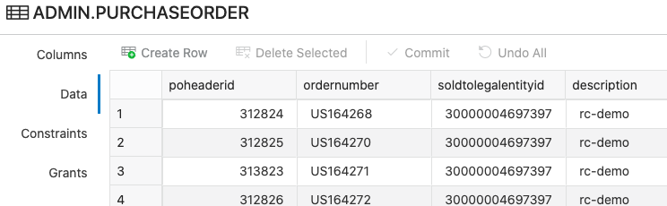

# Run end-to-end demo

## Introduction
This demo lab will walk you through the steps to create an ERP Purchase Order and validate how the data is processed in the integration flow. 

Estimated Time: 10 minutes

### Objectives
In this lab, you will:
- Create Purchase Order (PO) in ERP Cloud
- Validate PO status
- Track message flow triggered by the PO Create Event
- Verify PO record in ADW Table

### Prerequisites
This lab assumes you have:
- Completed all previous labs successfully 

## Task 1: Create Purchase Order in ERP Cloud
1. Access your ERP Cloud environment. Login with a user having the correct roles and privileges to create a PO. 

2. Navigate to the **Procurement** Tab.

3. Click **Purchase Orders**.

4. In the *Overview* section, click **Tasks** button on the right.
   

    This opens the Tasks menu. 

5. Under the *Orders* section, select **Create Order**.
  

    The *Create Order* dialog is displayed.

6. Enter a valid entry in the *Supplier* field, for example `ABC Consulting`, and select the corresponding supplier in the drop down. 

    > **Tip:** You can also search for valid suppliers using the **Search** icon. 

7. Click **Create**.

    

    The *Edit Document (Purchase Order)* page is displayed.

8. Under *General* section, in the *Description* field, enter the same value used for *Lab 2 > Task 2 > Step 5: Filter Expr for Purchase Order Event*. For example: `<your-initials>-demo`

    

9. In the *Lines* Tab, click **+** to add a Purchase Order line row.
    

10. Enter values in the below fields (sample values provided)
    | **Field**        | **Value**          |       
    | --- | ----------- |
    | Line | `1` (Default)       |
    | Type | `Goods` |
    | Item | Choose a valid item. For example, start typing `AS1`, and choose an item from the resulting drop-down (or hit the search button to select a valid item)
    | Description | &lt;keep default&gt; or enter a value if empty |
    | Quantity | Enter a valid number, eg. `2` |
    | UOM | `Ea` (Default) |
    | Base Price | Enter a valid number, eg. `200`

     

11. Click the **EDIT** button under *Lines* section.
    

    This opens the *Edit Line* page for the current purchase order line. 

12. Enter a future date in either *Requested Delivery Date* or *Promised Delivery Date* fields. 
    

13. Click **OK** at the top right of the *Edit Line* page and return to the parent window. 

14. Click **Submit** to initiate the the Purchase Order processing. 
    

    After submitting the Purchase Order, a confirmation message should appear with the PO number.

15. Click **OK** to close the confirmation dialog. 

## Task 2: Validate Purchase Order status
After the PO is submitted, the initial status becomes *Pending Approval*. The PO Create event will occur once the status changes to *Open*. 

1. In the **Overview** section, click **Tasks** button on the right.

    This opens the *Tasks* menu. 

2. Under the *Orders* section, click on **Manage Orders**.

3. Click **Search**. You should see the Purchase Orders for the current user. 

4. Look for your Purchase Order in the list with the PO number displayed in the previous task.

    > **Tip:** The last created PO should generally be the top one in the list.

5. Validate the PO Status. If it's *Open* then the Business Event has occurred. 

    > **Note:** If PO has another Status, such as *Pending Approval*, then wait a couple of minutes and keep refreshing the page until the desired PO Status appears. 

## Task 3: Track message flow triggered by the PO Create Event
Use the Oracle Integration dashboard to see the data flow resulting from the create Purchase Order event in ERP Cloud. 

1. In the Integration navigation pane, click **Home** > **Monitoring** > **Integrations** > **Tracking**

2. Find our corresponding Integration Instance, by matching the *PO Header Id* or *Document Description* from the Purchase Order in ERP Cloud. This should be under the columns *Primary Identifier* or *Business Identifiers*.

   

3. Click on your **PO Header Id** link to open the corresponding integration instance.

   

    The flow ran successfully if it is displayed with a green line.

    

4. Click on the **Actions** menu on the top right of the screen, and select **View Activity Stream**.
    
     

5. In the Activity Steam window, click on the different **Message** links to review the flow of request and response messages. 

6. Click **Close** after reviewing the Activity Stream. 

## Task 4: Verify PO record in ADW Table
Follow these steps to view the PO record in the designated DB table. 

1. If you are not already logged in to Oracle Cloud Console, log in and select **Autonomous Data Warehouse** from the navigation menu.

    

    > Note: You can also directly access your Autonomous Data Warehouse or Autonomous Transaction Processing service in the **Quick Actions** section of the dashboard.

2. Navigate into your demo database by clicking on the instance link.

    

    > Note: Similar steps apply to either Autonomous Data Warehouse or Autonomous Transaction Processing.

3. In your ADW Database Details page, click the **Database Actions** button.

    

4. Sign-in with your database instance's default administrator account, Username = `ADMIN` and click **Next**.

   

5.  Enter the **ADMIN** password and click **Sign in**.

    

6. The Database Actions page opens. In the *Development* box, click **SQL**.

    

7. The SQL Worksheet appears. In the *Navigator* on the left, select the **PURCHASEORDER** table, then right-click on **Open**.
    

    This opens the *ADMIN.PURCHASEORDER* table window. 

8. Click on **Data** in the left menu to display the table data. Verify your PO record is available. 
   

You have completed the final step of this workshop. Thank you! 

## Acknowledgements
* **Author** - Ravi Chablani, Product Management - Oracle Integration
* **Last Updated By/Date** - Ravi Chablani, April 2022

