# Create Integration flow

## Introduction
This lab will walk you through the steps to create an end-to-end integration of reading a file from the File Server and inserting the data set in an Oracle Autonomous (ADW) Table.

Estimated Time: 15 minutes

### Objectives
You will execute the following:
- Initiate a Scheduled integration flow
- Configure FTP Adapter
- Add the ADW invoke activity
- Map data between Source File structure and ADW invoke
- Define Tracking Fields
- Activate the integration


### Prerequisites
This lab assumes you have:
- Completed all the previous labs.


## Task 1: Initiate a Scheduled Integration Flow
We will start by creating a new integration and adding some basic info.

1. In the left Navigation pane, click **Integrations** > **Integrations**.
2. On the Integrations page, click **Create**.
3. On the *Integration Style* dialog, select **Scheduled Orchestration**, followed by **Select**.

    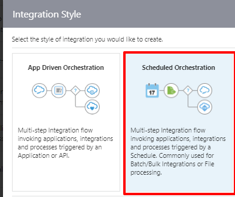

4. In the *Create New Integration* dialog, enter the following information:

    | **Element**        | **Value**          |       
    | --- | ----------- |
    | Name         | `LL Insert Sales Orders to ADW`       |
    | Description  | `Live Lab to Read File and Insert Sales Orders to ADW` |
    |

    Accept all other default values.

5. Click **Create**.

6. Click **Save** to apply changes.


## Task 2: Define FTP Invoke Activity
Add FTP Invoke to integration canvas.

1. Change the Layout to Horizontal from the Toolbar on the top. Hover over the outgoing arrow from the *Scheduled* activity and Click the **+** sign in the integration canvas.

2. Select the configured FTP Adapter connection which is created in the previous lab. This invokes the Oracle ERP Cloud Endpoint Configuration Wizard.

3. On the Basic Info page, for *What do you want to call your endpoint?* element, enter `downloadSalesOrders`. Leave the rest as defaults.

4. Click **Next**.

5. On the *Operations* page, Select the following values:

    | **Element**        | **Value**          |       
    | --- | ----------- |
    | Select Operation        | **Download File**       |
    | Select a Transfer Mode  | **Binary** |
    | Input Directory | **/home/users/<your username>/Output** |
    | File Name | **sales_orders.csv** |
    | Download Directory | **/tmp/stage** |

    

6. Click **Next**.

7. On the Summary page, review the configuration and click **Done**.

8. Click on **Save** to apply your changes.

    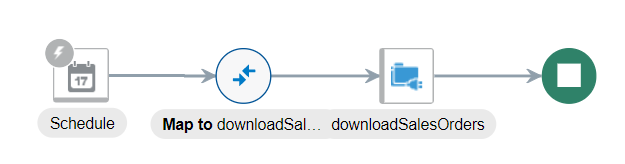

## Task 3: Add the ADW invoke activity
Add the Oracle Autonomous Data Warehouse Adapter invoke to the integration canvas.

1. Hover your cursor over the outgoing arrow of *downloadSalesOrders* activity in the integration canvas to display the **+** sign. Click the **+** sign and select the ADW connection created in the previous lab.

    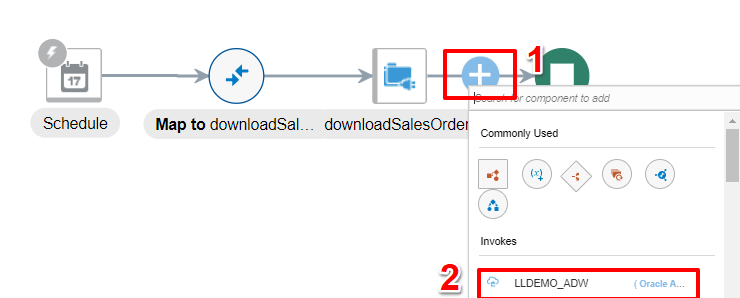

    This invokes the Oracle Autonomous Data Warehouse Endpoint Configuration Wizard.

2. On the Basic Info page, select the following values:

    | **Element**        | **Value**          |       
    | --- | ----------- |
    | What do you want to call your endpoint? | `insertSalesOrders`       |
    | What operation do you want to perform? | **Perform Bulk Data Operation** |

3. Click **Next**.

4. On the *Bulk load from Object Storage to ATP table* page, select the following values:

    | **Element**        | **Value**          |       
    | --- | ----------- |
    | Select Bucket | **bucket-demo** (Select the Object Storage bucket that was created in previous lab)  |
    | Delete file from object store after operation completion | **Un Check** |
    | Select Schema | **ADMIN** |
    | Select Table | Select **V\_SALES\_ORDERS**|
    | Table columns | Click **>>** to move all the fields to the *Selected* box|

    **Note:** The selected order of the columns should be per the input sales_order.csv data

    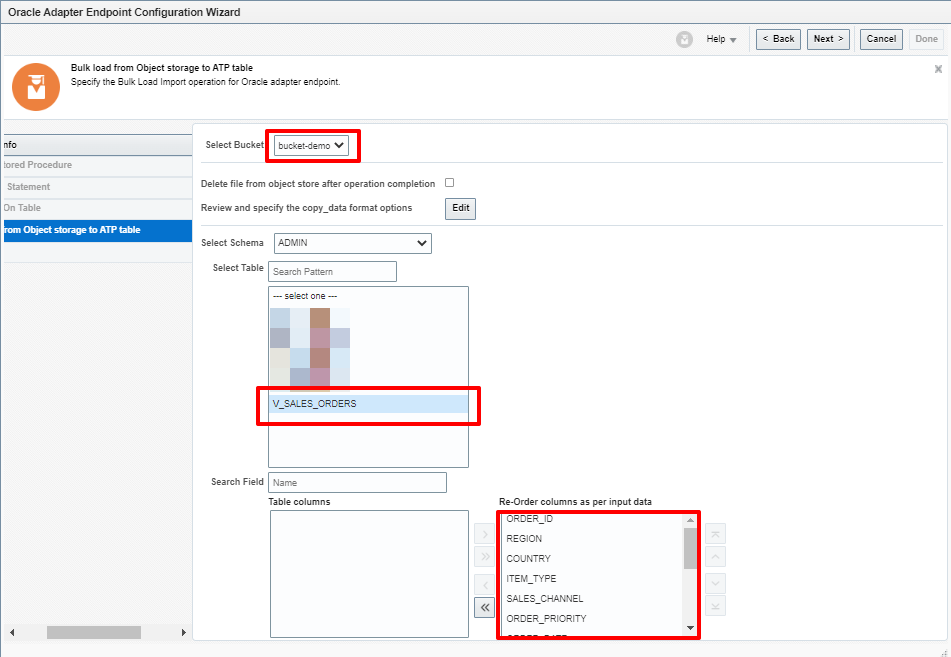

5. Click on **Edit**, in the *Bulk load from Object storage to ATP table* page in the section *Review and specify the copy_Data format options*.

    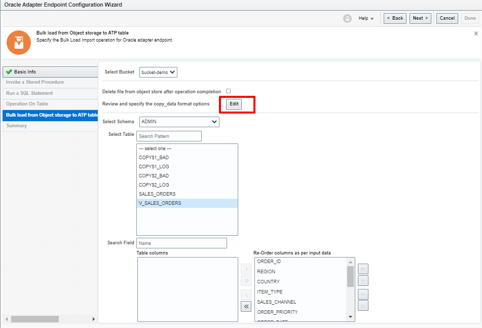

    In the *Copy_data API Format Options* page Provide the following values:

    | **Element**        | **Value**          |       
    | --- | ----------- |
    | Delimeter | **Comma** |
    | Skip Headers | **1** |

    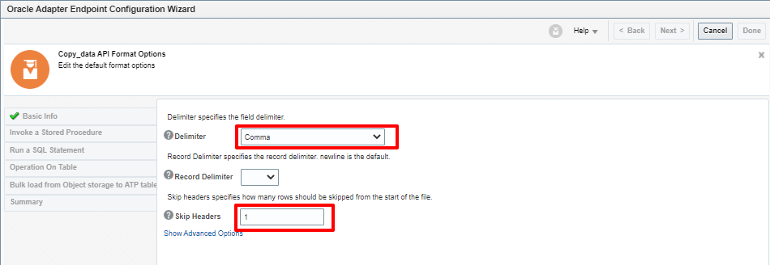

    Leave the rest of the values as default and Select **Ok**.

6. Click **Next**.

7. On the Summary page, review the configuration and click **Done**.

    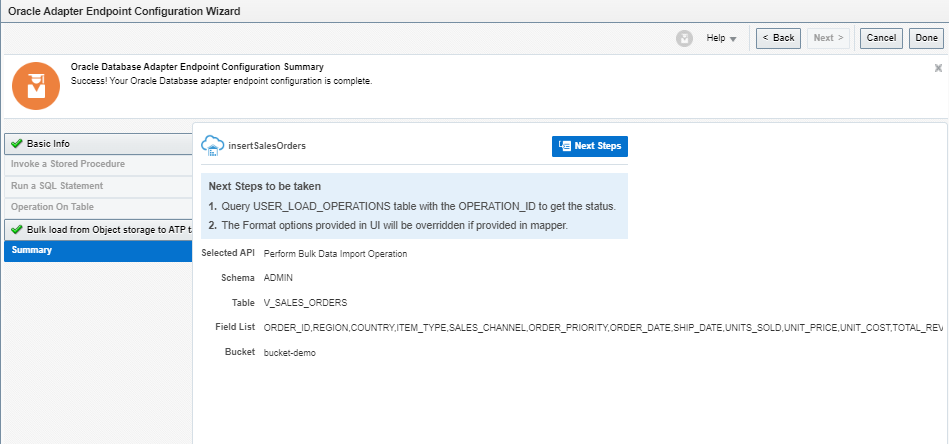

8. Click **Save** to apply changes.


## Task 4: Map data between FTP Invoke and ADW invoke
Use the mapper to drag fields from the source structure (downloadSalesOrders Response)  to the target structure (insertSalesOrders) to map elements between the two.

When we added the ADW invoke to the integration, a map icon was automatically added.

1. Hover your cursor over the *Map to insertSalesSalesOrders* **Mapper** icon, click once, then select **Edit**.
   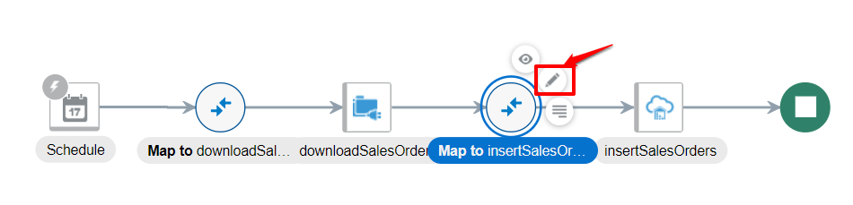

2. Use the mapper to drag element nodes in the source FTP Invoke Response structure to element nodes in the target Oracle ADW structure.

    Expand the **Source** node:

    ```
    downloadSalesOrders Response(FTP) > DownloadFileToICSResponse > Download Response > ICSFiles > ICSFile

    ```

    Expand the **Target** node:

    ```
    insertSalesOrders Request

    ```

    Complete the mapping as below:    

    | **Source** *(downloadSalesOrders Response FTP)*        | **Target** *(insertSalesOrdersRequest Oracle ADW)* |
    | --- | ----------- |
    | FileReference | FileReference |

   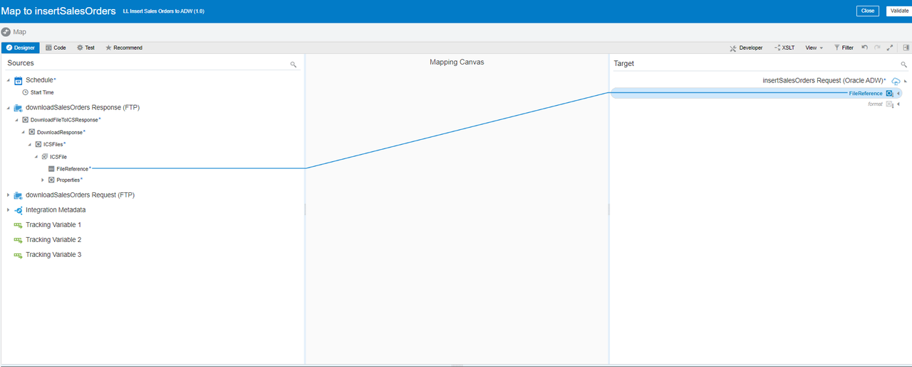

3. Click **Validate**, then wait for the confirmation message *Mapping is valid and ready to use.*

4. Click **Close**

5. Click **Save** to persist changes.


## Task 5: Define Tracking Fields
Manage business identifiers that enable you to track fields in messages during runtime.

> **Note:** If you have not yet configured at least one business identifier **Tracking Field** in your integration, then an error icon is displayed in the design canvas.
    

1. Click the **Actions** menu on the top right, then select **Tracking**.
    

2. From the *Source* section, expand **schedule**. Drag the **startTime** field from source to the *Drag a trigger field here* section:

    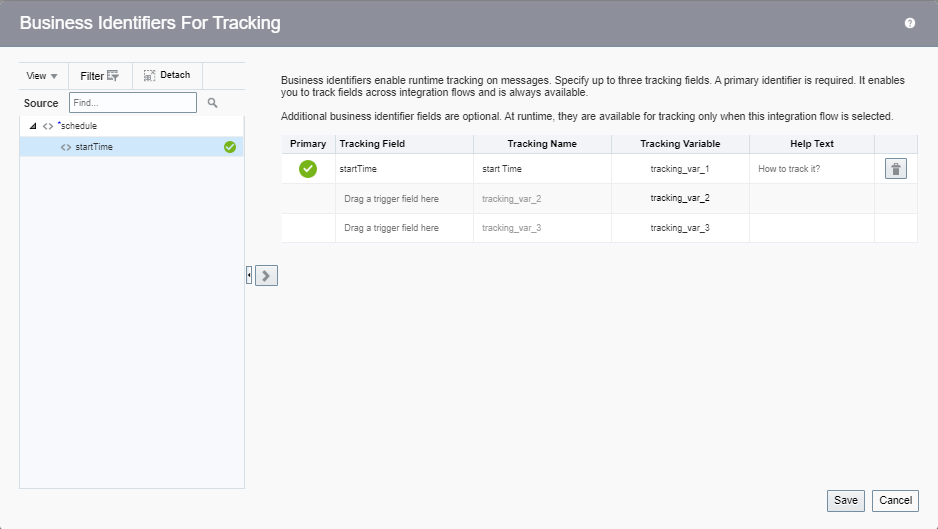

3. Click **Save**.

4. On the Integration canvas, click **Save**, followed by **Close**.

## Task 6: Activate the integration

1. On the *Integrations* page, click on the **Activate** icon.

    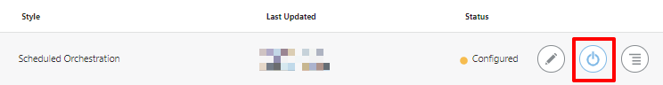

2. On the *Activate Integration* dialog, select **Enable Tracing**, followed by **Include Payload** options.

3. Click **Activate**.

    The activation will be complete in a few seconds. Once activation is successful, a status message is displayed in the banner at the top of the page, and the status of the integration changes to *Active*.


You may now **proceed to the next lab**.

## Learn More

* [Scheduled Integration](https://docs.oracle.com/en/cloud/paas/integration-cloud/integrations-user/create-scheduled-integrations.html)

* [Format Options](https://docs.oracle.com/en/cloud/paas/autonomous-database/adbdi/index.html)


## Acknowledgements
* **Author** - Kishore Katta, Product Management - Oracle Integration
* **Last Updated By/Date** - Kishore Katta, May 2022
