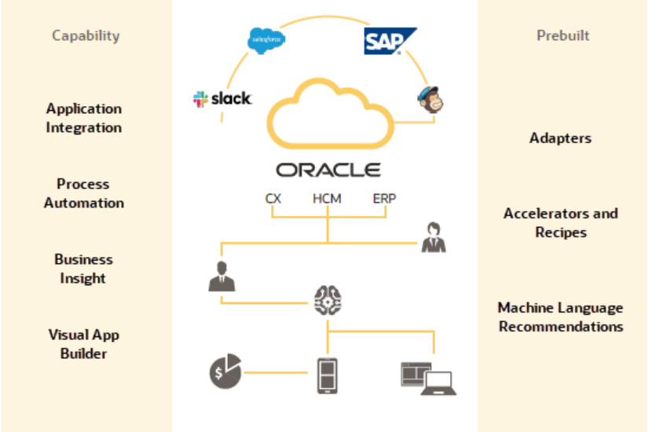

# Introduction

## About this Workshop

This workshop shows you how to create two connections using Oracle Integration - One for a File Server and one for an On Oracle Autonomous Database. You will learn how to create an integration flow that reads a file from the File Server and insert records into Oracle Autonomous Database.

Estimated Time: 1 hour 30 minutes

### What Will You Learn?

In this workshop, you will learn how to:

* Provision Oracle Integration in Oracle Cloud Infrastructure
* Learn several Integrations specific concepts
* Creating Connections
* Design a Scheduled Integration Flow
* Test and Monitor Integration Flow

### What Do You Need?

* An Oracle Free Tier or Paid Cloud Account.
* A Chrome browser.

### What is Oracle Integration?

Integration is a fundamental part of your digital business development. It involves connecting on-premises applications and cloud applications and services. Oracle Integration makes it easy to connect your applications and automate end-to-end processes such as procure to pay, inquiry to order, and hire to retire.

With Oracle Integration (OIC), you have the power to *integrate* your cloud and on-premises applications, *automate* business processes, *gain insight* into your business processes, visually *develop* web and mobile applications, use an SFTP-compliant file server to *store* and *retrieve* files, and *exchange* business documents with a B2B trading partner—all in one place.

Critical business processes, such as those related to human capital management (HCM), customer experience (CX), and enterprise resource planning (ERP), are frequently slow and inflexible. For example, a multi-step process such as Lead to Opportunity to Quote to Order can involve four or more applications and require human exception management at every step of the process. In this scenario, the lack of integration between departments as well as the delays caused by human-based problem resolution can result in lost revenue, frustrated customers, and high costs.

Oracle Integration changes all that. It empowers you to:

  - Establish connectivity between the many applications and people that are part of the entire business process life cycle.

  - Assemble existing technologies into new business services to better align with the changing pace of new business demands.

  - Deliver new business innovations faster by rapidly connecting diverse applications and key business roles.

  - Gain 360-degree views across your entire business. Easily monitor and analyze every application, integration, and workflow spanning the business process life cycle.

### Video Preview

  [Introduction to Integrations](youtube:avAbtEYbWeQ)

You may now **proceed to the next lab**.

## Learn More

* [Oracle Integration](https://docs.oracle.com/en/cloud/paas/integration-cloud/index.html)

## Acknowledgements

* **Author** - Kishore Katta, Product Management, Oracle Integration & Process Automation
* **Last Updated By/Date** - Kishore Katta, May 2022
