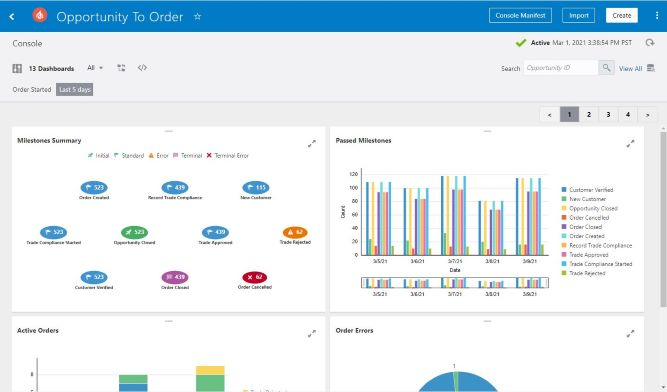
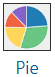
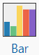
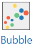
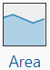
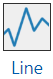
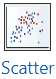

# Custom Console Dashboards

## Introduction

The Console page displays information about performance and preconfigured Dashboards show nominal information. You can create a custom Dashboard to help identify bottlenecks or shortages in the process and track key metrics immediately and in real time.  
  

Estimated Time: 15 minutes

## Prerequisites

This lab assumes you have:

- Completed Labs 1 through 10

## Learning Objectives

In this lab, you will learn how to create the following:

- Create Custom Dashboard

Consoles are created and associated within Insight automatically when a model, with defined business processes, has been activated. Standard Dashboards provide 5 summaries to view. However, you can create custom dashboards within Insight.

Custom dashboards use visualization charts, such as pie charts or bar charts, to represent indicators (dimensions and measures) for Insight models that have indicators defined. Creating custom dashboards track metrics, ratios, and trends that are important to the business. If a business process has indicators (dimensions and measures), custom dashboards can capture and visualize data related to the indicators.

Each custom dashboard is represented by a title and an icon. Custom dashboards can be filtered by a number of different criteria, including when a business transaction started or ended, how long the business transaction took to complete, and which milestones have most recently been passed. There is no limit to the number of custom dashboards that you can create.

There are 6 Chart Types:

-  A pie chart is a circular chart where each sector represents the quantity of a dimension you select. The size of each sector is determined by the value of a measure you select, aggregated using a function you select (such as average, sum, count, or standard deviation).
- A bar chart is a two-dimensional chart, where the X-axis values are computed based on the values of a dimension you select. Each bar on the graph is optionally grouped by the value of a second dimension. The Y-axis values are computed based on values of a measure you select, aggregated using a function you select (such as average, sum, count, or standard deviation).
A bar chart is the only chart type that lets you group by two different dimensions. You can swap the dimensions used for the X-axis and its grouping to change how the bars are displayed in the chart.
-  A bubble chart is a three-dimensional chart, where each bubble groups values of a dimension you choose. The size of each bubble is determined based on values of a measure you select, aggregated using a function you select (such as average, sum, count, or standard deviation). A bubble’s location on the X- and Y- axes is determined based on values of measures you select, aggregated using a function you select (such as average, sum, count, and standard deviation).
-  An area chart is a two-dimensional chart that is a line chart, where the area between the axes and line is shaded to represent the range of measure values for each dimension. The X-axis values are computed based on the values of a dimension you select. The Y-axis values are computed based on values of a measure you select, aggregated using a function you select (such as average, sum, count, or standard deviation).
-  A line chart is a two-dimensional chart that is represented by a series of data points connected with a straight line. Line charts are most often used to visualize data that changes over time. The X-axis values are computed based on the values of a dimension you select. The Y-axis values are computed based on values of a measure you select, aggregated using a function you select (such as average, sum, count, or standard deviation).
-   A scatter chart shows a single point for each point of data in a series without connecting them, showing patterns across hundreds of instances. The X-axis represents one measure, and the Y-axis represents another measure you select. Each point in the scatter chart is a combination of color and shape that represents a unique value of a dimension you select.  

First practice the steps to familiarize yourself with the commands and then do the Labs.

### Custom Dashboard

    A. On the Models page, Click the model for which you want to create a custom dashboard and ensure that the model has indicators (dimensions and measures) defined. If not, follow the steps in Define Indicators in Learning Objective 4.
        1. On the Models page, <Click> the model for which you want to create a custom dashboard and ensure that the model has indicators (dimensions and measures) defined. If not, follow the steps in Define Indicators in Learning Objective 4.
        
        2. In the model's console, click <Create> The Create Dashboard Dialog will appear.
            a. Enter a suitable name for the dashboard
            b. Click the dashboard icon to show the icon picker. Choose an appropriate icon for your dashboard.
            c. Click the chard icon to show the chart picker, Select a chart appropriate for the data visualization.
          
        3. Each chart type will have Y-Axis, X-Axis, Grouping or Ignore Empty Values. X and Y Axis charts will have Measure and Aggregation selections and others may be mandatory.
            a. Select the <Measure>, you may select the box to "ignore empty values", if available
            b. Select the <Aggregation Function>, you may select the box to "ignore empty values", if available 
            c. Select the <Grouping>, you may select the box to "ignore empty values", if available

 Now, let's get you to create on of each chart!

 You will create one of each chart type. You will test your mapping and then view the results of the order(s) in the created Console and Dashboards.

## Task 1: Pie Chart

Name: Average Daily Order Value
Chart Type: Bar Chart

Y Axis:

Measure: Total
Aggregating Function: Average
X Axis: Instance Start Time (Ignore empty valueBar)

## Task 2: Bubble Chart

Name: Products by Quantity Sold by Country
Chart Type: Bubble Chart  
X Axis:  
Measure: Quantity  
Aggregating Function: Average  

Y Axis: 
Measure: Unit Price  
Aggregating Function: Average  

Bubble Size:  
Measure: Total  
Aggregating Function: Sum  

Grouping: Country (Ignore empty values)  

## Task 3: Bar Chart

Name: Total Order Value by Country  
Chart Type: Bar Chart  
Measure: Total  

Aggregating Function: Count  

X Axis: Instance Start Time (Ignore empty values)  

Grouping: Country (Ignore empty values)  

## Task 4: Area Chart

Name: Quantity Sold by Product  
Chart Type: Pie Chart  
Y Axis:  
Measure: Quantity  

Aggregating Function: Sum  

X Axis: Product (Ignore empty values)  

## Task 5: Line Chart

Name: Quantity Sold by Country  
Chart Type: Area Chart  
Y Axis:   
Measure: Quantity  

Aggregating Function: Sum  

X Axis: Country (Ignore empty values)  

## Task 6: Scatter Chart

Name: Quantity Sold by Country  
Chart Type: Area Chart  
Y Axis:   
Measure: Quantity  

Aggregating Function: Sum  

X Axis: Country (Ignore empty values)  

## Task 7: Test

Now that you completed the charts. It's time to test them. Open the <Order Processing Lab> in Test. Invoke the <bulkOrder> operation using   **TBD**      test data file.
Review custom dashboards.
You may now **proceed to the next lab**.

## Learn More

More info on Insight Dashboards can be found [here](https://docs.oracle.com/en/cloud/paas/integration-cloud/user-int-insight-oci/create-custom-dashboards.html).

## Acknowledgements

- **Author** - Lucy Cortez, Product Enablement Management - Oracle Integration

- **Last Updated By/Date** - Lucy Cortez, April 2022
