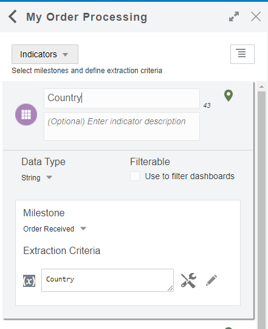
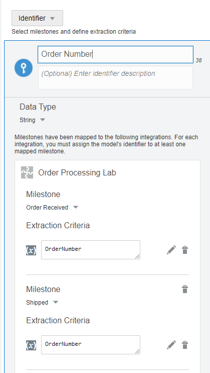
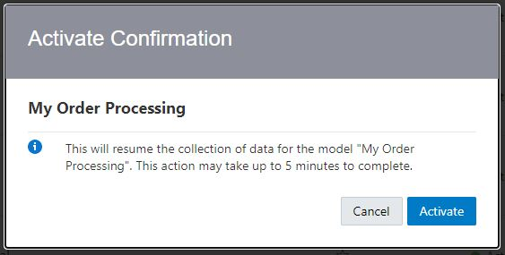
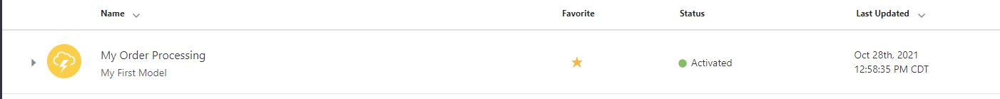

# Associate an Indicator to a Model

## Introduction

The Lab will cover how to map an Integration to Indicators and Activate a Model.

Estimated Time: 10 minutes

## Prerequisites

This lab assumes you have:

- Completed Labs 1 through 8

## Learning Objective

In this lab, you will learn how to create the following:

- Map Indicators to an Integration
- Modify your Draft into a Configured state
- Activate your Insight Model

You can associate an Insight Model to a business process implementation in Integrations.

To associate a Model to a business process implementation in Integrations, you must map Indicators to Integrations actions.  Mapping Indicators involves identifying execution points that best represent when the milestone has been passed.

As seen in Lab 6, part of the mapping process you must also define extraction criteria for the Indicators. Extraction criteria define the rules to extract information from runtime messages and is expressed using XPath expressions. Before you can activate a model, the extraction criteria must be defined.

First practice the steps to familiarize yourself with the commands and then do the exercise.

### How to Map an Indicator

    A. Click your Indicator Tab, this will expand the view area **or** click the orange Messages circle  (the circle will display how many indicators are missing mapping) 
        1. Once expanded, under Extraction Criteria click on the working **Open mapped integration to define extraction criteria**
            Note: you may receive a Save dialog box, click **Save**
        2. This will open the Integrations, that was previously used, for you to map 
        3. You will see your Indicator on the right hand side
            a. Under Milestone you will see Extraction Criteria
                1. Click on Define extraction Criteria
                2. This will open the expression page
                    a. Under Source click on the expression you wish to use and drag and drop to the Expression box, located on the right side 
                    Hint - You can use the search tool to locate the expression 
            c. You may click "Validate" to confirm its readiness to use and click "Close" to return to the integration mapping page.
        4.  Repeat for each Indicator you wish to map.
        5. Click Save, this will return you to the model.

Once Integration has been mapped to the Indicator, it's time to change the Draft Model into a Configured State  

### How to Place Draft Model into Configured State

    A. Click **Save** and you will receive a confirmation box stating **Successfully saved the change**
    B. Exit and return to your Models listing. You will now see your Status as **Configured**

Activating a Model allows it to be tested or used. Active models showcase status of a green dot that says "Activated".  

### How to Activate a Model

    A.  At the Model's list page, locate your Model
        1. Hover your mouse over the Last Updated Date and 3 buttons will appear
        2. Click on the center button named **Activate**
        3. Display window will appear click **Activate**
        4. This may take a few minutes to generate or you may click the refresh symbol
        5. Status will now display a green dot and word **Activated**

  

Now your turn to try!

 You will map your Indicators to an existing integration. The Integration you will use is called **Order Processing Lab**. After completing mapping the Indicators you will move your draft model into a configured model state and then re-active model state.

## Task 1: Map Indicators

Access your deactivated model. You will map 5 Indicators. 

Let's start with the **Order Received** Milestone Indicators. Under the **Extraction Criteria**,  Click **Open mapped integration to define extraction criteria** 

1. Set the **Country** Indicator Extraction Criteria to **$Country**. 
. 

2. Set the **Total** Indicator Extraction Criteria to **$Total**. 

3. Set the **Product** Indicator Extraction Criteria to **$Product**.
 
4. Set the **Quantity** Indicator Extraction Criteria to **$Quantity**.  

5. Set the **UnitPrice** Indicator Extraction Criteria to **$UnitPrice**.  

Now let's map the new Standard milestone and Identifier  

## Task 2: Map Milestone and Identifiers  

Map your **Shipped** Milestone **On Exit** event to the **PrepareShipping** activity.  
Now onto the Identifier. Set your **Order Number** Identifier Extraction Criteria for the **Shipped** Milestone to **$OrderNumber**. 
Set your **Order Number** Identifier Extraction Criteria for the **Order Completed** Milestone to **$OrderNumber**.

 Go to Task 3 in order to save your work. 

## Task 3: Draft to Configured State

You may now click **Save** and ensure you receive the message box **Successfully saved the changes** and close your model. To activate the model, go to Task 4.

## Task 4: Configured State to Active State

Access your Insight Models, locate your model and ensure it says Configured. Now Activate your model by clicking **Activate** button.

You will receive an Activation Confirmation box, click **Activate**. You will see a system response.
   
   

Congratulation on completing Mapping Indicators! The next exercise will test the mapping and showcase the Console/Dashboards. You may now **proceed to the next lab**

## Learn More

More about indicators can be found at [https://docs.oracle.com/en/cloud/paas/integration-cloud/user-int-insight-oci/work-models-integration-insight.html](http://docs.oracle.com)

## Acknowledgements

- **Author** - Lucy Cortez, Product Enablement Management - Oracle Integration
- **Last Updated By/Date** - Lucy Cortez, April 2022
