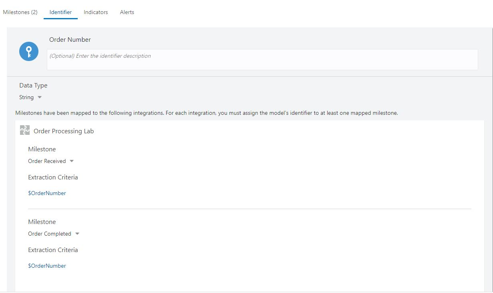
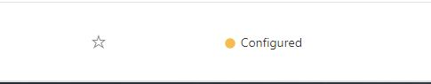
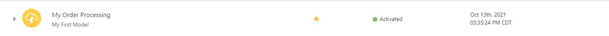

# Associate a Model

## Introduction

The Lab will cover how to map an Integration to a Milestone, Identifier and Activate a Model.

Estimated Time: 10 minutes

## Prerequisites

This lab assumes you have:

- Completed Labs 1 through 5

## Learning Objectives

In this lab, you will learn how to create the following:

- Map an Integration to a Milestone
- Modify your Draft into a Configured state
- Activate your Insight Model

First practice the steps to familiarize yourself with the commands and then do the exercise.

You can associate an Insight Model to a business process implementation in Integrations.

To associate a model to a business process implementation in Integrations, you must map milestones to Integrations actions.  Mapping milestones involves identifying execution points that best represent when a milestone has been passed.

As part of the mapping process you must also define extraction criteria for the unique instance identifier. Extraction criteria define the rules to extract information from runtime messages and is expressed using XPath expressions. Before you can activate a model, the extraction criteria must be defined.

### How to Map a Milestone

    A. Click your Milestone name, this will expand the view area.   
        1. Under mappings you will click on "Map Milestones" 
        2. This will open the Integrations, either search or scroll to find your integration
        3. At the far right (actions), and click on Insight Designer
            a. You will see your Milestones on the right
            b. Drag and drop the related activity from the left to your Milestone
                1. Select from dropdown "On Entry" or "On Exit"
            c. Repeat for each Milestone you wish to map.

### How to Map an Identifier

    A. Click dropdown and choose Identifier, this will expand the view area.   
        1. Under mappings you will click on "Open mapped integration to define extraction criteria" 
        2. This will open the Integrations, that was previously used, for you to map 
        3. You will see your Identifier on the right
            a. Under Milestone you will see Extraction Activity
                1. Click on Define extraction Activity
                2. This will open the expression page
                    a. Under Source click on $OrderNumber and drag and drop to the Expression box, located on the right side 
            c. You may click "Validate" to confirm its readiness to use or click "Close" to return to the integration mapping page.
        4.  Repeat for each Identifier you wish to map.
        5. Click Save, this will return you to the model

Once Integration has been mapped to the Milestone and Identifier, it's time to change the Draft Model into a Configured State  

### How to Place Draft Model into Configured State

    A. Click "Save" and you will receive a confirmation box stating "Successfully saved the changes"
    B. Exit and return to your Models listing. You will now see your Status as "Configured"

Activating a new model (or updating an existing activated model) pushes the new model definition, including mapping metadata, out to the runtime engines used during the mapping process. Mapping metadata is used by the runtime engines to monitor for execution patterns indicating that milestones have been passed. The process of validating a model, distributing it to the runtime engines, and then beginning the process of active monitoring for extracting metrics takes some time to complete.
Activating a Model allows it to be tested or used. Active models showcase status of a green dot that says "Activated".  

### How to Activate a Model

    A.  At the Model's list page, locate your Model
        1. Hover your mouse over the Last Updated Date and 3 buttons will appear
        2. Click on the center button named "Activate"
        3. Display window will appear click "Activate"
        4. This may take a few minutes to generate or you may click the refresh symbol
        5. Status will now display a green dot and word "Activated"

When a business process implementation spans more than one integration or process, or both, you must assign the model's unique instance identifier to mapped milestones to establish the correlation between the actions in the same instance of the business process and extract the unique instance identifier value when the specified milestone is passed.  

Now your turn to try!

 You will map your Milestones and Identifier to an existing integration. The Integration you will use is called Order Processing Lab. You will move your draft model into a configured model state and then active model state.

## Task 1: Map Milestones

Accessing your draft model, go to Milestones. You will map 5 Milestones and Identifiers.

1. Map your Order Received Milestone **On Exit** event to the **OrderReceived** activity.
2. Map your Backordered Milestone **On Exit** event to the **Backordered** activity.
3. Map your Discount Applied Milestone **On Exit** event to the **DiscountApplied** activity.
4. Map your Shipped Milestone **On Exit** event to the **Shipped** activity.
5. Map your Order Completed Milestone **On Exit** event to the **OrderCompleted** activity.
6. Click **Save** and return to your Model.

## Task 2: Map Identifiers

For each integration, you must assign the model's identifier to at least one mapped milestone.

1. Set the Order Number Identifier Extraction Criteria for the each of the Milestones to **$OrderNumber**
2. Click **Define extraction criteria"
3. Locate and Drag **$OrderNumber** to the Expression box.
4. Click **Validate** it will state a response of "Expression is valid and ready to use".
5. Click **Close** to save.
6. Repeat until all milestones have an extraction criteria completed.

## Task 3: Draft to Configured State

You may now click **Save** and ensure you receive the message box **Successfully saved the changes** and close your model. To activate the model, go to Task 4.

## Task 4: Configured State to Active State

Access your Insight Models, locate your model and ensure it says Configured. Now Activate your model by clicking **Activate** button. You will receive an Activation Confirmation box, click **Activate**. You will see a system response.
Click the Refresh button after a few minutes. 

Congratulation on completing the Process Mapping! The next exercise will test the mapping and showcase the Console/Dashboards.

You may now **proceed to the next lab**.

## Solution

Milestone solution:

Identifiers solution:  

Draft to Configured State will show as this:  

Activation :

## Want to Learn More

More info on Insight Models can be found [here](https://docs.oracle.com/en/cloud/paas/integration-cloud/user-int-insight-oci/work-models-integration-insight.html).

## Acknowledgements

- **Author** - Lucy Cortez, Product Enablement Management - Oracle Integration
- **Last Updated By/Date** - Lucy Cortez, August 2022
