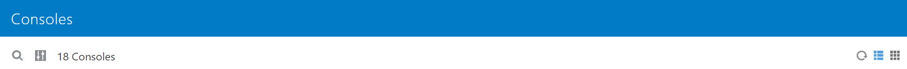
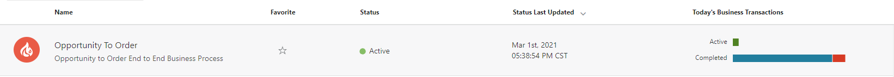
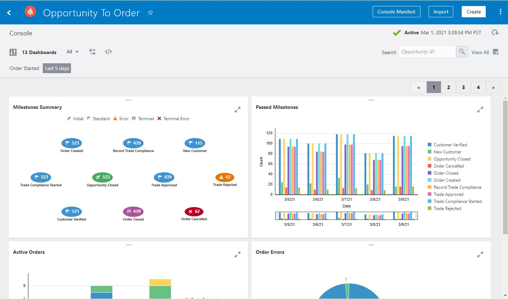

# Oracle Insight Navigation

## About this Workshop

The workshop will cover how to navigate to Insight and the command fields you will experience while working with a model.

Estimated Time: 5 Minutes

## Introduction

The Integration Insight feature (commonly referred to as Insight) is located in home page of Oracle Integration.

## Prerequisites

This lab assumes you have:

* Completed Labs 1 thru 3

## Objectives

In this workshop, you will:

* Navigate Insight

## Task 1: Main Page

Click the hamburger  at the top left hand site of the home screen. Then, select **Insight** to open the Consoles and Models.

## Task 2: Models

On the *Insight* page, click on **Models** to commence creating or modifying models.

In *Models*, starting left to right, you will see the search tool, filter tool, refresh, list horizontal, and list by block. Above that you will see the Import button or Create button.

## Task 3: Consoles

On the *Insight* page, click **Consoles** to view consoles.

In Consoles, starting left to right, you will see the search tool, filter tool, the number of how many consoles are listed, refresh, list horizontal, and list by block.

Consoles are created once you activate a model and will have different icons next to the respective titles. You will see the Name, Favorite star, Status, the Status Last Updated date/timestamp and Today's Business Transactions.

## Task 4: Dashboards

Open Dashboards via clicking on a Console name to open its related Dashboard.

In the *Dashboards* canvas, starting left to right, you will see the search tool, filter tool, All Dropdown (where you can locate pre-configured or create a custom Dashboard), Rearrange Dashboard, Embed Dashboard, Search Order Number, View All, Purge Console Data, and Refresh.

Top right side, you will see the Console Manifest, Import, Create and the three dots, which displays the Console Details. Lastly, you will see blocks with the dashboards displays as built within the model.

You may now **proceed to the next lab**

## Want to Learn More

* [https://docs.oracle.com/en/cloud/paas/integration-cloud/index.html](http://docs.oracle.com)
* [https://docs.oracle.com/en/cloud/paas/integration-cloud/integration-insight.html](http://docs.oracle.com)

## Acknowledgements

* **Author** - Lucy Cortez, Product Enablement Manager, OIC
* **Contributors** -  Nathan Angstadt, Senior Director, Oracle Integration Product Management
* **Last Updated By/Date** - Ravi Chablani, April 2022
