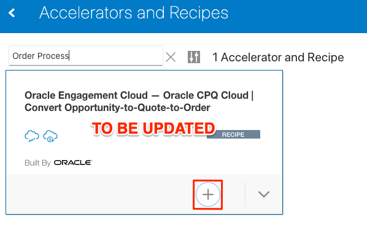
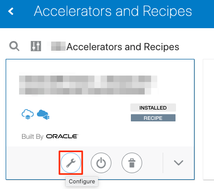
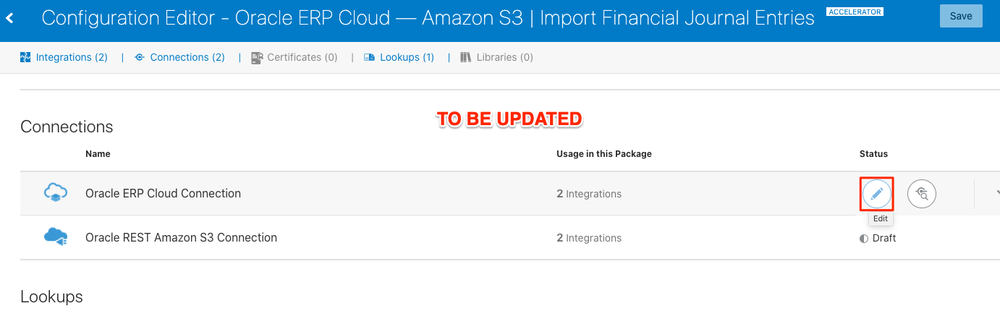
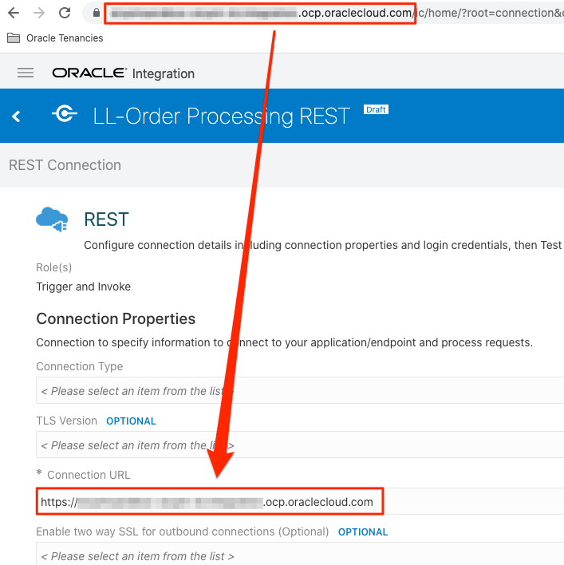

# Setup Workshop Prerequisites

## Introduction

This lab walks you through the setup required to complete this demo workshop.

Estimated Time: 5 minutes

### Objectives

In this lab, you will:

* Install and Configure an Integration Recipe

### Prerequisites

This lab assumes you have:

* An Oracle Cloud account
* All previous labs successfully completed

## Task 1: Install and Configure an Integration Recipe

On your Oracle Integration instance, install the recipe package to deploy and configure the integration and associated resources.

1. On the Oracle Integration home page, scroll to the **Accelerators & Recipes** section.

2. Click **Search All**.

3. Enter `Order Process` in the search field located on the top left side of the screen, then press **Enter**.

4. Find the *Order Process* recipe, then select it and click the **Install (+)** icon.

    

Wait for the Recipe installation to complete.

5. After the package is installed, click the **Configure** icon on the recipe card to configure the resources deployed by the package.

    

6. On the Configuration Editor page, find the Order Process connection under the *Connections* section and click the **Edit** icon.

    The Configuration Editor page opens, displaying all the resources of the recipe package.

    

7. In the Connection Properties section, copy the Oracle Integration host name from the browser address bar and past it into the field **Connection URL**.

    

8. Under *Security*, select **Basic Authentication** Security Policy, and enter the same credentials used for accessing your OCI Integration instance.

    

9. Click **Test** to ensure that your connection is successfully configured.
A confirmation message is displayed if your test is successful.

10. Click **Save**, wait for confirmation, then click **Back (<)** on the top left corner of the canvas to return to the Configuration Editor page.

You may now **proceed to the next lab**.

## Acknowledgements

* **Author** - Ravi Chablani, Product Management - Oracle Integration
* **Last Updated By/Date** - Ravi Chablani, April 2022
