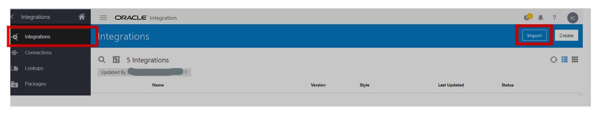
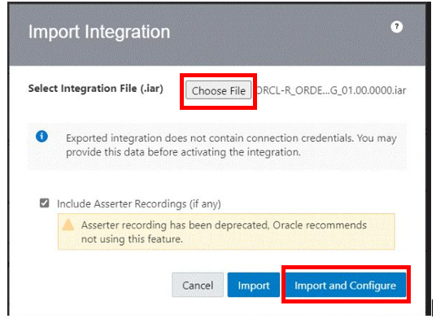
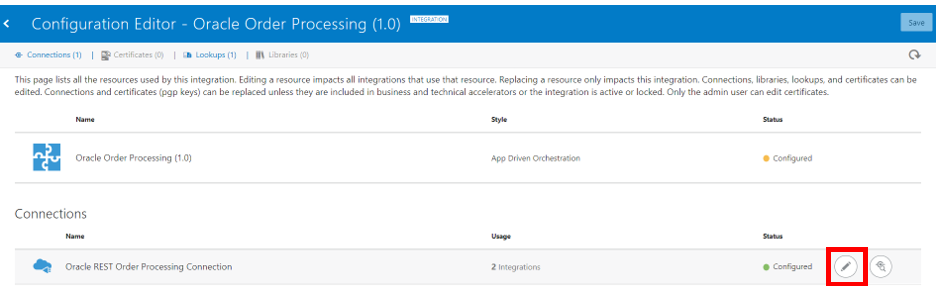
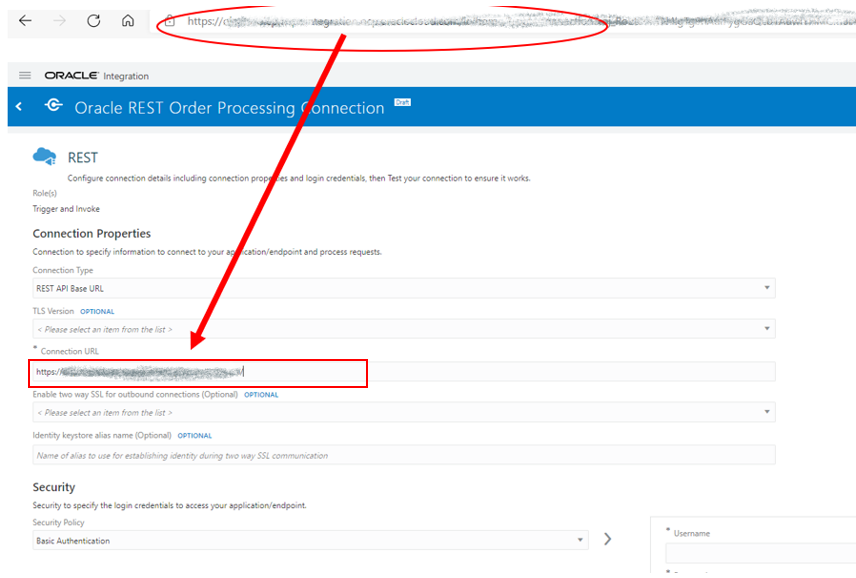
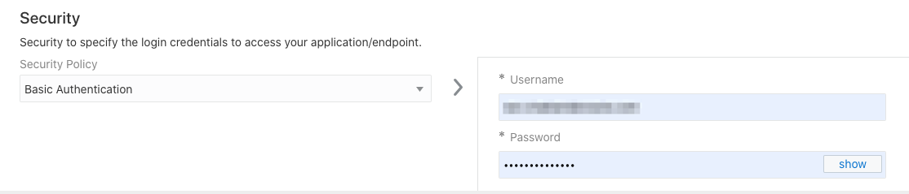

# Setup Workshop Prerequisites

## Introduction

This lab walks you through the setup required to complete this demo workshop.

Estimated Time: 5 minutes

### Objectives

In this lab, you will:

* Install and Configure an Data Loader Integration

### Prerequisites

This lab assumes you have:

* An Oracle Cloud account
* All previous labs successfully completed

## Task 1: Install and Configure Data Loader Integration

On your Oracle Integration instance, import and install the data loader package to deploy and configure the integration and associated resources.

1. Download the [Data Loader File](https://objectstorage.us-ashburn-1.oraclecloud.com/p/LNAcA6wNFvhkvHGPcWIbKlyGkicSOVCIgWLIu6t7W2BQfwq2NSLCsXpTL9wVzjuP/n/c4u04/b/livelabsfiles/o/developer-library/ORCL-R_ORDER_PROCESSING_01.00.0000.iar) to your local drive.

2. At the Home Page, Click on Integrations and Click Import

    

3. The Import Integration will display. Choose your file and click Import and Configure

    

4. The Configuration Editor page opens, displaying all the resources of the integration package. GO to Connections and click on Edit.

    

5. In the Connection Properties section, copy the Oracle Integration host name from the browser address bar and past it into the field **Connection URL**.

    

6. Under *Security*, select **Basic Authentication** Security Policy, and enter the same credentials used for accessing your OCI Integration instance.

    

7. Click **Test** to ensure that your connection is successfully configured.
A confirmation message is displayed if your test is successful.

8. Click **Save**, wait for confirmation, then click **Back (<)** on the top left corner of the canvas to return to the Configuration Editor page.

You may now **proceed to the next lab**.

## Acknowledgements

* **Author** - Ravi Chablani, Product Management - Oracle Integration
* **Last Updated By/Date** - Lucy Cortez, July 2022
