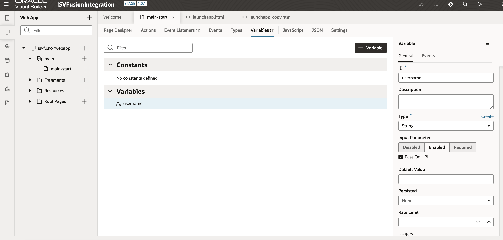
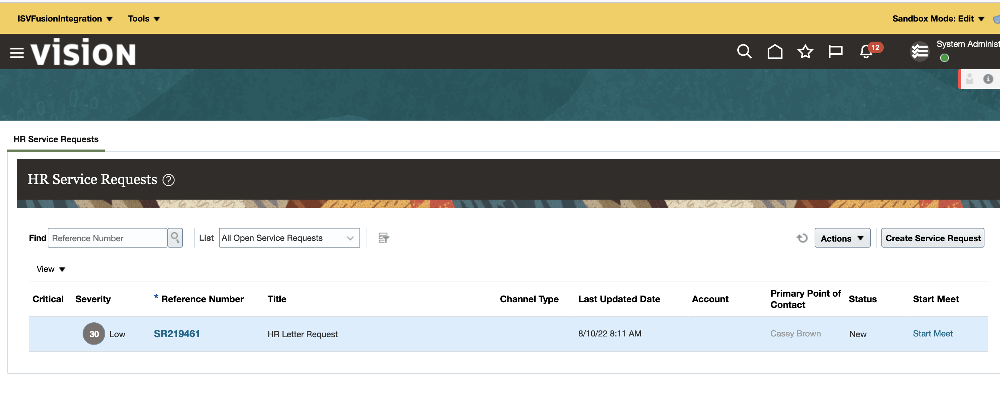
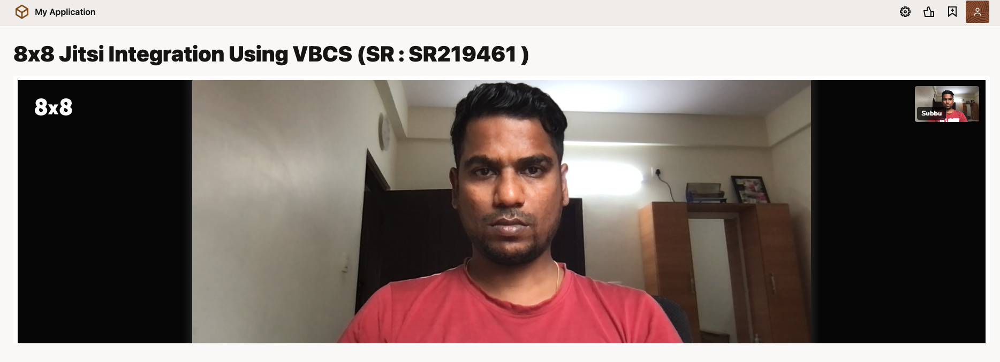

# Lab 2 : Data Transfer from Fusion Application to 8x8 Jitsi (ISV) Application

## Introduction

This lab will walk you through the steps to implement data transfer from Fusion to 8x8 Jitsi video conference platform.

Estimated Time: 30 minutes

### Objectives

You will execute the following:
- SR number field from fusion application will be transferred to VBCS iframe and Display the SR number in the video heading.
- Create variable in the VBCS application.
- Fusion configurations.

### Prerequisites
This lab assumes you have:
- Completed all the previous labs.

## Task 1: Create variable in the VBCS application

1. Login to Oracle Visual Builder.

2. Create new version of ISVFusionIntegration application.

3. Click **isvfusionwebapp** > **main** > **main-start** > **Variables**

4. Click **+Variable**

  Enter the variable ID : username
                   Type : String

  Select Enabled option under the Input Parameter section in the variables properties panel.

5. Check Pass On URL option.

   

6. Go to **isvfusionwebapp** > **main** > **main-start** > **code**  

   Copy the content from main-start file and paste in the main/main-start file in the web application.

7. Stage and Publish the application. (Refer Lab 1 , Task 2 , Steps 5 and 6).

## Task 2: Fusion configurations

1. Login to Fusion Application with Administrator role

2. Click **System Administration** > **Administration** > **Edit Pages** > **Activate a Sandbox**.

3. Enter into the sandbox created in the previous lab.

4. Go to **Home** > **HR Service Request**

5. Go to **Tools** > **Application Composer**

6. Click **Standard Objects** > **Service Request** > **Actions and Links**

7. Select Start Meet field and Click **Edit**

8. Copy the newly published application live url (Task 1 , Step 7) in the Edit Script panel and  Click **Validate** then **Save**.

Sample script: return "https://xxxx-xxxxx-px.integration.ocp.oraclecloud.com/ic/builder/rt/ISVFusionIntegration/1.0.1/webApps/isvfusionwebapp/?username=SR : "+SrNumber;

9. Launch the 8x8 video app from the HR Service Request Page through Start Meet link.

You may now **proceed to the next lab**.

## Acknowledgements

* **Author** - Subburam Mathuraiveeran, Senior Cloud Engineer, Oracle North America Cloud Engineering
* **Last Updated By/Date** - Subburam Mathuraiveeran, Aug 2022
