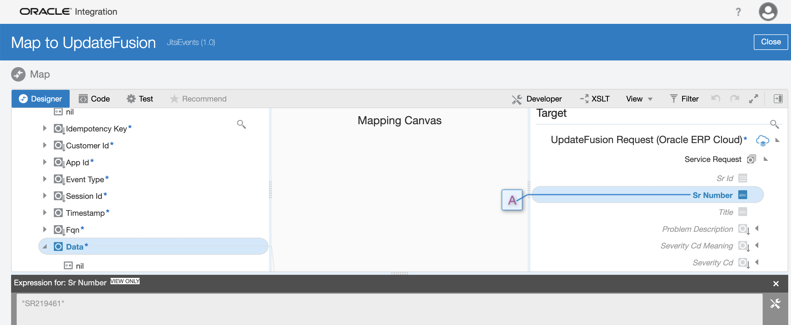
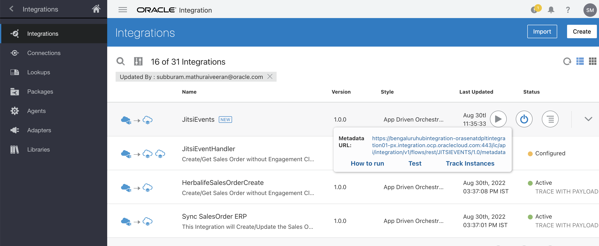
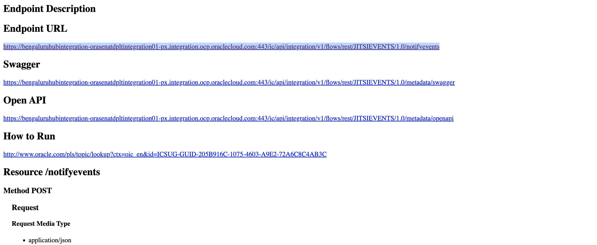
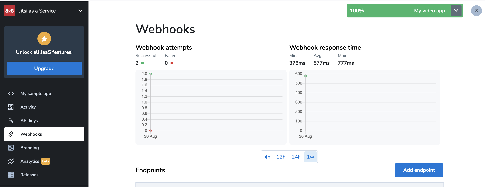
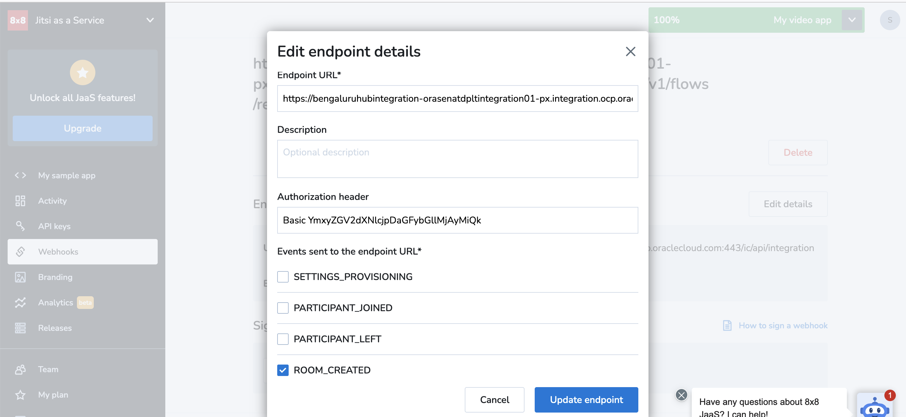
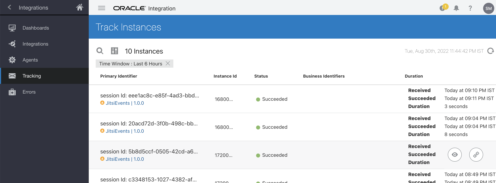
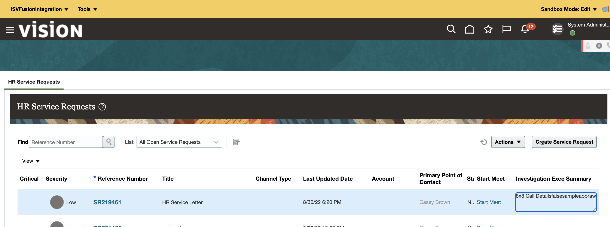

# Lab 3 : Data Transfer from 8x8 Jitsi Application to Fusion Application

## Introduction

This lab will walk you through the steps to implement data transfer from 8x8 Jitsi video conference platform to Fusion application.

Estimated Time: 30 minutes

### Objectives

You will execute the following:

- Capture the ROOM_CREATED event data in OIC from 8x8 Jitsi platform Webhook configuration.OIC updates the event data in the
  Investigation Exec Summary field in the Fusion application page (HR Help Desk Service request page) through Fusion Cloud ERP
  adapter.
- Oracle integration cloud implementation
- JaaS (Jitsi as a Service) configurations.

### Prerequisites
This lab assumes you have:

- Basic knowledge on OIC.
- OIC user with Service Invoker role
- Completed all the previous labs.

## Task 1: Oracle Integration Cloud implementation

1. Import the JITSIEVENTS_01.00.0000.iar file in the OIC instance.

2. Pick any existing SR number from HR Help Service Request page and update the SR number in the UpdateFusion xslt.

 

3. Save and Activate the OIC interface.

4. Keep the OIC service url handy and it will be used in the next task.

 Click **Metadata URL**

  

 Copy Endpoint URL.

 

## Task 2: JaaS (Jitsi as a Service) configurations

1. Login to https://jaas.8x8.vc

2. Go to  https://www.base64decode.org/ and Click **Encode**

3. Enter the oic credentials in the below format.

  username:password

  Click **Encode**

2. Click **Webhooks** > **Add endpoint**.

 | **Element**        | **Value** |       
 | --- | ----------- |
 | Endpoint URL | `enter the oic url created in the previous step`   |
 | Authorization header  | `Basic <<base64encoded value in the previous step>>`|
 | Event | `ROOM_CREATED`|

Click **Add endpoint**

3. Launch the 8x8 video app from the HR Service Request Page through Start Meet link and Join the meeting.

4. You may notice the OIC instance are created and its triggered from the webhook configuration created in the previous step.

Now you may see the Investigation Exec Summary field updated with the 8x8 ROOM_CREATED event data against the SR number provided the xslt in the Task1.

## Acknowledgements

* **Author** - Subburam Mathuraiveeran, Senior Cloud Engineer, Oracle North America Cloud Engineering
* **Last Updated By/Date** - Subburam Mathuraiveeran, Aug 2022
