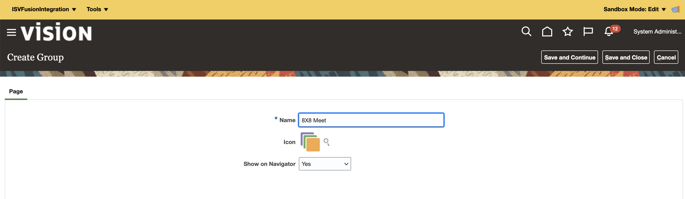

# Lab 1 : Embed ISV application within Fusion Application Page

## Introduction
This lab will walk you through the steps to embed ISV 8x8 video conferencing application inside fusion application page using the application composer.

Estimated Time: 30 minutes

### Objectives
You will execute the following:
- Create JaaS account
- Create VBCS application with 8x8 video app.
- Create new sandbox in the Fusion application.
- ISV integration within the Fusion application using Springboard.
- Embed the VBCS application within Fusion application page using application composer.
- Launch the 8x8 video app from fusion application page.

### Prerequisites
This lab assumes you have:
- Basic knowledge on VBCS
- Basic knowledge on Fusion technicals (sandbox , application composer , etc)

## Task 1: Create JaaS account

1. Go to https://jaas.8x8.vc url in browser and Sign in with trail account created in the previous lab.

2. Click on **Integrate meetings iFrame** under **My Video app**.

3. Click **Download Integration Code**

  It downloads index.html file and this file will be used in the following lab.

## Task 2: Create VBCS application

1. Login to Oracle Visual Builder.
2. Click **New** > **Create Application** > **Enter Application Name (ISVFusionIntegration) ** > **Finish**.
3. Create Web Application . Click **Web Apps** > **Create Web Application** > **Enter Application Name** > **Create**

   

## Task 3: Add the 8x8 Video app within the VBCS web application

1. Import the **index.html** file into the Resources folder. **Resources (Right Click) ** > **Import**.

2. Copy the code snippet from main-start file and paste in the main/main-start page code section.

   

3. Click **Preview**.

4. Stage the application. Click **Hamburger icon (Right top corner)** > **Stage**.

5. Publish the application. Click **Hamburger icon (Right top corner)** > **Publish**.

6. Launch the live application. Click **All Application** > **ISVFusionIntegration** > **Live** > **isvfusionwebapp**.

  Please keep the live url handy as it will be used in the following tasks.

## Task 4: ISV integration within the Fusion application using Springboard.

1. Login to Fusion Application with Administrator role

2. Click **System Administration** > **Administration** > **Edit Pages** > **Activate a Sandbox**.

3. Create a Sandbox. Click **Create Sandbox** > **Enter sandbox name (ISVFusionIntegration)**

     Select following options (Structure , Application Composer , Page Composer)

4. Click **Create and Enter**

5. Go to **Home** > **Help Dest** > **HR Service Request**

6. Go to **Tools** > **Structure**

7. Click **Create** > **Create Group** > Enter the Group Name > **Save and Close**

   

8. Click **Create** > **Create Page Entry**

9. Enter the details as per the screenshot below and Click **Save and Close**

   

10.Now you can launch the 8x8 video app from the Fusion Springboard navigator.

   

## Task 5: Embed the VBCS application within the Fusion application page using application composer.

1. Login to Fusion Application with Administrator role

2. Click **System Administration** > **Administration** > **Edit Pages** > **Activate a Sandbox**.

3. Click **Enter Sandbox** which is created in the Task 4.

4. Go to **Home** > **Help Dest** > **HR Service Request**

5. Go to **Tools** > **Application Composer**

6. Click **Standard Objects** > **Service Request** > **Actions and Links** > **Actions** > **Create**.

  

 | **Element**        | **Value** |       
 | --- | ----------- |
 | Display Label | `Start Meet`   |
 | Type  | `Link`|
 | Edit Script | `return *use the Live url from the previous task*`|

    Leave the rest of the values as default and Click **Save**.

7. Click **Service Request** > **Pages** > **Standard Layout (Under HR Help Desk Landing Page Layout)** > **Actions** > **Duplicate** > **Enter New Layout Name** > **Save and Edit**.

  

8. Click **Edit icon**

Add Start Meet - Link from Available fields to Selected fields then Click **Save and Close**.

9. Click **Hamburger Icon > **Help Desk** > **HR Service Request**.

You may notice the Start Meet field has been added to the each Service Request Records.

 

 ## Task 6: Embed the VBCS application within the Fusion application page using page composer.

 1. Login to Fusion Application with Administrator role

 2. Click **System Administration** > **Administration** > **Edit Pages** > **Activate a Sandbox**.

 3. Click **Enter Sandbox** which is created in the Task 4.

 4. Go to **Home** > **My Client Groups** > **Profiles**

 5. Go to **Tools** > **Page Composer** then Click **Structure** tab

  

 6. Expand the Page Composer editor in the browser. Select **panelGroupLayout:vertical** tag. (Refer the screenshot below)

    Click **+ icon**

    

 7. Click **Components** > **Web Page +Add** then Click **Close**

    

 8. Right Click on **Web Page** > **Edit** in the Page composer editor

    a. Copy the vbcs web application live url in the **Source** input box . Go to **Style** tab and enter *800px* in the Width     and Height fields

    b. Click **Apply** then **OK**

    

    

 9. Right Click on **showDetailFrame: Web Page** > **Edit** in the Page composer editor

    

    a. Enter "8x8" in the Text field. then Go to **Advanced** tab.
    b. Select **auto** for the **Stretch Content** field

    
    
    c. Click **Apply** then **OK**

You may now **proceed to the next lab**.

## Acknowledgements

* **Author** - Subburam Mathuraiveeran, Senior Cloud Engineer, Oracle North America Cloud Engineering
* **Last Updated By/Date** - Subburam Mathuraiveeran, Aug 2022
