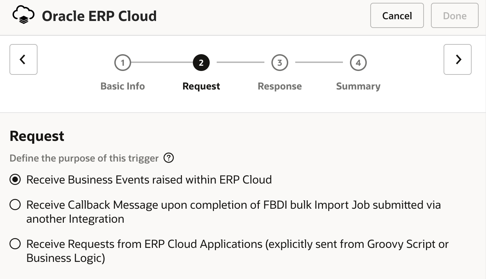
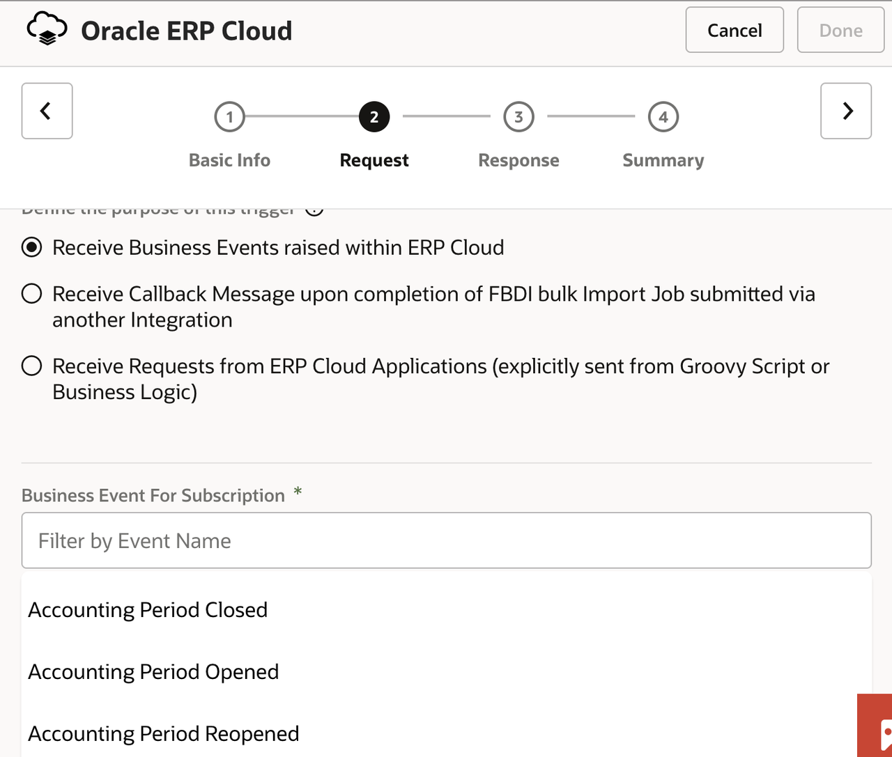
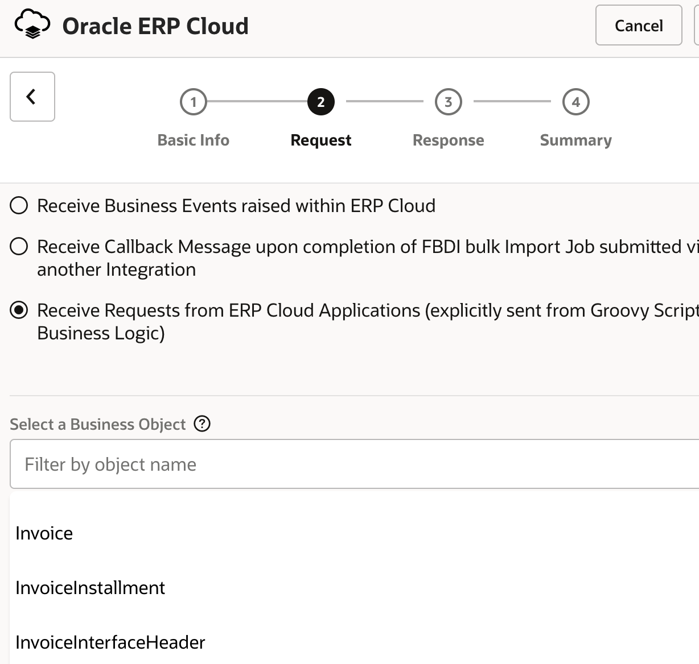
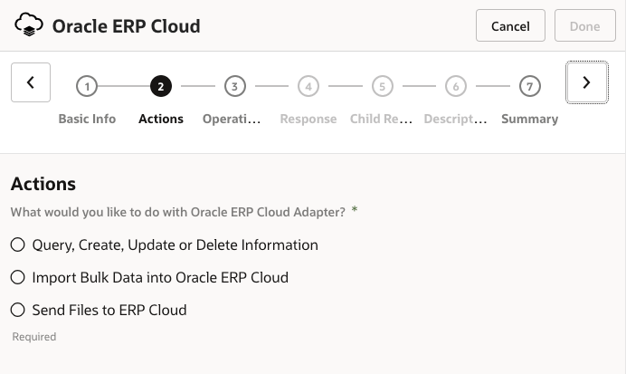

# Functional Details of the ERP Cloud Adapter - Read Only

## Introduction

This section describes the functional use of the ERP Cloud Adapter and its capabilities with respect to the design patterns described earlier.

Estimated Time: 15 minutes

### Objectives

In this lab, you will:

* Understand the functional use of the ERP Cloud Adapter.

### Prerequisites

This lab assumes you have:

* All previous labs successfully completed.

## Task 1: Understand ERP Cloud Adapter usage roles

- Select the integration pattern in advance. The Adapter Configuration Wizard provides an intuitive way to select a task by listing relevant integration artifacts that provide an abstract view for the integration developer.

### **When used as a trigger role**

- The Adapter Configuration Wizard supports processing business events, exposing an object interface, and subscribing to completed FBDI jobs.

    

### *Configure Business Events*

- A business event is received as a request that starts the integration. Only events that can be subscribed to are displayed in the Adapter Configuration Wizard.

    

- The ERP Cloud Adapter supports events from various modules, including:

    - Financials
    - Inventory Management
    - Maintenance
    - Manufacturing
    - Order Management
    - Product Lifecycle Management
    - Procurement
    - Supply Chain Collaboration and Visibility
    - Project Portfolio Management

### *Configure Business Objects*

- Gives a functional view of the ERP Cloud objects to expose a comprehensive interface

    

### **When used in an invoke role**
- The Adapter Configuration Wizard supports invoking SOAP and REST services, simplifies the invocation of FBDI jobs, and sends import files (FBDI/non-FBDI) to ERP Cloud.

    

* ***Query, Create, Update, or Delete Information:*** Provides the standard configuration path for selecting a business object or service. This option displays the standard Operations and Response pages. Select this option to browse by business object or service. There is a one-to-one correspondence between a business object and a service. The service acts on the business document. The Adapter supports:

    - Business Objects: Select to browse a list of available business objects.

    - Services: Select to browse a list of available services.

    - Business (REST) Resource: Select to browse a list of available Oracle Fusion Applications REST API resources.

* ***Import Bulk Data into Oracle ERP Cloud:*** Provides a scenario for loading and orchestrating data from a secure FTP location to Oracle ERP Cloud.

    - Data is loaded into a selected product interface table and then imported into the related main product application tables. A callback notification may also be configured to send when the data import completes. This option also shows a modified Operations page and a unique Response page in the Adapter Endpoint Configuration Wizard for importing data.

* ***Send Files to ERP Cloud:*** Select to upload files (FBDI/NonFBDI) to Oracle WebCenter Content (Universal Content Manager) in encrypted or unencrypted format.

You may now **proceed to the next lab**.

## Learn More

* [Getting Started with Oracle Integration 3](https://docs.oracle.com/en/cloud/paas/application-integration/index.html)
* [Using the Oracle ERP Cloud Adapter with Oracle Integration 3](https://docs.oracle.com/en/cloud/paas/application-integration/erp-adapter/understand-oracle-erp-cloud-adapter.html)

* [Prerequisites for Creating a Connection](https://docs.oracle.com/en/cloud/paas/application-integration/erp-adapter/prerequisites-creating-connection.html)

## Acknowledgements

* **Author** - Kishore Katta, Product Management, Oracle Integration
* **Contributors** - Subhani Italapuram, Product Management, Oracle Integration
* **Last Updated By/Date** - Subhani Italapuram, Aug 2026
