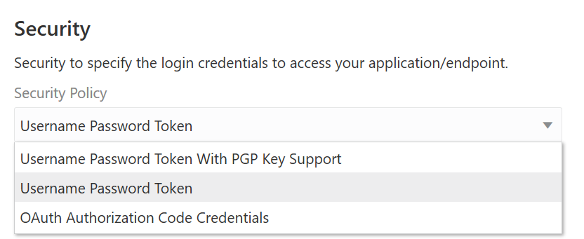
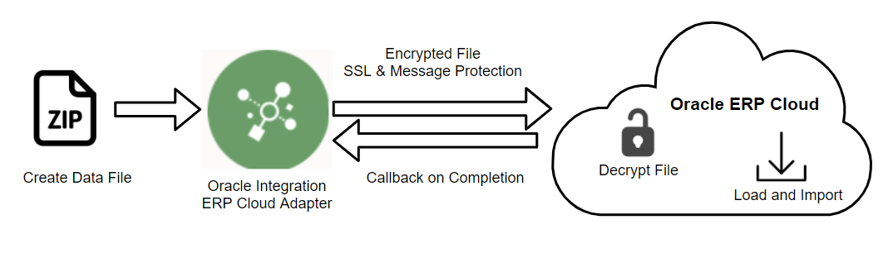
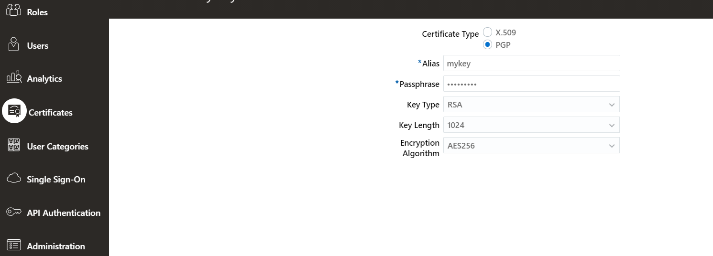
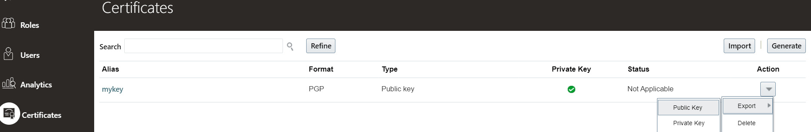
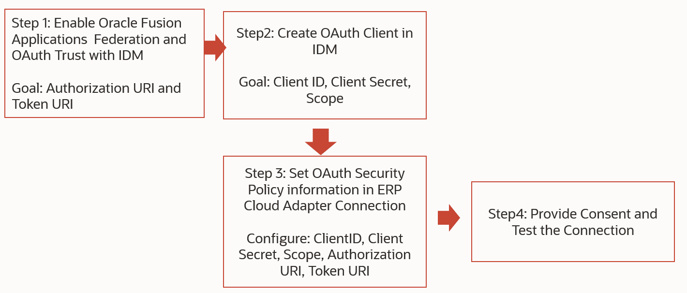
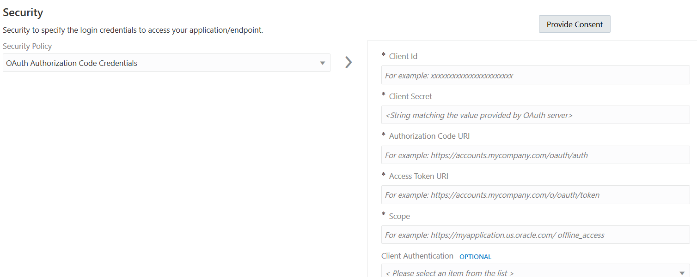

# Create ERP Cloud Connection

## Introduction

This lab walks you through the steps to configure the ERP Cloud Adapter connection.

Estimated Time: 10 minutes

### Objectives

In this lab, you will:

* Understand different authentication schemes supported by ERP Cloud Adapter
* Create ERP Cloud connection

### ERP Cloud Adapter Authentication schemes

1. Before you can build an integration, you have to create the connections to the applications with which you want to share data. Each adapter varies in authentication scheme and connection properties it supports.

    The Adapter Security Authentication scheme supports multiple options connecting to ERP Cloud

* Username Password Token
* Username Password Token with PGP Key Support
* OAuth Authorization Code Credentials

    

### *Username Password Token*

* Configure the ERP Cloud Integration Account Credentials and test the connection.

### *Username Password Token With PGP Key Support*

* PGP Key is required to encrypt files ex. Uploading company sensitive information and financial transactions (like journal entries, invoices, payments and bank records) into UCM. Data encryption is a critical and essential element in implementing integrations with Oracle ERP Cloud. ERP Cloud adapter supports an encryption algorithm for the public key with RSA and the key size must be 1024 bits in length.

    

### *Generate PGP Key in ERP Cloud*

* Oracle ERP Cloud supports Pretty Good Privacy (PGP) unsigned encryption with 1024 key size. There are two types of encryption keys:

    1. Oracle ERP Cloud Key – The Key is generated by the ERP cloud
    2. Customer Key – The key is generated by the Customer and the public key is imported into ERP Cloud. This is a case where ERP Cloud encrypts the data file extract

* In ERP Cloud Navigate to Security Console &gt; Certificates and select Generate and enter the relevant information. The certificate type should be PGP for uploading using OIC ERP Cloud Adapter

    
    Export the Public Key

    

### *OAuth Authorization Code Credentials*

* Fusion Applications offers support for OAuth through SIM federation with an Identity Manager that can function as an OAuth provider that complies with RFC 6749. IDCS (Identity Cloud Service) is one such provider. ERP Cloud Adapter supports OAuth Code Credentials security policy to invoke REST/SOAP API in addition to Business Events.

    High-level Workflow to Configure OAuth Authorization Code Credentials
    

    

 Reference Resources:

    [Create an Oracle ERP Cloud Adapter Connection](https://docs.oracle.com/en/cloud/paas/application-integration/erp-adapter/create-oracle-erp-cloud-adapter-connection.html)

### Prerequisites

This lab assumes you have:

* All previous labs successfully completed.

## Task 1: Create ERP Cloud Adapter Connection

Create a connection with the Oracle ERP Cloud Adapter.

1. In the left Navigation pane, click ***Projects***, click on the project which you have created.
    You can please skip this step if you are already in the project.
2. In the **Connections** section, click ***Add*** to create a new connection.

3. In the *Create Connection* dialog, select the ***Oracle ERP Cloud*** adapter to use for this connection. To find the adapter, enter `erp` in the search field. Click on the highlighted adapter.
4. In the *Create Connection* dialog, enter the following information and click on ***Create***:

    | **Field**        | **Value**          |
    | --- | ----------- |
    | Name         | `ERP Cloud`       |
    | Description  | `ERP Cloud Connection for OIC LiveLabs` |

    Keep all other values as default.

    > **Note:** If you are a Bootcamp user then execute step 5 only and skip other steps.
    If you are a non Bootcamp user then skip step 5 and continue with other steps..

5. Search for **ERP Cloud**, Please note that the connection with the name **ERP Cloud** is already created by the instructors, configured and shared with other projects.
Do not get confused with the same name, both the connections are in the different projects so, we are good with it. And click on **ERP Cloud** and click on **Save**. Exit the connection canvas by clicking the back button on the top left side of the screen.

6. In the *Oracle ERP Cloud Connection* dialog, enter the following information:

    | **Field**  | **Values** |
    |---|---|
    |ERP Cloud Host | `your-erp-host-name` |
    |Security Policy | **Username Password Token**|
    |Username | `<erp-username>`|
    |Password | `<erp-password>`|

7. Click on ***Test*** and wait until you receive a
confirmation box that the test was successful.

    > **Note:** The first time you run the test, it could take up to 2 minutes for completion.

8. Click ***Save*** and wait for the confirmation box. Exit the connection canvas by clicking the back button on the top left side of the screen.

You may now **proceed to the next lab**.

## Learn More

* [Getting Started with Oracle Integration 3](https://docs.oracle.com/en/cloud/paas/application-integration/index.html)
* [Create an Oracle ERP Cloud Adapter Connection](https://docs.oracle.com/en/cloud/paas/application-integration/erp-adapter/create-oracle-erp-cloud-adapter-connection.html)

## Acknowledgements

* **Author** - Kishore Katta, Product Management, Oracle Integration
* **Contributors** - Subhani Italapuram, Product Management, Oracle Integration
* **Last Updated By/Date** - Subhani Italapuram, OCt 2024
