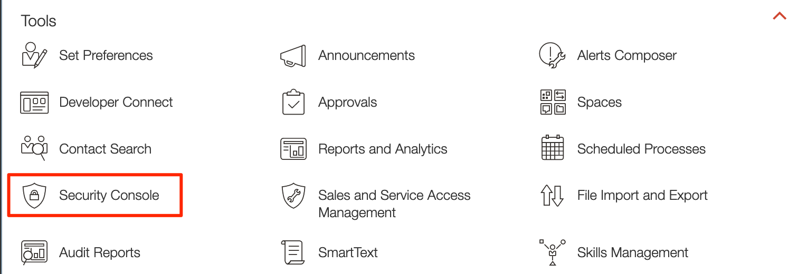

# Configure ERP Cloud for OCI Integration

> **Note:** This step is required **only** if your Oracle ERP environment is not yet configured to work with Oracle Integration

## Introduction
In this lab you will assign a custom role to an integration service user. This user account will be specified when creating an Oracle ERP Cloud Adapter connection in Oracle Integration.

Estimated Time: 10 minutes

### Objectives
* Create a custom Integration role
* Create an Integration Service user with custom role

### Prerequisites
This lab assumes you have
* An Oracle ERP Cloud account
* Access to an ERP Cloud user account with privileges to assign specific roles to an integration user. 

## Task 1: Create a custom Integration role

1. Login to Oracle ERP Cloud

2. Select **Navigator** > **Tools** > **Security Console**.
    

3. In the *Roles* tab, click **Create Role**. 

4. In the *Create Role* Canvas, enter the following information:
    | **Field**  | **Value** |
    |---|---|
    |Role Name | `<your-role-name>` |
    |Role Code | `<your-role-code>` |
    |Role Category | (Default) |
    |    

5. Click **Next**.

6. Add the following Roles and Privileges to the custom role:

    | Grant Type | Name | Code |
    | ---- | ---- | ---- |
    | Function Security Policy | Manage Webservices catalog | FND_MANAGE\_CATALOG\_SERVICE\_PRIV
    | Role | Integration Specialist | FND\_INTEGRATION\_SPECIALIST\_JOB
    | Role | Attachments User | AttachmentsUser |
    | Role | SOA Operator | SOAOperator |
    | 

7. In the *Summary* screen, click **Save and Close**.

## Task 2: Create an Integration Service user with custom role

1. In the *Security Console*, select **Users** tab and click **Add User Account**.

2.  In the *Add User Account* Canvas, enter the following information:

    | **Field**  | **Value** |
    |---|---|
    |User Category | (Default) |
    |First Name | `Integration` |
    |Last Name	 | `Service` |
    |Email | `<your-email>` (can be mock)|
    |User Name | &lt;auto generated&gt; |
    |Password | `<your-password>` |
    |

3. Click **Add Role**.

4. Search for the custom role created earlier by entering at least the first 3 characters of the role name. 

5. Select the role from the resulting list, then click **Add Role Membership**. 

6. Click **Done** to close the Role Membership dialog. 

7. In the *User Information* canvas, click **Save and Close**.
    

You may now **proceed to the next lab**.

## Learn More
* [Prerequisites for Creating an ERP Cloud Adapter Connection](https://docs.oracle.com/en/cloud/paas/integration-cloud/erp-adapter/prerequisites-creating-connection.html)
* [Using the Oracle ERP Cloud Adapter with Oracle Integration
](https://docs.oracle.com/en/cloud/paas/integration-cloud/erp-adapter)

## Acknowledgements
* **Author** - Ravi Chablani, Product Management - Oracle Integration
* **Last Updated By/Date** - Ravi Chablani, March 2022