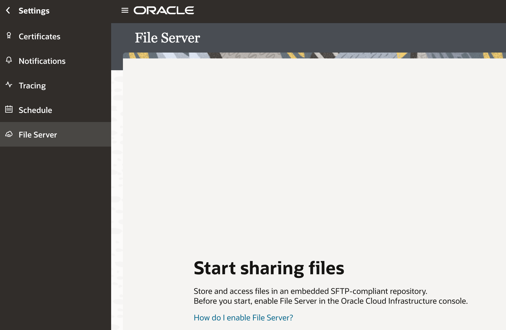
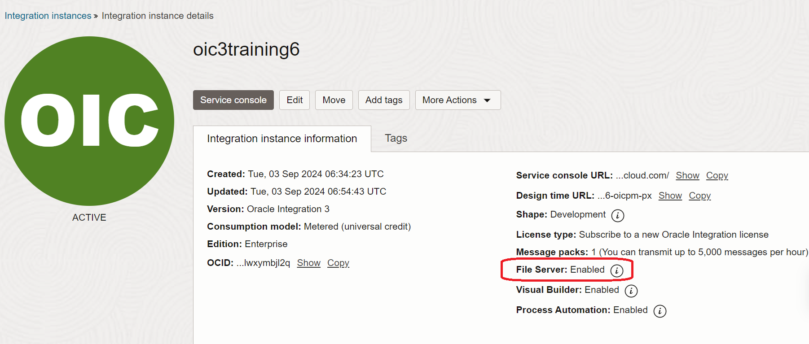
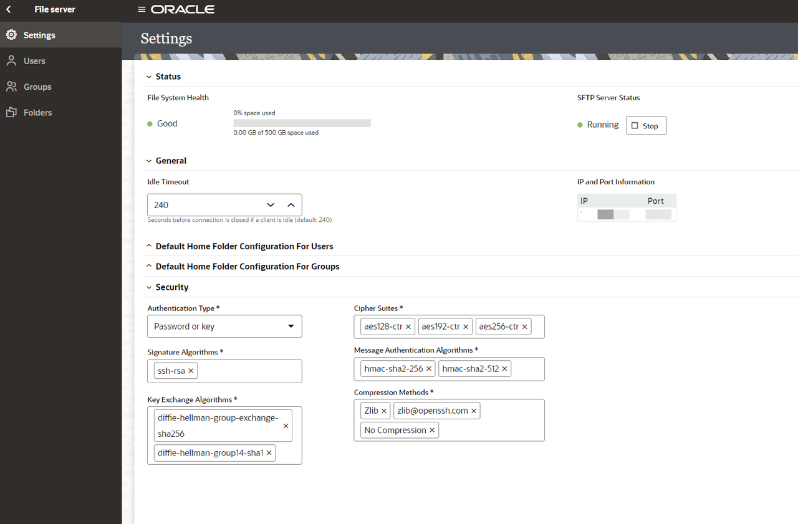
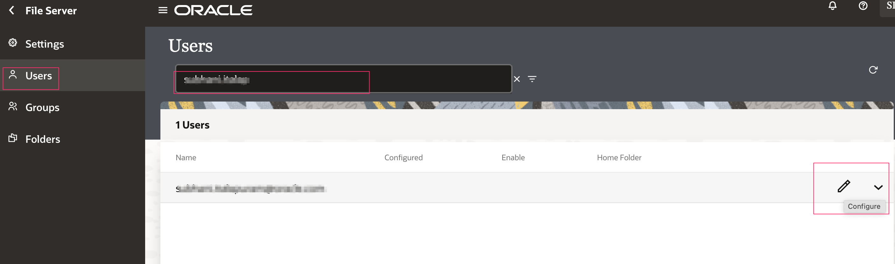
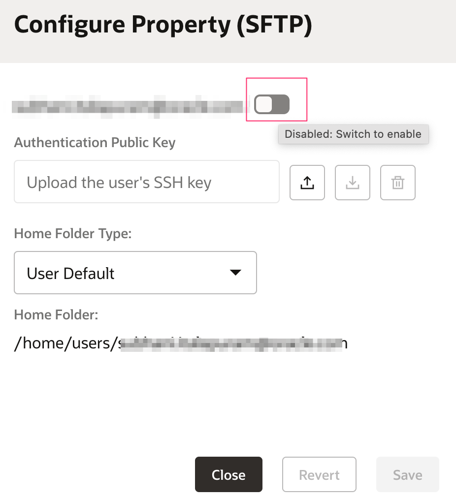
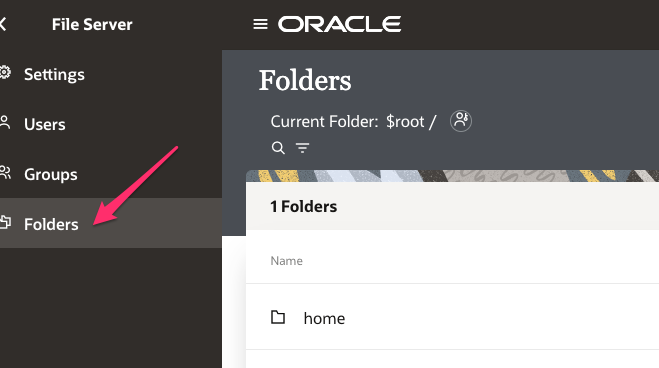
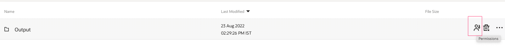
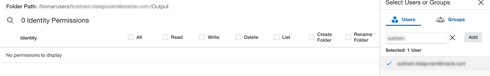
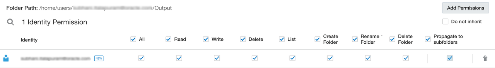
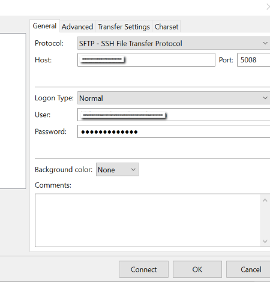

# Lab Configure OIC

## Introduction

This lab walks you through the steps required to enable and configure File
Server.

Estimated Time: 10 minutes

### Objectives

In this lab, you will:

- Enable File Server
- Configure File Server
- Connect to File Server using an SFTP client

### Prerequisites

This lab assumes you have:

- Successfully provisioned an Oracle Integration 3 instance and can access its
  home page.
- Completed all the previous labs.

## Task 1: Enable File Server

An administrator must enable File Server before an organization can start using
it with their Oracle Integration instance. Enabling File Server is a one-time
action in the Oracle Cloud Console.

If your organization hasn't enabled File Server yet, the following message
appears when you select File Server from the navigation pane: *Start sharing
files...*
    

To enable File Server:

1. On the Oracle Cloud Get Started page, select the region in the upper right where you created your Oracle Integration 3 instance. Open the navigation menu in the upper left and click **Developer Services**. Under **Application Integration**, click **Integration**.
2. If needed, select the compartment where you created your Oracle Integration 3 instance. You should see your instance.

3. Select your instance.
    The Integration Instance Details page is displayed.
4. Click the **Enable** link for File Server on the **Integration Instance Information** tab.
5. When prompted to confirm, click **Enable**. The Oracle Integration icon turns orange and its status changes to **Updating**. Enablement can take several minutes.

6. When enablement is complete, the Oracle Integration icon changes back to green with an **Active** status, and File Server shows as **Enabled**. You may need to sign out and sign back in to Oracle Integration to access File Server.

    

## Task 2: Configure File Server

Configure File Server settings. This is required when you use Oracle
Integration's embedded File Server as a target application in an integration
flow.

1. From the Oracle Integration *Home* page, select **Settings**, then **File
    Server** in the navigation pane.
2. Select **Settings** to open the File Server Settings page. Review the File
    Server status and configuration, and make a note of the hostname or IP
    address and port number.
    
    > **Note:**  Ensure the *Authentication Type* is set to **Password or Key**.

3. Under **Status**, monitor the server's status and stop or restart it as needed.
4. Select **Users** in the navigation pane, search for your username, and
    click **Configure**.
    
5. Enable the user, then click **Save**.
    
    > **Note:** By default, a user's home folder is `/home/users/<username>`.
    > If your environment uses a custom home folder, use the directory
    > configured for your user.

6. Select **Folders** in the navigation pane.
    
7. Open **home**, then **users**, and then your username. In the upper-right
    corner, click **Create** and create a folder named **Output**.
8. On the **Output** folder, click **Permissions**.
    
    > **Note:**  You will be using the above Folder structure in the lab.

9. Click **Add Permissions**, select your user, and click **Add**.
    
10. Select **All** and **Propagate to subfolders**. All permission checkboxes
    should be selected. Click **Save**, then exit the Permissions page.
    

## Task 3: Connect to File Server with an SFTP Client

To access files on File Server, use an SFTP client. Configure it with the
following:

- File Server hostname or IP address.
- File Server port.
- Your Oracle Integration username.
- Your Oracle Integration password.

1. To obtain the File Server hostname, IP address, and port, select
    **Settings** in the navigation pane. These values are in the *Host, IP and
    Port Information* section of the *Settings* page.
2. Use your preferred SFTP client to connect to File Server with the SFTP
    (SSH File Transfer Protocol) protocol.

    

    The image shows an example configuration in FileZilla.

    If the permissions are configured correctly, you should be able to list, read, and write files in the *Output* folder.

    You may now **proceed to the next lab**.

## Learn More

- [Configuring File Server Settings](https://docs.oracle.com/en/cloud/paas/application-integration/file-server/configure-file-server-settings.html)

## Acknowledgements

- **Author** - Subhani Italapuram, Product Management, Oracle Integration
- **Last Updated By/Date** - Subhani Italapuram, Aug 2026
