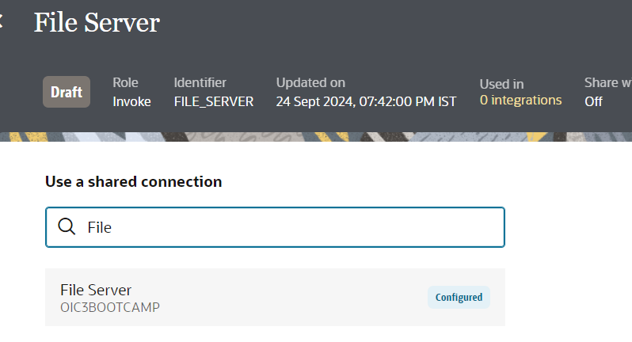

# Create Connections

## Introduction

This lab walks you through the steps to create connections for all services used in the integration flow.

Estimated Time: 20 minutes

### Objectives

In this lab, you will:

- Create an Oracle FTP connection.
- Create a REST connection.

    > **Note:**  You can use an existing connection if one has already been configured for your environment.

### Prerequisites

This lab assumes you have:

- Provisioned an Oracle Integration instance.
- Completed the setup tasks.

## Task 1: Create a Connection to File Server

To access File Server from Oracle Integration, you must create an FTP connection.

1. In the left navigation pane, click ***Projects***, then click the project that you created.
    You can skip this step if you are already in the project.
2. In the **Connections** section, click ***Add*** to create a new connection.

3. Select the **FTP** Adapter.
4. In the *Create Connection* dialog, name the connection **File Server**, select **Invoke** as the role, and leave all other settings at their default values. Click **Create**.
    > **Note:** If you are a Bootcamp user, complete only step 5 and skip the remaining steps.
    If you are not a Bootcamp user, skip step 5 and continue with the remaining steps.

5. Search for **File**. The instructors have already created, configured, and shared a connection named **File Server** with other projects.
    The connections have the same name but are in different projects. Select **File Server**, click **Save**, then exit the connection canvas by clicking the Back button in the upper-left corner of the screen.

    .

6. Configure the *FTP Connection* by using the information you previously gathered from the File Server Settings page.

    | Field                   | Value                                                 |
    |-------------------------|-------------------------------------------------------|
    | FTP Server Host Address | From File Server Settings - IP and Port Information   |
    | FTP Server Port         | From File Server Settings - IP and Port Information   |
    | SFTP Connection         | Yes                                                   |
    | Security                | FTP Server Access Policy                              |
    | Username                | Your Oracle Integration username                      |
    | Password                | Your Oracle Integration password                      |

7. Test the connection by clicking **Test**, then **Diagnose & Test**. You should see the *Connection File Server was tested successfully* confirmation message. Click **Save**, then exit the connection editor.

## Task 2: Create a Connection Using the REST Adapter

Create a connection using the REST Adapter.

1. In the left navigation pane, click ***Projects***, then click the project that you created.
    You can skip this step if you are already in the project. In the **Connections** section, click ***Add*** to create a new connection.
2. In the *Create Connection* dialog, select the **REST** Adapter. To find it, enter `REST` in the search field, then click the highlighted adapter.
3. In the *Create Connection* dialog, enter the following information, then click ***Create***:

    | **Field**        | **Value**          |       
    | --- | ----------- |
    | Name         | REST Interface     |
    | Role         | Trigger       |
    | Description  | REST Interface Connection for OIC LiveLabs |

    Leave all other values at their default settings.

4. On the *Configuration* page, enter the following information:

    | **Field**  | **Value** |
    |---|---|
    | Security Policy | OAuth 2.0 or Basic Authentication |

5. Click ***Test*** and wait for a confirmation that the test was successful.
6. Click ***Save*** and wait for the confirmation. Exit the connection canvas by clicking the Back button in the upper-left corner of the screen.

You may now **proceed to the next lab**.

## Learn More

* [Using the FTP Adapter with Oracle Integration 3](https://docs.oracle.com/en/cloud/paas/application-integration/ftp-adapter/ftp-adapter-capabilities.html)
* [Using the REST Adapter with Oracle Integration 3](https://docs.oracle.com/en/cloud/paas/application-integration/rest-adapter/index.html)

## Acknowledgements
* **Author** - Subhani Italapuram, Product Management, Oracle Integration
* **Last Updated By/Date** - Subhani Italapuram, Aug 2026
