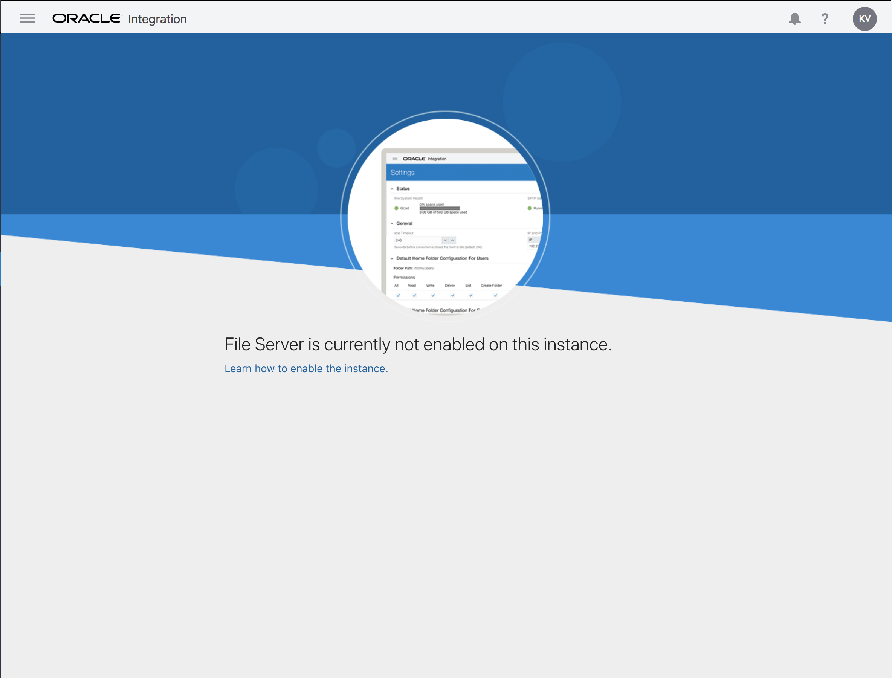
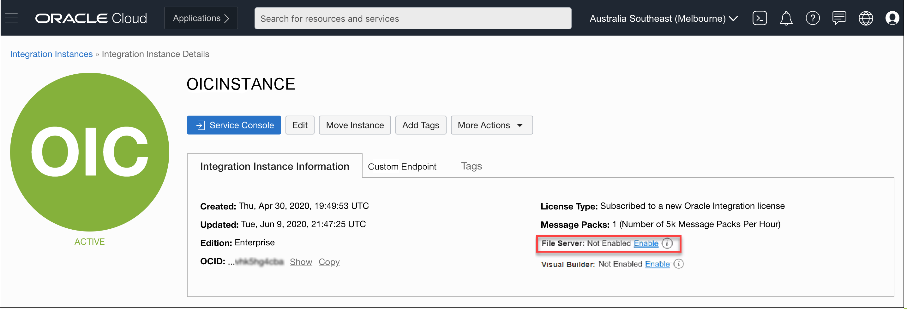
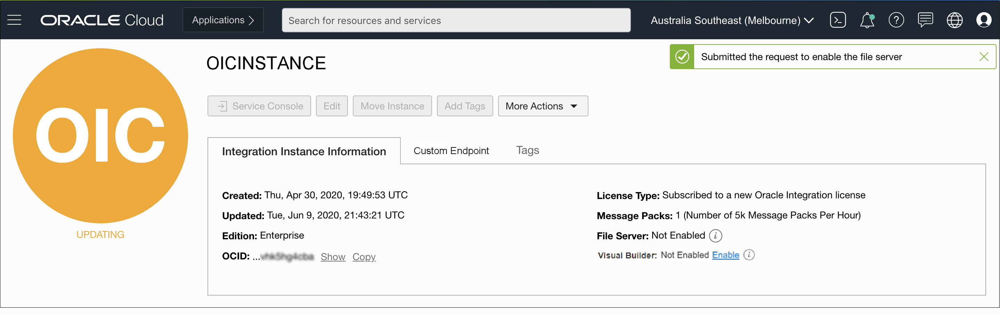
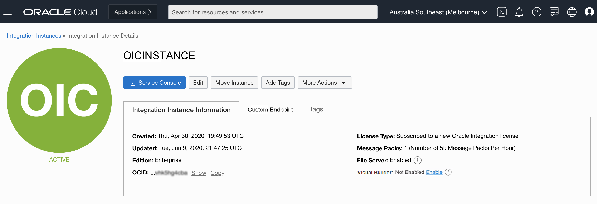

# Enable File Server

## Introduction

This lab walks you through the process of enabling the Oracle Integration File Server. By default, the File Server is not enabled, but is required for this workshop.

Estimated Time: 5 minutes

### Objectives

In this lab, you will:

* Enable File Server.

### Prerequisites

This lab assumes you have:

* Successfully provisioned Oracle Integration Instance and able to access the home page.

## Task 1: Enable File Server

To begin using File Server in Oracle Integration, it must first be enabled for the Oracle Integration instance in the Oracle Cloud Infrastructure Console. Enabling File Server is a one time action.

If you select File Server from the navigation pane and it's not yet enabled for Oracle Integration, the following message appears:
   

To enable File Server:

1. On the Oracle Cloud Get Started page, select the region in the upper right where you created your Oracle Integration instance. Open the navigation menu in the upper left and click Developer Services. Under Application Integration, click Integration.
2. If needed, select the compartment where you created your Oracle Integration instance. You should see your instance.

3. Select your instance.
   The Integration Instance Details page is displayed.
4. Click the Enable link for File Server on the Integration Instance Information tab.

   

5. When prompted to confirm enabling File Server, click Enable. The OIC icon turns orange and its status changes to Updating. Enablement can take several minutes.

   

6. Once complete, the OIC icon changes back to green with an Active status, and File Server shows as Enabled. You may need to log out and log back in to Oracle Integration to access the newly activated File Server.

   

You may now **proceed to the next lab**.

## Learn More

* [File Server](https://docs.oracle.com/en/cloud/paas/integration-cloud/file-server/file-server-overview.html)

## Acknowledgements

* **Author** - Kishore Katta, Technical Director, Oracle Integration Product Management
* **Contributors** - Subhani Italapuram, Oracle Integration Product Management
* **Last Updated By/Date** - Oracle Integration team, December 2021
