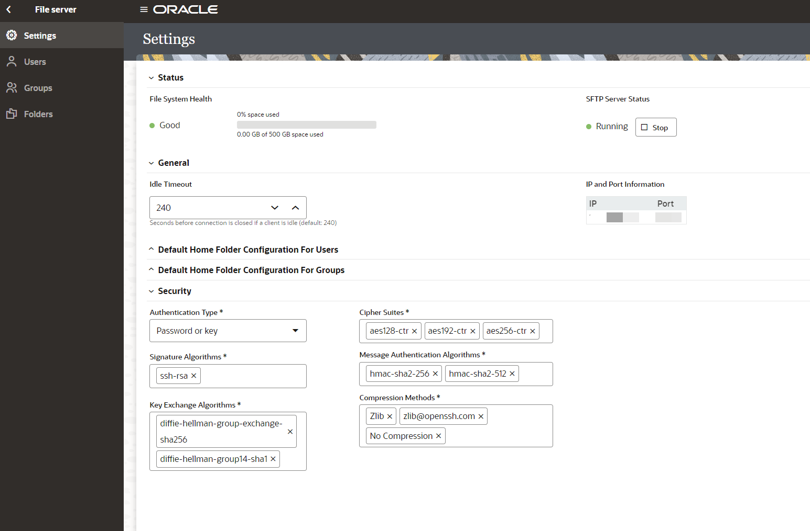

# Lab Setup

## Introduction

This lab walks you through the setup required to complete the workshop.

Estimated Time: 15 minutes

### Objectives
In this lab, you will:
- Configure File Server
- Connect to File Server using FTP Client

### Prerequisites
This lab assumes you have:
- Completed all the previous labs.

## Task 1: Configure File Server

Configure File Server settings. This is required as you are using Embedded File Serve of Oracle Integration and using File Server as a target application in your integration flow.

1. Starting at the Oracle Integration *Home* page, select **Settings**, then **File Server** from the left Navigation pane.
2. Select **Settings** from the left Navigation pane to open the File Server Settings page and review the File Server status and configurations. Make a note of IP and port number.

**Note**: Ensure the *Authentication Type* is set to **Password or Key**.
3. Under SFTP Server Status, monitor the server's status, and stop or restart as needed
4. Select **Folders** from left Navigation pane.

5. Click on **home**, click on **users**, click on your username and from the top right click **Create** and create a Folder named **Output**.
6. Click on **Permissions** on the **Output** Folder

**Note**: You will be using the above Folder structure in the lab.
7. Click **Add Permissions** and select your user. Click **Add**.

8. Select **All** and **Propagate to subfolders**. All of the permission checkboxes should be checked. Click **Save** and exit the Permissions page.

## Task 2: Connect to File Server with FTP Client

To access files on the File Server you will need to use an FTP Client. You will need to configure your FTP Client with the following:

* File Server IP Address.
* File Server Port.
* Your Oracle Integration username.
* Your Oracle Integration password.

1. To obtain the File Server IP Address and Port, select **Settings** from the left Navigation pane. The IP and Port are located in the *IP and Port Information* section of the *Settings* page.
2. Using your FTP Client choice, connect to the File Server using the SFTP - SSH File Transfer Protocol.  

An example configuration using FileZilla FTP Client.  
If the permissions are configured correctly, you should be able to list, read, and write files on the *Output* folder.

You may now **proceed to the next lab**.

## Learn More

* [Configuring File Server Settings](https://docs.oracle.com/en/cloud/paas/application-integration/file-server/configure-file-server-settings.html)

## Acknowledgements
* **Author** - Subhani Italapuram, Product Management, Oracle Integration
* **Last Updated By/Date** -
