# Create ODA Flow

## Introduction

Oracle Digital Assistant is an environment for building ***digital assistants***, which are user interfaces driven by artificial intelligence (AI) that help users accomplish a variety of tasks in natural language conversations. Digital assistants consist of one or more ***skills***, which are individual chatbots that are focused on specific types of tasks.

Estimated Time: 30 minutes

### Objectives

In this workshop, you will create a skill that can be used for interactions with a pizzeria, including ordering pizzas and canceling orders. As part of this process, you will:
* Define intents, utterances, entities.
* Design a conversation flow by using the Visual Flow Designer.
* Validate, debug and test your skill.

### Prerequisites
- Access to Oracle Cloud Account and Oracle Digital Assistant

## Task 1: Create a Skill

 1. This task assumes you are already signed in into the Oracle Cloud account and are able to navigate to the already provisioned Oracle Digital Assistant instance. With this as a prerequisite, navigate to the Oracle Digital Assistant UI in a browser, Click on the 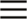 to open the side menu.

2. Click **Development** and then select **Skills**.
  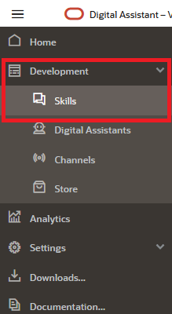


3. Click  again to collapse the side menu.

4. Click the **+ New Skill** button.
  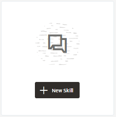

5. Enter the following details in the create skill dialoge window that appears as below.
    - **Display Name**:
          Purchase Order Assistant  
    - **One-Sentence Description**:
          A unique skill that assists users with the Status of Purchase Orders.  
    - **Skill Version**:
          1.0</copy>
    - **Platform Version**:
        Choose the latest from the drop down, ***23.06(Latest)***
    - **Dialoge Mode**:
        Please, Select the Visual radio button
    - **Primary Language(Natively-Supported)**:
        Please, Select ***English*** from the dropdown

      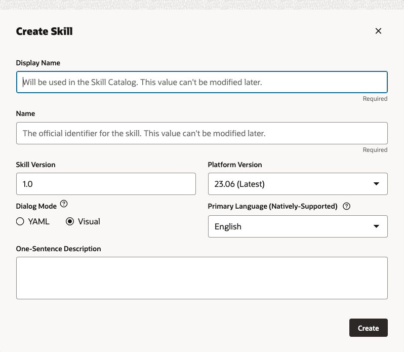

Here's a reference of details entered in the window above, after entering details please click the **Create**  button


you have successfully created a skill now you can proceed to the next task

## Task 2: Create Intents

1. After creating a skill, the designer will open on the Intents  page. Click on the **+ Intent** button and create your first Intent. Lets call this intent as Greetings.

2. Select and copy all of the example sentences below to your clipboard:

    - Hello there! How's it going?
	- Hey! Can you help?
	- Hi there! New user here.
	- Hello! What's your function?
	- Hi there! I'm lost.
	- Hey, any guidance available?
	- Hello! Need assistance please.
	- Hi there! What's possible here?
    - Hey! How does this work?
	- Hi there! Who are you?
	- Hello! Where do I start?
    - Hi there! What can I do?
	- Hey! I'm a bit confused.
	- Hello! Can you explain?
    - Hi there! Any tips?
    - Hi
    - Hello
    - Hello good morning!
    - Hello there, how are you?
    - Hi, how are you?

3. Add them to the Utterences to Add section, click on the Advanced input mode and paste all the above sentences here.

     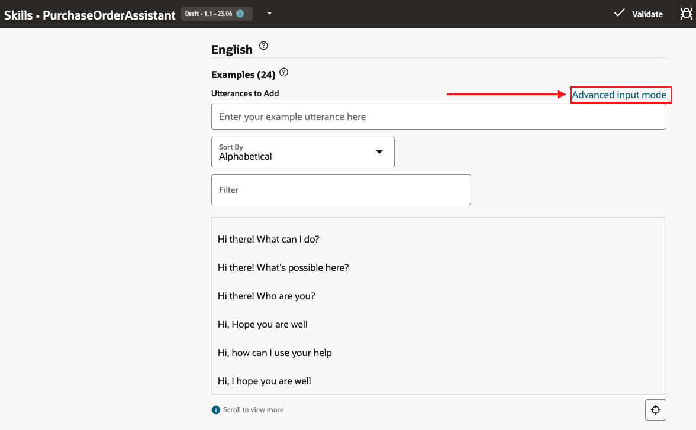


4. Now hit the **Create** button.

   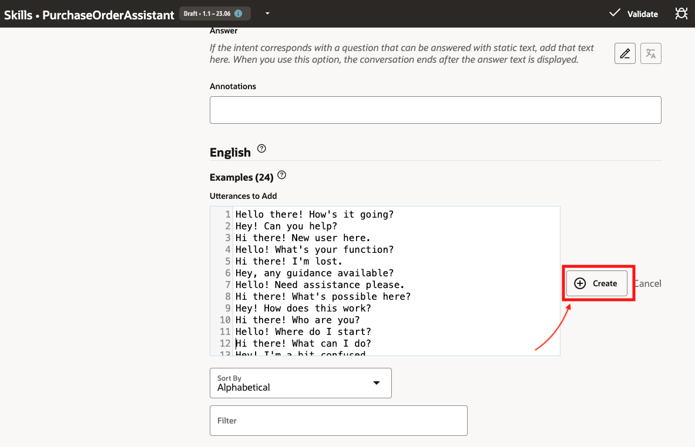    


5. Repeat the above steps for another Intent by naming the intent as  **Purchase Order** and add the below list of utterences to that particular intent and click on the **Create** button as shown below:
      - how to know the status of my purchase order
      - I would like to know the status of my order
      - Order Status
      - please help me know the status of my purchase order
      - status of my order
      - status of my purchase
      - what is the status of my order
      - what is the status of my purchase order

       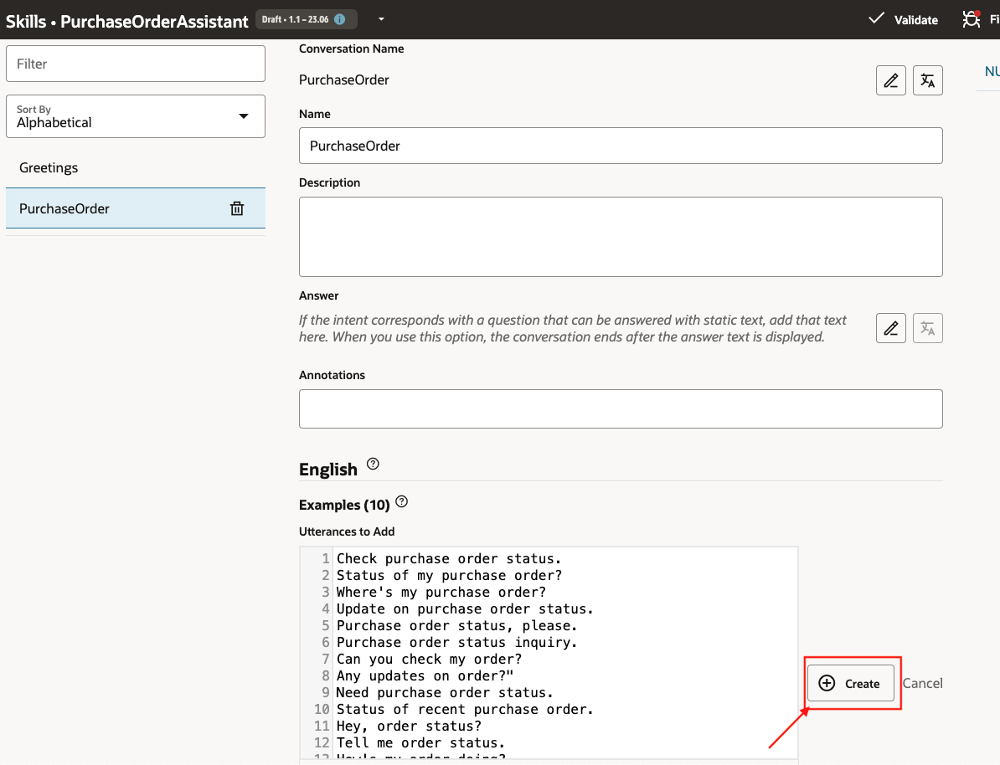


6. Train your Intents , by clicking on the **Train** on the right side of the page, click **Train Tm** and Submit. wait  for the training to complete, this may take few minutes.

     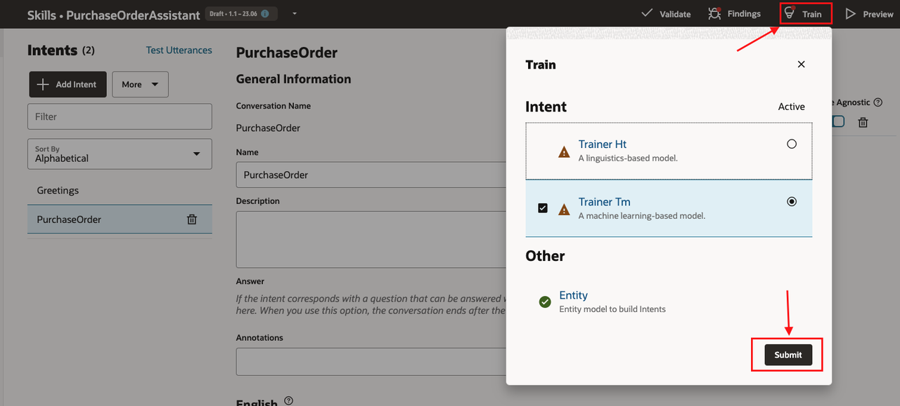

## Task 3: Design the Dialog flow
In this section you have to create dialogue flow for Greetings and the Purchase Order Intents.

**Create the Greetings conversation dialogue flow:**

1. Click on the Flow 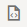 icon  on the left side of the page.

2. Click on **Add Flow** button.

  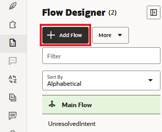


3. In the **Create Flow** dialogue box enter the name of the flow  **Greetings** and hit the **Create** button, make sure to check the box "**Open created flow afterwards**".

 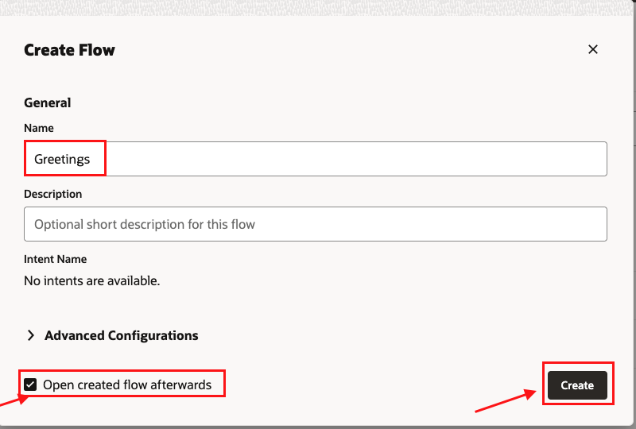

4. Click on the **Start** , you will see three dots appear like this "**...**", click on the dotes and popdown shows up with text on it as "add start state", click on it to select a template.

 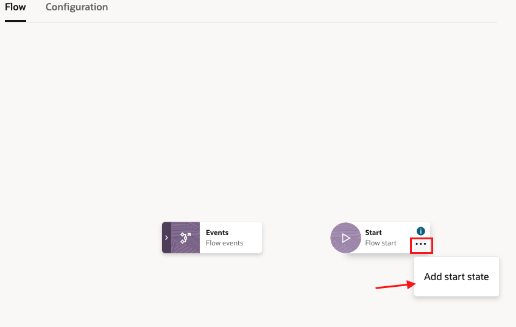

5. Select the **Send Message** template and add the **Name** as ***welcomeMessage*** and hit the **Insert** button as shown in the picture below.

 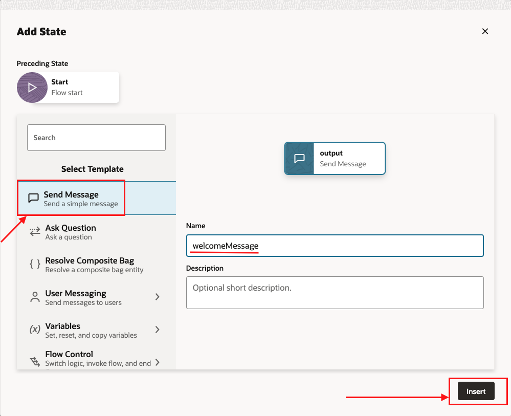

6. Then a side window opens up with the properties of the template to fill, under the **Component** tab , Please add the below text:

        ```
          <copy>
           Hello "${profile.firstName}", Welcome to the Purchase Order Assistant! How can I assist you today?   
         </copy>
       ```


**Create the Purchase Order conversation dialogue flow:**

1. Click on the Flow  icon  on the left side of the page.

2. Click on **Add Flow** button.

   

3. In the **Create Flow** dialogue box enter the name of the flow  **PurchaseOrderConversationFlow** and hit the **Create**
button, make sure to check the box "**Open created flow afterwards**".
   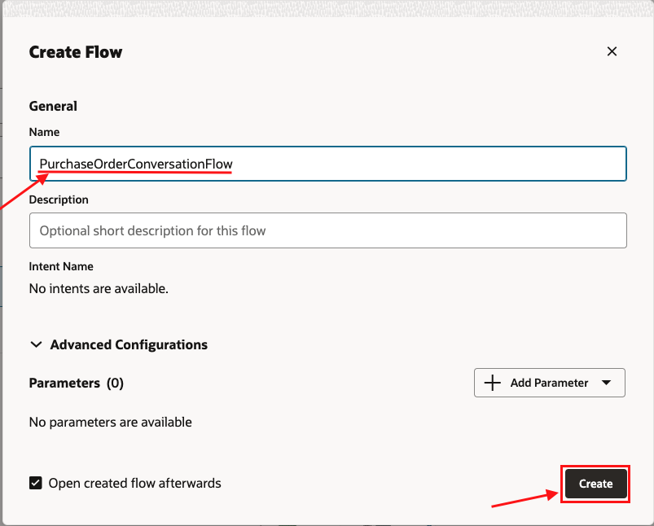

4. Once Visual Flow design editor opens, click on the **Configuration** tab and add two variables on the **Flow level** in the variables section by click on the **+ Add Variable** .   

   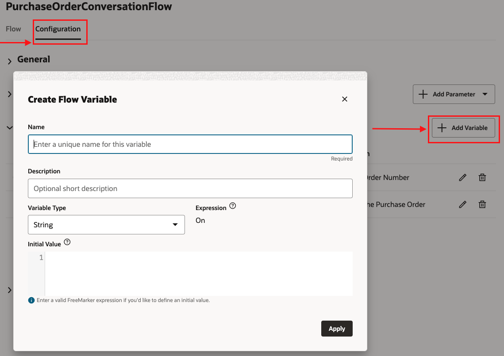

5. Enter the following details to add variables one by one and hit **Apply** button.

          - **Name**:   OrderNumber  
          - **Description**:  Purchase Order Number
          - **Variable Type**: String

    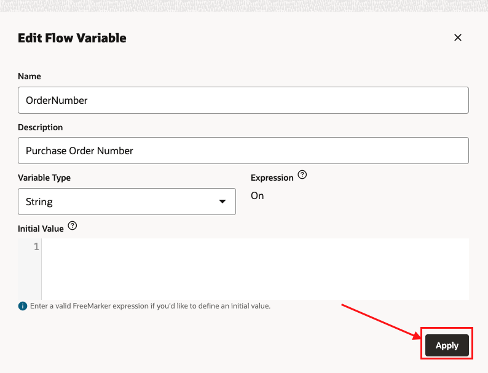

6. Repeat the step above for adding another variable with the details mentioned below

            - **Name**:   PurchaseOrderDetails  
            - **Description**:  Details of the Purchase Order
            - **Variable Type**: Map

     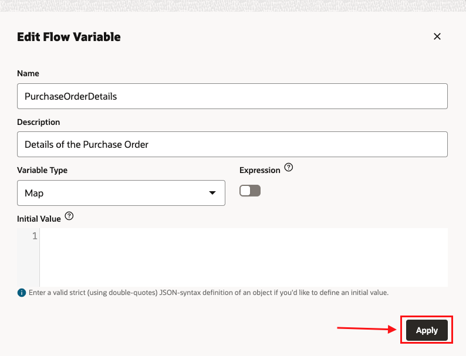

7. Click on the **Flow** tab to start building the conversation flow.

    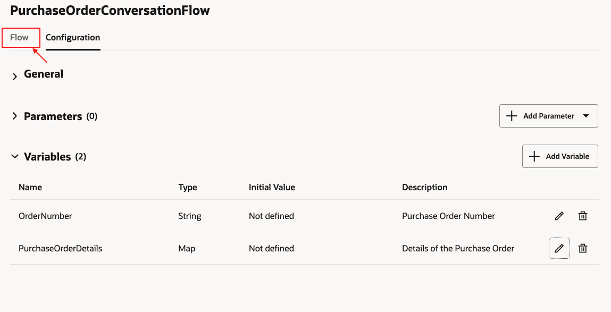

8. on the **Start** box click on the three dots **...** and then click on **add start state**

     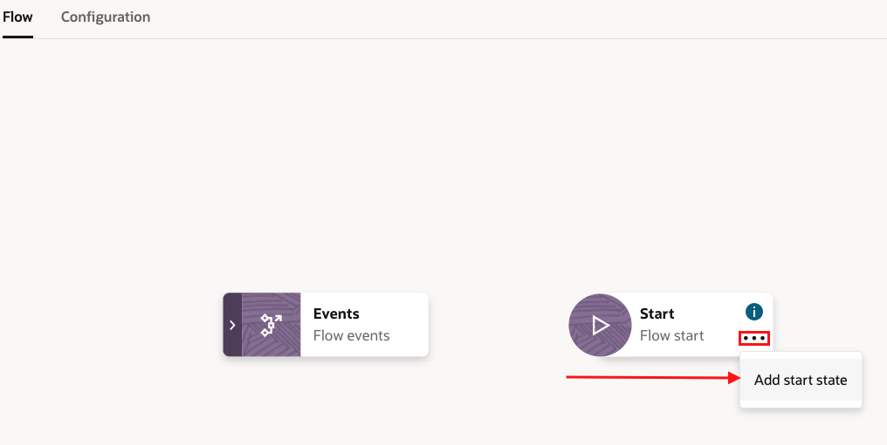

9. A window opens with options to select a template from. Please select the **Ask Question** template and fill the details as shown in the screenshot below and then hit the **Insert** button:

    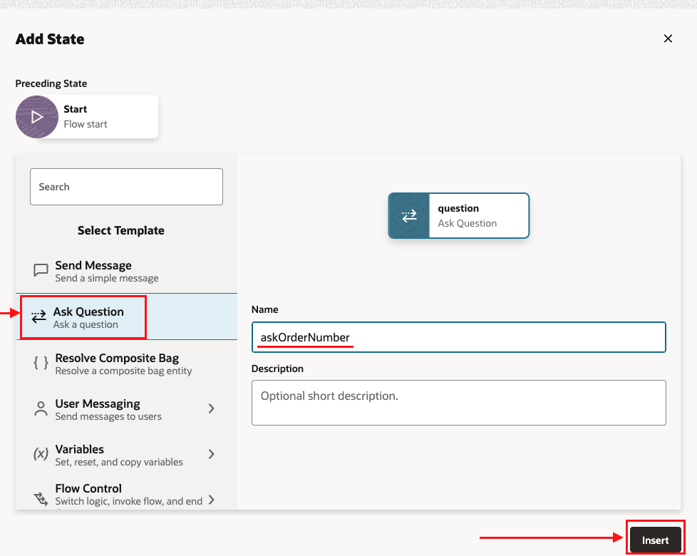

10. A side window pane opens up for this select template to fill all the details, click on the **Component** tab and enter the below details:

        Question  :  Absolutely! To better assist you, could you please provide your Order Number?
        Variable: select the Order Number from Flow Variables

     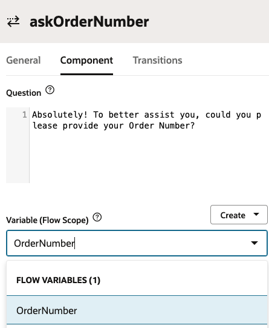

11. Click on the **Transition** tab and select **Add State ...**

      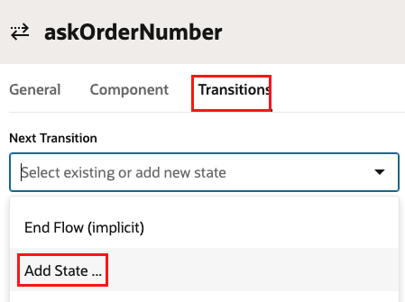

12. In the template select **User Messaging** and then **Create Text Menu** and select **Create Action Menu**, in the  **Name** enter text **validateOrderNumber** and then hit the **Insert** button.

       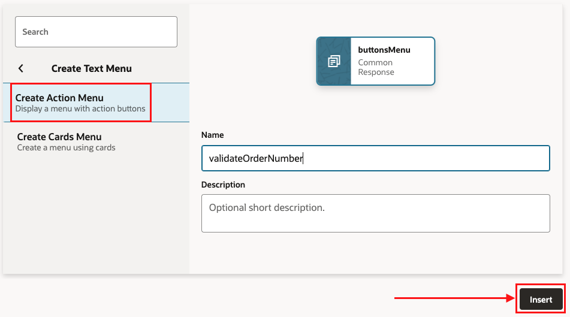

13. click on the **Component** tab and then click on the **Edit Response Items** button.

      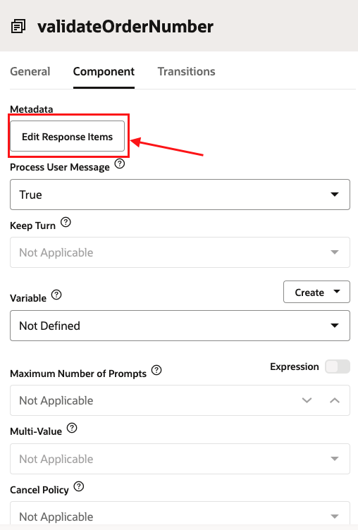

14. Copy the below details, paste it in the editor and hit the **Apply** button. This is a YAML code for it to work the indentation needs to be correct, make sure the indentation matches with the screenshot below:
        ```
        <copy>
         responseItems:
            - text: "Before we proceed, kindly verify, if the entered Order Number, ${OrderNumber} is correct!"
              type: text
              actions:
                - payload:
                    variables:
                      menuAction: "Yes"
                    action: "Yes"
                  label: "Yes"
                  type: postback
                  keyword: "1"
                - payload:
                    variables:
                      menuAction: "No"
                    action: "No"
                  label: "No"
                  type: postback
                  keyword: "2"
                  </copy>
                  ```

  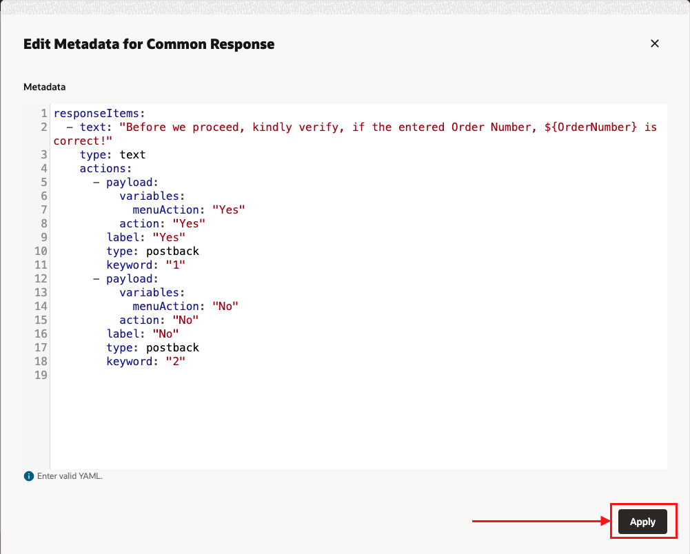

15. Click on the **Transition** tab and click on the **+** button besides **Action**

    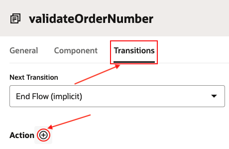

16. we are trying to define next state for the action buttons **Yes** and **No** , on the left box type **Yes** and on the right box pick **add state...** option from the dropdown.

    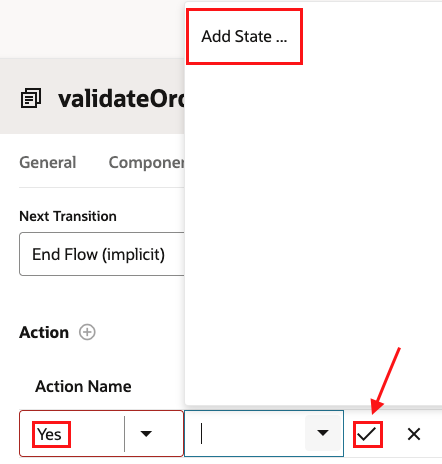

17. In the **Add State** window choose the **Variables** template

     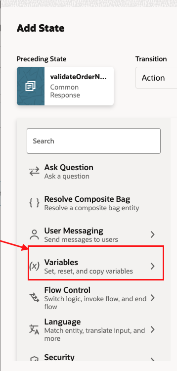

18. select the **Reset Variables** template , name it as **yesaction_resetVariable** and hit the **Insert** button.

     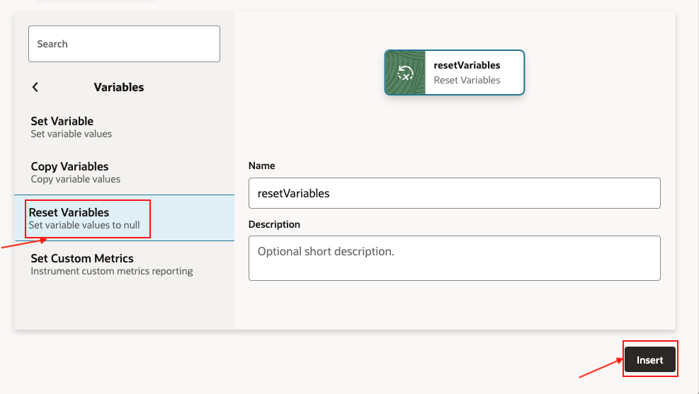


19. once the **Reset Variable** component opens up select the **Purchase Order Details** variable in the **Flow variables** section.

    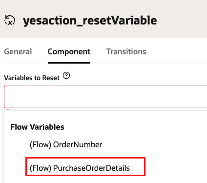


20. Repeat steps 16-19 for **No** action and this time reset both the Flow variables **Order Number** and **Purchase Order Details**

    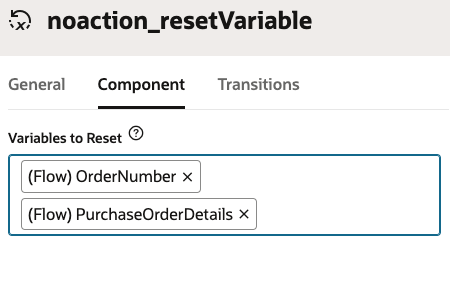


21. Now come back to **yesaction_resetVariable**, click on the **Transition** tab and select the **add state...**

    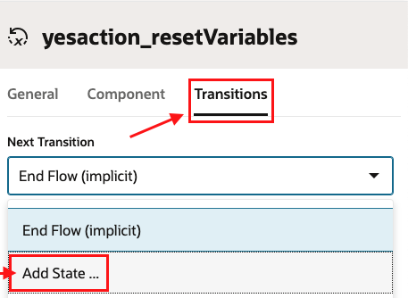


22. once the **add state** window opens, scroll down and select the **Service Integration** section.

    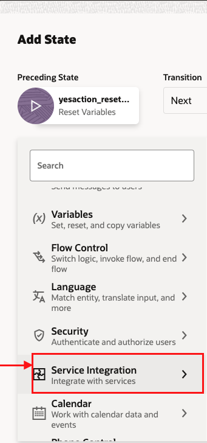

23. After clicking that section scroll down through the list and look for **Call REST Service**, name it **callERPAPI** and hit the **Insert** button

   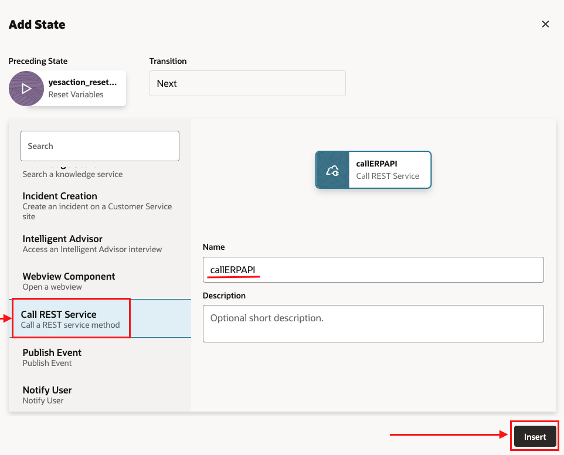

24. Click on the **Component** tab and add the following details:

      - **REST Service** : rom the drop down select the api **ERP_PO_API**.
      - **Method**: GET
      - **Parameters**: Click on the **+** button and add the below details

       **1. Sold to legal Entity**
          - **Key**: sold_to_legal_entity
          - **Value**: US1 Legal Entity
          - **Type**: Select **Query** from the dropdown and click on the  to save the variable details.

        **2.Order Number**
        add second parameter value as below
         - **Key**: orderNumber
         - **Value**: ${OrderNumber}
         - **Type**: Select **Path** from the dropdown and click on the  to save the variable details.

         - **Result Variable Service** : select the Flow variable **PurchaseOrderDetails** from the dropdown.

25. After the variables are successfully added in **Component**, select the **Transitions** tab, click on the **+** sign near the **Action** , a new row gets added with two Columns **Action Name** and **Transition To**
Click on the **Action Name** in the new row and from the dropdown select **Success**

  

26. In the **Transition To** from the dropdown select **add state...**

  

27. In the **Add State** window that opens up select the **Flow Control** section and navigate to **Switch** template and select it, name it as **determineIfValuePresent** and hit the **Insert** button.

  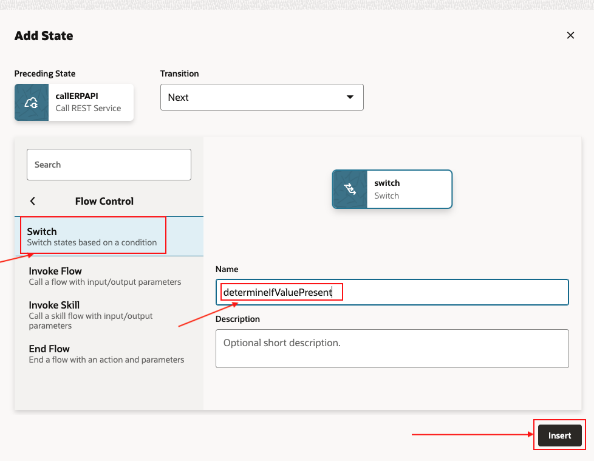

28. In the **Component** tab under the **Expression** editor add the below free marker expression.

             ${PurchaseOrderDetails.value.responsePayload.ordernumber?hasContent?then('success','failure')}            

    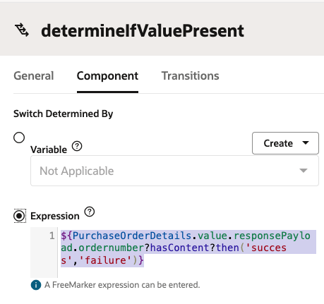

29. Go to the **Transition** tab , under the **Next Transition** section select the **Add State** from the dropdown.

 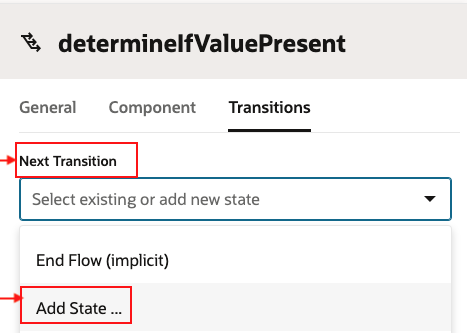


30. when the **Add State** opens up, select the **Send Message** template and name it as **outputFailure** and hit the **Insert** button.

  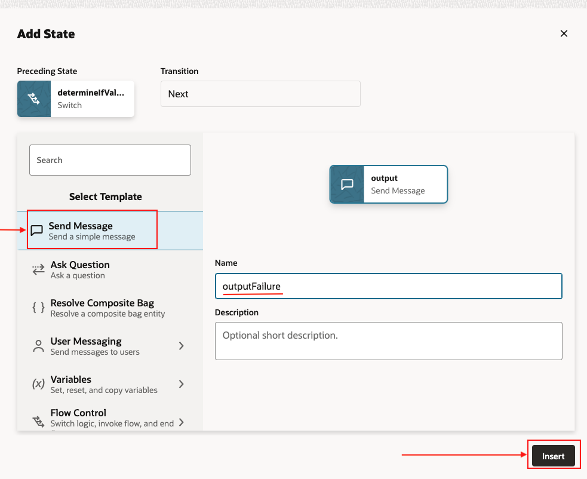

31. In the **outputFailure** window, go to the **Component** tab and copy the below message and paste it in the editor.

      Unfortunately, we couldn't locate any records matching the provided Order Number: ${OrderNumber}.


    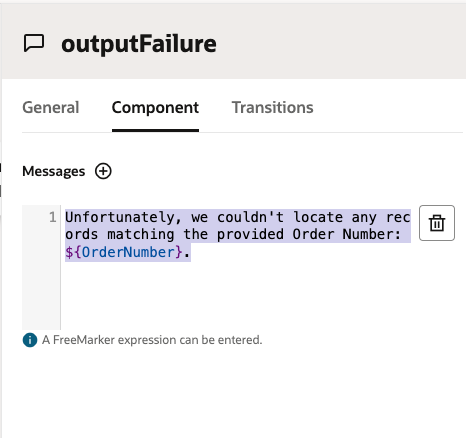     

32. No go to the **determineIfValuePresent** state and click on the **Transitions** tab , then click on the **+** icon near the **Action** and add the **Action Name** as **success** and for **Transition To** select add state again, once the add state window opens select the **Send Message** template and name it as **api Response** and hit the **Insert** button.

33. In the **apiResponse** pane, under the **Component** tab , copy the below message and paste it.

            The Status is "${PurchaseOrderDetails.value.responsePayload.status}"

            Please find the Order details below:

            Order Number:  "${PurchaseOrderDetails.value.responsePayload.ordernumber}"
            Description:   "${PurchaseOrderDetails.value.responsePayload.description}"
            Supplier:   "${PurchaseOrderDetails.value.responsePayload.supplier}"
            Creation Date:   "${PurchaseOrderDetails.value.responsePayload.creationDate}"
            Total Amount :   "${PurchaseOrderDetails.value.responsePayload.totalAmount}"
            Sold to Legal Entity:   "${PurchaseOrderDetails.value.responsePayload.sold_to_legal_entity}"
            Letter of Credit Id:   "${PurchaseOrderDetails.value.responsePayload.locId}"

34. After this, click on the **Transitions** tab , under the **Next Transition** , click on **add state** and navigate towards the **resetVariables** template, name it as **resetVariables** and hit then **Insert** button.

    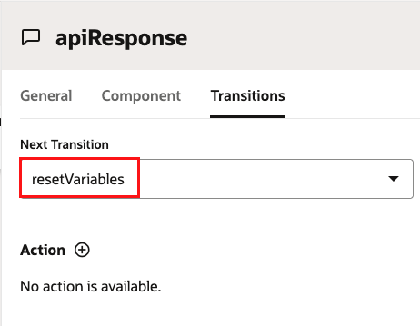

35. In the **resetVariables** pane, select both flow variables **OrderNumber** & **PurchaseOrderDetails** to reset.

     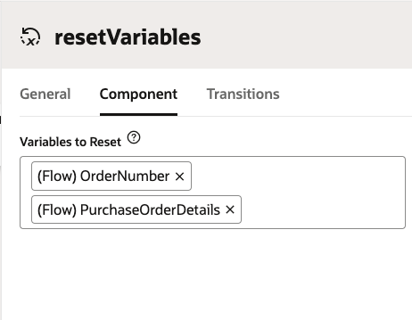


36. Click on the **Transitions** tab and under the **Next Transition** select **add state** and follow this path  **User Messaging>>Create Text Menu>> Create Action Menu**, name it as **anotherOrderNumber** and hit the **Insert** button. In the **Component** tab click on the **Edit Response Items** and copy the below text add the text and hit on the **Apply** button.


```
<copy>
         responseItems:
           - text: Are you interested in checking the Status of a different Order Number?
             type: text
             actions:
              - payload:
                  variables:
                    menuAction: "Yes"
                  action: "Yes"
                label: "Yes"
                type: postback
                keyword: "1"
              - payload:
                  variables:
                    menuAction: "No"
                  action: "No"
                 label: "No"
                 type: postback
                 keyword: "2"
                 </copy>
                 ```
The above code is a **YAML** code make sure the indentation matches with the screenshot below:
  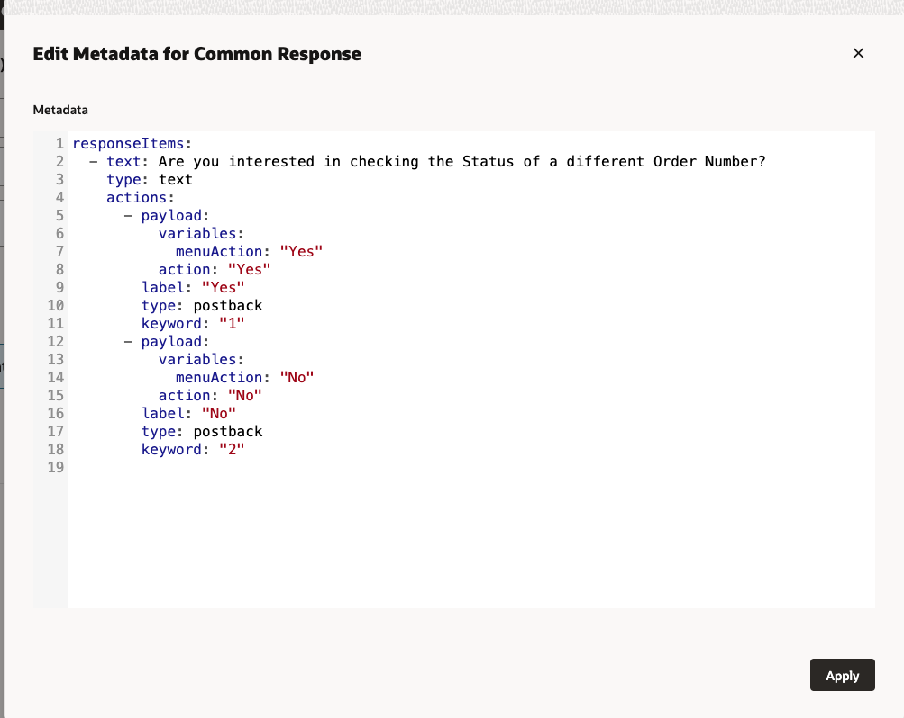

37. Now click on the **Transitions** tab and under the **Next Transition** drop down select the **askOrderNumber** state.

  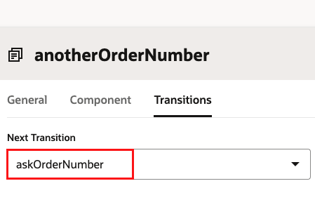

38. under the **Action** section, add **Action Name** as **No** and in the **Transition To** select **add state** and select the **Send Message** template and name it as **ThankYouMessage**. Go to the **Component** tab is opened copy the below message and paste it in the editor.

          Thank you for your time. It was a pleasure to assist you. Please feel free to reach out any time you need more assistance with your Purchase Order, until then, Goodbye and takecare!

  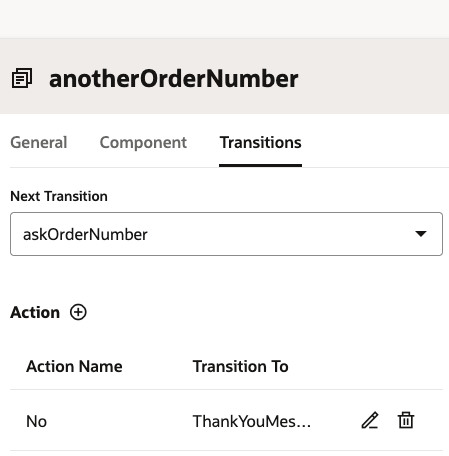

  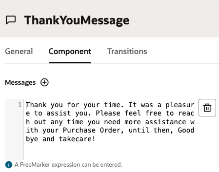

39. Now lets go to the **outputFailure** state and  click on the **Transitions** tab in the **Next Transition** dropdown select **resetVariables** state.

  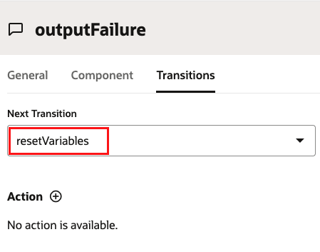

40. Finally, lets go back to the **yesaction_resetVariable** state and click on the **Transitions** tab in the **Next Transition** dropdown select the **callERPAPI** state.

  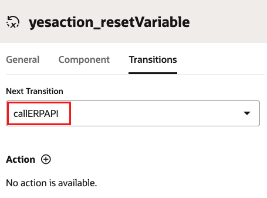

## Task 4: Test your Skill

In this section we will just test the happy path scenario of the conversation dialogue flow we built in the previous section.

  1. Click on the **Validate** button on the top to make sure there are no errors.

     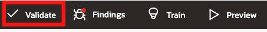

  2. Then click on the **Preview** button to Test the bot.

     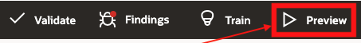

  3. **Conversation Tester** window opens up and in the **Type Here** section type "Hi" and hit enter, the bot should respond with a Greeting message as shown in the screenshot below.

     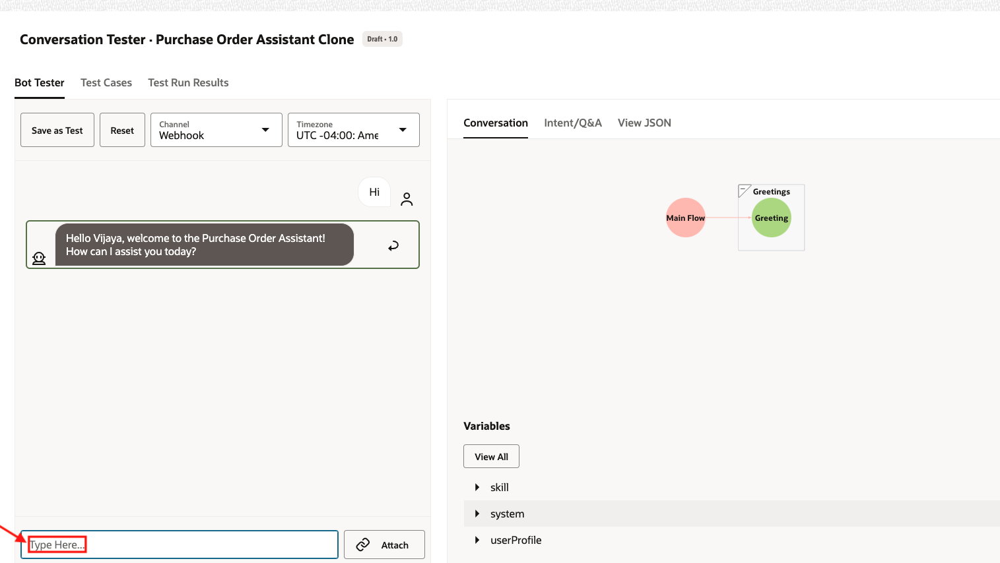

  4.  Then enter the sentence **Purchase Order Status** and hit enter, you should see the bot asking for you to enter the "Order Number " as below:

     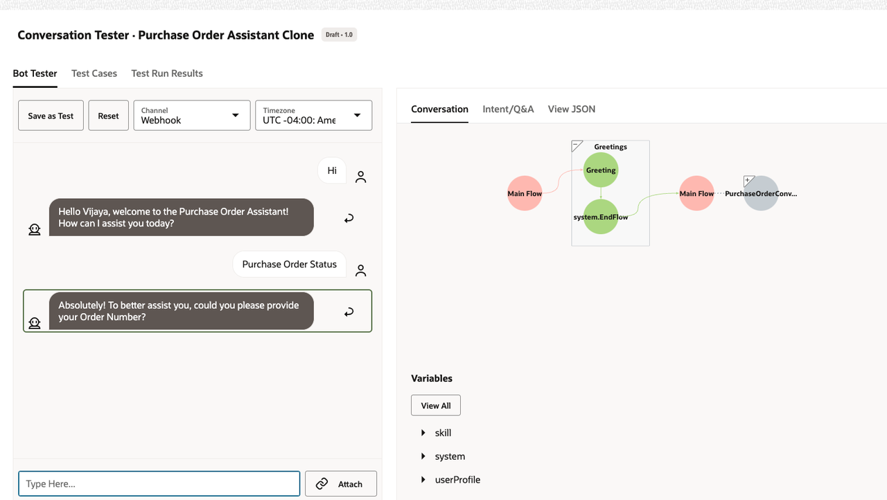

  5. Then enter the order number as **US166001** or **US166026** and then click on **Yes** the bot returns with details of the order number and asks if you would like to check status of another order number,  click on **No** to see the bot responding with "Thank you" message.

    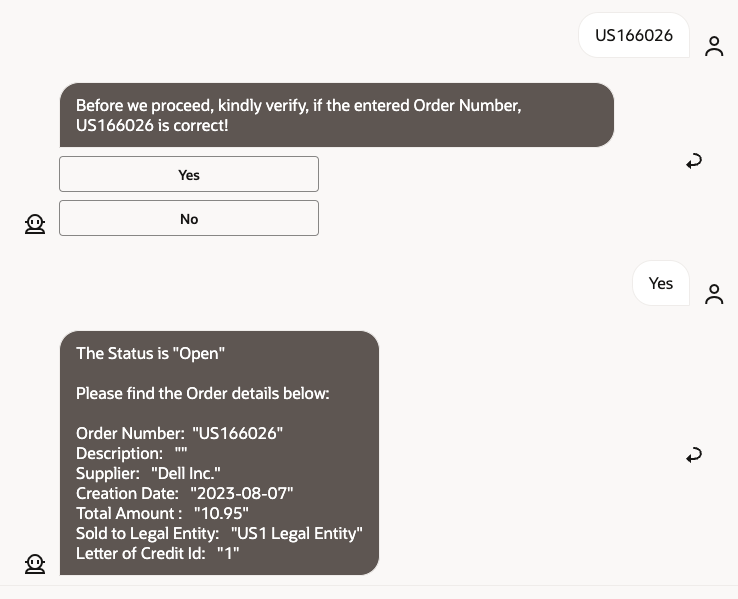

    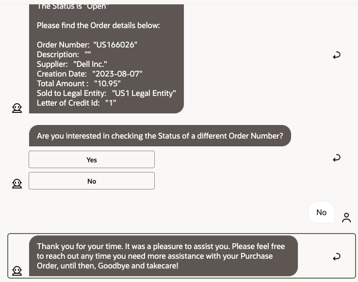

By completing this, you have effectively concluded the lab. we hope this has proven to be beneficial.

You may now **proceed to the next lab**.

## Acknowledgements
* **Author** - Vijaya Vishwanath, Sr. Cloud Solution Engineer
* **Last Updated By/Date** - Subhani Italapuram, August 2023
