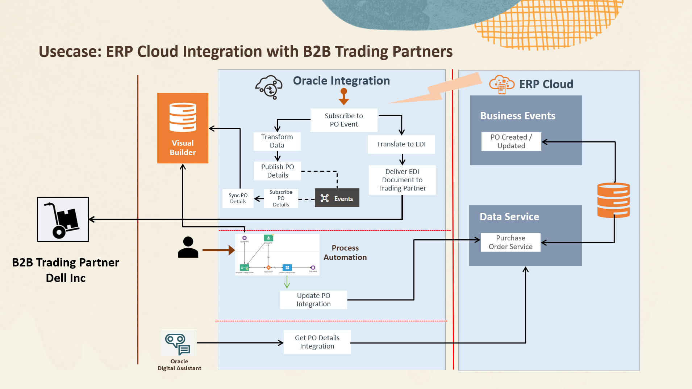

# Introduction

## About this Workshop

This tutorial introduces Oracle Integration Cloud (OIC) capabilities through a step-by-step scenario. When a user creates a Purchase Order (PO) in ERP Cloud, a real-time PO event is generated. Oracle Integration captures this event and transforms the relevant data, pushing it to a custom table in Visual Builder Cloud Service (VBCS). The B2B component within Oracle Integration translates the PO payload into an EDI 850 document using the X12 Business Protocol, which is then delivered to a Trading Partner via FTP based on the Trading Partner agreement. Additionally, an approval workflow is initiated by an ERP Process user who selects the order and attaches Letter of Credit (LOC) information via a web form. Once approved, the PO record in ERP Cloud is updated with the LOC details for cross-referencing. Furthermore, OIC facilitates seamless interaction: Oracle Digital Assistant (ODA) initiates a conversation, requesting an Order Number, then connects with Integration to retrieve Order details and presents them to the user.

Here is the high level architecture reference of the tutorial

Estimated Time: 3 hours 40 minutes

[Introduction to Live Lab Usecase](youtube:yW3TEBWkFbg)

### Objectives

In this workshop, you will learn how to:

- How to capture real-time events, such as Purchase Order (PO) creation, in Oracle ERP Cloud.
- How to set up Oracle Integration Cloud (OIC) to listen to these events and transform the data for further processing.
- How to push the transformed data from OIC to a custom table in Visual Builder Cloud Service (VBCS).
- How to use the B2B component in OIC to translate the PO data into an EDI 850 document using the X12 Business Protocol.
- How to deliver the translated document to a Trading Partner using the FTP protocol based on the Trading Partner agreement.
- How to initiate an approval workflow for a PO in Oracle Process Automation (OPA) and attach additional information using a web form.
- How to synchronize and update the approved PO record with the attached information.
- How Oracle Digital Assistant (ODA) can engage in a conversation, collect an Order Number, and retrieve Order details through integration with OIC.

Through this workshop, you will gain hands-on experience with Oracle Integration Cloud's capabilities in event handling, data transformation, B2B communication, approval workflows, and seamless integration with Oracle Digital Assistant.

### Prerequisites

This lab assumes you have the following:
* Oracle Cloud Account with credits to provision services.
* Oracle ERP Cloud access

You may now **proceed to the next lab**.

## Learn More

* [Oracle Integration 3 Documentation](https://docs.oracle.com/en/cloud/paas/application-integration/index.html)
* [Oracle Integration 3 Blogs](https://blogs.oracle.com/integration/)

## Acknowledgements
* **Author** - Kishore Katta, Oracle Integration Product Management
* **Contributors** - Subhani Italapuram (Oracle Integration, Product Management), Vijaya Vishwanath (Sr. Cloud Solution Engineer - Public Sector)
* **Last Updated By/Date** - Kishore Katta, July 2023
