# Provision Oracle Digital Assistant

## Introduction
Oracle Digital Assistant is a platform that allows enterprises to create and deploy digital assistants for their users. With Oracle Digital Assistant, you create:

- **Digital assistants**, which are AI-driven interfaces that help users accomplish a variety of tasks in natural language conversations. For each digital assistant, you assemble one or more skills

- **Skills** (formerly known as chatbots), which are individual bots that are focused on specific types of tasks, such as tracking inventory, submitting time cards, and creating expense reports

You can add skills to digital assistants or deploy them to a channel on their own.

**Basic Concepts**
Before you dive into digital assistant and skill development, here are some concepts you’ll want to get familiar with:

- **Intents**: Categories of actions or tasks users expect your skill to perform for them

- **Entities**: Variables that identify key pieces of information from user input that enable the skill to fulfill a task

Both intents and entities are common **Natural Language Processing (NLP)** concepts. NLP is the science of extracting the intention and relevant information from text.

- **Components**: Provide your skill with various functions so that it can respond to users. These can be generic functions like outputting text, or they can return information from a backend and perform custom logic

- **Dialog Flow**: The definition for the skill-user interaction. The dialog flow describes how your skill responds and behaves according to user input

- **Channels**: Digital assistants and skills aren’t apps that you download from an app marketplace, like iTunes. Instead, users access them through messaging platforms or through client messaging apps. Channels, which are platform-specific configurations, allow this access. A single digital assistant or skill can have several channels configured for it so that it can run on different services simultaneously

Estimated Time: 15 minutes

**Objectives**
In this lab, you will:

- Create and explore and set up your Digital Assistant instance

**Prerequisites**
- This lab assumes you have logged into your to Oracle Cloud account.

## Task 1: Set up the OIC service account

1. Login into the Oracle Cloud Account and click on the  and select the **Identity & Security**

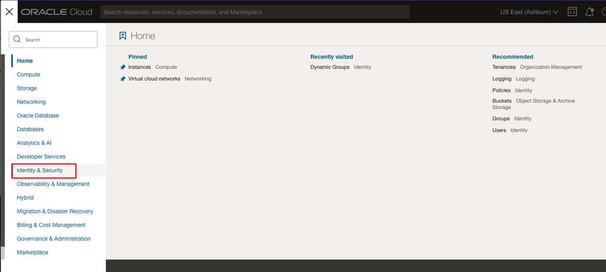

2. Then click on **Federation**
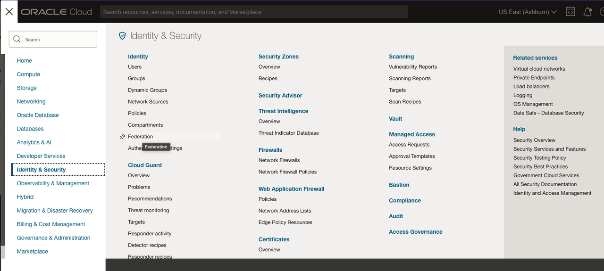

3. Then click on **OracleIDentityCloudService**  and click on the url that ends with "/adminconsole"
> **Note:** https://identitydomain/ui/v1/adminconsole)

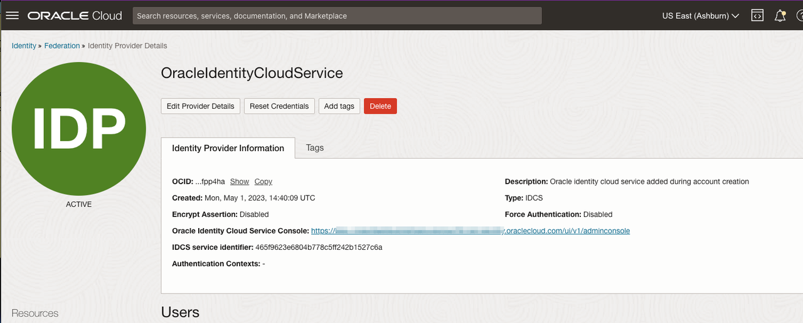

4. Click on the hamburger icon  and then click on the **Users**

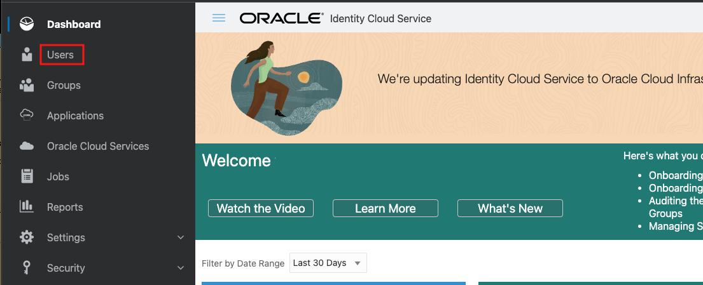

5. click on the **+ Add** button

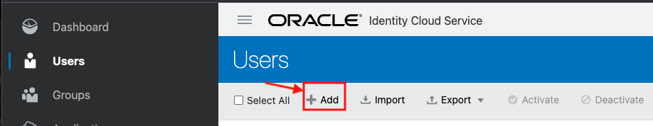

6. Enter all the details as below and click the Finish button.

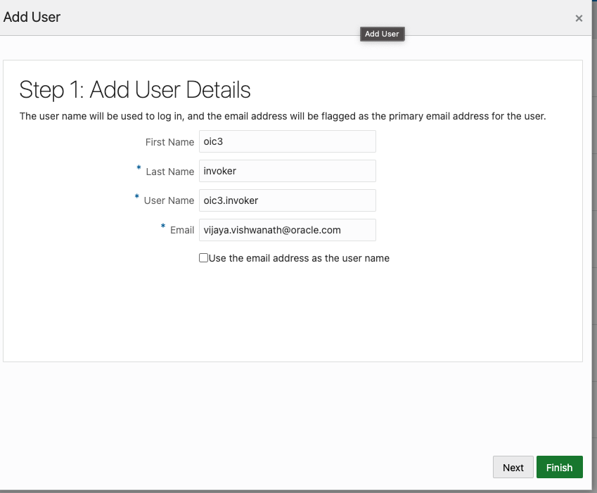

7. click on the side menu and select **Oracle Cloud Services** and in the search tab type **oic**

 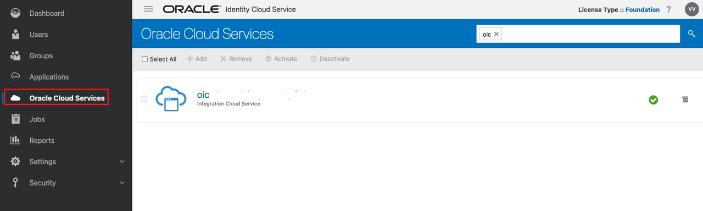

8. Click on the **oic** and then **Application Roles**

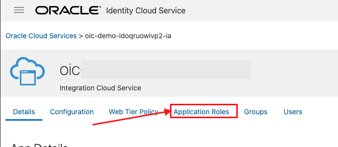

9. In the **Application Roles**, select the **Service Invoker** on the same tile click on the hamburger icon on extreme right and select the **Assign Users** menu option.

   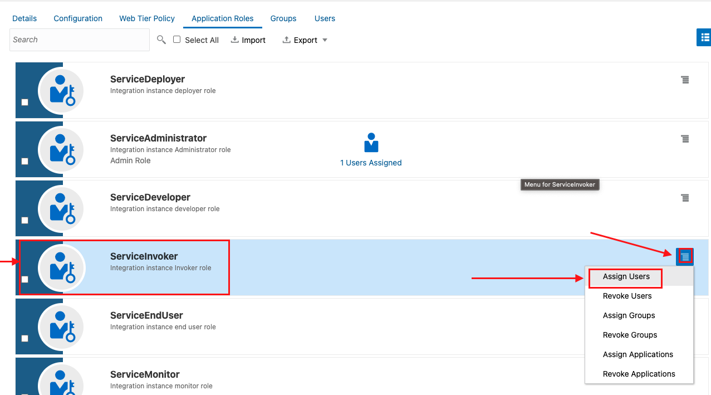

10. click on the check box with OIC 3 Invoker details and click on  button.

  

A welcome email with details to activate your account will be received, which helps in activating the account and set the password of your choice. You can now proceed to the Tasks in this lab.

## Task 2: Create a Digital Assistant instance

Create a Digital Assistant instance to start working with bots. You can find advance set up steps on the [official documentation](https://docs.oracle.com/en/cloud/paas/digital-assistant/use-chatbot/order-service-and-provision-instance.html#GUID-7E4F1CE5-FB40-45DF-B0F0-949289F5E184).

1. Go to the **Menu, Analytics & AI** and click on **Digital Assistant**:

  

2. Click on Create **Digital Assistant Instance** button:
You will have the **root compartment** selected, or pick the one you want.

   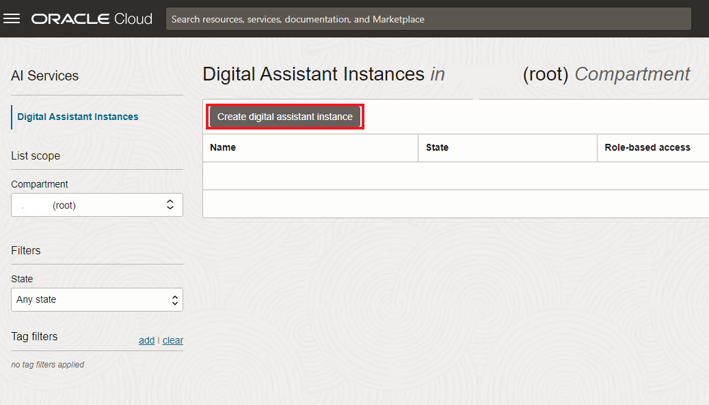

3. Fill the information as in the next image. *Development* edition is perfect for this workshop and develop new *Digital Assistant* systems until you want to move to production. Finally click **Create** bottom:
| Element           | Description               |
| ------------------| ------------------------- |
| Name              | ODA |
| Description       | My Oracle Digital Assistant     |
| Shape  | Development                      |
{: title="ODA Provision Properties"}

  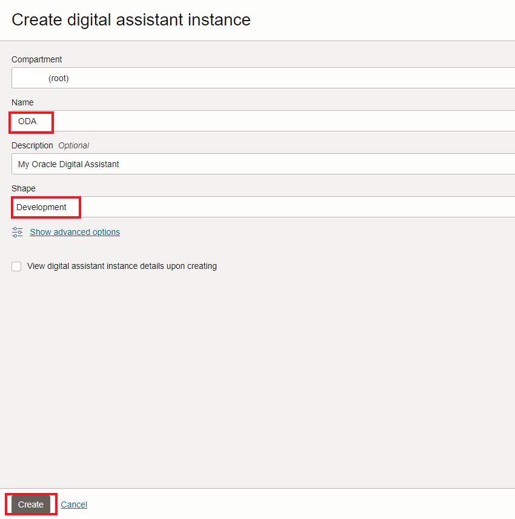  

4. Wait for the instance to be *Active*. The creation process will take a few minutes. Once the instance is *Active*, then on the instance menu, click on **Service Console**:

  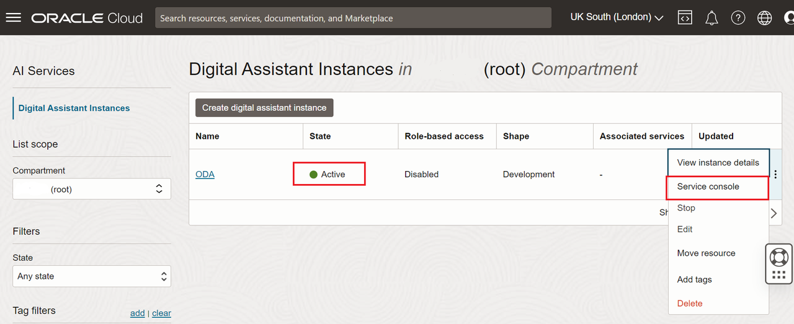  

5. If you see your *Oracle Cloud Account* in the next screen, *click on it*, otherwise follow the next steps to Sign in with a different user account.

  

6. You will have to *Log-in* again with your **Account name, User** and **Password**. Follow this step, just if you are Sign in with a different user account. Ensure you are on the right *Tenancy* or *Account* and click **Continue**.

    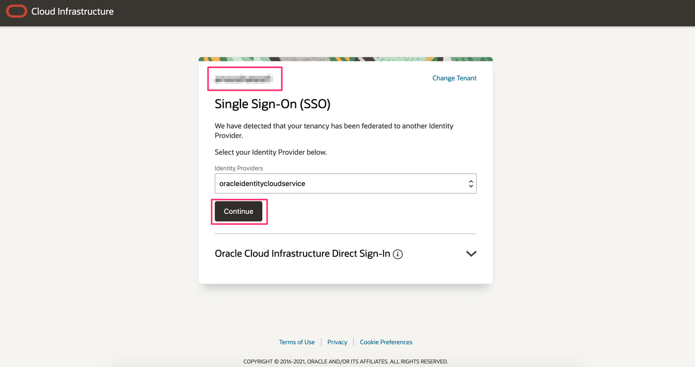

    - If not, click on **Change Tenant**, type your **Account Name** or **Tenancy** and click **Continue**.

      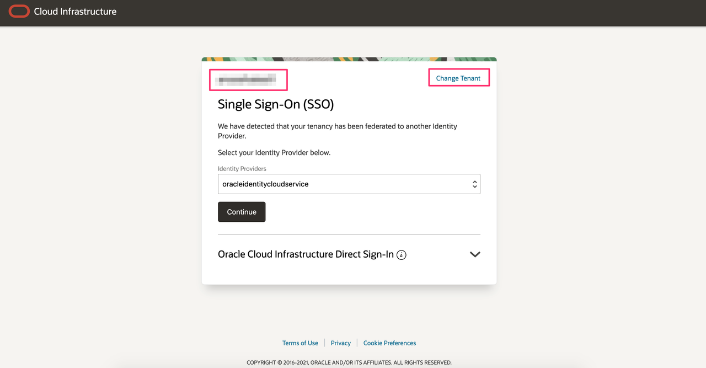

      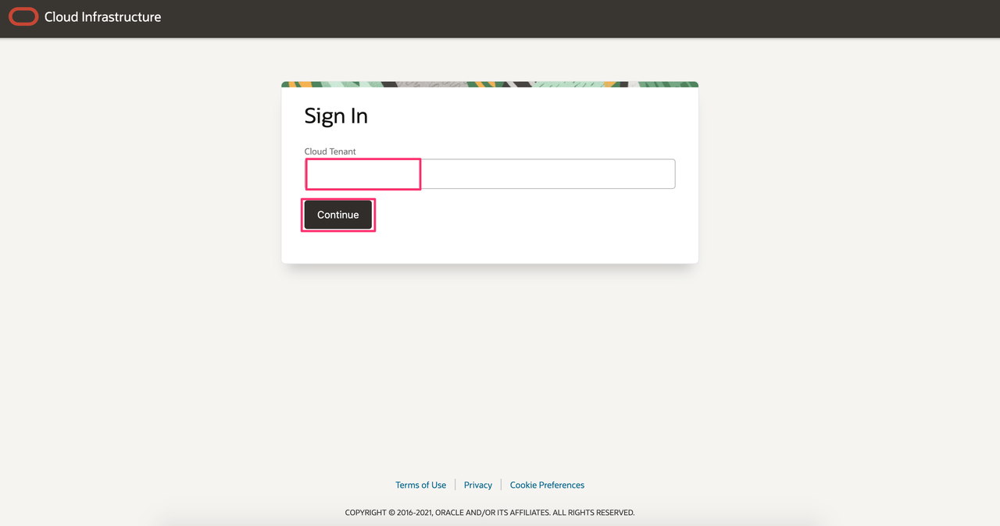

7. Provide your **Username, Password** and click **Sign In** to visit **Oracle Digital Assistant Home** page.

  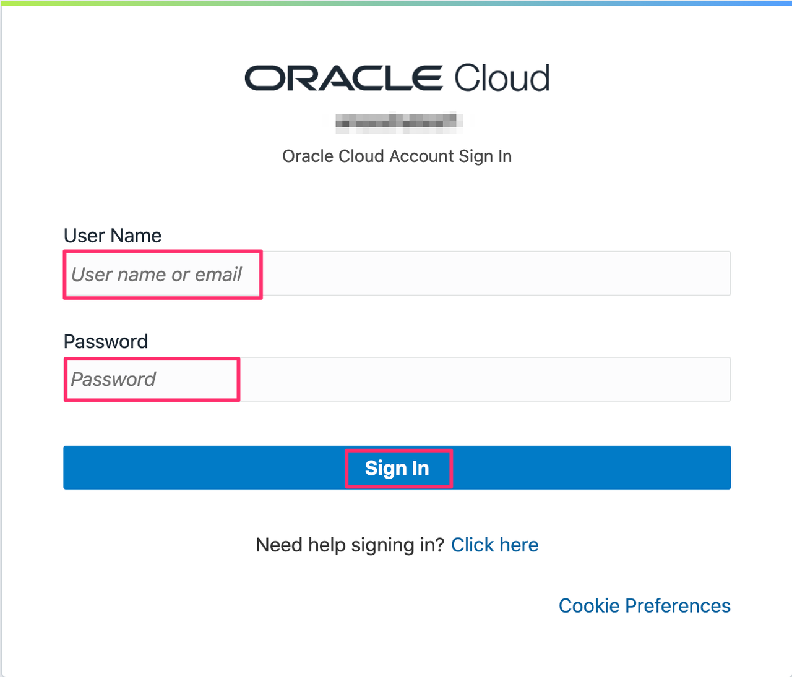

8. You will be on the Oracle Digital Assistant **Dashboard** where you can start building your bots.

  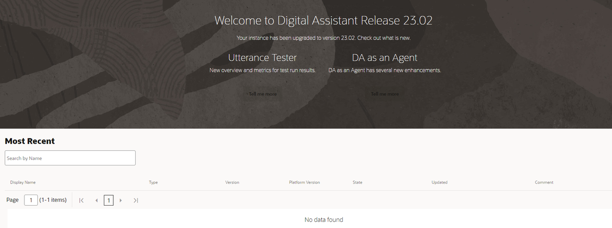

## Task 3:  Setup your Digital Assistant

1. Click on the  to open the side menu.
    - Click on the **Settings** in the side menu, in the submenu click on the **API Services**
      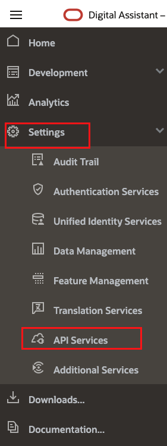

2. Click on the **+ Add REST Service** button.

      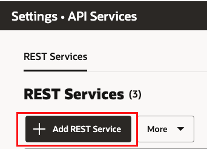

3. Enter the following details in the window that opens up and hit the **Create** button.

    - **General Information**:
         - **Name** : ERP _ PO _ API
         - **Endpoint**: *Sample URL Given below*
         - **Method**: GET

> **Note:** https://&lt;oic\_host&gt;/ic/api/integration/v1/flows/rest/PURCHASE_ORDER_DETAILS_PROXY/1.0/purchaseOrderDetails/{orderNumber}

  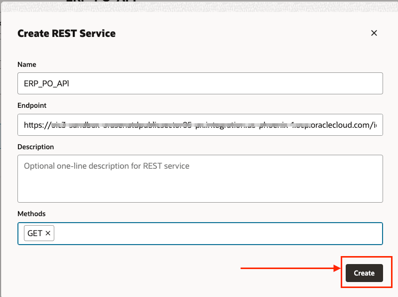

4. select the **Authentication Type** as **Basic Authentication** from the dropdown and enter the service account **User Name/Password** and click on the **+** icon  besides the  **Parameters** to add parameter values.

  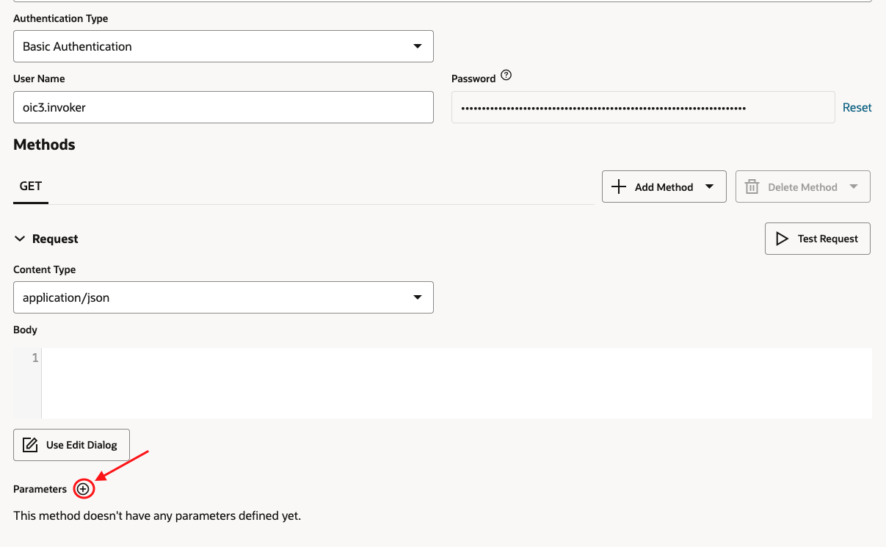

5. Enter the following as parameters as shown below and select the  to save the values. Then click on the **Test Request** button   to make sure the api is returning status as 200.

- **Parameter 1**:
    - **Key** : orderNumber
    - **Value**: 0
    - **Type**: Path

- **Parameter 2**:
    - **Key**: sold _ to _ legal _entity
    - **Value**: US1 Legal Entity
    - **Type**: Query

  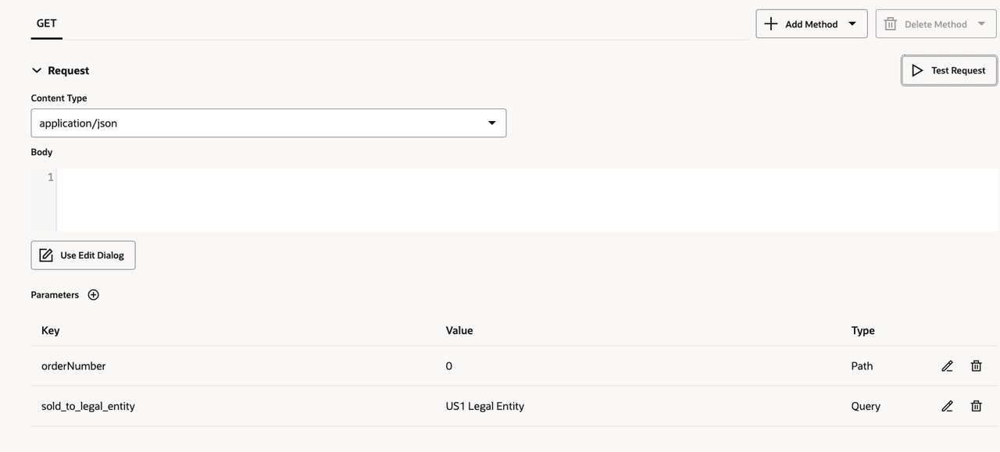

  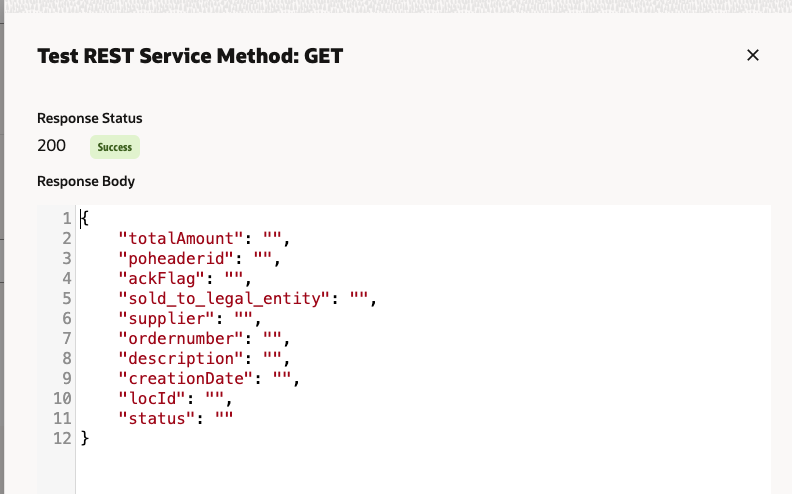

You can always **Watch Videos** on the **Learn** section at the bottom and explore the documentation of Oracle Digital Assistant by following the links on the dashboard.

Make sure you look around and feel familiar with the menus.

You may now **proceed to the next lab**.

## Learn More

* [Provision ODA](https://docs.oracle.com/en-us/iaas/digital-assistant/doc/order-service-and-provision-instance.html)

## Acknowledgements
* **Author** - Vijaya Vishwanath, Sr. Cloud Solution Engineer
* **Last Updated By/Date** - Subhani Italapuram, Sep 2025
