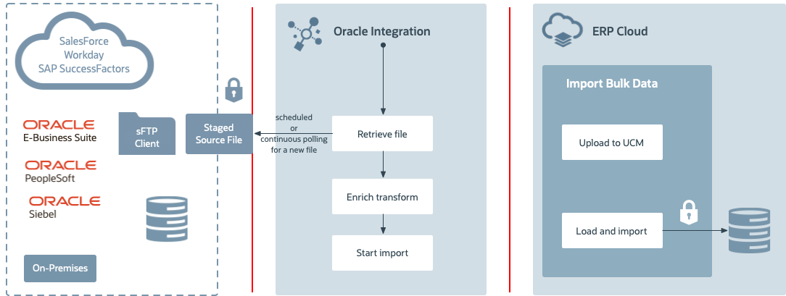
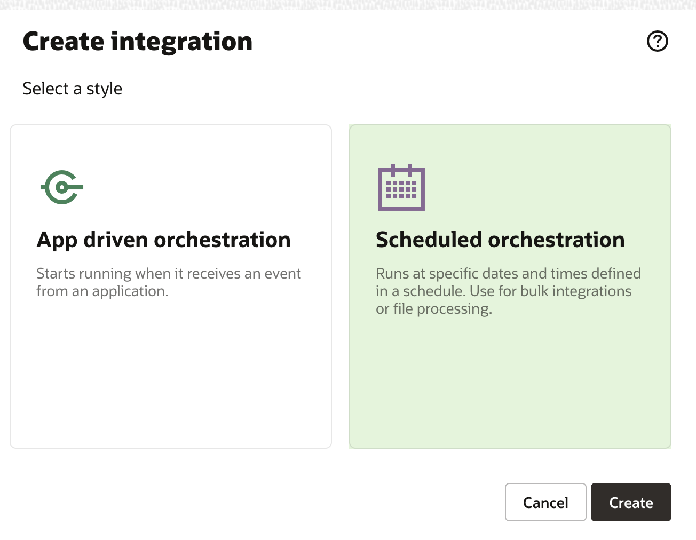
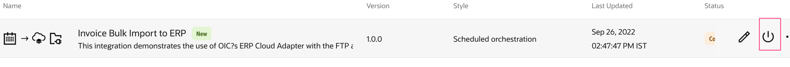
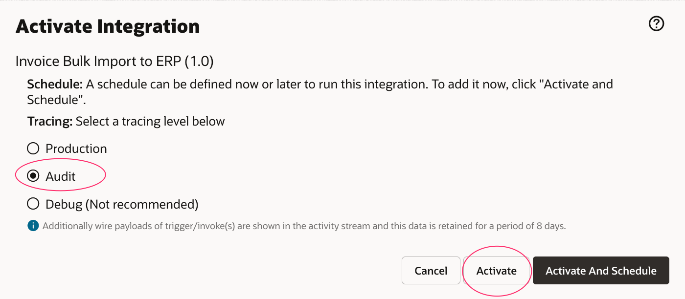
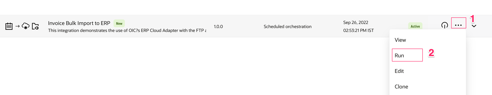

# File Based Data Import (FBDI) Import

## Introduction

This lab walks you through the steps to create Integration flow.

This use case uses Oracle Integration and ERP Cloud Import bulk data services with File Based Data Import (FBDI) complaint files.
The goal is to import ERP data such as account payable invoices using processes in ERP Cloud.

The typical flow of this use case is:

1. The user uploads an FBDI based account payable invoice file to an FTP Server.
2. Oracle Integration imports the account payable invoice file into the ERP Cloud.

This labs will explore the ERP Cloud adapter and File Adapter features and lets you know how to perform the following tasks:
 1. Read files from an SFTP Server
 2. Synchronize account payable invoices into the ERP Cloud

  The following diagram shows the runtime interaction between the systems involved in this use case:
  

Estimated Time: 30 minutes

### Objectives

In this lab, you will:

* Connect to file server to read file.
* Understand how to bulk import data in the Oracle ERP cloud leveraging out of the box ERP cloud
  adapter capabilities


### Prerequisites

This lab assumes you have:

* All previous labs successfully completed.


## Task 1: Create FBDI file

1. [Download the Invoice Import Template Spreadsheet](files/GSEPayablesStandardInvoiceImportTemplate.xlsm?download=1)
2. [Download the APTEST.PROPERTIES file](files/APTEST.PROPERTIES?download=1)
3. Open GSEPayablesStandardInvoiceImportTemplate.xlsm (If you are using Mac, then you need to download the templates from ERP Cloud documentation which are compatible with Mac)

Please note that this spreadsheet contains macros and you might get a security warning when you open the file. Select the option to enable the content.
4. Go to the ```AP_INVOICES_INTERFACE``` sheet and update the following fields with unique random numbers:
      - Invoice ID
      - Invoice Number

For example, you can use your OIC user number concatenated with the current date.
Enter the data in each cell, do not copy and paste it. This is to preserve the data type of each column. If you change the data type, this lab will fail.
You might get a warning message about the macros used in this spreadsheet. Accept the message.

5. Click on ```AP_INVOICE_LINE_INTERFACE``` sheet.
6. Enter the same invoice IDs that you used in the ```AP_INVOICES_INTERFACE``` sheet.
7. Save the file, Open the Instructions and CSV Generation Sheet and click Generate CSV file.
A file browser dialog appears.
8. Name the zip file as ```apinvoiceimport.zip```, save the ```AP_INVOICES_INTERFACE``` file as ApInvoiceInterface.csv, save the ```AP_INVOICE_LINE_INTERFACE``` file as APInvoiceLinesInterface.csv
9. Close the GSEPayablesStandardInvoiceImportTemplate.xlsm file
10. From File Explorer, copy the APTEST.PROPERTIES file to the apinvoiceimport.zip file.

Please note that zip file should contain ONLY three files: ApInvoiceInterface.csv, ApInvoiceLinesInterface.csv and APTEST.PROPERTIES and all of them in under root folder only, no sub folders.

Note: Failing to copy the APTEST.PROPERTIES file will prevent the import payables job from running.

Note: For the purpose of this lab we won't change the values for the Business Unit, Supplier Name, Supplier Number, and Supplier Site fields in the ```AP_INVOICES_INTERFACE``` sheet. If you want to change them in the future, make sure that the values you provide match the values in the ERP instance. If you change the business unit or the source, you must also update the properties file

## Task 2: Upload the FBDI file to the FTP Server
1. Login to the FTP Server using your favourite FTP Client (Could be FileZilla, WinSCP..)
2. Copy the apinvoiceimport.zip file to the following directory.
/upload/public_ftp/```<<your oic usernumber>>```

Note: If you have received your oic usernumber then you can use as is, otherwise, you can use any random number
And please create directory if it is not there by following the steps given in the setup lab.

## Task 3: Create the Invoice Bulk Import to ERP integration
1. In the left Navigation pane, click ***Design*** > ***Integrations***.
2. On the **Integrations page**, click ***Create***.
3. On the **Integration Style** dialog, select ***Scheduled Orchestration***, followed by ***Create***

4. In the **Create New Integration** dialog, enter the following information:

    | **Element**          | **Value**          |       
    | --- | ----------- |
    | Name         |```
    <copy>Invoice Bulk Import to ERP</copy
    ```
    |
    | Description |```
    <copy>This integration demonstrates the use of OIC’s ERP Cloud Adapter with the FTP adapter to retrieve an AP Invoices file, import it to the ERP Cloud.</copy
    ```
    |

Accept all other default values.

5. Click ***Create***.

## Task 4: Get the File from FTP Server

1. Click the ***+*** sign after **Schedule** in the integration canvas.

2. Select the FTP Connection which you have created in the previous labs. This invokes the FTP Adapter Configuration Wizard.

3. On the Basic Info page,
     - for the **What do you want to call your endpoint?** element, enter ***ReadAPInvoicesFileFromFTP***
     - for the **What does this endpoint do?** element, enter ***Retrieves the AP Invoices that comply with FBDI from an FTP location.***
     - Click ***> (Next Step)***.
4. From the **Operations** page,
    - select ***Read a File*** as an Operation
    - from the **Select a Transfer Mode** option, select ***ASCII***
    - Enter the following values and Click ***> (Next Step)***.

| **Element**        | **Value**   |
| --- | ----------- |
| Input Directory         | /home/users/```<<your oic usernumber>>```       
| File Name | apinvoiceimport.zip |

5. On the **Schema** page,
    - in the **Do you want to specify the structure for the contents of the file** section, select No.
    - Click ***> (Next Step)***.
6. Review the summary and click ***Done***.
7. Click ***Save*** to persist changes.


## Task 5: Upload the file to ERP Cloud
1. Hover over the outgoing arrow for ReadAPInvoicesFileFromFTP and click + icon.
2. Begin typing ERP in the Search field to find the connection to your ERP Cloud.
3. Select the connection which you have created in the previous labs.
The Configure Oracle ERP Cloud Endpoint wizard appears.
4. On the Basic Info page,
    - In the **What do you want to call your endpoint?** field, enter ***ImportAPInvoicestoERPCloud***
    - In the **What does this endpoint do?** field, enter: ***Uploads files to UCM in ERP Cloud***
    - Click ***> (Next Step)***.
5. On the Actions page,
    - select ***Import Bulk Data into Oracle ERP Cloud***
    - Click ***> (Next Step)***.
6. On the Operations page,
    - select ***Import Payables Invoices*** (Search for it)
    - Click ***> (Next Step)***.
7. On the Response page, select the following options:
    - From the **Notification Mode** list, select ***Email & Bell Notification***
    - From the **Occurrence** list, select ***Send in any case***.
    - Click ***> (Next Step)***.
8. Review the summary and click ***Done***.
9. Click ***Save*** to persist changes.


## Task 6: Define the data Mapping
A map action named ImportAPInvoicestoERPCloud is automatically created. We will define this data mapping.
1. Select the action **Map ImportAPInvoicestoERPCloud** and click on **...** and click on **Edit**
2. In the Sources section successively expand the following elements:

  a. ReadAPInvoicesFileFromFTP Response (FTP)

  b. Sync Read File Response

  c. File Read Response

  d. ICS File

3. In the Target section successively expand the following elements:

  a. Import Bulk Data

  b. ICS File

4. Drag the File Reference element From the Sources section, and drop it on the element of the same name in the Target section.
5. In the Sources and Target sections expand Properties located under ICS File.
6. Drag the following elements from the Sources and drop them on the element of the same name in the Target section:

   a. directory

   b. filename


7. Click on ***Validate***
A confirmation message appears.
8. Click ***< (Go back)***
9. Click ***Save*** to persist changes.

## Task 7: Define Tracking Fields
Manage business identifiers that enable you to track fields in messages during runtime.

> **Note:** If you have not yet configured at least one business identifier **Tracking Field** in your integration, then an error icon is displayed in the design canvas.
    

1. Click on the ***(I) Business Identifiers*** menu on the top right.
    

2. From the **Source** section, expand ***schedule*** > ***startTime***. Drag the ***startTime*** field to the right side section:

    


3. Click on the ***(I) Business Identifiers*** menu on the top right again to close Business Identifier section
4. Click ***Save***
5. Click on ***< (Go back)*** button.

## Task 8: Activate the integration

1. On the **Integrations** page, click on the ***Activate*** icon.

    

2. On the **Activate Integration** dialog, select ***a tracing level***.


3. Click ***Activate***.

    The activation will be complete in a few seconds. If activation is successful, a status message is displayed in the banner at the top of the page, and the status of the integration changes to **Active**.
## Task 9: Run the integration
Refresh your page after few seconds.
1. Click on ***Run***
    
2. Click on ***Submit Now*** and then click on ***Submit Now*** again when prompted.
3. Click the link which appears on top to track the instance.
The track instance page appears. The Integration state should be processing or successful.
Importing of the invoices to the ERP Cloud might take few minutes.
OR you can also track by clicking on ***Design***, ***Observability*** and ***Instances***
## Task 10: Verify the Bulk Import
Wait 5 minutes before performing this procedure.
1. Open a browser to sign in to the ERP Cloud using the information provided to you.
2. Click on Navigator Menu(On top lift corner), Click on Payables, click Invoices and Click on the search in the Details panel located below the User menu.
3. Enter the invoice number and click search.
The invoice should appear in the search results.
4. Congratulations! You have finished your integration flow.


You may now **proceed to the next lab**.

## Learn More

* [Getting Started with Oracle Integration 3](https://docs.oracle.com/en/cloud/paas/integration-cloud)
* [Using the Oracle ERP Cloud Adapter with Oracle Integration 3](https://docs.oracle.com/en/cloud/paas/integration-cloud/erp-adapter)

## Acknowledgements

* **Author** - Subhani Italapuram, Director Product Management, Oracle Integration
* **Contributors** - Kishore Katta, Director Product Management, Oracle Integration
* **Last Updated By/Date** -
