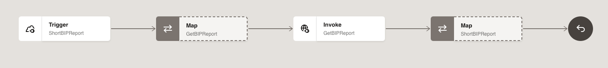
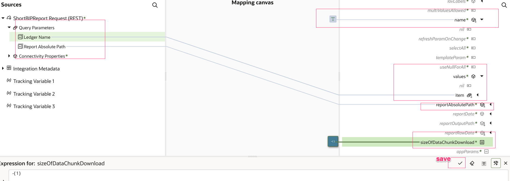
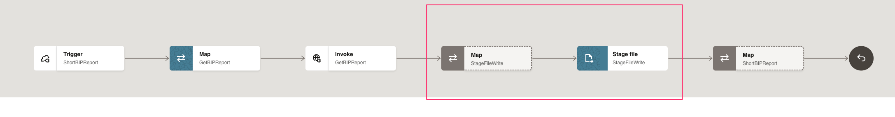
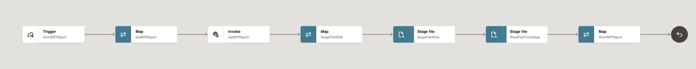

# BIP Report Integration Flow

## Introduction

This lab walks you through the steps to create an Integration flow.

This use case describes how to use Oracle Integration with Oracle ERP Business Intelligence Publish(BIP) report.
   - User creates a GL BIP report in ERP Cloud
   - OIC consumes the report using External Report Service
   - OIC enriches the response
   - OIC sends the response to the client.

 The following diagram shows the interaction between the systems involved in this use case.
    

Estimated Time: 30 minutes

### Objectives

In this lab, you will:

* Connect to ERP Cloud to extract BIP report
* Understand how to extract BIP report using External Report Service from Oracle Integration.


### Prerequisites

This lab assumes you have:

* All previous labs successfully completed.


## Task 1: Create the Short BIP Report Integration

1. In the left Navigation pane, click ***Design*** &gt; ***Integrations***.
2. On the **Integrations page**, click ***Create***.
3. On the **Create integration** dialog, select and click on ***Application***.
4. In the **Create integration** dialog, enter the following information:

    | **Element**          | **Value**          |       
    | --- | ----------- |
    |Name | Short BIP Report |
    |Description | This integration shows you how to connect to the ERP BIP service, pull a report, decode the response, and return the report results |

    Accept all other default values.

5. Click ***Create***.
6. Click on Horizontal to change the layout to Horizontal

## Task 2: Create the REST Trigger

1. Search for the **REST Interface** connection which you have created in the previous Task and click on it. This invokes the REST  Adapter Configuration Wizard.
2. On the **Basic Info** page,
     - for the **What do you want to call your endpoint?** element, enter ***ShortBIPReport***
     - for the **What does this endpoint do?** element, enter ***This endpoint defines the REST interface.***
     - Click ***Continue***.
3. From the **Resource Configuration** page,
    - for the **What does this operation do?** element, enter ***Retrieves ledgers from the ERP system.***
    - for the **What is the endpoint's relative resource URI?**, enter ***/BIP***
    - for the **What action do you want to perform on the endpoint?**, enter ***GET***
    - Select ***Add and review parameters for this endpoint*** checkbox
    - Select ***Configure this endpoint to receive the response*** checkbox
    - Click ***Continue***.
4. From the **Request Parameters** page, in the **Specify Query Parameter section**, click ***Add***
A new row appears.
    - Enter ***LedgerName*** in the **Name** column and select ***string*** from the **Date Type** column
    - Click ***Add***, Enter ***ReportAbsolutePath*** in the **Name** column and select ***string*** from the **Date Type** column
    - Click ***Continue***.

5. On the **Response** Page
    - Select the **response payload format** to ***JSON Sample***
    - Click the ***&lt&lt&ltinline&gt&gt&gt*** link.
    - Provide the below JSON and Click ***Continue***

        ```
        <copy>
        [
        {
          "LEDGERNAME" : "US Primary Ledger",
          "SEGMENT3" : 31,
          "SEGMENT4" : 21,
          "FIN_CATEGORY" : "FREIGHT"
        },
        {
          "LEDGERNAME" : "US Primary Ledger",
          "SEGMENT3" : 31,
          "SEGMENT4" : 21,
          "FIN_CATEGORY" : "FREIGHT"
        }
        ]
        </copy>
        ```
    - In the **What is the media-type of Response Body?** Select ***JSON***, It is select by Default. If not, you will have to select it explicitly.

6. Click ***Continue***
7. Review the summary and click ***Finish***.
8. Click ***Save*** to persist changes.


## Task 3: Get the BIP report
1. Hover over the outgoing arrow for the ShortBIPReport activity (after first activity) and Click the ***+*** sign in the integration canvas.
Search for the **ERP Cloud External Report Service** connection which you have created in the previous Task and click on it. This invokes the REST  Adapter Configuration Wizard.
2. On the **Basic Info** page,
    - for the **What do you want to call your endpoint?** element, enter ***GetBIPReport***
    - Click ***Continue***.
3. On the **Operations** page,
    - for the **Select Operation list** element, enter ***runReport***
    - Click ***Continue***.    
3. On the **Headers** page,
    - Click ***Continue***.    
4. Review the summary and click ***Finish***
5. Click ***Save*** to persist changes
6. If required, click on Zoom out/in to view the complete flow.
    

## Task 4: Define the Data Mapping
A map action named GetBIPReport is automatically created. We will define this data mapping.
1. Select the action **Map GetBIPReport** and click on **...** and click on **Edit**
2. In the Source section, expand **ShortBIPReport** and then expand **Query Parameters**
3. In the Target section, expand the **GetBIPReport Request**, expand **Body**, expand **runReport**, expand **reportRequest**.
    - Map the ***Report Absolute Path*** field from the source section to the ***reportAbsolutePath*** of target section.
    - In the Target section, expand the **parameterNameValues** and expand **item**
    - Right-mouse click on the **name** node and select **Create Target Node**.
    - Click on ***Switch to Developer View*** which is there on bottom right corner. (Note: If it is already in Developer View then no need to click on this icon)
    - Enter the literal value ***"LedgerName"***
    - Click ***Save*** icon in the Expression editor to commit the data.
    - In the Target section, expand **values** which is under **parameterNameValues**
    - Map the ***Ledger Name*** field in the Sources section, to the ***item*** field located under **values** in the Target section
    - Search for **sizeOfDataChunkDownload** in the Target section.
    - Right-mouse click on the **sizeOfDataChunkDownload** node and select **Create Target Node**.
    - Enter ***-1*** and click on ***Save***
    - Click on ***Validate***
    A confirmation message appears.
    - Click ***&lt; (Go back)***
    - Click ***Save*** to persist changes.

    


## Task 5: Write the file
1. [Download the artifacts](https://objectstorage.us-phoenix-1.oraclecloud.com/p/63HDL8xxxbcwydv2taZ3G0Kxy1rgZuuCighKn_D4vvyouKpiVRmzb5Tbjs68rNsc/n/oicpm/b/oiclivelabs/o/oic3/erp-cloud/BIPReportArtifacts.zip) and extract the zip file in your local folders. It should contain two files opaque_schema.xsd and GLCCReport.csv

2. Hover over the outgoing arrow for the **Invoke GetBIPReport** activity and Click the ***+*** sign in the integration canvas.
Search for the **Stage File** activity and click on it. This invokes Stage File Configuration Wizard.
3. On the **Basic Info** page,
    - for the **What do you want to call your endpoint?** element, enter ***StageFileWrite***
    - Click ***Continue***.
4. On the **Configure Operation** page,
    - for the **Choose Stage File Operation** element, select ***Write File***
    - for the **Specify the File Name** element, select ***"temp.csv"***
    - for the **Specify the Output Directory** element, select ***"/tmp"***
    - Click ***Continue***.
5. On the **Schema Options** page,
      - select ***XML Schema (XSD) document***
      - Click ***Continue***.
6. On the **Format Definition** page,
      - click ***Drag and Drop*** and select the ***opaque_schema.xsd*** which you have downloaded
      - Click ***Continue***.
7. Review the summary and click ***Finish***
8. Click ***Save*** to persist changes
    

## Task 6: Define the Data Mapping
A map action named StageFileWrite is automatically created. We will define this data mapping.
1. Select the action **Map StageFileWrite** and click on **...** and click on **Edit**
2. In the Source section, expand **GetBIPReport Response**, expand **runReportResponse**, expand **runReportReturn**
3. In the Target section, expand the **StageFileWrite Response**
4. Map the ***reportBytes*** from the source section to the ***Opaque Element*** of target section.
5. Click on ***Validate***
  - A confirmation message appears.
6. Click ***&lt; (Go back)***
7. Click ***Save*** to persist changes.

## Task 7: Read the file from Stage
1. Hover over the outgoing arrow for the **StageFileWrite** activity and Click the ***+*** sign in the integration canvas.
Search for the **Stage File** activity and click on it. This invokes Stage File Configuration Wizard.
2. On the **Basic Info** page,
    - for the **What do you want to call your endpoint?** element, enter ***ReadFileFromStage***
    - Click ***Continue***.
3. On the **Configure Operation** page,
    - for the **Choose Stage File Operation** element, select ***Read Entire File***
    - for the **Specify the File Name** element, select ***"temp.csv"***
    - for the **Specify the Directory** element, select ***"/tmp"***
    - Click ***Continue***.
4. On the **Schema Options** page,
      - Click ***Continue***.
5. On the **Format Definition** page,
      - click ***Drag and Drop*** and select the ***GLCCReport.csv*** which you have downloaded
      - for the **Enter Record Name**, enter ***Ledger***
      - for the **Enter Record Name**, enter ***LedgerSet***
      - Click ***Continue***.
6. Review the summary and click ***Finish***
7. Click ***Save*** to persist changes
    

## Task 8: Define the Data Mapping
1. Select the action **Map ShortBIPReport** and click on **...** and click on **Edit**
2. In the Source section, expand **ReadFileFromStage Response**, expand **Read Response**, expand **Ledger Set**
3. In the Target section, expand the **ShortBIPReport Response**, expand **Response Wrapper**
   - Map the ***Ledger*** from the source section to the ***Top Level Array*** of target section.
   - In the Source section, expand **Ledger**, in the Target section, expand the **Top Level Array**
   - Map the following fields from the Sources section to the fields in the Target section
  | **Field**        | **Value**|       
  | --- | ----------- |
  | LEDGERNAME         | LEDGERNAME|
  | SEGMENT3         | SEGMENT3|
  | SEGMENT4         | SEGMENT4|
  | FIN CATEGORY         | FIN CATEGORY|

  - Click on ***Validate***.
     - A confirmation message appears.
  - Click ***&lt; (Go back)***
  - Click ***Save*** to persist changes.


## Task 9: Define Tracking Fields

Manage business identifiers that enable you to track fields in messages during runtime.

1. Click on the ***(I) Business Identifiers*** menu on the top right.
2. From the **Source** section, expand ***execute*** &gt; ***QueryParameters***. Drag the ***LEDGERNAME*** field to the right side section:
3. Click on the ***(I) Business Identifiers*** menu on the top right again to close Business Identifier section
4. Click ***Save***.
    
5. Click on ***&lt; (Go back)*** button.


## Task 10: Activate the Integration
1. On the **Integrations** page, click on the ***Activate*** icon of **Short BIP Report** Integration.
2. On the **Activate Integration** dialog, select **a tracing level** to ***Audit***
3. Click ***Activate***.

    The activation will be complete in a few seconds. If activation is successful, a status message is displayed in the banner at the top of the page, and the status of the integration changes to **Active**.

## Task 11: Run the Integration
Refresh your page after few seconds.
1. Select **Short BIP Report**,  Click on **...(Actions)** menu and Click on ***Run***
2. Configure the URI parameters:
  - for **ReportAbsolutePath**, enter ***/Custom/Financials/GLCCReport.xdo***
  - for **LedgerName**, enter ***US Primary Ledger***
3. Click ***Run*** (in the upper right of the page).
4. Look at the Response section to verify the BIP report results and verify the Status is 200 OK
5. Click the link which appears on top to track the instance.
The track instance page appears. The Integration state should be processing or successful.
OR you can also track by clicking on ***Home***, ***Observability*** and ***Instances***

## Task 12: Congratulations
Congratulations! You have invoked an integration from a web client using REST. On the Oracle Integration side, you've called a service, convert the response to JSON, and sent the data back to the web client.


You may now **proceed to the next lab**.

## Learn More

* [Getting Started with Oracle Integration 3](https://docs.oracle.com/en/cloud/paas/application-integration/index.html)
* [Using the SOAP Adapter with Oracle Integration 3](https://docs.oracle.com/en/cloud/paas/application-integration/soap-adapter/index.html)
* [Using the REST Adapter with Oracle Integration 3](https://docs.oracle.com/en/cloud/paas/application-integration/rest-adapter/index.html)

## Acknowledgements

* **Author** - Subhani Italapuram, Director Product Management, Oracle Integration
* **Contributors** - Kishore Katta, Director Product Management, Oracle Integration
* **Last Updated By/Date** -
