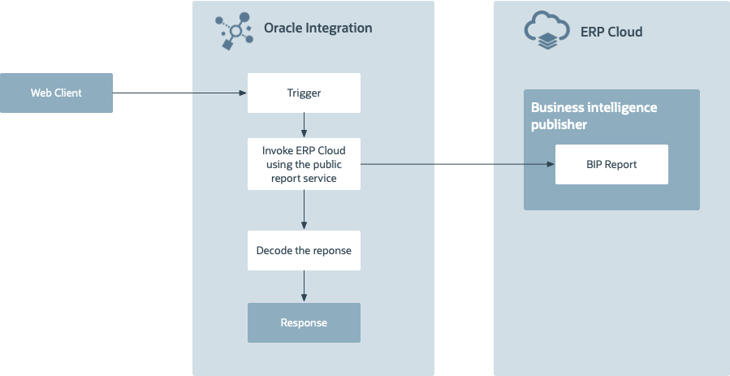

# Introduction

## About this Workshop

This workshop shows you how to use Oracle Integration 3 with Oracle ERP Business Intelligence Publish (BIP) report. Out of the box, SOAP adapter helps an Integration developer to quickly consume BIP Report in a secured way using various authentication schemes.

The user creates a report in Oracle ERP Cloud and uploads it to a shared folder. Oracle Integration 3 connects to the ERP BIP service, pulls the report, decodes the response, applies the required transformations and writes it into the REST client.

Estimated Time: 1 hour 20 minutes

This lab walks you through the steps to create an Integration flow.

This use case describes how to use Oracle Integration with Oracle ERP Business Intelligence Publish(BIP) report.
   - User creates a GL BIP report in ERP Cloud
   - OIC consumes the report using External Report Service
   - OIC enriches the response
   - OIC sends the response to the client.

 The following diagram shows the interaction between the systems involved in this use case.
    

### Objectives

In this lab, you will:

* Connect to ERP Cloud to extract BIP report
* Understand how to extract BIP report using External Report Service from Oracle Integration.

### Objectives

In this workshop, you will learn how to:

* Create and configure common connections which are useful for this workshop like REST Interface and ERP Cloud External Report Service Connection
* Learn ERP Cloud Integration Design Patterns and Usecases.
* Create an Integration flow to make a call to extract the data from ERP Cloud Oracle Business Intelligence Publisher (BIP) and gets the response back.

### Prerequisites

* An Oracle Free Tier or Paid Cloud Account Tenancy
* Oracle Integration Instance provisioned in OCI.

You may now **proceed to the next lab**.

## Learn More

* [Getting Started with Oracle Integration 3](https://docs.oracle.com/en/cloud/paas/application-integration/index.html)

## Acknowledgements

* **Author** - Subhani Italapuram, Product Management, Oracle Integration
* **Contributors** - Kishore Katta, Product Management, Oracle Integration
* **Last Updated By/Date** - Subhani Italapuram, Sep 2025
