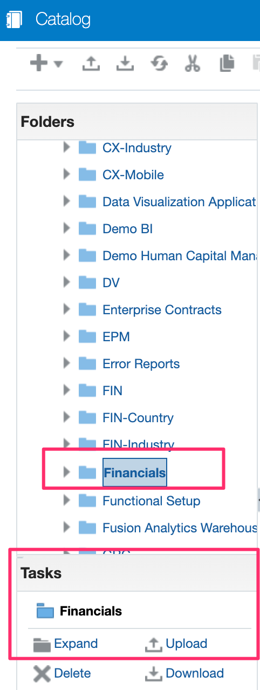
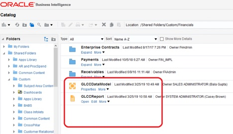
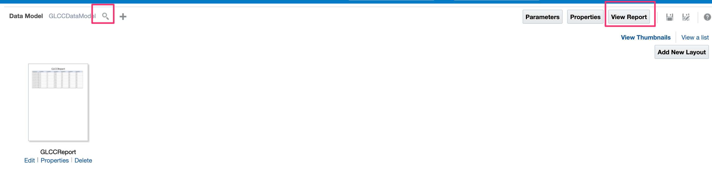

# Configure BIP Report in the ERP Cloud

## Introduction

This lab walks you through the setup required to complete the workshop.

Estimated Time: 15 minutes

### Objectives
In this lab, you will:
- Configure BIP Report in the ERP Cloud environment.

### Prerequisites
This lab assumes you have:
- Completed all the previous labs.
- If GLCCReport is already uploaded into your ERP Cloud environment, then you can ignore this lab.

## Task 1: Configure BIP Report

1. [Download the BIPSetupArtifacts](https://objectstorage.us-phoenix-1.oraclecloud.com/p/gemDiMgAlIo1KsqKOml2Pw01-SiiQSJw_y3fez_7pIMH3EcGeiv8JlfAgbgd8GV0/n/oicpm/b/oiclivelabs/o/oic3/erp-cloud/bipreport/BIPSetupArtifacts.zip) and extract the zip file in your local folders. It should contain two files GLCCDataModel.xdmz and GLCCReport.xdoz

2. Login to https://<erp-cloud-host>/xmlpserver/servlet/catalog using a user which has **BI Administrator Role and BI Publisher Data Model Developer Role**, Go to  Catalog &gt; Shared folders &gt; Custom &gt; Financials &gt; Click on ***Upload*** under **Tasks** region(below left corner) and upload "GLCCDataModel.xdmz"
    
3. Logout and Login back again into https://ERPCloudHost/xmlpserver/servlet/catalog using CASEY.BROWN or similar user which has **BI Administrator Role and BI Publisher Data Model Developer Role** and upload “GLCCReport.xdoz”
    
4. Select the "GLCCReport", you should see **Edit** option under **Tasks** region, click on ***Edit***, System displays **Data Model** page, click on **search** icon which is next to the **Data Model** and select the ***GLCCDataModel*** and click on ***Open***
    
5. Click on ***View Report*** which is available on the top right and then for **LedgerName**, enter ***US Primary Ledger*** and click on ***Apply*** to see the report

You may now **proceed to the next lab**.

## Learn More

* [Process to create new report](https://docs.oracle.com/en/cloud/saas/otbi/otbi-pub-design/create-and-edit-reports.html)

## Acknowledgements
* **Author** - Subhani Italapuram, Product Management, Oracle Integration
* **Last Updated By/Date** - Subhani Italapuram, Sep 2025
