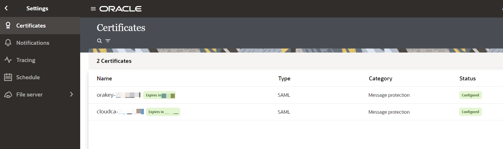

# Configure Certificates

## Introduction

This lab will walk you through the steps to configure certificates .

Estimated Time: 15 minutes

### Objectives
In this lab, you will:
- Configure Certificates in OIC
- Assign Service User role to Integration User
- Create ERP Cloud Callback connection using SOAP adapter

### Prerequisites
This lab assumes you have:
- Completed all the previous labs

## Task 1: Configure Certificates in OIC

ERP Cloud callback implements SAML bearer token policy. In order for OIC to receive callback, the issuer name (username) used in SAML assertion must exist in OIC identity store. The issuer name is the username used when invoking bulk export service in ERP Cloud through OIC.

The Oracle ERP cloud certificates must be imported in OIC to authenticate SAML assertion

1.  The cloudca certificate (cert chain) and orakey certificates are needed from the Fusion application to be imported to OIC 3 for webservice callback functionality. Create a service request against Oracle ERP Cloud to obtain the certificates.

2.  You need to import the above 2 certificates in OIC 3 as a message protection certificate.

3.  Navigate to OIC 3 console ***Home &gt; Settings &gt; Certificates***. Select ***Create*** provide an alias name of choice and *Type* as ***SAML (Authentication and Authorization)*** and choose cloudca certificate to *Upload*

4.  Similarly, upload orakey certificate with a different alias name

## Task 2: Create and Assign Service User role in OIC

1.  Create a User in IDCS

2.  Login into IDCS and Navigate to ***Oracle Cloud Services*** and Search for the OIC instance which is provisioned. Select the instance and navigate to ***Application Roles*** tab.

3.  In the ***Service User*** role, Go to the ***Action*** menu Select ***Assign User*** and select the Integration User created.

You may now **proceed to the next lab**.

## Learn More

* [Oracle Integration Adapters](https://docs.oracle.com/en/cloud/paas/application-integration/find-adapters.html)

## Acknowledgements
* **Author** - Kishore Katta, Director Product Management, Oracle Integration
* **Contributors** - Subhani Italapuram, Director Product Management, Oracle Integration
* **Last Updated By/Date** - Subhani Italapuram, Kishore Katta March 2023
