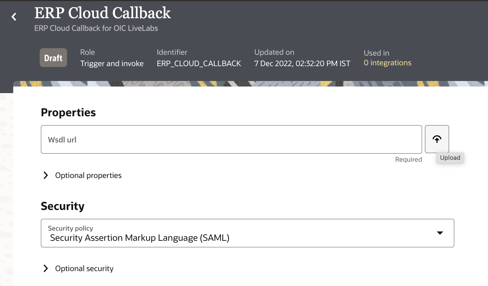

# Create Connections

## Introduction

This lab will walk you through the steps to create connections for all the services which will be used in the Integration Flow.

Estimated Time: 15 minutes

### Objectives
In this lab, you will:
- Create an Oracle FTP Connection using FTP adapter
- Create ERP Cloud Integration Service connection using SOAP adapter
- Create ERP Cloud Callback connection using SOAP adapter

    > **Note:**  You can use an existing connection if one has already been configured for your environment.

### Prerequisites
This lab assumes you have:
- Completed all the previous labs

## Task 1: File Server Connection

To access the File Server from an Integration, you will need to create an FTP Connection.  

1. In the left Navigation pane, click ***Design*** &gt; ***Connections*** &gt; click ***Create***
2. In the *Create Connection* dialog, select the **FTP** adapter to use for this connection. To find the adapter, enter *FTP* in the search field. Click on the highlighted adapter
3. From the *Create Connection* dialog, *Name* your connection as **File Server** and leave the rest of the configurations as default. Click ***Create***.  
    > **Note:**  If you get an error that the identifier already exists, enter unique connection name and remember this name for use later in the workshop.

4. Enter the following configurations in the *FTP Connection* with the information you previously gathered from the File Server Settings page.  
    | Field                   | Value                                               |
    | ----------------------- | --------------------------------------------------- |
    | FTP Server Host Address | From File Server Settings - IP and Port Information |
    | FPT Server Port         | From File Server Settings - IP and Port Information |
    | SFTP Connection         | Yes                                                 |
    | Security                | FTP Server Access Policy                            |
    | Username                | Your Oracle Integration username                    |
    | Password                | Your Oracle Integration password                    |

5. Confirm your Connection by clicking ***Test***, then ***Diagnose & Test***. You should see the *Connection File Server was tested successfully* confirmation message. Click ***Save*** and exit the Connection editor.

## Task 2: ERP Cloud Integration Service Connection

1. In the left Navigation pane, click ***Design*** &gt; ***Connections*** &gt; click ***Create***
2. In the *Create Connection* dialog, select the **SOAP** adapter to use for this connection. To find the adapter, enter *soap* in the search field. Click on the highlighted adapter
3. From the *Create Connection* dialog, enter the following information and click on ***Create***:

    > **Note:**  If you get an error that the identifier already exists, enter unique connection name and remember this name for use later in the workshop.

    | **Field**   | **Value**                                        |
    | ----------- | ------------------------------------------------ |
    | Name        | `ERP Cloud Integration Service`                  |
    | Description | `ERP Cloud Integration Service for OIC LiveLabs` |

    Keep all other values as default.

4. In the *Configuration* page, enter the following information:

    | **Field**       | **Values**                                                              |
    | --------------- | ----------------------------------------------------------------------- |
    | WSDL URL        | enter ***https://ERPCloudHost/fscmService/ErpIntegrationService?wsdl*** |
    | Security Policy | select ***Username Password Token***                                    |
    | Username        | Enter ***Enter ERP Cloud username***                                    |
    | Password        | Enter ***Enter ERP Cloud password***                                    |

5. Confirm your Connection by clicking ***Test***, then ***Validate & Test***. You should see the *Connection ERP Cloud Integration Service was tested successfully.* confirmation message. Click ***Save*** and exit the Connection editor.

## Task 3: ERP Cloud Callback Connection

1. [Download the erpcbkinterface-onjobcompletion.wsdl](https://c4u04.objectstorage.us-ashburn-1.oci.customer-oci.com/p/EcTjWk2IuZPZeNnD_fYMcgUhdNDIDA6rt9gaFj_WZMiL7VvxPBNMY60837hu5hga/n/c4u04/b/livelabsfiles/o/oic-library/erpcbkinterface-onjobcompletion.wsdl)
2. In the left Navigation pane, click ***Design*** &gt; ***Connections*** &gt; click ***Create***
3. In the *Create Connection* dialog, select the **SOAP** adapter to use for this connection. To find the adapter, enter *soap* in the search field. Click on the highlighted adapter
4. From the *Create Connection* dialog, enter the following information and click on ***Create***:

    > **Note:**  If you get an error that the identifier already exists, enter unique connection name and remember this name for use later in the workshop.

    | **Field**   | **Value**                             |
    | ----------- | ------------------------------------- |
    | Name        | `ERP Cloud Callback`                  |
    | Description | `ERP Cloud Callback for OIC LiveLabs` |

    Keep all other values as default.

5. In the *Configuration* page, enter the following information:

    | **Field**       | **Values**                                            |
    | --------------- | ----------------------------------------------------- |
    | WSDL URL        | upload the ***erpcbkinterface-onjobcompletion.wsdl*** |
    | Security Policy | select ***Security Assertion Markup Language(SAML)*** |

    

5. Confirm your Connection by clicking ***Test***, then ***Validate & Test***. You should see the *Connection ERP Cloud Callback was tested successfully.* confirmation message.
6. Click ***Save*** and exit the Connection editor.

You may now **proceed to the next lab**.

## Learn More

* [Using the FTP Adapter with Oracle Integration 3](https://docs.oracle.com/en/cloud/paas/application-integration/ftp-adapter/ftp-adapter-capabilities.html)
* [Using the SOAP Adapter with Oracle Integration 3](https://docs.oracle.com/en/cloud/paas/application-integration/soap-adapter/index.html)

## Acknowledgements
* **Author** - Subhani Italapuram, Product Management, Oracle Integration
* **Last Updated By/Date** - Subhani Italapuram, Kishore Katta March 2023
