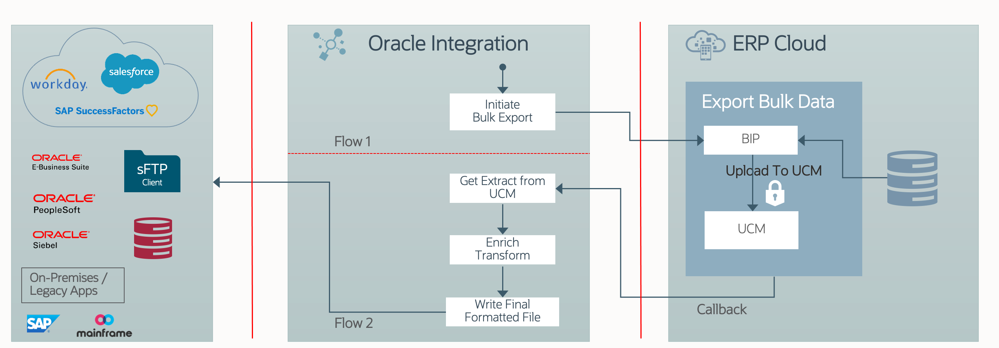

# Introduction

## About this Workshop

This workshop shows you how to design and develop a Bulk Extract Usecase in Oracle Integration 3 integrating with the ERP cloud. Out of the box, ERP Cloud adapter helps an Integration developer to quickly develop the usecases which interacts with the ERP Cloud.

This lab walks you through the steps to create a Bulk Extract Integration flow integrating with Oracle ERP Cloud.

This use case explores the use of Oracle Integration to extract large data sets from Oracle in an asynchronous fashion leveraging a callback mechanism.

This use case includes the following steps:

* Initiate Payables Transactions Process
* Listen to the callback message delivered from ERP cloud
* Finally, download the extract from UCM and deliver the data set to an SFTP location

 The following diagram shows the interaction between the systems involved in this use case.
     

Estimated Time: 120 minutes

### Video Preview

[ERP Cloud Integration Patterns](youtube:nKXbh2ZPuMI)

### Objectives

* Optional, How to enable the File Server in Oracle Integration 3 instance.
* Optional, Setup required to complete this LiveLab
* Creating a Project
* Creating Connections
* Create an Integration flow which extract large data sets from Oracle in an asynchronous fashion leveraging a callback mechanism..

### Prerequisites

* An Oracle Integration instance.
* A Chrome browser.
* Access to the ERP Cloud environment

You may now **proceed to the next lab**.

## Learn More

* [Getting Started with Oracle Integration 3](https://docs.oracle.com/en/cloud/paas/integration-cloud)
* [Using the Oracle ERP Cloud Adapter with Oracle Integration 3](https://docs.oracle.com/en/cloud/paas/application-integration/erp-adapter/index.html)

## Acknowledgements

* **Author** - Kishore Katta & Subhani Italapuram, Product Management, Oracle Integration
* **Last Updated By/Date** - Subhani Italapuram, Oct 2024
