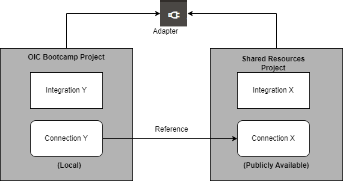

# Create and Configure Connections

## Introduction

This lab walks you through the steps to create connections for all the services used in the integration flow.

Estimated Time: 10 minutes

### Objectives

In this lab, you will:

- Create a REST connection using the REST Adapter.
- Create an ERP Cloud connection using the ERP Cloud Adapter.

### Prerequisites

This lab assumes you have:

- Completed all the previous labs.

## Task 1: Create a REST Connection Using the REST Adapter

> **Note: Ignore this section if you already created a REST Interface connection in your project as part of one of the previous labs.**

Create a connection with the REST Adapter.

1. In the left navigation pane, click ***Projects***, then click the project you created.
    You may skip this step if you are already in the project.
2. In the **Connections** section, click ***Add*** to create a new connection.
3. In the *Create Connection* dialog, select the **REST** adapter. To find the adapter, enter *REST* in the search field. Click on the highlighted adapter.
4. In the *Create Connection* dialog, enter the following information and click on ***Create***:

    | **Field**        | **Value**          |
    | --- | ----------- |
    | Name         | REST Interface     |
    | Role         | Trigger       |
    | Description  | REST Interface Connection for OIC LiveLabs |

    Keep all other values at their defaults.

    > **Note: If you are a Bootcamp user, complete only step 5 and skip the remaining steps.
    If you are not a Bootcamp user, skip step 5 and continue with step 6.**

5. In the *Use a Shared Connection* section, search for **REST Interface** and select the connection that is already created and shared in the training instance. Exit the connection canvas by clicking the back button in the upper-left corner of the screen.

    The connection named **REST Interface** is already created, configured, and shared with other projects in your training instance. Although the two connection names are similar, they exist in different projects. You can share adapter connection resources across projects. For example, two projects can integrate with a common system, such as Oracle ERP Cloud. The connection you created references the shared connection in the instance.

    

6. In the *Configuration* page, enter the following information:

    | **Field**  | **Values** |
    |---|---|
    |Security Policy | OAuth 2.0 Or Basic Authentication |

7. Click ***Test*** and wait until a confirmation box indicates that the test was successful.
8. Click ***Save*** and wait for the confirmation box. Exit the connection canvas by clicking the back button in the upper-left corner of the screen.

## Task 2: Create an ERP Cloud Connection Using the ERP Cloud Adapter

> **Note: Ignore this section if you already created an ERP Cloud connection in your project as part of one of the previous labs.**

Create a connection with the Oracle ERP Cloud Adapter.

1. In the left navigation pane, click ***Projects***, then click the project you created.
    You can skip this step if you are already in the project.
2. In the **Connections** section, click ***Add*** to create a new connection.

3. In the *Create Connection* dialog, select the ***Oracle ERP Cloud*** adapter to use for this connection. To find the adapter, enter `erp` in the search field. Click on the highlighted adapter.
4. In the *Create Connection* dialog, enter the following information and click on ***Create***:

    | **Field**        | **Value**          |
    | --- | ----------- |
    | Name         | `ERP Cloud`       |
    | Description  | `ERP Cloud Connection for OIC LiveLabs` |

    Keep all other values at their defaults.

    > **Note:** If you are a Bootcamp user, complete only step 5 and skip the remaining steps.
    If you are not a Bootcamp user, skip step 5 and continue with the remaining steps.

5. Search for **ERP Cloud**. The connection named **ERP Cloud** is already created by the instructors, configured, and shared with other projects. Although both connections have the same name, they exist in different projects. Click **ERP Cloud**, then click **Save**. Exit the connection canvas by clicking the back button in the upper-left corner of the screen.

6. In the *Oracle ERP Cloud Connection* dialog, enter the following information:

    | **Field**  | **Values** |
    |---|---|
    |ERP Cloud Host | `your-erp-host-name` |
    |Security Policy | **Username Password Token**|
    |Username | `<erp-username>`|
    |Password | `<erp-password>`|

7. Click ***Test*** and wait until a confirmation box indicates that the test was successful.

    > **Note:** The first time you run the test, it could take up to 2 minutes for completion.

8. Click ***Save*** and wait for the confirmation box. Exit the connection canvas by clicking the back button in the upper-left corner of the screen.

You may now **proceed to the next lab**.

## Learn More

- [Using the REST Adapter with Oracle Integration 3](https://docs.oracle.com/en/cloud/paas/application-integration/rest-adapter/index.html)
- [Using the SOAP Adapter with Oracle Integration 3](https://docs.oracle.com/en/cloud/paas/application-integration/soap-adapter/index.html)

## Acknowledgements

* **Author** - Subhani Italapuram, Product Management, Oracle Integration
- **Last Updated By/Date** - Subhani Italapuram, Aug 2026
