# Business Services Integration

## Introduction

This lab walks you through the steps to create an integration flow that invokes an ERP Cloud REST API.

This lab explores the use of Oracle Integration to invoke Oracle ERP Cloud business services that validate data on the fly and create a payables invoice in ERP Cloud. As part of the lab, you will build the following use case:

1. Create and activate an integration that invokes business services such as Financials Business Unit, Suppliers LOV, and the Invoice REST API. The integration flow validates data from the source request and conditionally creates invoices after validation.
2. Trigger the integration flow from Oracle Integration Tester.
3. The integration receives the request, validates various data elements, and creates an invoice in ERP Cloud.

    The following diagram shows the runtime interaction between the systems involved in this use case:
    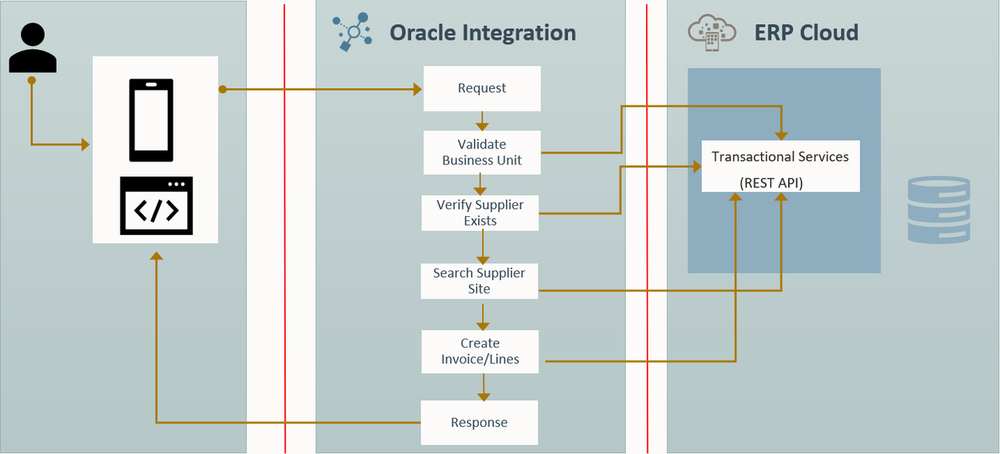

### Components and Flow Description

The diagram illustrates a high-level overview of an integration process between a **REST Interface**, **Oracle Integration**, and **ERP Cloud** with a focus on business services in the ERP Cloud application.

1. **User Input**: The process begins with a user providing an invoice and line details in JSON format, which is sent to the OIC.
2. **OIC Processing**: Within OIC, several validation steps occur:
     - **Validate Business Unit**: Ensures the business unit provided in the invoice data is valid.
     - **Verify Supplier Exists**: Checks if the supplier exists in the ERP Cloud system.
     - **Search Supplier Site**: Validates the supplier site associated with the invoice.
3. **Invoice Creation**: Once all validations pass, OIC invokes Oracle ERP Cloud's transactional services through REST APIs to create the invoice and associated line items.
4. **Response**: After successfully creating the invoice, a status response is sent back to the user, completing the flow.

This integration leverages OIC's ERP Cloud adapter to facilitate seamless communication with ERP Cloud's REST API, enabling the creation of invoices based on validated input data.

Estimated Time: 20 minutes

### Objectives

In this lab, you will:

- Understand how to use an ERP Cloud Adapter connection in the invoke role.
- Invoke ERP Cloud REST services for validation and enrichment.
- Use global variables and Data Stitch to store intermediate results.
- Configure a custom fault response for the client.

### Prerequisites

This lab assumes you have:

- Successfully completed all previous labs.

## Task 1: Create the Invoice Validation Integration

1. In the left navigation pane, click ***Projects***, then click the project you created.
    You can skip this step if you are already in the project.
2. In the **Integrations** section, click ***Add***.
3. On the *Add integration* dialog, click ***Create***.
4. On the *Create Integration* dialog, click ***Application***.
5. In the *Create integration* dialog, enter the following information:

    | **Element**        | **Value**          |
    | --- | ----------- |
    | Name         | `Invoice Validation`       |
    | Description  | `ERP Business Services Integration` |

    Accept all other default values.

6. Click ***Create***.

    > **Note:** If you receive an error that the identifier already exists, add your username or another suffix to the integration name and remember it for later use in the workshop.

7. Optional: select the ***Horizontal*** layout, then click ***Save*** to apply the changes.

## Task 2: Create the REST Interface Trigger

1. Click the ***+*** sign below **START** in the integration canvas.

2. Begin typing ***REST Interface*** in the search field to find the connection to your REST interface that you created in one of the previous labs.

3. Select the connection named ***REST Interface***. The Configure REST Endpoint wizard appears.

4. On the **Basic Info** page,
     - for the **What do you want to call your endpoint?**, enter ***createInvoice***
     - for the **What does this endpoint do?**, enter ***This endpoint defines the REST interface***
     - Click ***Continue***

5. On the Resource Configuration page,
    - for the **What does this operation do?**, enter ***Creates Invoice in ERP Cloud***
    - for the **What is the endpoint's relative resource URI:**, enter ***/createInvoice***
    - for the **What action do you want to perform on the endpoint?:**, enter select ***POST***
    - Select ***Configure request payload for this endpoint***
    - Select ***Configure this endpoint to receive the response***
    - Click ***Continue***

6. On the **Request** Page
    - Select the **Request Payload Format** to ***JSON Sample***
    - Click the ***&lt&lt&ltinline&gt&gt&gt*** link.
    - Provide the JSON below and click ***Continue***. Scroll down to see the **OK** button.

    ```
    <copy>
    {
    "InvoiceNumber" : "XX_INV_ABC_0001",
    "InvoiceCurrency" : "USD",
    "InvoiceAmount" : 600,
    "InvoiceDate" : "2021-01-01",
    "BusinessUnit" : "US1 Business Unit",
    "Supplier" : "ABC Consulting",
    "SupplierSite" : "ABC US1",
    "Description" : "Invoice Created using OIC",
    "invoiceLines" : [ {
      "LineNumber" : 1,
      "LineType" : "Item",
      "LineAmount" : 500,
      "Description" : "Line 1 Description",
      "ProrateAcrossAllItemsFlag" : true
    }, {
      "LineNumber" : 2,
      "LineType" : "Item",
      "LineAmount" : 100,
      "Description" : "Line 2 Description",
      "ProrateAcrossAllItemsFlag" : true
    } ]
    }
    </copy>
    ```

    - In the **What is the media type of the Request Body?** field, select ***JSON***. This option is selected by default; if it is not, select it.
    - Select ***Continue***

7. On the **Response** Page,
      - Set the **Response Payload Format** to ***JSON Sample***.
      - Click the ***&lt&lt&ltinline&gt&gt&gt*** link.
      - Provide the JSON below and click ***Continue***. Scroll down to see the **OK** button.

        ```
          <copy>
          {
            "InvoiceId" : 300000245076423,
            "InvoiceNumber" : "XX_INV_ABC_0002",
            "InvoiceCurrency" : "USD",
            "PaymentCurrency" : "USD",
            "InvoiceAmount" : 2500,
            "InvoiceDate" : "2021-01-01",
            "BusinessUnit" : "US1 Business Unit",
            "Supplier" : "ABC Consulting",
            "SupplierNumber" : "1288",
            "SupplierSite" : "ABC US1",
            "InvoiceGroup" : null,
            "AccountingDate" : "2021-01-01",
            "Description" : "Invoice Created using OIC"
          }
          </copy>
          ```

      - In the **What is the media type of the Response Body?** field, select ***JSON***. This option is selected by default; if it is not, select it.
      - Select ***Continue*** and click ***Finish*** on the Summary page.
      - Click ***Save*** to apply the changes.

## Task 3: Configure Validate Business Unit

1. Hover over the outgoing arrow for the **Trigger createInvoice** activity and click ***+***.

2. Begin typing ***ERP Cloud*** Service in the search field and select the ERP Cloud connection.

3. In the **Basic Info** page, name your endpoint ***validateBusinessUnit***. Click ***Continue***.

4. In the **Actions** page, select ***Query, Create, Update, or Delete Information***. Click ***Continue***.

5. On the **Operations** page,
    - In the **Browse by** list of values, select ***Business (REST) Resources***.
    - For **Select a Service Application**, select ***fscmRestApp***.
    - For **Select a Business Resource**, search for and select ***FinBusinessUnitsLOV***.
    - For **Select the operation**, select ***getAll***, then click ***Continue***.

6. On the **Summary** page, select ***Finish***.

## Task 4: Define the Data Mapping (validateBusinessUnit)

A Map action named **Map to validateBusinessUnit** is created automatically. Define this data mapping.

1. Select the ***Map validateBusinessUnit*** action. Click ***...***, then select ***Edit*** from the menu. The **Data Mapping** page appears.

2. In the Target section, expand ***Query Parameters***.

3. Use the mapper to drag element nodes from the source **createInvoice Request** structure to the target **validateBusinessUnit Request** structure.

    Expand the **Source** node:
      createInvoice Request > Request Wrapper

    Expand the **Target** node:
      validateBusinessUnit Request > Query Parameters

    Complete the mapping as follows: right-click ***Query***, click **Create Target Node**, then click **Switch to Developer View**. Enter ***concat("BusinessUnitName=",)*** and drag **BusinessUnit** from the source after the comma.
    
    

    | **Source**      | **Target**  |
    | --- | ----------- |
    | concat("BusinessUnitName=", /nssrcmpr:execute/nssrcdfl:request-wrapper/nssrcdfl:BusinessUnit) | Query |

    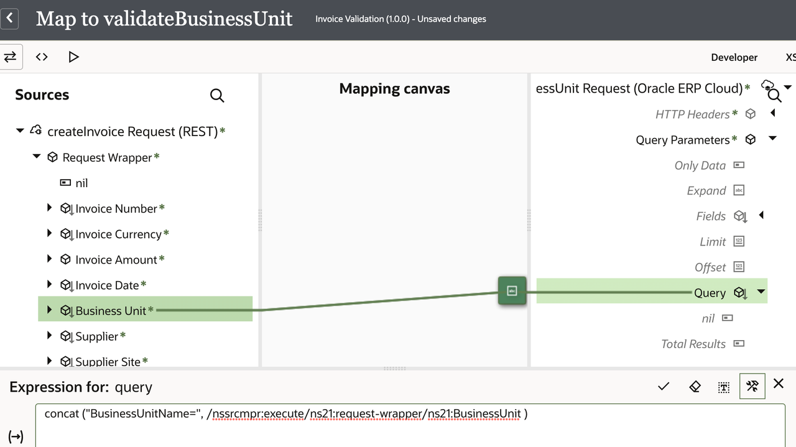

    > **Note:** The XPath expression namespace might vary. Always drag the element to capture the correct namespace.
    You can drag functions from the Component section. Expand **Functions**, then expand **String Category**.

4. Click the ***Tick Mark*** in the expression editor, then click ***Validate***. A message confirming that the expression is valid appears. Click ***&lt; (Go back)*** and ***Save*** the integration flow.
5. Click ***Save*** to persist changes.

## Task 5: Check for Business Unit

Check whether the business unit sent in the request payload is valid.

1. Click the ***Actions*** icon. From the **Collection** section, drag ***Switch*** to the **Integration** canvas and place it after the **validateBusinessUnit** activity.
    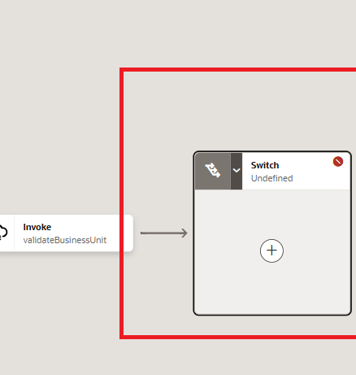

    You need to define two branches:
    - Route1 branch: This branch checks the **count of items**. If the expression evaluates to true, the instance follows this branch.
    - Otherwise branch: The instance follows this branch when the routing expression for the initial branch resolves to false. Configure a fault return if the business unit is invalid.

### *Add the branches*
1. Select ***Switch***, click **...**, select **Add**, then click **Otherwise**.
2. You should see two branches: **Route1** and **Otherwise**.
    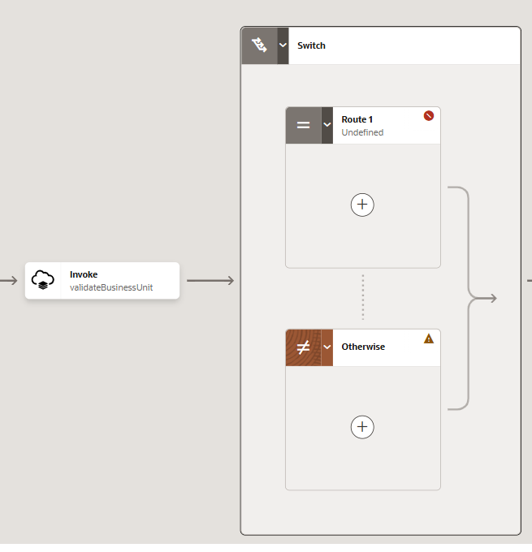

### *Define the Route1 flow*

1. Select ***Route1***, click **...**, then click **Edit**. The Expression Builder appears.
2. Define an expression to check if any business units returned per the query parameter.

    - In the **Expression Name** field, enter ***BusinessUnitFound***
    - In the **Source** section, select $validateBusinessUnit/getAllResponse/items
    - Drag and drop **items** into the right-side section.
    - Click **Switch to Developer View** and formulate the expression as `count($validateBusinessUnit/nsmpr5:getAllResponse/nsmpr5:items)`. This returns the number of item nodes.

3. Select **=** as the operator, then enter ***1.0*** in the **Value** field, as shown in the image below.
    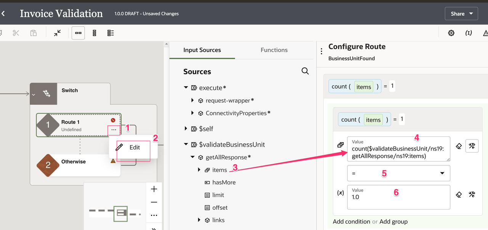

4. Click ***Route 1*** or anywhere on the canvas to exit the Expression Builder.
5. Click ***Save*** to persist changes.

### *Invoke Create Invoice*

1. Click ***+*** under the **Route1** activity.

2. Begin typing ***ERP Cloud*** Service in the search field and select the ERP Cloud connection.

3. In the **Basic Info** page, name your endpoint ***createERPInvoice***, then click ***Continue***.

4. In the **Actions** page, select ***Query, Create, Update, or Delete Information***. Click ***Continue***.

5. In the **Operations** page
    - In the **Browse by** list of values, select ***Business (REST) Resources***.
    - For **Select a Service Application**, select ***fscmRestApp***.
    - For **Select a Business Resource**, search for and select ***Invoices***.
    - For **Select the operation**, select ***create***.
    - Click ***Continue***.
    - For **Child Resource**, select ***invoiceLines*** and move it to the **Your Selected Child Resource(s)** box.
    - Click ***Continue***.
    - In **Select Flexfield Contexts**, do not select anything; click ***Continue***.

    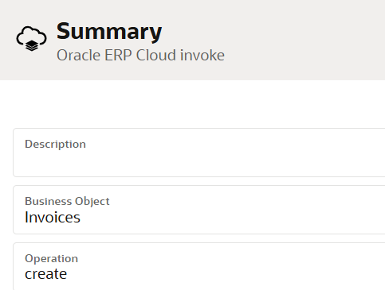

6. In the **Summary** page, select ***Finish***.

    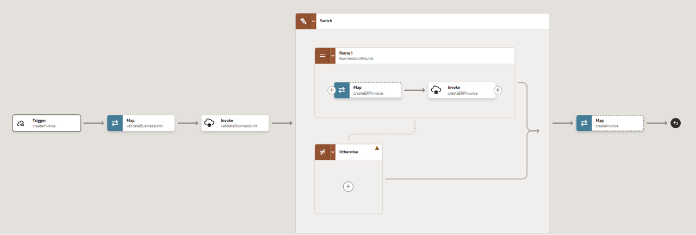
7. Click ***Save*** to persist changes.

### *Define the Mapping Map to createERPInvoice*

A Map action named **Map createERPInvoice** is created automatically. Define this data mapping.

1. Select the ***Map createERPInvoice*** action. Click the ***...*** icon, then click the ***Edit*** icon. The **Data Mapping** page appears.

2. Use the mapper to drag element nodes from the source **createInvoice Request** structure to the target **createERPInvoice Request** structure.

    Expand the **Source** node:
      createInvoice Request > Request Wrapper

    Expand the **Target** node:
      createInvoice Request > Invoices

    Complete the mapping as follows:

    | **Source**      | **Target**  |
    | --- | ----------- |
    | Invoice Number | Invoice Number |
    | Invoice Currency | Invoice Currency |
    | Invoice Amount | Amount |
    | Invoice Date | Invoice Date |
    | Business Unit | Business Unit |
    | Supplier | Name |
    | Supplier Site | Site |
    | Description | Description |
    | Invoice Lines | Invoice Lines |
    | Invoice Lines > Line Number | Invoice Lines > Line Number |
    | Invoice Lines > Line Type | Invoice Lines > Line Type |
    | Invoice Lines > Line Amount | Invoice Lines > Line Amount |
    | Invoice Lines > Description | Invoice Lines > Description |
    | Invoice Lines > Prorate Across All Items Flag | Invoice Lines > Prorate Across All Item Lines |

    > **Note:** You can easily find a source or target element by using the search functionality.

3. Click ***Validate***. A message confirming that the expression is valid appears. Click ***&lt; (Go back)*** and ***Save*** the integration flow.

### *Define the Global Variable*

Define a global variable to store the **createInvoice** response. The **createInvoice** response variable is created automatically within the scope of the Switch condition. To access the response payload, use the Data Stitch activity.

1. Select ***(x)*** Global Variables from the right-hand palette.

2. Select ***Add Variable***.

3. Enter ***invoice\_response\_var*** for **Name** and select ***Object*** for **Type**. This opens the Sources pane with all variables. Expand ***$createERPInvoice &gt; createResponse &gt;***. Drag the ***Invoices*** variable onto the right-side pane.

    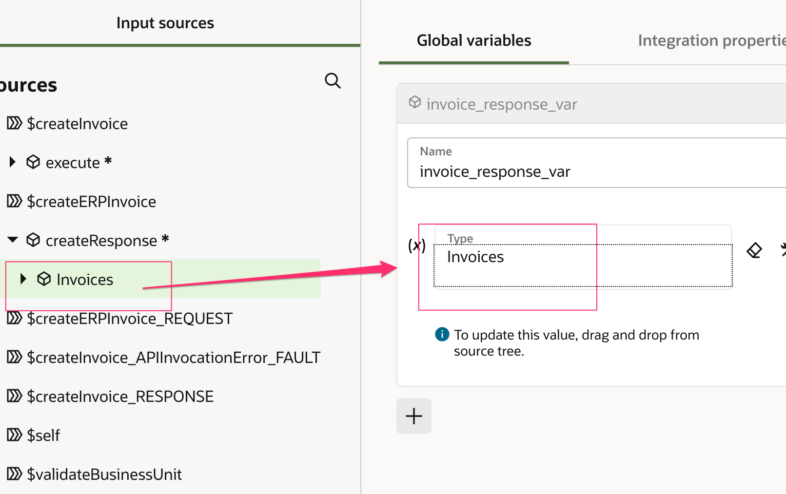

4. Close the Global Variables pane.

5. ***Save*** the integration flow.

6. Hover over the outgoing arrow for the **createERPInvoice** activity and click ***+***. Search for the **Data Stitch** activity. Alternatively, drag it from the **Actions** palette.

7. The Data Stitch activity pane appears. Select the variable and values.

    - Enter the activity name as ***storeInvoiceResponse***
    - Select the Tools icon next to the **Variable (x)** box to switch to Developer View. From the **Sources** view, drag ***$invoice\_response\_var*** onto the **Variable (x)** box.
    - Select **Operation** as ***Assign***
    - In the **Value (x)** box, switch to Developer View if required, then drag ***$createERPInvoice &gt; createResponse &gt; Invoices*** into the **Value (x)** box.
    - Click the Stitch activity, which closes the Data Stitch pane automatically.
    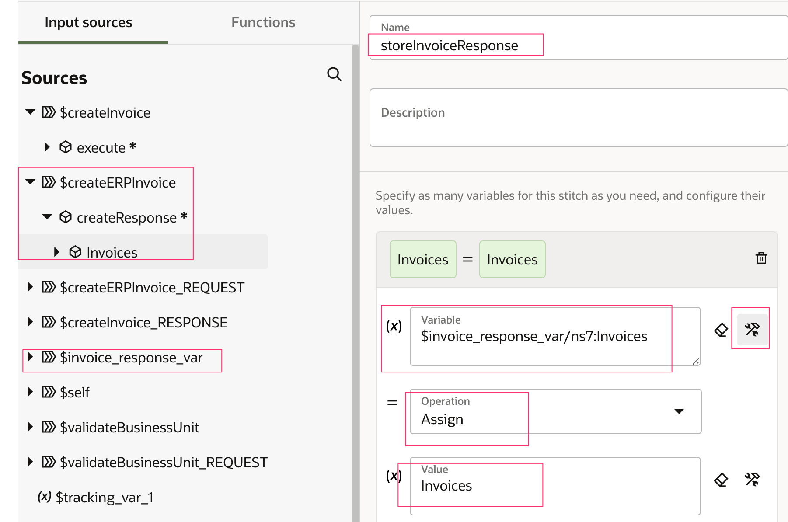

### *Define the Response mapping (createInvoice)*

Map the response from ERP Cloud for **createERPInvoice** to the integration flow response that is sent back to the client. Map only the elements needed to indicate that a new invoice was created in ERP Cloud.

1. Select ***Map createInvoice***, click ***...***, then click ***Edit***.

2. Use the mapper to drag element nodes from the source **invoice\_response\_var** request structure to element nodes in the target **createInvoice Response** structure.

    Expand the source node ***invoice\_response\_var*** and ***Invoices***.

    Expand the **Target** node:

     createInvoice Response > Response Wrapper

    Complete the mapping as follows:

    | **Source**      | **Target**  |
    | --- | ----------- |
    | Invoice Id | Invoice Id |
    | Invoice Number | Invoice Number |
    | Invoice Currency | Invoice Currency |
    | Payment Currency | Payment Currency |
    | Amount | Invoice Amount |
    | Invoice Date | Invoice Date |
    | Business Unit | Business Unit |
    | Name | Supplier |
    | Supplier Number | Supplier Number |
    | Site | Supplier Site |
    | Invoice Group | Invoice Group |
    | Accounting Date | Accounting Date |
    | Description | Description |

3. Click ***Validate***, then click ***&lt; (Go back)***. ***Save*** the integration flow.

### *Define the Otherwise conditional flow*

1. Click ***+*** under the **Otherwise** activity and select the ***Fault Return*** activity. This activity returns a custom fault.

2. Select ***Map createInvoice*** to configure the fault details.

3. Expand the target **createInvoice Fault** and map the following:

    | **Source**      | **Target**  |
    | --- | ----------- |
    | "Invalid Business Unit" | Title |
    | "The value for the Business Unit attribute is invalid. You must provide a valid value" | Detail |
    | "400" | Error Code |

    > **Note:** If the target element is grayed out, select the target node and right-click **Create Target Node**. This opens the Expression Editor.

4. Select ***Validate***, then click ***&lt; (Go back)***.
5. Your final integration flow should look as follows:
    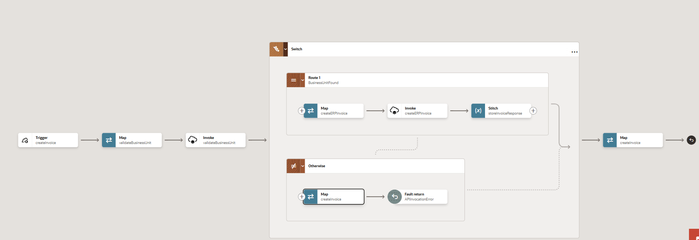

## Task 6: Define Tracking Fields

1. Manage business identifiers to track fields in messages during runtime.

    > **Note:** If you have not yet configured at least one business identifier **Tracking Field** in your integration, then an error icon is displayed in the design canvas.

2. Click ***(I)*** in the upper-right corner.
    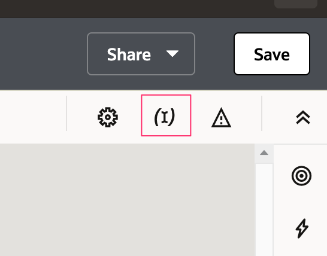

3. From the **Source** section, expand ***execute &gt; request-wrapper***. Drag the ***InvoiceNumber***, ***BusinessUnit***, and ***InvoiceDate*** fields from the source to the *Business Identifier Field* section:

    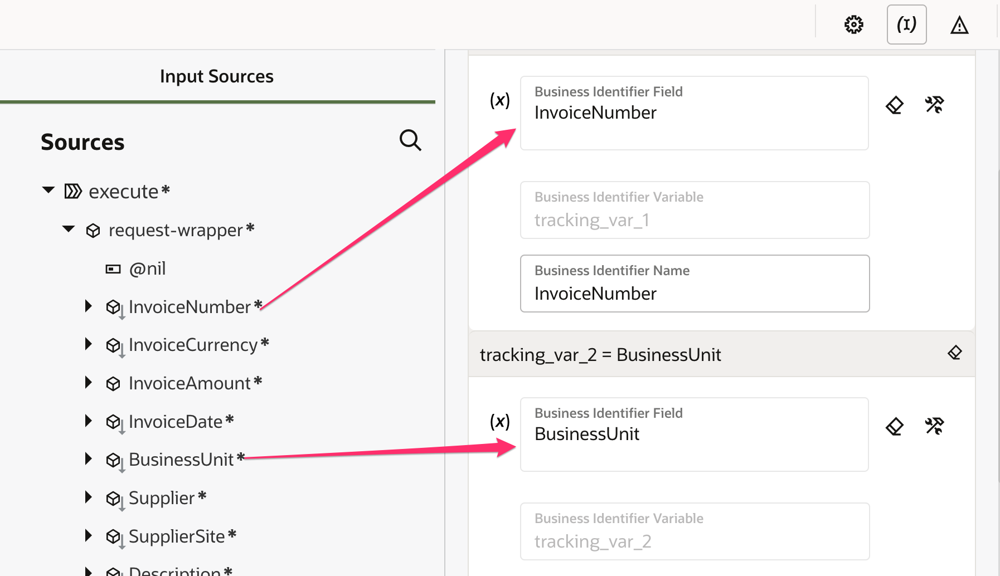

4. Click ***(I)***

5. On the Integration canvas, click ***Save***, followed by ***&lt; (Go back)***.

## Task 7: Activate the integration

1. In the **Integrations** section, click **...** for the integration, then click the **Activate** icon.
2. In the **Activate Integration** dialog, select ***Audit*** as the tracing level, then click ***Activate***.

- The activation will be completed in a few seconds. If activation is successful, a status message is displayed in the banner at the top of the page, and the status of the integration changes to **Active**.

## Task 8: Formulate Request Payload to Create Invoice

Test the integration flow with a success case and a fault case by modifying the request payload.

1. Log in to ERP Cloud. Identify a user with the **Create Invoices** role.

2. Navigate to ***Payables &gt; Invoices***

3. Select ***Tasks &gt; Create Invoice***

4. Provide the following values:

    | **Name**      | **Value**  |
    | --- | ----------- |
    | Business Unit | US1 Business Unit |
    | Supplier | ABC Consulting |

    Make a note of the following values:
      - Business Unit
      - Supplier
      - Supplier Site

    Do not create the invoice. You will need valid values to formulate the test request payload.

## Task 9: Test the Integration Flow

Test the end-to-end integration flow using the built-in Test Client. In an ideal scenario, the request would be posted from a web or mobile client.

1. From the **Integrations** section, select the **Invoice Validation** integration flow, click ***... (Actions)***, then click ***Run***.

2. Select the ***Body*** tab and ensure that the ***Text*** radio button is selected. Provide the payload below.

    ```
    <copy>
    {
    "InvoiceNumber" : "XX_INV_ABC_0099",
    "InvoiceCurrency" : "USD",
    "InvoiceAmount" : 600,
    "InvoiceDate" : "2021-01-01",
    "BusinessUnit" : "US1 Business Unit",
    "Supplier" : "ABC Consulting",
    "SupplierSite" : "ABC US1",
    "Description" : "Invoice Created using OIC",
    "invoiceLines" : [ {
      "LineNumber" : 1,
      "LineType" : "Item",
      "LineAmount" : 500,
      "Description" : "Line 1 Description",
      "ProrateAcrossAllItemsFlag" : true
    }, {
      "LineNumber" : 2,
      "LineType" : "Item",
      "LineAmount" : 100,
      "Description" : "Line 2 Description",
      "ProrateAcrossAllItemsFlag" : true
    } ]
    }
    </copy>
    ```

    Modify the payload with the values captured from ERP Cloud for **Business Unit**, **Supplier**, and **Supplier Site**. Provide a unique **Invoice Number**.

3. Click ***Run***. Observe the returned **Response** payload.

    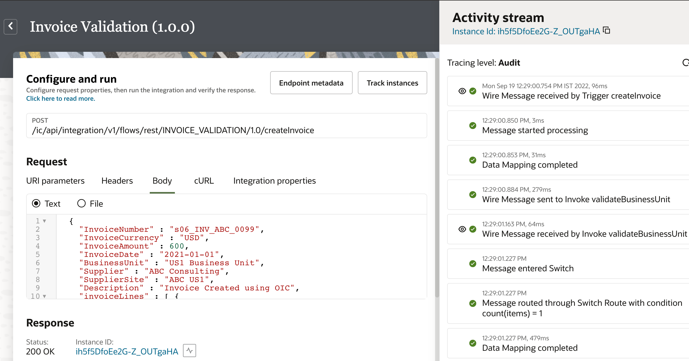

4. Select the Instance ID and view the integration flow.

    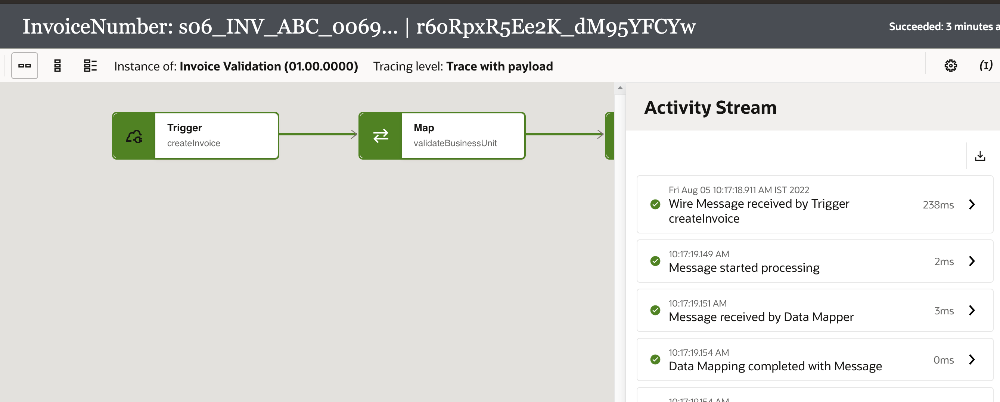

5. Modify the **Request Payload** with an invalid business unit and test the integration flow. Observe the returned custom fault payload and the execution of the **Otherwise** condition.

## Task 10: Extend the Use Case (Bonus Lab)

There are a few hints in the bonus lab for extending the use case to validate the supplier and supplier site. Refer to the Introduction section for the high-level flow.

### *Validate Supplier Activity*

1. Use the **ERP Cloud** connection and configure the REST resources to invoke the ***SupplierLOV &gt; getAll*** operation.

2. In the **Child Resources** page, select ***sitesLOV***.

### *Define the Map to validateSupplier*

1. In **validateSupplier Request**, provide the following query parameters:
      - Expand -> "sitesLOV"
      - Query -> concat ("SupplierName=", /nssrcmpr:execute/ns31:request-wrapper/ns31:Supplier )

### *Create IF Condition for Supplier*

1. In the ***If*** condition, use **count($validateSupplier/nsmpr13:getAllResponse/nsmpr13:items) = 1.0** to validate that the supplier is found.

### *Create IF Condition for Supplier Site*

1. In the ***If*** condition, use **count($validateSupplier/nsmpr13:getAllResponse/nsmpr13:items/nsmpr7:sitesLOV[nsmpr2:SupplierSite=/nsmpr8:execute/nsmpr4:request-wrapper/nsmpr4:SupplierSite]) = 1** to validate that the supplier site is found.

### *Create Otherwise Condition for Supplier and Supplier Site*

1. Create an Otherwise condition for the supplier and supplier site to return the appropriate fault payload.

The final integration changes for the bonus lab are as follows:
  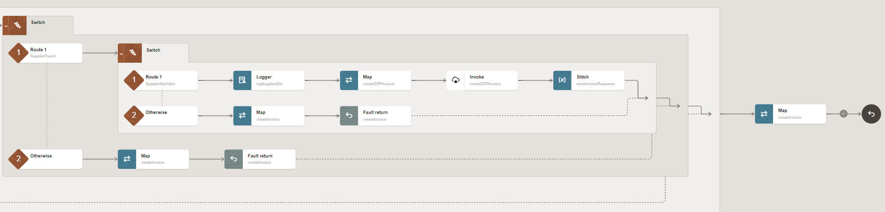

**Congratulations!** You have learned how to invoke an ERP Cloud REST API with out-of-the-box adapter capabilities. The ERP Cloud Adapter abstracts APIs, services, and business objects and provides an intuitive interface that simplifies real-time synchronization.

## Learn More

- [Getting Started with Oracle Integration 3](https://docs.oracle.com/en/cloud/paas/application-integration/index.html)

## Acknowledgements

- **Author** - Kishore Katta, Director Product Management, Oracle Integration
- **Contributors** - Subhani Italapuram, Director Product Management, Oracle Integration
- **Last Updated By/Date** - Subhani Italapuram, Aug 2026
