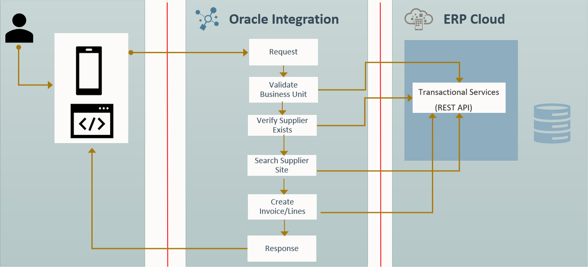

# Introduction

## About this Workshop

This workshop shows you how to design and develop a Real time Synchronization Usecase in Oracle Integration 3 integrating with the ERP cloud. Out of the box, ERP Cloud adapter helps an Integration developer to quickly consume Business Services in a secured way using various authentication schemes.

  The following diagram shows the runtime interaction between the systems involved in this use case:
  

Estimated Time: 40 minutes

### Objectives

In this workshop, you will learn how to:

* Creating a Project
* Creating Connections
* Create a Real-Time Synchronization scenario using Business Services.
* Use Business Object to Integrate with ERP Cloud.

### Prerequisites

* Oracle Integration Instance.
* Access to the ERP Cloud environment
* A Chrome browser.

## Task 1: Leverage the ERP Cloud Adapter in Oracle Integration 3

Oracle Integration 3 provides native connectivity to Oracle and non-Oracle Software as a Service (SaaS) and On-premises applications, such as Oracle ERP Cloud, Oracle Service Cloud, HCM Cloud, Salesforce.com, Workday, EBS, SAP, NetSuite and so on. OIC adapters simplify connectivity by handling the underlying complexities of connecting to applications using industry-wide best practices

With the help of this cookbook series, you can design and implement ERP Cloud Integration patterns leveraging Oracle Integration 3 features and functionalities

As an Integration Developer, if you have a requirement to integrate an ERP Cloud application with any other SaaS or On-premise application, then this cookbook series helps you to go through the pre-requisite steps, common use cases, ERP Cloud adapter functional capabilities and several implementation considerations along with lab exercises to provide hands-on experience.

The Oracle ERP Cloud Adapter enables you to easily integrate on-premises or SaaS applications with Oracle ERP Cloud without having to know about the specific details involved in the integration.

The Oracle ERP Cloud Adapter provides the following key benefits:

* Supports connecting to private resources that are in your virtual cloud network (VCN) private subnet with a private endpoint. Private endpoints do not support Oracle ERP Cloud business events. This type of connection does not use the connectivity agent.
* Integrates easily with the Oracle ERP Cloud application’s WSDL file to produce a simplified, integration-centric WSDL.

* Provides declarative support for subscribing to business events raised by various modules in Oracle ERP Cloud and Oracle Supply Chain Management Cloud. 

* Generates automatic mapping to the exposed business object, event subscription, or business (REST) API that you select during adapter configuration:
    - Business object: Represents a self-contained business document that can be acted upon by the integration. An integration can send requests to create a new record for that business object. They can send a request either to update or delete an existing record for a business object. Integrations can also send requests to retrieve information about one or more records representing that business object.

    - Event subscription: Represents an event document to which you subscribe. The event subscription is raised by the Oracle ERP Cloud application.

      You can also create custom business events in Oracle ERP Cloud that can be published and subscribed to with the Oracle ERP Cloud Adapter. 

    - Business (REST) API: Represents an Oracle Fusion Applications REST API resource.
      You can select parent business resources and their corresponding child business resources on the Operations page in the Adapter Endpoint Configuration Wizard. Support is provided in the invoke (outbound) direction. If you select a top-level resource on the Operations page, you can also select sub-resources on the Sub-Resources page. 

* Simplified connection creation: Automatically identifies the required service catalog service WSDL, optional event catalog URL, and optional interface catalog URL to use based on the Oracle ERP Cloud host name you specify when creating a new connection on the Connections page.
* Dynamically invokes a REST endpoint/URL at runtime without requiring you to configure any extra invoke connection or REST outbound details

### Video Preview

[ERP Cloud Integration Patterns](youtube:nKXbh2ZPuMI)

You may now **proceed to the next lab**.

## Learn More

* [Getting Started with Oracle Integration 3](https://docs.oracle.com/en/cloud/paas/application-integration/index.html)
* [Using the Oracle ERP Cloud Adapter with Oracle Integration 3](https://docs.oracle.com/en/cloud/paas/application-integration/erp-adapter/index.html)

## Acknowledgements

* **Author** - Kishore Katta, Director Product Management, Oracle Integration
* **Contributors** - Subhani Italapuram, Director Product Management, Oracle Integration
* **Last Updated By/Date** - Subhani Italapuram, Nov 2024
