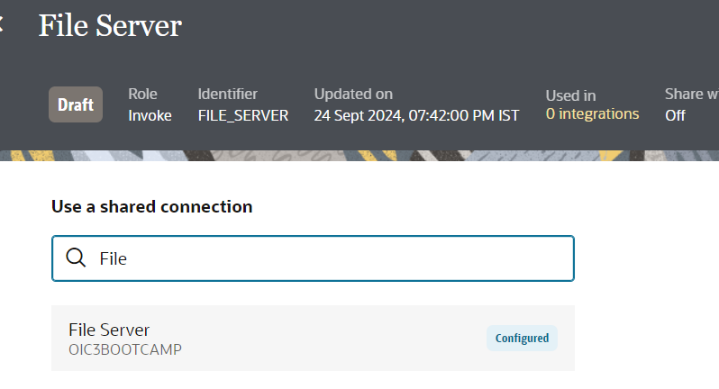
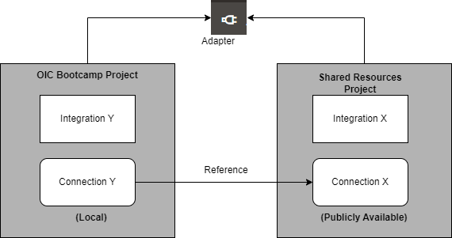

# Create and Configure Connections

## Introduction

This lab will walk you through the steps to create connections for all the services which will be used in the Integration Flow.

Estimated Time: 10 minutes

### Objectives

In this lab, you will:

- Create File Server connection using FTP adapter
- Create ERP Cloud connection using ERP Cloud adapter

### Prerequisites

This lab assumes you have:

- Completed all the previous labs

## Task 1: Create File Server(FTP) Connection using FTP adapter

> **Note: Ignore this section if you have a File Server connection created already in your Project as part of one of the previous labs.**

Create a connection with the FTP Adapter.

1. In the left Navigation pane, click ***Projects***, click on the project which you have created.
    You may skip this step if you are already in the project.
2. In the **Connections** section, click ***Add*** to create a new connection.
3. Select the **FTP** Adapter.
4. From the *Create Connection* dialog, *Name* your connection as **File Server** and select *Role* as **Invoke** and leave the rest of the configurations as default. Click **Create**

    > **Note:** If you are a Bootcamp user then execute step 5 only and skip other steps.
    If you are a non Bootcamp user then skip step 5 and continue with other steps..

5. Search for **File**, And click on **File Server** and click on **Save**. Exit the connection canvas by clicking the back button on the top left side of the screen.

    .

Please note that the connection with the name **File Server** is already created in your training instance, which is configured and shared with other projects. Although both the connections names are similar, they exist in the different projects. You can share adapter connection resources across projects. For example, you may have two projects that need to integrate with a common system, such as Oracle ERP Cloud. The connection you created is referencing the shared connection in the instance.

6. Enter the following configurations in the *FTP Connection* with the information you previously gathered from the File Server Settings page.  

    | Field                   | Value                                                 |
    |-------------------------|-------------------------------------------------------|
    | FTP Server Host Address | From File Server Settings - IP and Port Information   |
    | FPT Server Port         | From File Server Settings - IP and Port Information   |
    | SFTP Connection         | Yes                                                   |
    | Security                | FTP Server Access Policy                              |
    | Username                | Your Oracle Integration username                      |
    | Password                | Your Oracle Integration password                      |

7. Confirm your Connection by clicking **Test**, then **Diagnose & Test**. You should see the *Connection File Server was tested successfully* confirmation message. Click **Save** and exit the Connection editor.

## Task 2: Create ERP Cloud Connection using ERP Cloud adapter

> **Note: Ignore this section if you have a ERP Cloud connection created already in your Project as part of one of the previous labs.**

Create a connection with the Oracle ERP Cloud Adapter.

1. In the left Navigation pane, click ***Projects***, click on the project which you have created.
    You can please skip this step if you are already in the project.
2. In the **Connections** section, click ***Add*** to create a new connection.

3. In the *Create Connection* dialog, select the ***Oracle ERP Cloud*** adapter to use for this connection. To find the adapter, enter `erp` in the search field. Click on the highlighted adapter.
4. In the *Create Connection* dialog, enter the following information and click on ***Create***:

    | **Field**        | **Value**          |
    | --- | ----------- |
    | Name         | `ERP Cloud`       |
    | Description  | `ERP Cloud Connection for OIC LiveLabs` |

    Keep all other values as default.

    > **Note:** If you are a Bootcamp user then execute step 5 only and skip other steps.
    If you are a non Bootcamp user then skip step 5 and continue with other steps..

5. Search for **ERP Cloud**, Please note that the connection with the name **ERP Cloud** is already created by the instructors, configured and shared with other projects.
Do not get confused with the same name, both the connections are in the different projects so, we are good with it. And click on **ERP Cloud** and click on **Save**. Exit the connection canvas by clicking the back button on the top left side of the screen.

6. In the *Oracle ERP Cloud Connection* dialog, enter the following information:

    | **Field**  | **Values** |
    |---|---|
    |ERP Cloud Host | `your-erp-host-name` |
    |Security Policy | **Username Password Token**|
    |Username | `<erp-username>`|
    |Password | `<erp-password>`|

7. Click on ***Test*** and wait until you receive a
confirmation box that the test was successful.

    > **Note:** The first time you run the test, it could take up to 2 minutes for completion.

8. Click ***Save*** and wait for the confirmation box. Exit the connection canvas by clicking the back button on the top left side of the screen.

You may now **proceed to the next lab**.

## Learn More

- [Shared Connection across the Projects](https://docs.oracle.com/en/cloud/paas/application-integration/integrations-user/design-project.html#GUID-8B2FBBB5-4F68-4690-AD73-19F79E5577C8)

- [Oracle Integration FTP Adatper](https://docs.oracle.com/en/cloud/paas/application-integration/ftp-adapter/ftp-adapter-capabilities.html#GUID-59194DED-31DC-4E3D-893C-0064D7CC65A0)

- [Create an Oracle ERP Cloud Adapter Connection](https://docs.oracle.com/en/cloud/paas/application-integration/erp-adapter/create-oracle-erp-cloud-adapter-connection.html)

## Acknowledgements

- **Author** - Subhani Italapuram, Product Management, Oracle Integration
- **Last Updated By/Date** - Subhani Italapuram, November 2024
