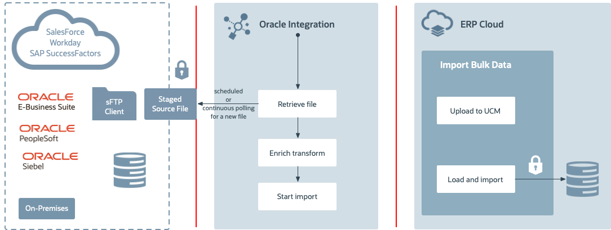

# Introduction

## About this Workshop

This workshop shows you how to design and develop File-based Data Integration (FBDI) Import usecase in Oracle Integration 3 with the ERP Cloud. Out of the box, ERP Cloud adapter helps an Integration developer to quickly import the data into the ERP Cloud in a secured way using various authentication schemes

In this workshop, we shall use Oracle Integration and ERP Cloud Import bulk data services with File Based Data Import (FBDI) complaint files.
The goal is to import ERP data such as account payable invoices using processes in ERP Cloud.

The typical flow of this use case is:

1. The user uploads an FBDI based account payable invoice file to an FTP Server.
2. Oracle Integration imports the account payable invoice file into the ERP Cloud.

This labs will explore the ERP Cloud adapter and File Adapter features and lets you know how to perform the following tasks:

 1. Read files from an SFTP Server
 2. Synchronize account payable invoices into the ERP Cloud

  The following diagram shows the runtime interaction between the systems involved in this use case:
    

Estimated Time: 2 hours

### Objectives

* Optional, How to enable the File Server in Oracle Integration 3 instance.
* Optional, Setup required to complete this LiveLab
* Creating a Project
* Creating Connections
* Create an Integration flow which reads the file from FTP Server and imports into the ERP Cloud.

### Prerequisites

* An Oracle Integration instance.
* A Chrome browser.
* Access to the ERP Cloud environment

You may now **proceed to the next lab**.

## Learn More

* [Getting Started with Oracle Integration 3](https://docs.oracle.com/en/cloud/paas/application-integration/index.html)
* [Using the Oracle ERP Cloud Adapter with Oracle Integration 3](https://docs.oracle.com/en/cloud/paas/application-integration/erp-adapter/index.html)
* [Invoke a File-Based Data Import (FBDI) Job](https://docs.oracle.com/en/cloud/paas/application-integration/erp-adapter/invoke-file-based-data-import-fbdi-job.html)

## Acknowledgements

* **Author** - Kishore Katta, Director Product Management, Oracle Integration
* **Contributors** - Subhani Italapuram, Director Product Management, Oracle Integration
* **Last Updated By/Date** - Subhani Italapuram, Sep 2025
