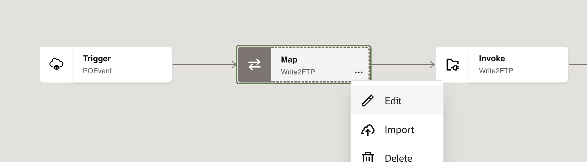
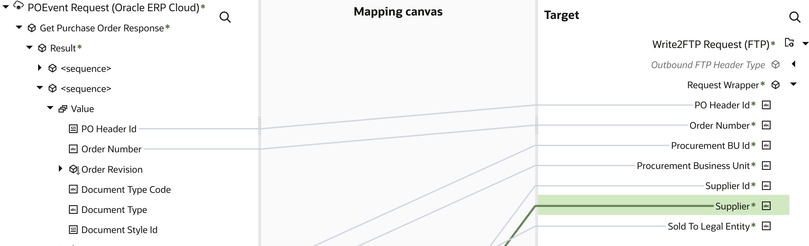
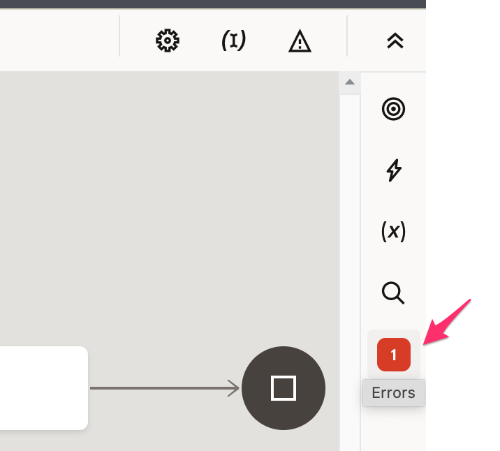
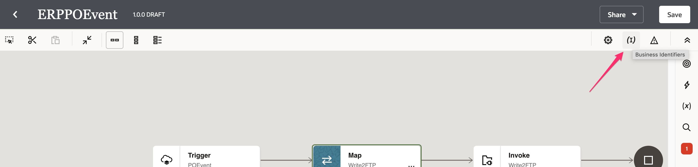
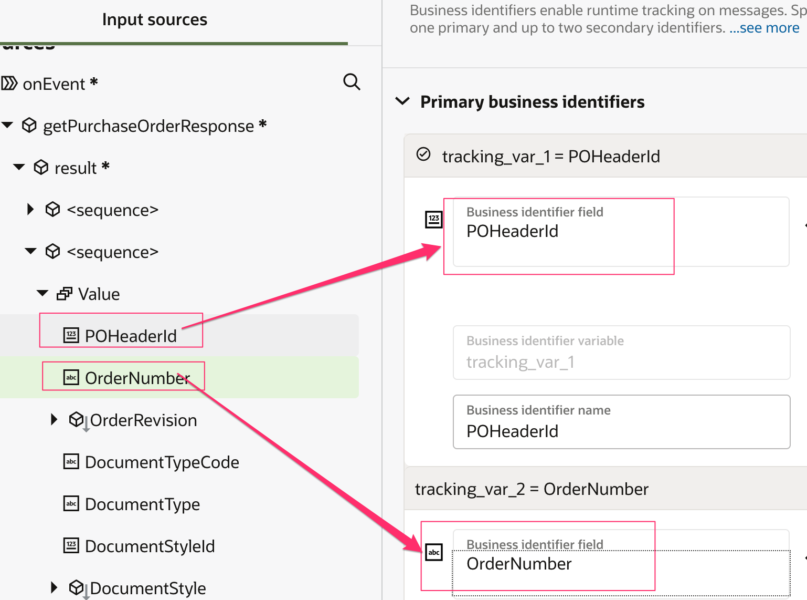
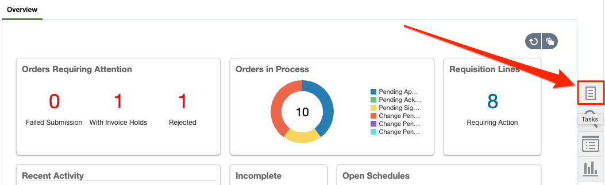
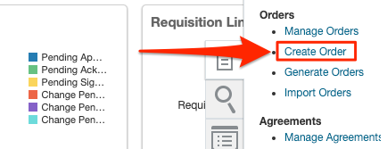
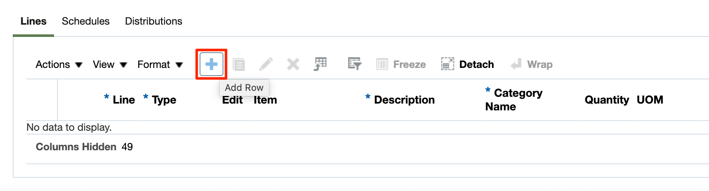
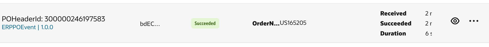
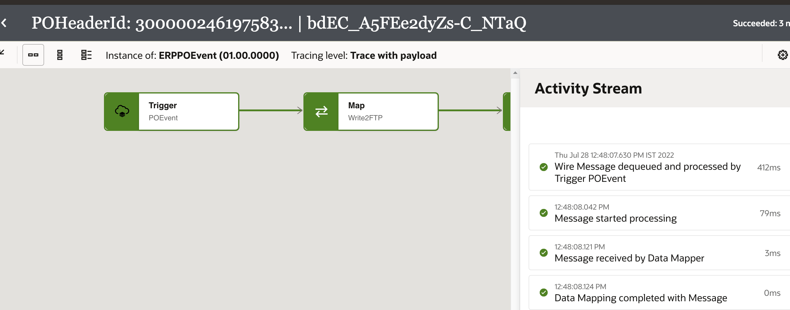

# Business Events

## Introduction

This lab walks you through the steps to create Integration flow.

This Lab explores the use of Oracle Integration to subscribe to Oracle ERP Cloud Events and
push the relevant event information to downstream systems. As part of the lab you will build the following use case scenario:

1. You create and activate an integration that subscribes to an ERP Cloud Purchase Order (PO) event
2. You then create a PO in ERP Cloud and a PO event is triggered.
3. Your integration receives the PO event and pushes the data
    into the File Server.

    The following diagram shows the runtime interaction between the systems involved in this use case:
    

Estimated Time: 30 minutes

### Objectives

In this lab, you will:

* Understand how to subscribe to business events in Oracle ERP cloud leveraging out of the box ERP cloud
  adapter capabilities
* Connect to file server to write data records

### Prerequisites

This lab assumes you have:

* All previous labs successfully completed.

## Task 1: Create the PO Event Integration

1. In the left Navigation pane, click ***Projects***, click on the project which you have created.
    You can please skip this step if you are already in the project.
2. In the **Integrations** section, click ***Add***.
3. On the *Add integration* dialog, click ***Create***.
4. On the *Create integration* dialog, Click on ***Application***.
5. In the *Create integration* dialog, enter the following information:

    | **Element**        | **Value**          |
    | --- | ----------- |
    | Name         | `ERPPOEvent`       |
    | Description  | `ERP Event integration for LiveLabs` |

    Accept all other default values.

6. Click ***Create***.
7. Click ***Save*** to apply changes.

## Task 2: Define ERP Purchase Order (PO) Event trigger

Add ERP PO Event trigger to the empty integration canvas.

1. Click the ***+*** sign in the integration canvas.
2. Select the *ERP Cloud* connection which you have created in the previous labs. This invokes the Oracle ERP Cloud Endpoint Configuration Wizard.
3. On the **Basic Info** page,
     * for the **What do you want to call your endpoint?** element, enter ***POEvent***
     * Click ***Continue***.

4. On the **Request** page, select the following values:

    | **Element**        | **Value**          |
    | --- | ----------- |
    | Define the purpose of the trigger         | Receive Business Events raised within ERP Cloud       |
    | Business Event for Subscription  | Purchase Order Event |
    | Filter Expr for Purchase Order Event | [see code snippet below] |

    ```
    <copy>
    <xpathExpr xmlns:ns0="http://xmlns.oracle.com/apps/prc/po/editDocument/purchaseOrderServiceV2/" xmlns:ns2="http://xmlns.oracle.com/apps/prc/po/editDocument/purchaseOrderServiceV2/types/">$eventPayload/ns2:result/ns0:Value/ns0:PurchaseOrderLine/ns0:ItemDescription="Lan Cable"</xpathExpr>
    </copy>
    ```

    > **Tip:**
    1. If you are working on a shared ERP Cloud environment, it is recommended to use a distinct value in the filter expression under **ItemDescription**. For example `Lan Cable <your-initials>`. The value you enter is case sensitive. Write down this value for later use.
    2. Please note that the filter is not mandatory, however, it does allow you to control which integration should be triggered. This is useful if there are multiple integrations subscribed to the PO Event in the same ERP Cloud environment. Without the filter expression, all integrations subscribed to the PO Event would get triggered whenever that specific event occurs.

5. Click ***Continue***.
6. On the **Summary** page, click ***Finish***.
7. Click ***Save*** to persist changes.
8. Optional, Select Layout to ***Horizontal*** and click ***Save*** to apply changes.
    

## Task 3: Add the FTP Adapter as invoke activity

Add the FTP Adapter invoke to the integration canvas.

1. Hover your cursor over the arrow in the integration canvas to display the ***+*** sign. Click the ***+*** sign and select the **File Server** Connection created in the previous lab.
This invokes the FTP adapter Configuration Wizard.
2. On the **Basic Info** page, select the following values and click ***Continue***.

    | **Element**        | **Value**          |
    | --- | ----------- |
    | What do you want to call your endpoint? | `Write2FTP`       |

3. On the **Operation** page, select the following values and click ***Continue***.

    | **Element**        | **Value**          |
    | --- | ----------- |
    | Select Operation | Write File  |
    | Output Directory | /upload/users/```<<your oic usernumber>>```  |
    | File Name Pattern | PO%SEQ%.json  |

    Leave the rest as default.
4. On the **Schema page**,
    * For the **Do you want to specify the structure of the contents of the file?**, select as ***Yes***
    * select the ***Sample JSON document*** from the drop-down.
    * Copy the below json content into a file and save it on to your desktop. Name it as ***PurchaseOrder.json***

    ```
    <copy>
    {
      "poHeaderId":"US164985",
      "orderNumber":"300000245105090",
      "procurementBUId":"300000046987012",
      "procurementBusinessUnit":"US1 Business Unit",
      "supplierId":"300000047414679",
      "supplier":"Dell Inc.",
      "soldToLegalEntity":"US1 Legal Entity"
    }
    </copy>
    ```

5. Click ***Continue***.
6. On the **File Contents - Definition** page, upload the file **PurchaseOrder.json** saved in the previous step
7. Click ***Continue*** and Review the **Summary** page and click on ***Finish***
8. Click on ***Save***

## Task 4: Map data between ERP trigger and FTP invoke

Use the mapper to drag fields from the source structure (POEvent)  to the target structure (Write2FTP) to map elements between the two.

When we added the FTP invoke to the integration, a map icon was automatically added.

1. Hover your cursor over the **Map Write2FTP** Mapper icon, click on **...** and then select ***Edit***.
    

2. Use the mapper to drag element nodes in the source ERP Cloud structure to element nodes in the target FTP structure.

    Expand the ***Source*** node:
        POEvent Request > Get Purchase Order Response > Result > 2nd <sequence> > Value
    Expand the ***Target*** node: Write2FTP Request > request-wrapper

    Complete the mapping as below:

    | **Source** *(ERP Cloud)*        | **Target** *(FTP)* |
    | --- | ----------- |
    | PO Header Id | PO Header Id |
    | Order Number | Order Number |
    | Procurement BU Id | Procurement BU Id |
    | Procurement Business Unit | Procurement Business Unit |
    | Sold To Legal Entity Id | Sold To Legal Entity |
    | supplierId | Supplier Id |
    | supplier | Supplier |

    

3. Click ***Validate***, then wait for the confirmation message **Map to Write2FTP successfully validated.**

4. Click ***&lt; (Go back)***

5. Click ***Save*** to persist changes.

## Task 5: Define Tracking Fields

1. Manage business identifiers that enable you to track fields in messages during runtime.

    > **Note:** If you have not yet configured at least one business identifier **Tracking Field** in your integration, then an error icon is displayed in the design canvas.
    

2. Click on the ***(I) Business Identifiers*** menu on the top right.
    

3. From the **Source** section, expand ***getPurchaseOrderResponse*** &gt; ***result***, click on 2nd sequence, expand ***Value***. Drag the ***PO Header Id*** and ***Order Number***  fields to the right side section:

    

4. Click on the ***(I) Business Identifiers*** menu on the top right and Click ***Save*** and Click on ***&lt; (Go back)*** button.

## Task 6: Activate the integration

1. In the **Integrations** section, Click on **...** of the Integration and click the **Activate** icon

2. On the **Activate Integration** dialog, select ***Audit*** as tracing level and click ***Activate***
    

    The activation will complete in a few seconds. If activation is successful, a status message is displayed in the banner at the top of the page, and the status of the integration changes to **Active**.

## Task 7: Create Purchase Order in ERP Cloud

Access your ERP Cloud environment.

1. Login with a user having the correct roles and privileges to create a PO.

2. Navigate to the ***Procurement*** Tab.

3. Click ***Purchase Orders***.

4. In the **Overview** section, click the ***Tasks*** button on the right.
    

    This opens the Tasks menu.

5. Under the **Orders** section, select ***Create Order***.
    

    The **Create Order** dialog is displayed.

6. Select **Requisitioning BU** as **Procurement BU** and Enter a valid entry in the **Supplier** field, for example, `Dell Inc`, and select the corresponding supplier in the dropdown.

    > **Tip:** You can also search for valid suppliers using the **Search** icon.

7. Click ***Create***.

    The **Edit Document (Purchase Order)** page is displayed.

8. In the **Lines** Tab, click ***+*** to add a Purchase Order line row.
      

9. Enter values in the below fields (sample values provided) and click on ***Save***

      | **Field**        | **Value**          |
      | --- | ----------- |
      | Type | `Goods` |
      | Description | Enter the description value which you have entered as a filter expression at the time of creating an  integration flow. For example: `Lan Cable <your-initials>`|
      | Category Name | search for Computer Supplies and then select it |
      | Quantity | Enter a valid number, eg. `1` |
      | UOM | `Ea` (Default) |
      | Base Price | Enter a valid number, eg. `1.0`

10. Click ***Submit*** to initiate the Purchase Order processing.

      After submitting the Purchase Order, a confirmation message should appear with the PO number. Make a note of the **PO number**

## Task 8: Validate Purchase Order status

  After the PO is submitted, the initial status becomes **Pending Approval**. The PO Create event will occur once the status changes to **Open**.

1. In the **Overview** section, click ***Tasks*** button on the right.

    This opens the **Tasks** menu.

2. Under the **Orders** section, click on ***Manage Orders***.

3. Click ***Search***. You should see the Purchase Orders for the current user OR enter the PO number to search for the purchase order which you have created.

4. Look for your Purchase Order in the list with the PO number displayed in the previous task.

    > **Tip:** The last created PO should generally be the top one in the list.

5. Validate the PO Status. If it's **Open** then the Business Event has occurred.

    > **Note:** If PO has another Status, such as *Pending Approval*, then wait a couple of minutes and keep refreshing the page until the desired PO Status appears.

## Task 9: Track message flow triggered by the PO Create Event

Use the Oracle Integration dashboard to see the data flow resulting from the create Purchase Order event in ERP Cloud.

1. In the Integration navigation pane, Go back to the ***Home*** page &gt; click on ***Observability*** &gt; ***Instances***

2. Find our corresponding Integration Instance, by matching the *PO Header Id* or *Order Number* from the Purchase Order in ERP Cloud. This should be under the columns *Primary Identifier* or *Business Identifiers*.

    

3. Click on your ***POHeaderId*** link to open the corresponding integration instance.

    The flow ran successfully if it is displayed with a green line.

    

4. In the Activity Steam window, click on the different ***Message*** links to review the flow of request and response messages.

6. Click ***&lt; (Go back)*** button after reviewing the Activity Stream.

## Task 10: Verify PO record in FTP Server

Follow these steps to view the file in the FTP Server

1. In the Integration navigation pane, click ***Home*** &gt; ***Settings*** &gt; ***File Server*** &gt; ***Folders*** &gt; ***home*** &gt; ***users*** &gt; ***Select your username*** &gt; ***Output*** &gt; You should see the **PO%.json** file.

    > **Note:** Currently, you can not view the contents of the file using the Oracle Integration console but, you can use any third-party tools like FileZilla to connect to this file server and pull the file from the FTP server to your local machine and view the file contents

**Congratulations!** You have learnt how to subscribe to ERP Cloud Business Events by configuring the Out of the box ERP Cloud adapter. The Adapter abstracts the Business Events experience and provides an intuitive interface to select from the Catalog which greatly simplifies the task to perform Real-Time Synchronization.

You may now **proceed to the next lab**.

## Learn More

* [Getting Started with Oracle Integration 3](https://docs.oracle.com/en/cloud/paas/application-integration/index.html)

## Acknowledgements

* **Author** - Subhani Italapuram, Director Product Management, Oracle Integration
* **Contributors** - Kishore Katta, Director Product Management, Oracle Integration
* **Last Updated By/Date** - Subhani Italapuram, Oct 2024
