# Business Events

## Introduction

This lab walks you through the steps to create an integration flow.

The following diagram shows the runtime interaction between the systems involved in this use case:

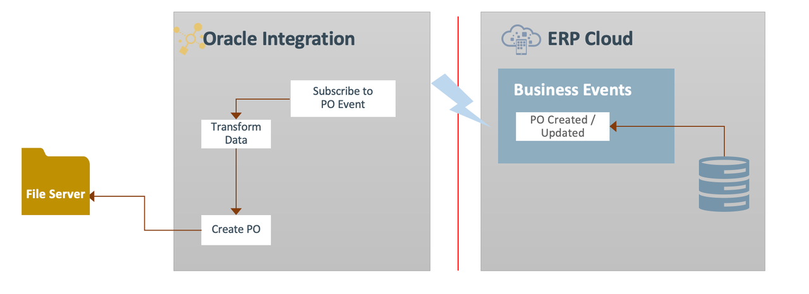

### Components and Flow Description

The diagram provides a high-level overview of an integration process between **ERP Cloud**, **Oracle Integration**, and **File Server**, with a focus on business events in the ERP Cloud application.

1. **ERP Cloud**:
     - The process begins when **ERP Cloud** triggers the integration. When a user creates a purchase order in ERP Cloud, it raises an event.

2. **Oracle Integration**:
     - **Trigger**: **ERP Cloud** initiates a trigger in Oracle Integration, which begins the integration process.
     - Oracle Integration retrieves the purchase order information, creates a file, and places it in File Server.

3. **File Server**:
     - The embedded **File Server** acts as the target system for this use case. Oracle Integration creates a file and places it in File Server.

Estimated Time: 20 minutes

### Objectives

In this lab, you will:

* Understand how to subscribe to business events in Oracle ERP Cloud by using the out-of-the-box ERP Cloud Adapter capabilities.
* Connect to File Server to write data records.

### Prerequisites

This lab assumes you have:

* All previous labs successfully completed.

## Task 1: Create the PO Event Integration

1. In the left navigation pane, click ***Projects***, then click the project that you created.
    You can skip this step if you are already in the project.
2. In the **Integrations** section, click ***Add***.
3. On the *Add integration* dialog, click ***Create***.
4. On the *Create integration* dialog, click ***Application***.
5. In the *Create integration* dialog, enter the following information:

    | **Element**        | **Value**          |
    | --- | ----------- |
    | Name         | `ERPPOEvent`       |
    | Description  | `ERP Event integration for LiveLabs` |

    Accept all other default values.

6. Click ***Create***.
7. Click ***Save*** to apply changes.

## Task 2: Define ERP Purchase Order (PO) Event trigger

Add ERP PO Event trigger to the empty integration canvas.

1. Click the ***+*** sign in the integration canvas.
2. Select the *ERP Cloud* connection that you created in the previous labs. This opens the Oracle ERP Cloud Endpoint Configuration Wizard.
3. On the **Basic Info** page,
     * for the **What do you want to call your endpoint?** element, enter ***POEvent***
     * Click ***Continue***.

4. On the **Request** page, select the following values:

    | **Element**        | **Value**          |
    | --- | ----------- |
    | Define the purpose of the trigger         | Receive Business Events raised within ERP Cloud       |
    | Business Event for Subscription  | Purchase Order Event |
    | Filter Expr for Purchase Order Event | [see code snippet below] |

    ```
    <copy>
    <xpathExpr xmlns:ns0="http://xmlns.oracle.com/apps/prc/po/editDocument/purchaseOrderServiceV2/" xmlns:ns2="http://xmlns.oracle.com/apps/prc/po/editDocument/purchaseOrderServiceV2/types/">$eventPayload/ns2:result/ns0:Value/ns0:PurchaseOrderLine/ns0:ItemDescription="Lan Cable"</xpathExpr>
    </copy>
    ```

    > **Tip:**
    1. If you are working on a shared ERP Cloud environment, it is recommended to use a distinct value in the filter expression under **ItemDescription**. For example `Lan Cable <your-initials>`. The value you enter is case sensitive. Write down this value for later use.
    2. The filter is optional; however, it lets you control which integration is triggered. This is useful when multiple integrations are subscribed to the PO event in the same ERP Cloud environment. Without the filter expression, all integrations subscribed to the PO event are triggered whenever that event occurs.

5. Click ***Continue***.
6. On the **Summary** page, click ***Finish***.
7. Click ***Save*** to persist changes.
8. Optionally, select the ***Horizontal*** layout and click ***Save*** to apply the changes.
    

## Task 3: Add the FTP Adapter as an Invoke Activity

Add the FTP Adapter invoke to the integration canvas.

1. Hover your cursor over the arrow in the integration canvas to display the ***+*** sign. Click the ***+*** sign and select the **File Server** Connection created in the previous lab.
    This opens the FTP Adapter Configuration Wizard.
2. On the **Basic Info** page, select the following values and click ***Continue***.

    | **Element**        | **Value**          |
    | --- | ----------- |
    | What do you want to call your endpoint? | `Write2FTP`       |

3. On the **Operation** page, select the following values and click ***Continue***.

    | **Element**        | **Value**          |
    | --- | ----------- |
    | Select Operation | Write File  |
    | Output Directory | /upload/users/```<<your oic usernumber>>```  |
    | File Name Pattern | PO%SEQ%.json  |

    Leave all other settings at their default values.
4. On the **Schema** page:
    * For **Do you want to specify the structure of the contents of the file?**, select ***Yes***.
    * Select ***Sample JSON document*** from the drop-down list.
    * Copy the following JSON content into a file and save it to your desktop as ***PurchaseOrder.json***.

    ```
    <copy>
    {
      "poHeaderId":"US164985",
      "orderNumber":"300000245105090",
      "procurementBUId":"300000046987012",
      "procurementBusinessUnit":"US1 Business Unit",
      "supplierId":"300000047414679",
      "supplier":"Dell Inc.",
      "soldToLegalEntity":"US1 Legal Entity"
    }
    </copy>
    ```

5. Click ***Continue***.
6. On the **File Contents - Definition** page, upload the **PurchaseOrder.json** file that you saved in the previous step.
7. Click ***Continue***, review the **Summary** page, then click ***Finish***.
8. Click ***Save***.

## Task 4: Map Data Between the ERP Trigger and FTP Invoke

Use the mapper to map fields from the source structure (POEvent) to the target structure (Write2FTP).

When we added the FTP invoke to the integration, a map icon was automatically added.

1. Hover your cursor over the **Map Write2FTP** Mapper icon, click on **...** and then select ***Edit***.
    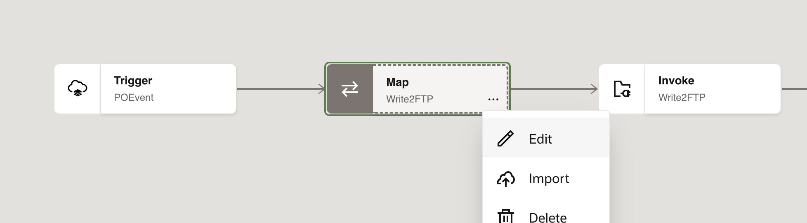

2. Use the mapper to drag element nodes from the source ERP Cloud structure to the target FTP structure.

    Expand the ***Source*** node:
        POEvent Request > Get Purchase Order Response > Result > 2nd <sequence> > Value
    Expand the ***Target*** node: Write2FTP Request > request-wrapper

    Complete the mapping as below:

    | **Source** *(ERP Cloud)*        | **Target** *(FTP)* |
    | --- | ----------- |
    | PO Header Id | PO Header Id |
    | Order Number | Order Number |
    | Procurement BU Id | Procurement BU Id |
    | Procurement Business Unit | Procurement Business Unit |
    | Sold To Legal Entity Id | Sold To Legal Entity |
    | supplierId | Supplier Id |
    | supplier | Supplier |

    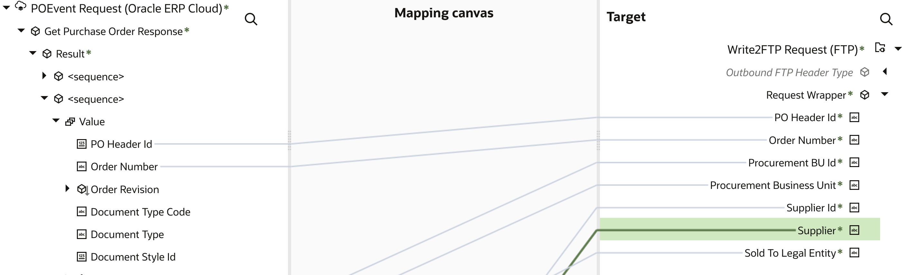

3. Click ***Validate***, then wait for the confirmation message **Map to Write2FTP successfully validated.**

4. Click ***&lt; (Go back)***

5. Click ***Save*** to persist changes.

## Task 5: Define Tracking Fields

1. Configure business identifiers to track fields in messages at runtime.

    > **Note:** If you have not yet configured at least one business identifier **Tracking Field** in your integration, then an error icon is displayed in the design canvas.
    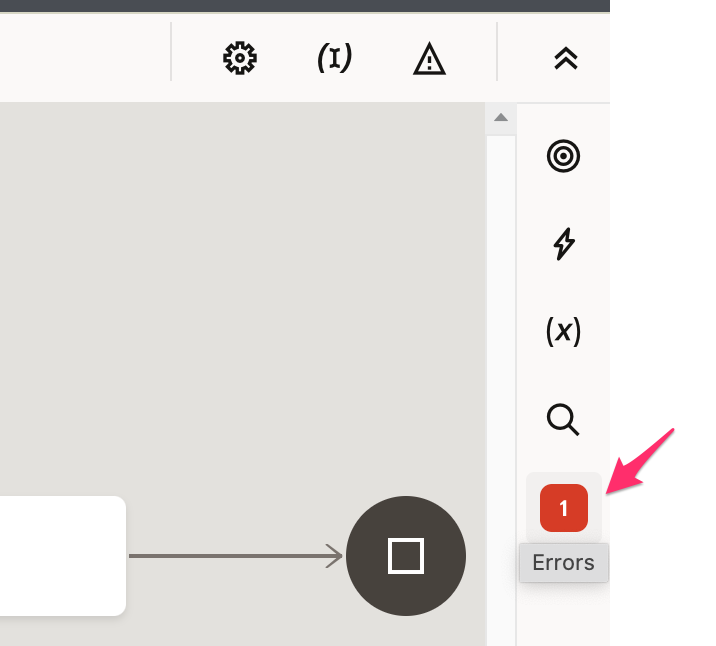

2. Click on the ***(I) Business Identifiers*** menu on the top right.
    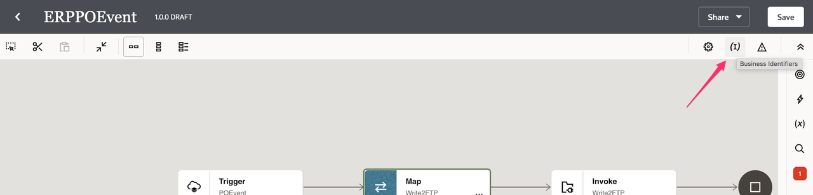

3. From the **Source** section, expand ***getPurchaseOrderResponse*** &gt; ***result***, click on 2nd sequence, expand ***Value***. Drag the ***PO Header Id*** and ***Order Number***  fields to the right side section:

    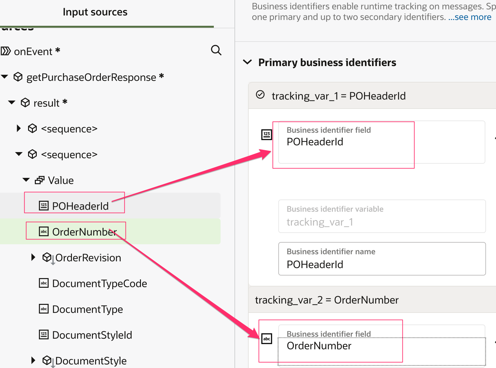

4. In the upper-right corner, click the ***(I) Business Identifiers*** menu, then click ***Save*** and ***&lt; (Go back)***.

## Task 6: Activate the integration

1. In the **Integrations** section, click **...** for the integration, then click the **Activate** icon.

2. On the **Activate Integration** dialog, select ***Audit*** as the tracing level, then click ***Activate***.
    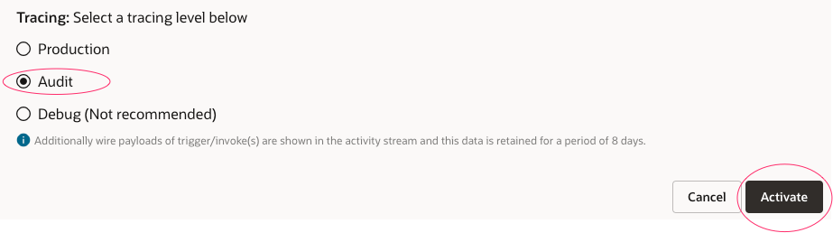

    The activation will complete in a few seconds. If activation is successful, a status message is displayed in the banner at the top of the page, and the status of the integration changes to **Active**.

## Task 7: Create Purchase Order in ERP Cloud

Access your ERP Cloud environment.

1. Log in with a user who has the roles and privileges required to create a PO.

2. Navigate to the ***Procurement*** tab.

3. Click ***Purchase Orders***.

4. In the **Overview** section, click the ***Tasks*** button on the right.
    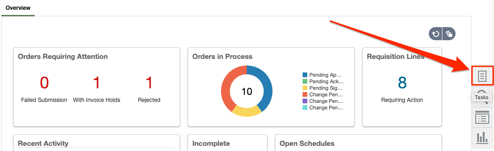

    This opens the Tasks menu.

5. Under the **Orders** section, select ***Create Order***.
    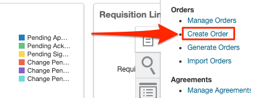

    The **Create Order** dialog is displayed.

6. Select **Procurement BU** as the **Requisitioning BU**, enter a valid value in the **Supplier** field (for example, `Dell Inc`), then select the corresponding supplier from the drop-down list.

    > **Tip:** You can also search for valid suppliers using the **Search** icon.

7. Click ***Create***.

    The **Edit Document (Purchase Order)** page is displayed.

8. On the **Lines** tab, click ***+*** to add a purchase order line.
      

9. Enter values in the following fields (sample values are provided), then click ***Save***.

      | **Field**        | **Value**          |
      | --- | ----------- |
      | Type | `Goods` |
      | Description | Enter the description value that you used as the filter expression when creating the integration flow. For example: `Lan Cable <your-initials>`|
      | Category Name | Search for and select Computer Supplies. |
      | Quantity | Enter a valid number, for example, `1`. |
      | UOM | `Ea` (Default) |
      | Base Price | Enter a valid number, for example, `1.0`. |

10. Click ***Submit*** to initiate the Purchase Order processing.

      After submitting the Purchase Order, a confirmation message should appear with the PO number. Make a note of the **PO number**

## Task 8: Validate Purchase Order status

After the PO is submitted, its initial status is **Pending Approval**. The PO Create event occurs when the status changes to **Open**.

1. In the **Overview** section, click the ***Tasks*** button on the right.

    This opens the **Tasks** menu.

2. Under the **Orders** section, click on ***Manage Orders***.

3. Click ***Search***. You should see the purchase orders for the current user, or enter the PO number to search for the purchase order that you created.

4. Look for your Purchase Order in the list with the PO number displayed in the previous task.

    > **Tip:** The last created PO should generally be the top one in the list.

5. Confirm that the PO status is **Open**. If it is, the business event has occurred.

    > **Note:** If the PO has another status, such as *Pending Approval*, wait a few minutes and refresh the page until the desired PO status appears.

## Task 9: Track message flow triggered by the PO Create Event

Use the Oracle Integration dashboard to view the data flow resulting from the Purchase Order creation event in ERP Cloud.

1. In the Projects pane, click **Observe &gt; Instances**.

2. Find the corresponding integration instance by matching the *PO Header Id* or *Order Number* from the purchase order in ERP Cloud. This information appears in the *Primary Identifier* or *Business Identifiers* columns.

    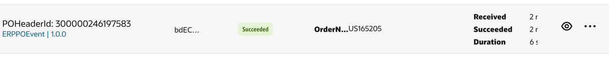

3. Click on your ***POHeaderId*** link to open the corresponding integration instance.

    The flow ran successfully if it is displayed with a green line.

    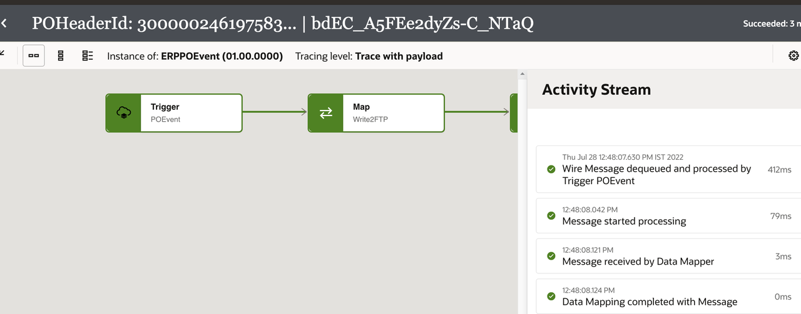

4. In the Activity Stream window, click the ***Message*** links to review the request and response messages.

5. Click ***&lt; (Go back)*** button after reviewing the Activity Stream.

## Task 10: Verify the PO Record on the FTP Server

Follow these steps to view the file on the FTP server.

1. In the Integration navigation pane, click ***Home*** &gt; ***Settings*** &gt; ***File Server*** &gt; ***Folders*** &gt; ***upload*** &gt; ***users*** &gt; ***Select your username*** &gt; You should see the **PO%.json** file.

    > **Note:** You cannot currently view the file contents in the Oracle Integration console. You can use a third-party file client to connect to this file server, download the file to your local machine, and view its contents.

**Congratulations!** You have learned how to subscribe to ERP Cloud business events by configuring the out-of-the-box ERP Cloud Adapter. The Adapter provides an intuitive interface for selecting events from the catalog, which greatly simplifies real-time synchronization.

You may now **proceed to the next lab**.

## Learn More

* [Getting Started with Oracle Integration 3](https://docs.oracle.com/en/cloud/paas/application-integration/index.html)

## Acknowledgements

* **Author** - Subhani Italapuram, Director Product Management, Oracle Integration
* **Contributors** - Kishore Katta, Director Product Management, Oracle Integration
* **Last Updated By/Date** - Subhani Italapuram, Aug 2026
