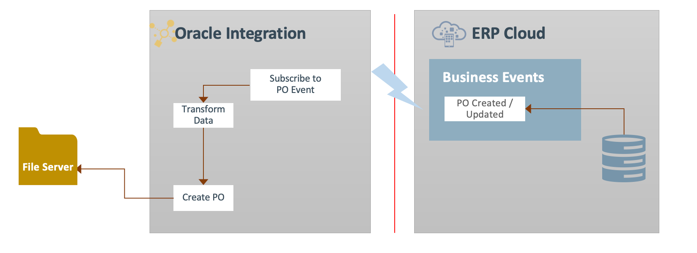

# Introduction

## About this Workshop

This workshop shows you how to design and develop a Real time Synchronization Usecase in Oracle Integration 3 integrating with the ERP cloud. Out of the box, ERP Cloud adapter helps an Integration developer to quickly consume Business Events in a secured way using various authentication schemes.

This Lab explores the use of Oracle Integration to subscribe to Oracle ERP Cloud Events and
push the relevant event information to downstream systems. As part of the lab you will build the following use case scenario:

1. You create and activate an integration that subscribes to an ERP Cloud Purchase Order (PO) event
2. You then create a PO in ERP Cloud and a PO event is triggered.
3. Your integration receives the PO event and pushes the data
    into the File Server.

    The following diagram shows the runtime interaction between the systems involved in this use case:
    

Estimated Time: 90 minutes

### Objectives

In this workshop, you will learn how to:

* Optional, Enable File Server.
* Optional, Configure File Server and connect with FTP client.
* Optional, Configure ERP Cloud for Oracle Integration
* Creating a Project
* Creating Connections
* Create a Real-Time Synchronization scenario using Business Events.
* Use Business Object to Integrate with ERP Cloud.

### Prerequisites

* Oracle Integration Instance.
* Access to the ERP Cloud environment
* A Chrome browser.

## Task 1: Leverage the ERP Cloud Adapter in Oracle Integration 3

Oracle Integration 3 provides native connectivity to Oracle and non-Oracle Software as a Service (SaaS) and On-premises applications, such as Oracle ERP Cloud, Oracle Service Cloud, HCM Cloud, Salesforce.com, Workday, EBS, SAP, NetSuite and so on. OIC adapters simplify connectivity by handling the underlying complexities of connecting to applications using industry-wide best practices

With the help of this cookbook series, you can design and implement ERP Cloud Integration patterns leveraging Oracle Integration 3 features and functionalities

As an Integration Developer, if you have a requirement to integrate an ERP Cloud application with any other SaaS or On-premise application, then this cookbook series helps you to go through the pre-requisite steps, common use cases, ERP Cloud adapter functional capabilities and several implementation considerations along with lab exercises to provide hands-on experience.

The Oracle ERP Cloud Adapter enables you to easily integrate on-premises or SaaS applications with Oracle ERP Cloud without having to know about the specific details involved in the integration.

The Oracle ERP Cloud Adapter provides the following key benefits:

* Provides declarative support for subscribing to business events raised by various modules in Oracle ERP Cloud and Oracle Supply Chain Management Cloud.
* Integrates easily with the Oracle ERP Cloud application’s WSDL file to produce a simplified, integration-centric WSDL.
* Generates automatic mapping to the selected business object, event subscription, or business (REST) API.
* Simplifies connection creation by automatically identifying the required service resources based on the Oracle ERP Cloud hostname you specify when creating a new connection on the **Connections** page.
* Supports several security policies for selection during Oracle ERP Cloud Adapter connection configuration:
  * Username Password Token With PGP Key Support
  * Username Password Token
  * OAuth Authorization Code Credentials
* Provides standard error handling capabilities.
* Enables you to upload a file in the Oracle ERP Cloud business tables.
* Enables you to upload files to Oracle WebCenter Content (Universal Content Manager) in encrypted or unencrypted format.

### Video Preview

[ERP Cloud Integration Patterns](youtube:nKXbh2ZPuMI)

You may now **proceed to the next lab**.

## Learn More

* [Getting Started with Oracle Integration 3](https://docs.oracle.com/en/cloud/paas/application-integration/index.html)
* [Using the Oracle ERP Cloud Adapter with Oracle Integration 3](https://docs.oracle.com/en/cloud/paas/application-integration/erp-adapter/index.html)

## Acknowledgements

* **Author** - Kishore Katta, Director Product Management, Oracle Integration
* **Contributors** - Subhani Italapuram, Director Product Management, Oracle Integration
* **Last Updated By/Date** - Subhani Italapuram, Nov 2024
