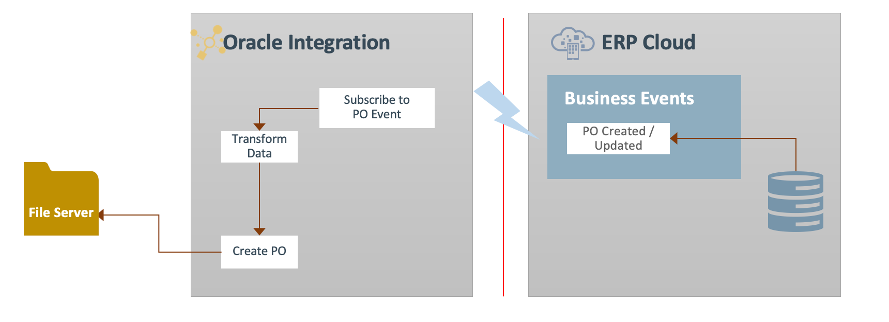

# ERP Cloud Real Time Synchronization

## Introduction

This workshop shows you how to design and develop a real-time synchronization use case in Oracle Integration 3 with ERP Cloud. The out-of-the-box ERP Cloud Adapter helps an integration developer quickly consume business events securely by using various authentication schemes.

This lab explores how to use Oracle Integration to subscribe to Oracle ERP Cloud events and push relevant event information to downstream systems. As part of the lab, you will build the following use case:

1. You create and activate an integration that subscribes to an ERP Cloud Purchase Order (PO) event
2. You then create a PO in ERP Cloud, which triggers a PO event.
3. Your integration receives the PO event and sends the data to File Server.

    The following diagram shows the runtime interaction between the systems involved in this use case:
    

Estimated Workshop Time: 80 minutes

### Objectives

In this workshop, you will learn how to:

* Optionally enable File Server.
* Optionally configure File Server and connect with an FTP client.
* Optionally configure ERP Cloud for Oracle Integration.
* Create a project.
* Create connections.
* Create a real-time synchronization scenario using business events.

### Prerequisites

* An Oracle Integration instance.
* Access to the ERP Cloud environment.
* Google Chrome.

## Task 1: Leverage the ERP Cloud Adapter in Oracle Integration 3

Oracle Integration 3 provides native connectivity to Oracle and non-Oracle Software as a Service (SaaS) and on-premises applications, such as Oracle ERP Cloud, Oracle Service Cloud, HCM Cloud, Salesforce.com, Workday, EBS, SAP, and NetSuite. Oracle Integration adapters simplify connectivity by handling the underlying complexities of connecting to applications using industry-standard best practices.

With this cookbook series, you can design and implement ERP Cloud integration patterns by using Oracle Integration 3 features and capabilities.

If you are an integration developer who needs to integrate ERP Cloud with another SaaS or on-premises application, this cookbook series guides you through the prerequisites, common use cases, ERP Cloud Adapter capabilities, and implementation considerations. It also includes lab exercises that provide hands-on experience.

The Oracle ERP Cloud Adapter enables you to easily integrate on-premises or SaaS applications with Oracle ERP Cloud without having to know about the specific details involved in the integration.

The Oracle ERP Cloud Adapter provides the following key benefits:

* Supports connecting to private resources that are in your virtual cloud network (VCN) private subnet with a private endpoint. Private endpoints do not support Oracle ERP Cloud business events. This type of connection does not use the connectivity agent.
* Integrates easily with the Oracle ERP Cloud application’s WSDL file to produce a simplified, integration-centric WSDL.
* Provides declarative support for subscribing to business events raised by various modules in Oracle ERP Cloud and Oracle Supply Chain Management Cloud.

* Generates an automatic mapping to the exposed business object, event subscription, or business REST API that you select during adapter configuration:

* Business object: Represents a self-contained business document that the integration can act on. An integration can send requests to create, update, or delete a record for that business object. It can also send requests to retrieve information about one or more records representing that business object.

* Event subscription: Represents an event document to which you subscribe. The event subscription is raised by the Oracle ERP Cloud application.

* You can also create custom business events in Oracle ERP Cloud that can be published and subscribed to with the Oracle ERP Cloud Adapter.

* Business (REST) API: Represents an Oracle Fusion Applications REST API resource.
* You can select parent business resources and their corresponding child business resources on the Operations page in the Adapter Endpoint Configuration Wizard. Support is provided in the invoke (outbound) direction. If you select a top-level resource on the Operations page, you can also select sub-resources on the Sub-Resources page.

* Simplified connection creation: Automatically identifies the required service catalog WSDL, optional event catalog URL, and optional interface catalog URL based on the Oracle ERP Cloud host name that you specify when creating a connection on the Connections page.
* Dynamically invokes a REST endpoint or URL at runtime without requiring you to configure an additional invoke connection or REST outbound details.

### Video Preview

[ERP Cloud Integration Patterns](youtube:nKXbh2ZPuMI)

You may now **proceed to the next lab**.

## Learn More

* [Getting Started with Oracle Integration 3](https://docs.oracle.com/en/cloud/paas/application-integration/index.html)
* [Using the Oracle ERP Cloud Adapter with Oracle Integration 3](https://docs.oracle.com/en/cloud/paas/application-integration/erp-adapter/index.html)

## Acknowledgements

* **Author** - Kishore Katta, Director Product Management, Oracle Integration
* **Contributors** - Subhani Italapuram, Director Product Management, Oracle Integration
* **Last Updated By/Date** - Subhani Italapuram, Aug 2026
