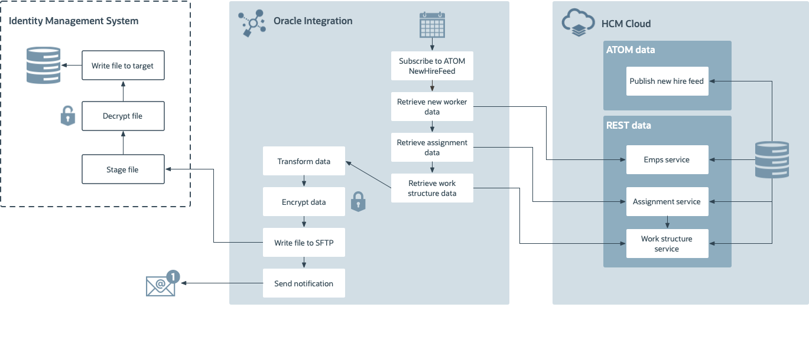

# Introduction

## About this Workshop

This workshop shows you how to design and develop a Real time Synchronization Usecase in Oracle Integration 3 integrating with the HCM cloud. Out of the box, The Oracle HCM Cloud Adapter enables you to create an integration with Oracle Human Capital Management (HCM) Cloud applications.
In this workshop, you would be experiencing ATOM Feeds feature which is available in the HCM cloud to extract the feeds and you would be leveraging HCM Cloud and FTP Adapters of Oracle Integration 3 to implement this usecase.

HCM Atom feeds provide notifications of Oracle Fusion Human Capital Management (HCM) events. When an event occurs in Oracle Fusion HCM, the corresponding Atom feed is delivered automatically to the Atom server. The feed contains details of the REST resource on which the event occurred. Subscribers who consume these Atom feeds use the REST resources to retrieve additional information about the resource.

The following diagram shows the interaction between the systems involved in this use case.
   

Estimated Time: 2 hours

### Objectives

In this workshop, you will learn how to:

* Configure HCM Cloud Adapter.
* Configure FTP Adapter
* Create a Real-Time Synchronization scenario using ATOM feeds

### Prerequisites

* An Oracle Free Tier or Paid Cloud Account Tenancy
* Oracle Integration Instance provisioned in OCI.
* Access to HCM Cloud Environment

You may now **proceed to the next lab**.

## Learn More

* [Getting Started with Oracle Integration 3](https://docs.oracle.com/en/cloud/paas/application-integration/index.html)
* [Using the Oracle HCM Cloud Adapter with Oracle Integration 3](https://docs.oracle.com/en/cloud/paas/application-integration/hcm-adapter/index.html)

## Acknowledgements

* **Author** - Subhani Italapuram, Product Management, Oracle Integration
* **Contributors** - Kishore Katta, Product Management, Oracle Integration
* **Last Updated By/Date** - Kishore Katta, November 2024
