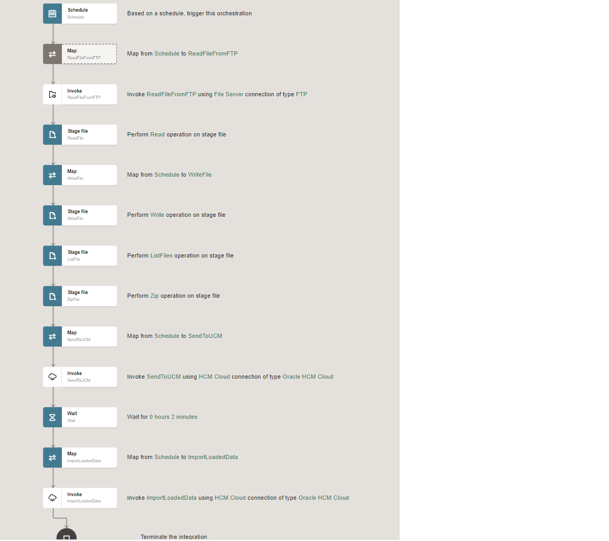

# Create Pending Worker Integration Flow

## Introduction

Pending Workers are imported to HCM in bulk using HCM Data Loader (HDL). In this use case, a new hires extract has been pseudo generated as a structured XML file to simulate generic external system export. Extracted file has been sent to the FTP server.

OIC 3 will trigger a scheduled integration to retrieve this file. Data from the file is imported into a structured schema. Using OIC 3 mapping capabilities the data is transformed into HCM Data Loader compatible file format with native schema definition and subsequently zipped, sent to UCM, and imported using HDL.

This lab walks you through the steps to create Integration flow.

The following diagram shows the interaction between the systems involved in this use case.
    

Estimated Time: 40 minutes

### Objectives

In this lab, you will:

* Read a file that contains new hired employees from an external FTP server.
* Transform and format the data to generate an DAT file that can be used in HCM.
* Import the DAT file to HCM Cloud using the HCM Data Loader, to create pending
  workers.

### Prerequisites

This lab assumes you have:

* All previous labs successfully completed.
* Download the [Live Labs](https://objectstorage.us-phoenix-1.oraclecloud.com/p/ionECcn9REuLomlkD0k0yxEqnRt2MqMX9rL21K4zBaSAhQwbN3H5MMNQ5PXza4mI/n/oicpm/b/oiclivelabs/o/oic3/hcm-cloud/bulk-import/bulk-import.zip) related files and unzip. The files downloaded will be referred in the lab instructions.


## Task 1: Import Pending Worker Integration Flow
1.  In the left Navigation pane, click ***Design*** &gt; ***Integrations***.

2.  On the **Integrations page**, click ***Import***.

3.  Download the [Live labs](https://objectstorage.us-phoenix-1.oraclecloud.com/p/ionECcn9REuLomlkD0k0yxEqnRt2MqMX9rL21K4zBaSAhQwbN3H5MMNQ5PXza4mI/n/oicpm/b/oiclivelabs/o/oic3/hcm-cloud/bulk-import/bulk-import.zip) file and unzip

4.  On the **Import Integration** dialog, select the downloaded integration archive (.iar), and select ***Import***. Notice that the imported integration appears in the **Integrations** list.

5.  Hover over the integration, then click ***Actions*** icon and select ***Configure***.

6.  The **Configuration Editor** page shows two connections. Replace the connections with the connections created in [Lab 5](?lab=create-connections)

## Task 2: Understand HCM Data Loader DAT Files
Use the NXSD native schema to generate a DAT file compatible with the HCM Data Loader in an integration.

The NXSD schema defines the structure of the output file (fields) and the formatting of the data.

1.  Download the [Live lab](https://objectstorage.us-phoenix-1.oraclecloud.com/p/ionECcn9REuLomlkD0k0yxEqnRt2MqMX9rL21K4zBaSAhQwbN3H5MMNQ5PXza4mI/n/oicpm/b/oiclivelabs/o/oic3/hcm-cloud/bulk-import/bulk-import.zip) files and unzip if not already done.

2.  Open the file *worker-hdl.nxsd* in a text editor.

3.  Locate the **schema** element at the beginning of the file.

This element defines the global schema attributes. You must include a similar **schema** element in the NXSD schemas you build for HDL objects. You will need to change the object names.
        ```
        <schema xmlns="http://www.w3.org/2001/XMLSchema"
                xmlns:nxsd="http://xmlns.oracle.com/pcbpel/nxsd"
                xmlns:tns="http://supoc.oracle.com/WorkerData"
                targetNamespace="http://supoc.oracle.com/WorkerData"
                elementFormDefault="qualified"
                attributeFormDefault="unqualified"
                nxsd:stream="chars"
                nxsd:version="NXSD"
                nxsd:encoding="UTF8"
                nxsd:encodeLineTerminators="false">
        ```

4.   Locate the **WorkerData** element.
This element defines the set of objects and child objects required to load this business object to the HCM Data Loader.

The following elements are specified for each of the objects in the NXSD schema:
- **ObjectLabel** element: inserts a **METADATA** line in the **DAT** file.
  For example: **WorkerLabel**
- **Object** element: inserts a **MERGE** line in the **DAT** file.
  For example: **Worker**
The format for the lines is specified in the **nxsd:startsWidth** attribute with the values **METADATA** for the object label and **MERGE** for the object.
        ```
        <element name="WorkerData">
            <complexType>
                <choice maxOccurs="unbounded" minOccurs="0">
                     <element ref="tns:WorkerLabel" minOccurs="0" maxOccurs="unbounded" nxsd:startsWith="METADATA|Worker|" />
                     <element ref="tns:Worker" minOccurs="0" maxOccurs="unbounded" nxsd:startsWith="MERGE|Worker|" />
                     <element ref="tns:PersonLegislativeDataLabel" minOccurs="0" maxOccurs="unbounded" nxsd:startsWith="METADATA|PersonLegislativeData|" />
                     <element ref="tns:PersonLegislativeData" minOccurs="0" maxOccurs="unbounded" nxsd:startsWith="MERGE|PersonLegislativeData|" />
                     <element ref="tns:PersonNameLabel" minOccurs="0" maxOccurs="unbounded" nxsd:startsWith="METADATA|PersonName|" />
                     <element ref="tns:PersonName" minOccurs="0" maxOccurs="unbounded" nxsd:startsWith="MERGE|PersonName|" />
                     <element ref="tns:PersonEmailLabel" minOccurs="0" maxOccurs="unbounded" nxsd:startsWith="METADATA|PersonEmail|" />
                     <element ref="tns:PersonEmail" minOccurs="0" maxOccurs="unbounded" nxsd:startsWith="MERGE|PersonEmail|" />
                     <element ref="tns:PersonAddressLabel" minOccurs="0" maxOccurs="unbounded" nxsd:startsWith="METADATA|PersonAddress|" />
                     <element ref="tns:PersonAddress" minOccurs="0" maxOccurs="unbounded" nxsd:startsWith="MERGE|PersonAddress|" />
                     <element ref="tns:PersonPhoneLabel" minOccurs="0" maxOccurs="unbounded" nxsd:startsWith="METADATA|PersonPhone|" />
                     <element ref="tns:PersonPhone" minOccurs="0" maxOccurs="unbounded" nxsd:startsWith="MERGE|PersonPhone|" />
                     <element ref="tns:PersonNationalIdentifierLabel" minOccurs="0" maxOccurs="unbounded" nxsd:startsWith="METADATA|PersonNationalIdentifier|" />
                     <element ref="tns:PersonNationalIdentifier" minOccurs="0" maxOccurs="unbounded" nxsd:startsWith="MERGE|PersonNationalIdentifier|" />
                     <element ref="tns:WorkRelationshipLabel" minOccurs="0" maxOccurs="unbounded" nxsd:startsWith="METADATA|WorkRelationship|" />
                     <element ref="tns:WorkRelationship" minOccurs="0" maxOccurs="unbounded" nxsd:startsWith="MERGE|WorkRelationship|" />
                     <element ref="tns:WorkTermsLabel" minOccurs="0" maxOccurs="unbounded" nxsd:startsWith="METADATA|WorkTerms|" />
                     <element ref="tns:WorkTerms" minOccurs="0" maxOccurs="unbounded" nxsd:startsWith="MERGE|WorkTerms|" />
                     <element ref="tns:AssignmentLabel" minOccurs="0" maxOccurs="unbounded" nxsd:startsWith="METADATA|Assignment|" />
                     <element ref="tns:Assignment" minOccurs="0" maxOccurs="unbounded" nxsd:startsWith="MERGE|Assignment|" />
                </choice>
            </complexType>
        </element>
        ```
5.  Find the **WokerLabel** element.
This element adds the name of the fields to the **METADATA** line. Each object requires its corresponding label element.
        ```
        <element name="WorkerLabel">
            <complexType>
                <sequence>
                    <element name="EffectiveStartDateLabel" type="string" nxsd:style="terminated" nxsd:terminatedBy="|" />
                    <element name="EffectiveEndDateLabel" type="string" nxsd:style="terminated" nxsd:terminatedBy="|" />
                    <element name="StartDateLabel" type="string" nxsd:style="terminated" nxsd:terminatedBy="|" />
                    <element name="CategoryCodeLabel" type="string" nxsd:style="terminated" nxsd:terminatedBy="|" />
                    <element name="ActionCodeLabel" type="string" nxsd:style="terminated" nxsd:terminatedBy="|" />
                    <element name="DateOfBirthLabel" type="string" nxsd:style="terminated" nxsd:terminatedBy="|" />
                    <element name="SourceSystemOwnerLabel" type="string" nxsd:style="terminated" nxsd:terminatedBy="|" />
                    <element name="SourceSystemIdLabel" type="string" nxsd:style="terminated" nxsd:terminatedBy="|" />
                    <element name="ApplicantNumberLabel" type="string" nxsd:style="terminated" nxsd:terminatedBy="${eol}" />
                </sequence>
            </complexType>
        </element>
        ```

6.  Locate the **Worker** element.
This element defines the fields required by the HCM Data Loader **Worker** object. The format is defined in the **nxsd:terminatedBy** attribute which adds a separator at the end of each line.
        ```
        <element name="Worker">
            <complexType>
                <sequence>
                    <element name="EffectiveStartDate" type="string" nxsd:style="terminated" nxsd:terminatedBy="|" />
                    <element name="EffectiveEndDate" type="string" nxsd:style="terminated" nxsd:terminatedBy="|" />
                    <element name="StartDate" type="string" nxsd:style="terminated" nxsd:terminatedBy="|" />
                    <element name="CategoryCode" type="string" nxsd:style="terminated" nxsd:terminatedBy="|" />
                    <element name="ActionCode" type="string" nxsd:style="terminated" nxsd:terminatedBy="|" />
                    <element name="DateOfBirth" type="string" nxsd:style="terminated" nxsd:terminatedBy="|" />
                    <element name="SourceSystemOwner" type="string" nxsd:style="terminated" nxsd:terminatedBy="|" />
                    <element name="SourceSystemId" type="string" nxsd:style="terminated" nxsd:terminatedBy="|" />
                    <element name="ApplicantNumber" type="string" nxsd:style="terminated" nxsd:terminatedBy="${eol}" />
                </sequence>
            </complexType>
        </element>
        ```

7.  Locate the **PersonName** element
This element defines the fields required by HCM Data Loader **Person** object. The format is defined in the **nxsd:terminatedBy** attribute which adds a separator at the end of each line.
        ```
        <element name="PersonName">
            <complexType>
                <sequence>
                    <element name="PersonIdSourceSystemId" type="string" nxsd:style="terminated" nxsd:terminatedBy="|" />
                    <element name="EffectiveStartDate" type="string" nxsd:style="terminated" nxsd:terminatedBy="|" />
                    <element name="EffectiveEndDate" type="string" nxsd:style="terminated" nxsd:terminatedBy="|" />
                    <element name="LegislationCode" type="string" nxsd:style="terminated" nxsd:terminatedBy="|" />
                    <element name="NameType" type="string" nxsd:style="terminated" nxsd:terminatedBy="|" />
                    <element name="FirstName" type="string" nxsd:style="terminated" nxsd:terminatedBy="|" />
                    <element name="MiddleNames" type="string" nxsd:style="terminated" nxsd:terminatedBy="|" />
                    <element name="LastName" type="string" nxsd:style="terminated" nxsd:terminatedBy="|" />
                    <element name="SourceSystemOwner" type="string" nxsd:style="terminated" nxsd:terminatedBy="|" />
                    <element name="SourceSystemId" type="string" nxsd:style="terminated" nxsd:terminatedBy="${eol}" />
                </sequence>
            </complexType>
        </element>
        ```

## Task 3: Understand the Integration

From the list of Integrations page *click* the integration named **Import Pending Worker**
The following integration flow appears:


This table briefly describes the different activities in the integration. For more details, you can open the integration and click each of the activities.
**Step** | **Type** | **Description**
:---:|:---:|:---:
Schedule | Schedule | Start of the integration. This step is read-only.                             
**ReadFileFromFTP** | **FTP Adapter: Download File** |Reads the file from an FTP server. **In this lab, you will edit this step to specify the FTP directory where you uploaded the file.**                            
ReadFile | Stage File: Read | Reads the file retrieved from the FTP server and loads the data to a schema. This step is read-only.                        
Map to WriteFile | Map | Maps and transforms the data to generate the HCM Data Loader file.This step is read-only.                             
WriteFile | Stage File: Write Files | Write the result of the data mapping and transformation to a virtual directory in Oracle Integration. This step is read-only.                            
ListFile | Stage File: List Files | Returns a list of files that match the file name pattern of the virtual directory in Oracle Integration.
ZipFile | Stage File: Zip Files | Creates a zip file that contains the worker.dat file that was created in the  Write File step.
Map to SendToUCM | Map | Maps the UCM properties required to check in the file to UCM.
SendToUCM | Oracle HCM Cloud Endpoint | Checks in the file to UCM using the HCM adapter.
Wait | Wait | Waits for 2 minutes.
Map to ImportLoadData | Map | Maps the ContentID that was successfully uploaded to UCM.
ImportLoadData | Stop | Uploads the file to HCM Cloud using the UCM ContentId
Stop | Stop | The end of the integration.
{: title="HDL Import Integration Flow Activities"}

## Task 4: Edit the ReadFileFromFTP Activity

1.  Download the [Live labs](https://objectstorage.us-phoenix-1.oraclecloud.com/p/ionECcn9REuLomlkD0k0yxEqnRt2MqMX9rL21K4zBaSAhQwbN3H5MMNQ5PXza4mI/n/oicpm/b/oiclivelabs/o/oic3/hcm-cloud/bulk-import/bulk-import.zip) file and unzip if not already done

2.  Using an FTP Client of your choice, connect to FTP Server with the information from [Lab3 Setup](?lab=setup)

3.  Copy the *persons.xml* (Refer Prerequisites)file to the directory ***/upload/users/```<<your oic usernumber>>```***

4.  Click on *Edit* if the Integration Flow if not opened already. Select the *ReadFileFromFTP* activity. Select the three dots and Click on *Edit*.

5.  In the FTP Wizard navigate to the **Operations** step. In the Input Directory field, enter ***/upload/users/```<<your oic usernumber>>```***. Click *Next*.
The Schema page appears. Select *No* to as we don't want to specify the structure for the content of the file.

6.  Click *Next*. Review the summary and click *Finish*.


## Task 5: Understand the Data Mapping

1.  Select the **Map To WriteFile** activity.

2.  Click *Edit*

    The **Map** page appears.

    The **Sources** section shows all the fields available for mapping.

    The **Target** section shows the WriteFile hierarchy.

    This data mapping is a representation of the **Worker.dat** file.


3.  Click *Go back*

## Task 6: Edit the Zip File Action

1.  Select the **Zip File** Activity. Click *Edit*

2.  In the **Basic Info** page Click *Next*. The **Configure Operation** page appears

3.  In the **Specify File Name** Value box edit the expression to change the file name if required. This will help you identify your file in UCM and the HCM DataLoader

4.  Click *Next* and Review the summary and Click *Finish*


## Task 7: Define the Tracking Fields

Tracking fields specify a unique value to monitor your integration instance.

1.  On the Integration canvas, Click *(I)* **Business Identifiers**.
    
    The **Business Identifiers** for Tracking dialog appears.

2.  From the **Source** section, select *startTime*. Drag and drop the in the **Business identifier field** expression box under tracking_var_1.

3.  On the Integration canvas, click on main canvas(designer page),  click *Save*, and then click *Go back*

## Task 8: Activate the Integration Flow

1. On the **Integrations** page, click on the *Activate* icon of **Import Pending Workers** Integration.

2. On the **Activate Integration** dialog, select **a tracing level** to *Audit*

3. Click *Activate*.

    The activation will be complete in a few seconds. If activation is successful, a status message is displayed in the banner at the top of the page, and the status of the integration changes to **Active**.

## Task 9: Run the Integration Flow

Refresh your page after few seconds.
1. Select **Import Pending Workers**,  Click on **...(Actions)** menu and Click on *Run*

2. Click on *Run*

3. Click the link which appears on top to track the instance.
  The track instance page appears. The Integration state should be processing or successful.
  OR you can also track by clicking on *Home*, *Observability* and *Instances*

4. Wait for your integration to complete.

The wait activity is set to 2 minutes so you will have to wait at least 2 minutes.
Once integration flow is completed Click on the Integration instance primary identifier link.

The flow for your instance appears. The flow is colored in green to indicate that it ran successfully.

  

Click on the Activity Stream and expand **Invoke ImportLoadedData** activity. Make a note of the **Request Id** in the response received from HDL Job.

  

## Task 10: Verify the Data in HCM

1.  Sign in to HCM Cloud with the credentials used for HCM Cloud connection.

2.  Click the **Navigation Menu**

3.  Expand **My Client Groups** and then click **Data Exchange**.

4.  In the **HCM Data Loader** section, click **Import and Load Data**.
    The Data Sets section shows the file you uploaded.

5.  Click the **Navigation Menu** icon

6.  Expand **My Client Groups** and then click **Person Management**

7.  In the Name field enter Person Name provided in the persons.xml files

8.  Click Search. The Search Results section shows the data for the Person. This
    confirms that the data was imported to your HCM instance.

    **Congratulations**! You've configured and run an integration to retrieve a file from File Server, transform it to an HDL format, and finally import pending workers to HCM Cloud.

## Task 11: Invoking OIC3 Factory API (Bonus Lab)

In this section you will learn how to clone an integration using the Factory API. Before you can use the REST API with OAuth in Oracle Integration, you need to register your Oracle Integration instance as a trusted application in Oracle Identity Cloud Service.

**Configure a Confidential Application in IDCS to Authenticate with OAuth**

You need Identity Domain Administrator or Application Administrator credentials to perform this task. We will create a confidential application in IDCS for client credentials grant type.

1.  Access your Oracle Identity Cloud Service instance.

2.  Add a Confidential application for your Oracle Integration instance.
    - In Oracle Identity Cloud Service, from the menu, click *Applications*, then *Add*.
    - Select *Confidential Application* as the type of application.
    - Enter an application name, then click *Next*.
    - Select *Configure this application as a client now* .
    - On the Authorization page, select the following fields:
        - Select *Client Credentials* from the **Allowed Grant Types** list
        - Select **client type** as *Confidential*
        - In the **allowed operations** select *On behalf of*
        - Select *Specific* in the **Authorized Resources** area of the **Token Issuance Policy** section
        - Click *Add Scope* under the **Resources** section
        - Find the Oracle Integration application, and click *>*
        - Add the scope containing **urn:opc:resource:consumer::all** and **/ic/api/**
        
        - Save your changes
    - Click through the remaining wizard pages without making changes and save the application.
    - *Activate* the application for use
    - Make a note of below
        - ClientId
        - Secret
        - Scope (that ends with urn:opc:resource:consumer::all)

3.  Add roles to the client application
    - Go to the **Application Roles** tab of the Oracle Identity Cloud Service application.
    - Select *Assign Applications* for the ServiceAdministrator role
      

**Generate Access Token from Postman**

1.  Validate client application and generate access token
    - Use the pre-req information (clientid,scret and scope) to generate the access token using this REST api in Postman
        - Create a new request in Postman
        - Provide the OAUTH token Endpoint: https://&lt;idcs_host&gt;/oauth2/v1/token
        - Under **Authorization tab**
            - Use ClientId as username
            - Use Client secret as password
        - Under **body** tab, select *x-www-form-urlencoded* radio button
            - Enter KEY = grant\_type and VALUE = client\_credentials
            - Enter KEY = scope and VALUE = <scope> from pre-requisites section
              
        - Click Send and copy the access_token from the response body (ensure to copy only the data between quotes)

**Invoke OIC3 Factory API using access token**

1.  Open another tab in Postman and enter the factory REST API to Clone the Integration.
    Provide Verb as POST and endpoint: https://design.integration.&lt;region&gt;.ocp.oraclecloud.com/ic/api/integration/v1/integrations/IMPORT\_PENDING\_WORKER|02.00.0000/clone?integrationInstance=&lt;integration_instance&gt;
    >**Note:** Refer OIC Console url for integrationInstance Name

2.  Under the **Authorization** tab
    - Select Type = Bearer token
    - Paste the copied access token into the token field
    - Provide the below json body
    ```
    <copy>{
    "code": "CLONEDPENDINGWORKER",
    "version": "01.00.0000",
    "name": "ClonedPendingWorker",
    "description": "This integration imports pending workers"
    }</copy>
    ```

3.  Click *Send* button to invoke the REST API. Verify the new cloned integration appear in the  OIC 3 integration list page.


    **Congratulations**! You've learnt how to use OIC 3 REST API using Client Credentials OAuth2.0 grant type.

## Learn More

* [Getting Started with Oracle Integration 3](https://docs.oracle.com/en/cloud/paas/application-integration/index.html)
* [Using the Oracle HCM Cloud Adapter with Oracle Integration 3](https://docs.oracle.com/en/cloud/paas/application-integration/hcm-adapter/index.html)
* [REST API for Oracle Integration 3](https://docs.oracle.com/en/cloud/paas/application-integration/rest-api/op-ic-api-integration-v1-integrations-id-clone-post.html)

## Acknowledgements

* **Author** - Kishore Katta, Director Product Management, Oracle Integration
* **Contributors** - Subhani Italapuram, Director Product Management, Oracle Integration
* **Last Updated By/Date** - Subhani Italapuram, Oct 2023
