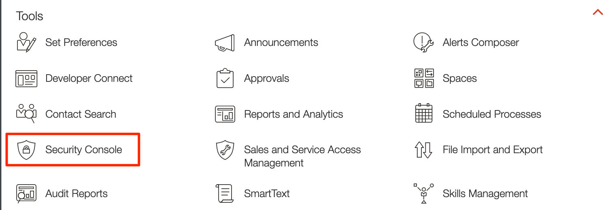
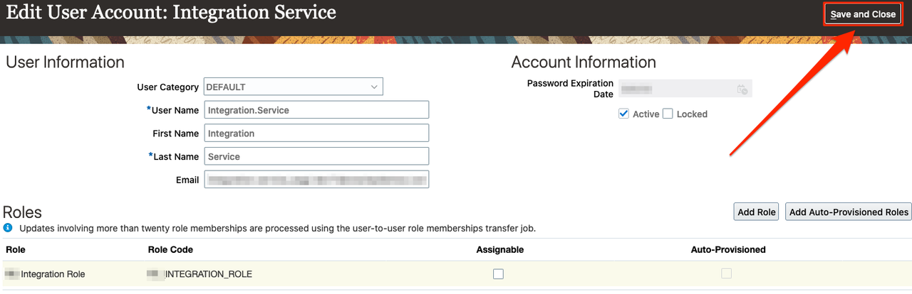

# Configure HCM Cloud for Oracle Integration 3

## Introduction
To use the Oracle HCM Cloud Adapter in an integration, you must assign specific roles to an integration user.

> **Note:** This Lab is required **only** if your Oracle HCM environment is not yet configured to work with Oracle Integration 3

Estimated Time: 15 minutes

### Objectives
* Create a custom Integration role
* Create an Integration Service user with custom role

### Prerequisites
This lab assumes you have
* An Oracle HCM Cloud account
* Access to an HCM Cloud user account with privileges to assign specific roles to an integration user.

## Task 1: Create a custom Integration role

1. Login to Oracle HCM Cloud

2. Select **Navigator** &gt; **Tools** &gt; **Security Console**.
    

3. In the *Roles* tab, click **Create Role**.

4. In the *Create Role* Canvas, enter the following information:
    | **Field**  | **Value** |
    |---|---|
    |Role Name | `<your-role-name>` |
    |Role Code | `<your-role-code>` |
    |Role Category | (Default) |
    |    

5. Click **Next**.

6. Add the following Roles and Privileges to the custom role:

    | Grant Type | Name | Code |
    | ---- | ---- | ---- |
    | Role | Integration Specialist | FND\_INTEGRATION\_SPECIALIST\_JOB |
    | Role | Attachments User | AttachmentsUser |
    | Role | SOA Operator | SOAOperator |
    |

7. In the *Summary* screen, click **Save and Close**.

## Task 2: Create an Integration Service user with custom role

1. In the *Security Console*, select **Users** tab and click **Add User Account**.

2.  In the *Add User Account* Canvas, enter the following information:

    | **Field**  | **Value** |
    |---|---|
    |User Category | (Default) |
    |First Name | `Integration` |
    |Last Name	 | `Service` |
    |Email | `<your-email>` (can be mock)|
    |User Name | &lt;auto generated&gt; |
    |Password | `<your-password>` |
    |

3. Click **Add Role**.

4. Search for the custom role created earlier by entering at least the first 3 characters of the role name.

5. Select the role from the resulting list, then click **Add Role Membership**.

6. Click **Done** to close the Role Membership dialog.

7. In the *User Information* canvas, click **Save and Close**.
    

You may now **proceed to the next lab**.

## Learn More
* [Using the Oracle HCM Cloud Adapter with Oracle Integration 3](https://docs.oracle.com/en/cloud/paas/application-integration/hcm-adapter/index.html)

## Acknowledgements
* **Author** - Subhani Italapuram, Product Management, Oracle Integration
* **Last Updated By/Date** - Subhani Italapuram, Feb 2023
