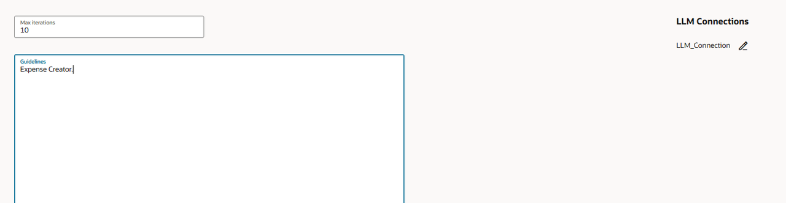

# Build OIC AI Agent

## Introduction

In this section, you'll create the **Expense Agent** within Oracle Integration. This agent will orchestrate your four tools to conduct intelligent, automated utilization reviews.

Estimated Time: 10 minutes

### Thinking Patterns

**Thinking patterns define how the AI agent reasons about problems.**

OIC provides two built-in patterns:

**1. ReAct (Reasoning and Action)**
    - AI agent alternates between thinking and doing
    - Pattern: Think → Act → Observe → Think → Act → ...
    - Best for: Tasks requiring iterative problem-solving and adaptation

**2. Plan and Execute**
    - AI agent creates complete plan first, then executes steps
    - Pattern: Think (create plan) → Execute step 1 → Execute step 2 → ... → Observe results
    - Best for: Well-defined workflows with predetermined steps

***For This Lab we will use ReAct Pattern***

### LLM Connection

- The thinking pattern requires connection to a Large Language Model that powers the agent's reasoning.

- The AI agent will use an LLM connection.

### Agentic AI Tools

- Your four registered tools from previous labs become the agent's action capabilities.

- The agent decides which tools to invoke based on the data.

### Objectives

In this lab you will learn:

- How to Configure the Agentic AI Thinking Pattern.
- How to Configure the Prompt templates
- How to Build an AI Agent in OIC
- How to configure Tools in an Agent

### Prerequisites

- All the previous labs completed successfully.
- All Integrations in Active Status
- All Tools Registered

## Task 1: Configure the Agentic AI Thinking Pattern

1. In the left navigation pane, select **Projects**.

2. Select the **Intelligent Expense Automation with Agentic AI** project that you created.
3. In the left navigation pane, select **AI Agents** icon.
4. In the **Agent patterns** card, click *Add*. The Create pattern dialog is displayed.
5. In **Create pattern**, configure required fields for your pattern:
    - **Name:** Name for the thinking pattern. For our lab, enter the name **Thinking pattern**.
    - **Identifier:** Auto Populated
    - **Pattern recipe:** Value sent to the LLM as a system prompt to define how the agent reasons. Select the *ReAct* pattern for this lab.
6. Click Create. The Pattern details page is displayed.
7. Configure the Pattern Guidelines and the LLM Connection.
    - Leave the Max Iterations and Temperature as defaults.
    - In the Guidelines box, enter the following guidelines for the ReAct Thinking pattern.

    ```
        <copy>
        Expense Creator.
        </copy>
    ```

    

    - Click **Save**.
    - Under LLM Connections, click **Edit** icon to configure the LLM connection. A new LLM connection is created and is displayed.
    - Configure connection information for your LLM.
        - **Base URL:** URL to connect to your LLM. For example: https://api.openai.com
        - **Model:** Model to use for your AI agent. For example: gpt-4o-mini
        - **API Key Based Authentication:** Specify your Open AI API key to connect to the LLM.
    - Click **Test** to test that your connection works, then click **Save**.
    When you save, Oracle Integration creates an integration that implements the ReAct pattern called ReAct Pattern Intg. This system-created integration is automatically activated for the agent when you activate the Agent Pattern.
8. Click **Back** < to return to Pattern Details page
9. Click **Back** < to return to AI Agents page
10. Activate the thinking pattern. The pattern must have the status Active before you can specify it in your agent. In the **Agent patterns** section, next to **Thinking pattern**, click Actions  icon, and select **Activate**.

## Task 2: Add and Configure the *Prompt templates*

1. In the *Prompt templates* card, click **Add** . The Create prompt template panel is displayed.
2. Enter the name as *Read the expense receipt* and click **Create**
3. Enter the prompt as given below and click on **Save**

    ```
        <copy>
        Process this expense receipt. File: {{fileName}} and Directory: {{directory}}
        </copy>
    ```

## Task 3: Add and Configure the AI Agent

1. In the AI Agents card, click **Add** . The Create agent panel is displayed.

2. Configure required fields for your agent and Click **Create**
    - Name: Name for your AI Agent. Example: Expense Agent
    - Identifier: Auto generated
    - Thinking Pattern: Select the **Thinking pattern** created in the previous Task.

3. Configure your Agent Role, Guidelines and Tools.

    a.  **Role:** You are an expense report analyst.

    > **Note:**  Role is Sent to the LLM as part of the system prompt. We need to specify a clear role for your agent so that the LLM knows the purpose of your agent.

    b.  Copy Paste the below guidelines. **Guidelines** are sent to the LLM as part of the system prompt.

    ```
    <copy>
    1. Read the receipt based on the details provided by the user such as directory and receipt name.
    2. Based on the expense data, check if approval required or not.
    3. If "APPROVAL_NOT_REQUIRED", then create the expense in Oracle HCM and stop the process.
    4. If "APPROVAL_REQUIRED", then proceed with raising a request for human review of this expense without asking user.
    5. Finally, Create an expense in Oracle HCM if the expense is approved by the reviewer else don't do anything.
    </copy>
    ```
    c. In **Tools**, provide tools for the AI agent. Tools are integrations that have been registered as agentic AI tools and provide external connectivity for the AI agent. You already created the tool when you registered the integration as a tool in the previous Section. Click **+** and Add the following Tools, can select all the tools at a time.
      - Read Expense Receipt
      - Approval Required
      - HITL-Raise Approval Request
      - Create Expense Oracle HCM
      
    d. In **Prompt templates**, Click **+** and add the prompt template *Read the expense receipt*
4. Click on **Save**
5. Navigate **Back <** to the AI Agents Page.
6. Activate the AI Agent.
    a.  In the Agents card, find the agent to activate. Click **Actions ...**, and Select *Activate*.

    You may now **proceed to the next lab**.

## Learn More

* [Using OIC Agentic AI](https://docs.oracle.com/en/cloud/paas/application-integration/aiagents/welcome-agentic-ai.html)

## Acknowledgements
- **Author** - Subhani Italapuram, Technical Director, Partner Enablement, Oracle Integration
- **Last Updated By/Date** - Subhani Italapuram, Feb 2026
