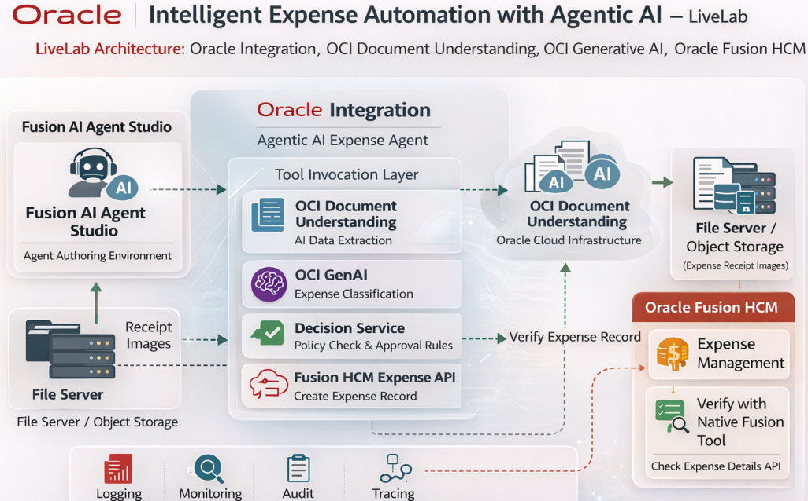
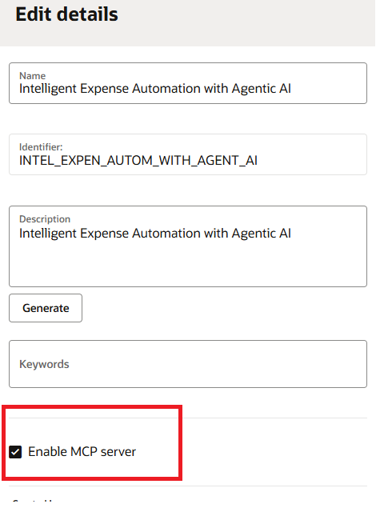
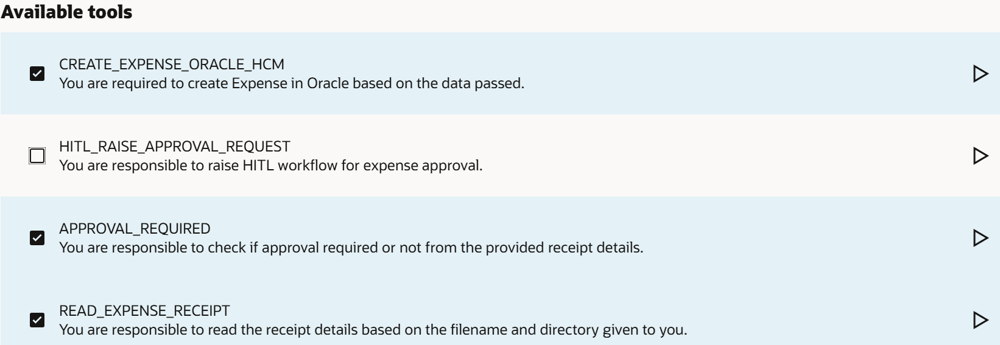
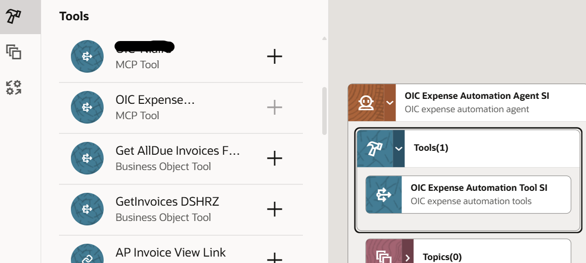

# Oracle Fusion AI Agent Studio

## Introduction

This session introduces how to call Oracle Integration tools from Fusion AI Agent Studio by leveraging an MCP server, enabling agents to securely invoke enterprise integrations and automate business processes.

You can now use AI Agent Studio, a design-time environment that empowers you to create, configure, validate, and deploy GenAI features and AI agents to meet your organization's needs. With AI Agent Studio, you can easily extend preconfigured agent templates and even build new agents and multi-agent workflows from scratch.

AI Agent Studio is fully integrated into Fusion Applications, providing secure and seamless access to the knowledge stores, tools, and APIs of Fusion Applications. This integration enables agents to be deployed directly within business workflows, ensuring efficient and streamlined processes.
This is where all your prior work comes together:
    

- Your integrations become active
- You have created the tools for all your integrations

Estimated Time: 25 minutes

### Objectives

In this lab, you will learn:

- How external applications, such as Fusion AI Agent Studio, discover and access MCP tools
- How tools are exposed to external frameworks
- How to invoke tools from outside Oracle Integration (OIC)
- How MCP enables integration between different platforms
- How to create tools, agents, and agent teams in Fusion AI Agent Studio

### Prerequisites

- All the previous labs completed successfully.
- [Complete and Activate Client Application](https://docs.oracle.com/en/cloud/paas/application-integration/aiagents/complete-prerequisites-create-and-activate-confidential-client-application.html): This configuration is mandatory for non-Bootcamp users. For Bootcamp users, these details are already configured.

###	Background - Understanding Model Context Protocol (MCP)

### What is MCP?

Model Context Protocol (MCP) is an open standard that allows AI applications to discover and invoke tools hosted on external servers. MCP enables interoperability between different AI frameworks and integration platforms.

### How MCP Works with OIC

When you enable MCP for an OIC project:
- Your project becomes an **MCP Server**
- All registered agentic AI tools become **discoverable** through a unique URL
- External AI agent frameworks (OCI ADK, Fusion AI Studio, Postman, Langflow, etc.) can **discover** these tools
- External frameworks can **invoke** these tools securely using OAuth

### Key MCP Concepts

| Concept | Description |
|---------|-------------|
| **MCP Server** | Your OIC project exposed as an MCP server |
| **MCP Client** | External applications (OCI ADK, Fusion AI Studio, Postman, Langflow, etc.) that discover and use tools |
| **MCP Server URL** | Unique endpoint for discovering available tools |
| **Transport Mechanism** | Communication protocol (streamable HTTP) |
| **Security** | OAuth 2.0 authentication |
{: title="MCP Terminology"}

### Benefits of MCP

- **Flexibility**: Use OIC tools in any MCP-compatible framework
- **Interoperability**: Integrate with multiple AI agent platforms
- **Scalability**: Expose integrations beyond OIC
- **Security**: OAuth-secured access to tools
- **Decoupling**: Separate your tools from specific agent implementations

## Task 1: Enable MCP in the OIC Project

When MCP is enabled for a project, the project functions as an MCP server. Integrations registered as Agentic AI tools are exposed through the MCP server URL, enabling AI agent frameworks that support MCP to discover and invoke these integrations. Each project has a unique MCP server URL.

1. Access Project Details
    - Navigate to **Projects** in OIC navigation pane
    - Select the project which you have created or cloned.
    - Click **Edit** (pencil icon) in the upper right corner to open **Project details**

2. Enable MCP Server
    - In the Project details panel, locate **Enable MCP server** checkbox
    - Click to **Enable MCP server**
    - Click **Save changes**
    - MCP server URL is created when you save

    

3. Retrieve MCP Server URL
    - Click the edit icon again to open **Project details**
    - Locate the **MCP server URL**
    - Copy the complete URL - it follows this format:

    `https://<oic-instance-host>.integration.<region>.ocp.oraclecloud.com/mcp-server/v1/projects/<project-identifier>/mcp`

    **Example:**
    ```
    https://mycompany.integration.us-phoenix-1.ocp.oraclecloud.com/mcp-server/v1/projects/INTEL_EXPEN_AUTOM_WITH_AGENT_AI/mcp
    ```

4. Save this URL - you'll need it for Fusion AI Agent Studio

## Task 2: MCP Client Prerequisites

> **Note:** For **Bootcamp** users, complete details will be provided.

To connect any MCP client to your OIC project, you need:

| Information | How to Obtain | Value |
|-------------|--------------|-------|
| **MCP Server URL** | Get it from Task1, Step 3 | `https://.../.../mcp` |
| **Access Token** | OAuth token for confidential client app | See Prerequisites above |
| **Transport Mechanism** | Standard for OIC | `streamable HTTP` |
{: title="MCP Client Requirements to connect with MCP server"}

### OAuth Credentials

You should already have from Prerequisites section:

- **Client ID** - From confidential client application
- **Client Secret** - From confidential client application  
- **Identity Domain URL** - Your OCI identity domain
- **OAuth Token Endpoint** - `https://<identity_domain>/oauth2/v1/token`
- **Scope** - `https://<identity_domain>urn:opc:resource:consumer::all`

    If you don't have these, refer back to Prerequisites section to create a confidential client application.

## Task 3: Agent Studio Overview (Read-Only)

To use AI Agent Studio, go to Navigator, select Tools, and then AI Agent Studio. You can do these tasks:
1. Instantiate, configure, and deploy predefined Agents and Agent Teams templates
2. Create your own custom Agents and Agent Teams
3. Create Tools and Topics
4. Upload documents for your Agent to semantically search
5. Debug the Agents or Agent Teams running within your environment
6. Enable an Agent to do these actions:
    - Retrieve or take actions on Fusion Applications business objects, including custom business objects
    - Send an email through the Oracle Fusion Cloud HCM Alert system to a specific role
    - Provide a deep link within Fusion Applications
    - Perform mathematical calculations

## Task 4: Steps to Enable and Configure Fusion AI Agent Studio (Not required if is already enabled)

> **Note:** This configuration is mandatory for non-Bootcamp users. For Bootcamp users, these details are already configured.

1. Set the Enable Security Console External Application Integration (ORA\_ASE\_SAS\_INTEGRATION\_ENABLED) profile option to Yes, and enable permission groups for the appropriate roles. See [Access Requirements for AI Agent Studio](https://docs.oracle.com/en/cloud/saas/fusion-ai/aiaas/access-ai-agent-studio.html)
2. After you provide users access to AI Agent Studio, they should be able to open AI Agent Studio without additional setup. If not, it's possible that your environment doesn't have certain necessary configurations. Ask your help desk to contact Oracle Support, who can verify what your environment has and address any gaps

## Task 5: Create a Native Tool in AI Agent Studio

1. Log in to HCM Cloud using FIN_IMPL or any other user who has access to Agent Studio.
2. Go to Navigator, select Tools, and then AI Agent Studio
3. Click on **Tools** from the bottom menu or banner of the page
    
4. Click on **Add** button and enter the details given below.

    | Information | Value |
    |-------------|--------------|
    | **Tool Type** | select *External REST* |
    | **Tool Name** | enter *getExpenseDetails* + suffix with your initials |
    | **Family** | select *SCM* |
    | **Product** | select *Others* |
    | **Description** | enter *gets expense details tool* |
    | Under **Authorization** | click on *Add* |
    | **Instance URL** | enter the HCM Cloud URL, eg: `https://xxxxxxxx.ds-fa.oraclepdemos.com` |
    | **Authentication** | select *Basic* |
    | **User Name** | enter *casey.brown* |
    | **Password** | enter *the password of HCM Cloud for the user casey.brown* |
    | **Description** | enter *authorization details* |
    | Under **Functions** | click on *Add* |
    | **Name** | select *getExpenseDetailsByExpenseId* |
    | **Operation Type** | select *HTTP GET* |
    | **Resource Path** | enter the resource path as per your environment, eg: `/fscmRestApi/resources/11.13.18.05/expense/{ExpenseId}` |
    | **Description** | enter *gets expense details based on expense identifier* |
    | Under **Parameters** | click on *Add* |
    | **Name** | enter *getExpenseDetailsByExpenseId* |
    | **Data Type** | select *String* |
    | **Description** | enter *expense identifier* |
    | On **Parameters** section | click *Save* |
    | On **Add Endpoint** section | click *Add* |
    | On **tool creation** page | click *Create* |
    {: title="Creating Native tool in Fusion AI Agent Studio"}

5. You have created a native tool and make a note of the tool name

## Task 6: Agent Creation and Configuration

1. Log in to HCM Cloud using FIN_IMPL or any other user who has access to Agent Studio, if you are not already logged in.
2. Go to Navigator, select Tools, and then AI Agent Studio
3. Click on **Tools** from the bottom menu or banner of the page
    
4. Click on **Add** button and enter the details given below.

    | Information | Value |
    |-------------|--------------|
    | **Tool Type** | select *MCP* |
    | **Tool Name** | enter *OIC Expense Automation Tool* + suffix with your initials |
    | **Family** | select *Common* |
    | **Product** | select *Others* |
    | **Description** | enter *OIC expense automation tools* |
    | **Add MCP server connection** | click on *Add* |
    | **Instance URL** | enter the URL which you have copied when you have enabled MCP server |
    | **Transport Type** | select `Streamable  HTTP` |
    | **Credential Type** | select *Client Credential* |
    | **Token URL** | enter *the URL which you have coopied from pre reque*, eg: `https://<identity_domain>.identity.oraclecloud.com/oauth2/v1/token`|
    | **lient Credentials Connection Configuration** | prepare a JSON sample as given below and enter here. Please validate the JSON sample with online tools and make sure that it is correct |
    {: title="MCP Client Requirements to connect with MCP server"}

    ```
    <copy>
    {
    "grant_type": "client_credentials",
    "client_id": "XXXXXXXXXXX",
    "client_secret": "XXXXXXXXXXX",
    "scope": "https://XXXXXXXXXXX.integration.us-phoenix-1.ocp.oraclecloud.  com:443urn:opc:resource:consumer::all"
    }
    </copy>
    ```

5. Click on **Update**, The system will display the tools from OIC as shown in the screenshot below if everything is configured correctly. Otherwise, resolve any issues—most are typically related to connections. Select the required tools for the agent. In our case, uncheck the **HITL...** tool and select the remaining tools.
    
6. Click on **Create** button which is on top right side.
7. Click on **Agents** from the bottom menu or banner of the page
8. Click on **Add** button and enter the details given below.

    | Information | Value |
    |-------------|--------------|
    | **Agent Name** | enter *OIC Expense Automation Agent* + suffix with your initials |
    | **Family** | select *Common* |
    | **Product** | select *Others* |
    | **Description** | enter *OIC expense automation agent* |
    | **Agent Persona and Role** | enter *You are an expense report analyst* |
    | **Prompt** | copy the details given below |
    {: title="Fusion Agent"}

    ```
    <copy>
    1. Read the receipt based on the details provided by the user such as directory and receipt name.
    2. Based on the expense data, check if approval required or not.
    3. If "APPROVAL_NOT_REQUIRED", then create the expense in Oracle HCM and stop the process.
    </copy>
    ```
9. Click on **Create**
10. Click on **Tools** from the left-side menu on the Designer canvas.
    
11. Search for the tool *OIC Expense Automation Tool* you created, select it, and click the **+** icon. Then click **Add** in the pop-up window to add the tool to the agent.
12. Search for the tool *getExpenseDetails* you created, select it, and click the **+** icon. Then click **Add** in the pop-up window to add the tool to the agent.
12. Finally agent screen should look like the below screenshot.
    
13. Click on **Create**. Then click on **Publish** to publish the agent which you have created.
14. Click on **Agents Teams** from the bottom menu or banner of the page
15. Click on **+** button and enter the details given below.

    | Information | Value |
    |-------------|--------------|
    | **Agent Team Name** | enter *OIC Expense Automation Agent Team* + suffix with your initials |
    | **Family** | select *Common* |
    | **Product** | select *Others* |
    | **Type** | select *Supervisor* |
    | **Description** | enter *OIC expense automation agent team* |
    {: title="Fusion Agent Team"}

16. Click on **Create**
17. Click **Agents** from the left-side menu and search for the agent you created. Click the **+** icon. Then click **Add** in the pop-up window to add the agent. You can also use filters to search for the agent if required.
18. Click on Run(Debug) Icon to test the agent and enter the prompt given below and click on **enter**

    ```
        <copy>
        Process this expense receipt. receipt name: food_non_hitl.jpeg and directory: /upload/expenseautomation/C21
        </copy>
    ```

19. You should see the expense creation response. Then enter the prompt below again to call the native tool and retrieve the expense details.
    ```
        <copy>
        gets expense details based on expense identifier
        </copy>
    ```

19. Check the results and also observe the activity stream in the Oracle Integration Console.

    Congratulations! 🎉

    You have successfully completed the *Intelligent Expense Automation with Agentic AI* Live Lab!

    What You've Accomplished

    - ✅ Understood agentic AI concepts and use case
    - ✅ Imported project and configured connections
    - ✅ Registered the integrations as agentic AI tools
    - ✅ Built intelligent AI Agent
    - ✅ Executed and validated agent with comprehensive test cases

## Learn More

* [How do I use AI Agent Studio?](https://docs.oracle.com/en/cloud/saas/fusion-ai/aiaas/)

## Acknowledgements

* **Author** - Subhani Italapuram, Technical Director, Partner Enablement, Oracle Integration
* **Last Updated By/Date** - Subhani Italapuram, March 2026
