# Import the Project and Configure

## Introduction

In this section, you'll import the pre built *Intelligent Expense Automation with Agentic AI* project into your Oracle Integration environment and configure the necessary connections for the integrations. The project contains four integrations that will become agentic AI tools.

You'll need to configure three essential connections:

- FTP Adapter Connection - For retrieving patient data files from healthcare repositories
- HCM Cloud Connection - For creating an expense record.
- REST Adapter Connection - For Trigger Interface
- OpenAI LLM Connection - For the AI agent's Large Language Model reasoning capabilities

By the end of this section, you'll have a fully operational project with all connections configured and tested, ready for agentic AI tool registration.

Estimated Time: 30 minutes

### Objectives

In this lab, you will:

- Import a Project

### Prerequisites

This lab assumes you have:

- All previous labs completed.
- [Download](https://objectstorage.us-phoenix-1.oraclecloud.com/p/UrkKROO3M8fiP5l9MEfHBkRSo4s8NkprRfGIOqKaDG3-4oiim0y0AWwFmfiO6K97/n/oicpm/b/oiclivelabs/o/oic3/ExpenseCreationLabVer2.zip) the Lab artifacts and unzip on your local computer. The lab artifacts contains a .car file (OIC Project) and .jpeg files which will act as data source for this usecase.

## Task 1: Import Project

1. Login into Oracle Integration console.

2. Navigate to the Projects Section. If you don't see the Projects option, you may need to expand the menu by clicking the hamburger icon (☰) at the top left.

3. On the Projects page, look for an **Add** button in the top-right corner of the page. Click *Add* and Select *Import* action

    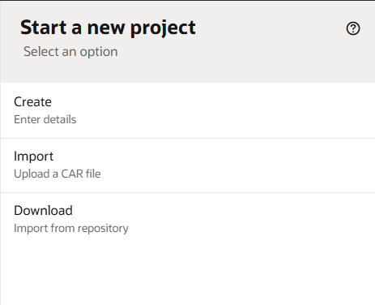

4. Locate the OIC project file **INTEL\_EXPEN\_AUTOM\_WITH\_AGENT\_AI-OICDP.car** on your local computer. Refer the Prerequisites section above to download the artifacts. Drag the file and drop it into the upload area in the dialog

5. Click on *Import*.

6. Upon successful import, you should see Project Name: **Intelligent Expense Automation with Agentic AI** and clone the project with modify the project name which consists of your initials and delete the imported project so that others can do these steps if it is shared environment.

## Task 2: Explore the Imported Project

1. Once inside the project, you should see the Project Overview page showing:

    - Project Name: Intelligent Expense Automation with Agentic AI
    - Integrations section with the four integrations:

        - **1. Read Expense Receipt** — Retrieves expense receipt images from a file server and uses AIs-powered document understanding to extract structured expense details such as date, amount, merchant, and line items.
        - **2. Approval Required** — Applies AI reasoning and policy evaluation to determine whether the expense complies with organizational rules or requires managerial approval.
        - **3. HITL-Raise Approval Request** — Triggers a human-in-the-loop review when exceptions, policy violations, or confidence thresholds demand explicit authorization before proceeding.
        - **4. Create Expense in Oracle HCM** — Once validated, automatically creates the expense record in Oracle HCM, ensuring accurate categorization, audit traceability, and seamless downstream processing.

    - Decisions
        - Expense Approval: A decision table used to determine whether approval is required based on the expense type (Food or Airfare) and the expense amount.
    - Connections
        - REST Connection
        - FTP Connection : This is the place where your files are stored
        - HCM Cloud Connection : To create an expense record

TIP: Edit each integration and click on **Learn about the Integration** to understand the details of the integration flow.
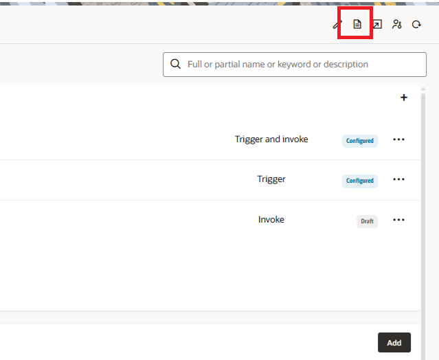

## Task 3: Configure Connections

All the connections are in draft state. We will configure the connections used by the integration flows.

**REST Connection Configuration**

1. Edit the REST Connection.

2. Configure the Security Policy as **OAuth 2.0 Or Basic Authentication**

3. Click on **Test** and *Save* the connection.

**HCM Connection Configuration**

1. Edit the HCM Connection.

2. Configure the host and username and password.

3. Click on **Test** and *Save* the connection.

**FTP Adapter Connection Configuration**

Keep the following information handy. Refer File Server Setup section and make a note of the following information

    - File Server IP Address.
    - File Server Port.
    - Your Oracle Integration username.
    - Your Oracle Integration password.

1. Edit the FTP Adapter Connection.

2. Configure the below properties in the connection properties page. Enter the following configurations you previously gathered from the File Server Settings page.  

    | Field                   | Value                                                 |
    |-------------------------|-------------------------------------------------------|
    | FTP Server Host Address | From File Server Settings - IP and Port Information   |
    | FPT Server Port         | From File Server Settings - IP and Port Information   |
    | SFTP Connection         | Yes                                                   |
    | Security                | FTP Server Access Policy                              |
    | Username                | Your Oracle Integration username                      |
    | Password                | Your Oracle Integration password                      |
    {: title="FTP Adapter Connection Properties"}

3. Confirm your Connection by clicking **Test**, then **Diagnose & Test**. You should see the *Connection File Server was tested successfully* confirmation message. Click **Save** and exit the Connection editor.

4. Click on **Test** and *Save* the connection.

**OpenAI LLM Adapter Connection Configuration**

> **Note:** For now, you can ignore this connection.You need this information later part of the live lab.

1. Edit the open AI LLM Adapter Connection.

2. Configure the below properties in the connection properties page.

    | Field                   | Value                                                 |
    |-------------------------|-------------------------------------------------------|
    | Base URL                | **<https://api.openai.com>**                                |
    | Models                  | **gpt-4o-mini**                                           |
    | API Key                 | <You open ai API Key> Refer: <https://platform.openai.com/api-keys>   |
    {: title="OpenAI Adapter Connection Properties"}

3. Click on **Test** and *Save* the connection.

Verify that all the connections are in Configured state.

## Task 4: Configure the File(FTP) Server

1. Using an FTP Client of your choice, connect to FTP Server with the information from [File Server Setup](?lab=setup)

2. Copy the files *food.jpeg, food_comliant.jpeg* (You can get these files from the zip file which you have downloade) into FTP server location. For example, copy these two files to the folder /home/users/fileserveroic3user/oicusername. You can create your own folder under /home/users/fileserveroic3user and copy the files in into new directory which you have created.

## Task 5: Configure the Decision and Activate

1. Click on *Decision* tab, edit the decision **Expense Approval**, review the business rules and go back to the *Decisions*
2. Activate **Expense Approval** decision.

## Task 6: Configure the Human in the loop(HITL) and Activate

1. Click on *Human in the loop* tab, edit the form **Expense Form**, review the form and *activate* the form
2. Click on **Add** button in Workflow section, enter Name **Expense Workflow** and click on **Create**
3. Click on **Start event**, click on **Actions** icon, click on **Open Properties**
    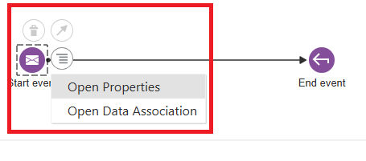
4. Add the JSON given below by clicking on **inline**, and click on **Apply**
    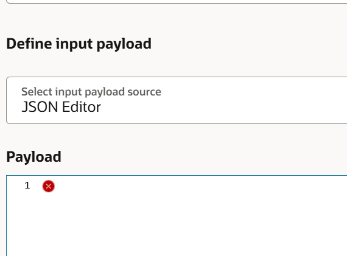

    ```
        <copy>
            {
            "expenseType":"",
            "subTotal" : "",
            "merchantPhone" : "+91-7982988244",
            "merchantAddress" : "CYBERHUB MALL, GURGAON",
            "transactionTime" : "19:06",
            "tax" : "",
            "tip" : "",
            "total" : "11",
            "merchantName" : "GOLA SIZZLERS PRIVATE LIMITED",
            "transactionDate" : "2025-12-25T00:00:00.000Z",
            "items" : [ {
                "itemName" : "NY AMRITSARI PARATHA",
                "itemPrice" : "159",
                "quantity" : "",
                "itemTotalPrice" : "477.00"
            }]
            }
        </copy>
    ```

5. Click on **End event**, click on **Actions** icon, click on **Open Properties**
6. Add the JSON given below by clicking on **inline**, and click on **Apply**

    ```
        <copy>
         {
          "outcome":""
         }
        </copy>
    ```
7. Close the *Properties*
8. Add *User Task*, drag and drop **User Task** from the *Palette* on the the designer between *Start event* and *End Event*
    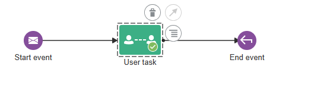
9. Click on **User Task** user action OR select **User Task** action , click on **Open Properties**
    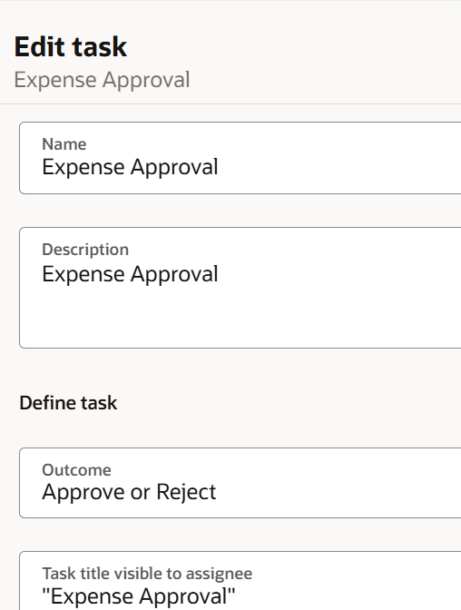
10. Change User Task's *Name* and *Title* as *Expense Approval*.
11. Click on *+* under **Assignees** and add your oic username.
    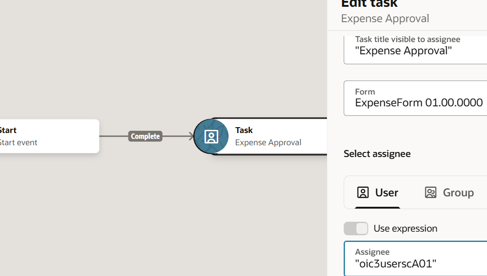
12. For *UI* property, select the *form* from the drop down.
 and click on the designer to save all the properties automatically.
    
13. select **Expense Approval** action, click on **Open Data Association**, expand *Input* from source, expand *messageStartArgs* and expand *input* from right side, expand *formData* and map the below elements and refer the screenshot given below.
    - merchantName to merchantName
    - merchantAddress to merchantAddress
    - transactionDate to expenseDate
    - total to amount
    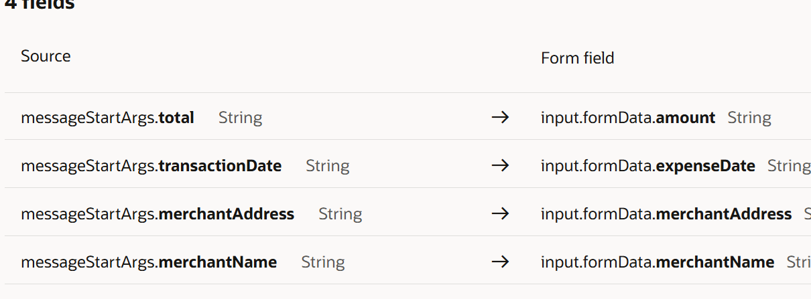
14. Click on **Output**, map *output.taskOutcome* to *callBackEndArgs.outcome*
    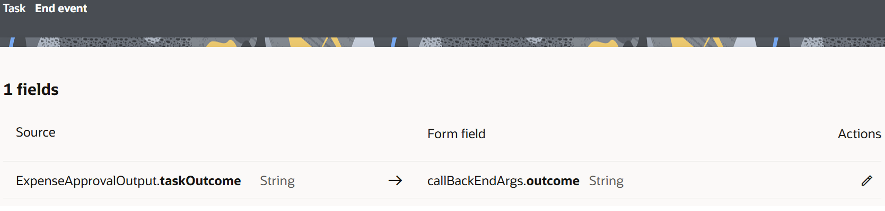
15. Click on **Apply**.
16. Go back to *Workflows* which is under *Human in the loop* tab by clicking *back* button
17. Activate *Expense Workflow*

## Task 7: Configure the integrations and Activate

_Read Expense Receipt_

1. Edit **Read Expense Receipt** integration, go through all the actions of the integration flow and try to understand it.
2. Go to *OCI Document Understanding* action, edit it, and modify the compartment name as per your OCI environment.
3. Save the integration flow and activate it.

_Approval Required_

1. Edit **Approval Required** integration, Edit *OCI Generative AI* action and modify the *Region, Compartment, Model and Model ID* as per your OCI environment.
2. Add *Decision Service* action after *OCI Generative AI* action and call it as *ExecuteBusinessRule* and select the *Decision Service* which you have activated.
    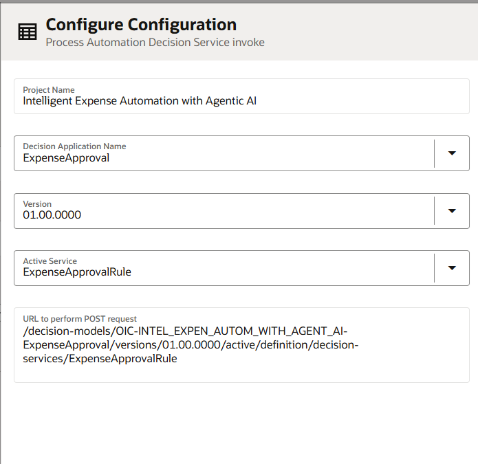
3. Map the source and target elements as per the details given below. If, required refer the screenshots.
    - Edit **Map ExecuteBusinessRule**
    - expand *Request Wrapper->Expense Data* from Target
    - expand *GetExpenseType Request-->Request Wrapper* from Source
    - Map *Total Amount* to *Amount*
    - expand *ExtractType Response-->Chat Action Response-->Response Wrapper-->Body-->Chat Response-->Choices-->Message-->Content* from Source
    - Map *Text* to *Exp Type*

    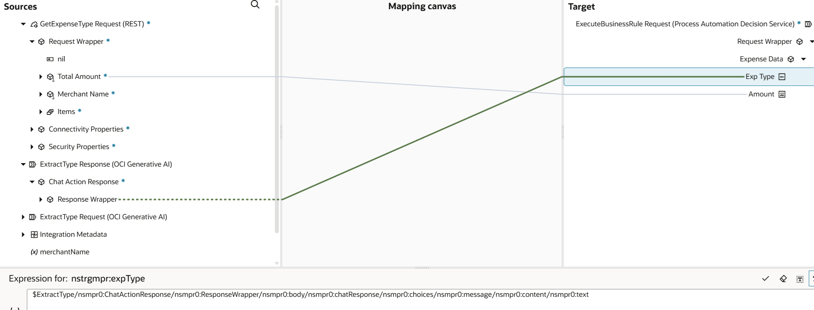
    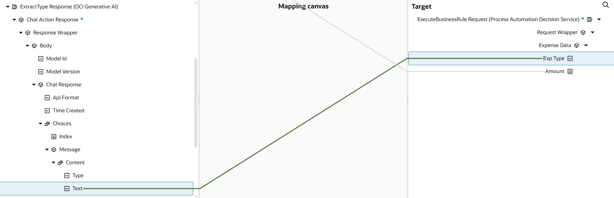
4. Edit **Map GetExpenseType** and map as per the screenshot given below.
    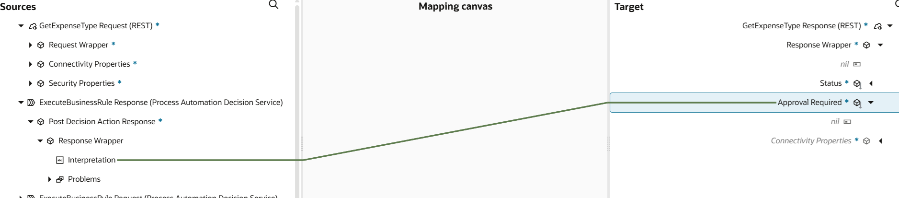
5. Save the integration flow and activate it.

_HITL-Raise Approval Request_

1. Edit **HITL-Raise Approval Request** integration, add *Human in the loop* action under *Main* section by clicking on **+** icon.
    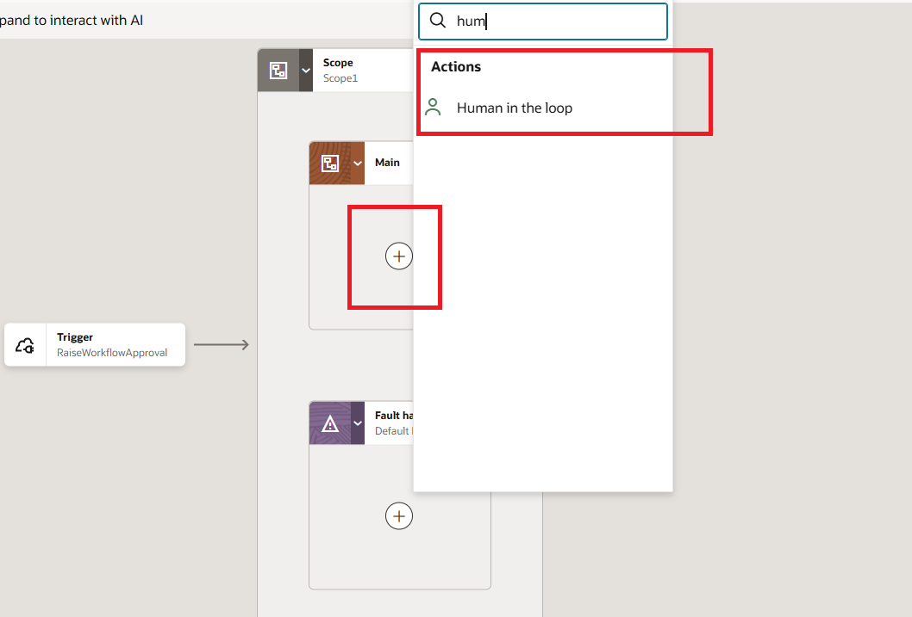
2. Enter *endpoint* name as **InitiateProcess** and select the *workflow* which you have created.
    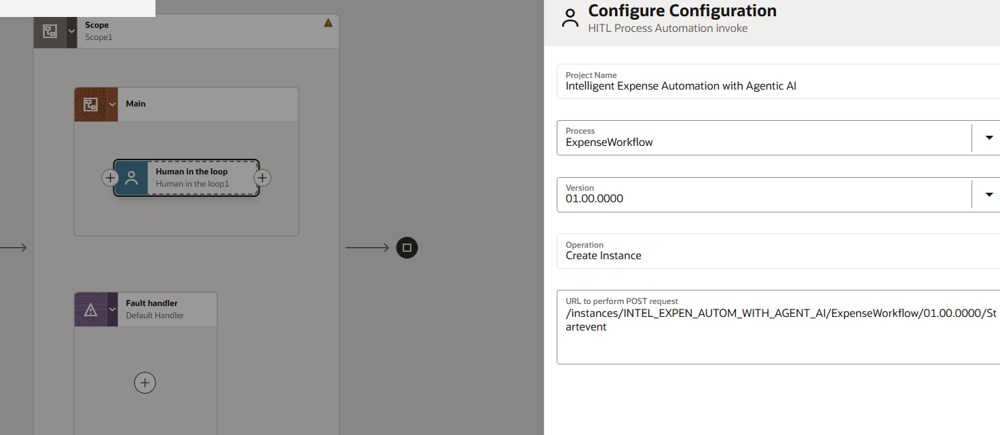
3. Edit **Map InitiateProcess** and map the source and target elements. Refer the mappings given below in the screenshot.
    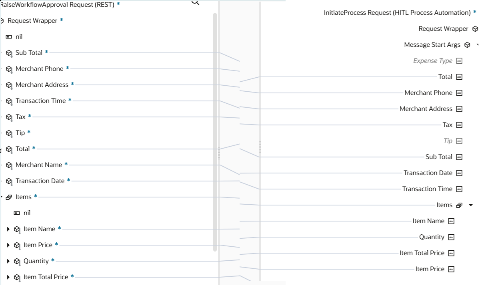
4. Save the integration flow and activate it.

_Create Expense Oracle HCM_

1. Edit **Create Expense Oracle HCM** integration, go through the all the actions and please note that we have hard coded username as *CASEY.BROWN* to create the expense report on behalf of actual user to keep it simple.
2. Save the integration flow and activate it.

You may now **proceed to the next lab**.

## Learn More

- [Getting Started with Oracle Integration 3](https://docs.oracle.com/en/cloud/paas/application-integration/index.html)

- [About Projects](https://docs.oracle.com/en/cloud/paas/application-integration/integrations-user/integration-projects.html)

- [Activate Integration](https://docs.oracle.com/en/cloud/paas/application-integration/integrations-user/activate-and-deactivate-integrations.html)

- [Monitor Integration](https://docs.oracle.com/en/cloud/paas/application-integration/integrations-user/track-integration-instances.html#GUID-46A7C0A0-CBE4-4F1B-9B45-62A5AFA89D74)

- [Open AI Adapter](https://docs.oracle.com/en/cloud/paas/application-integration/openai-adapter/openai-adapter-capabilities.html)

## Acknowledgements

- **Author** - Ankur Jain, Kishore Katta, Subhani Italapuram, Product Management, Oracle Integration
- **Last Updated By/Date** - Subhani Italapuram, Feb 2026
