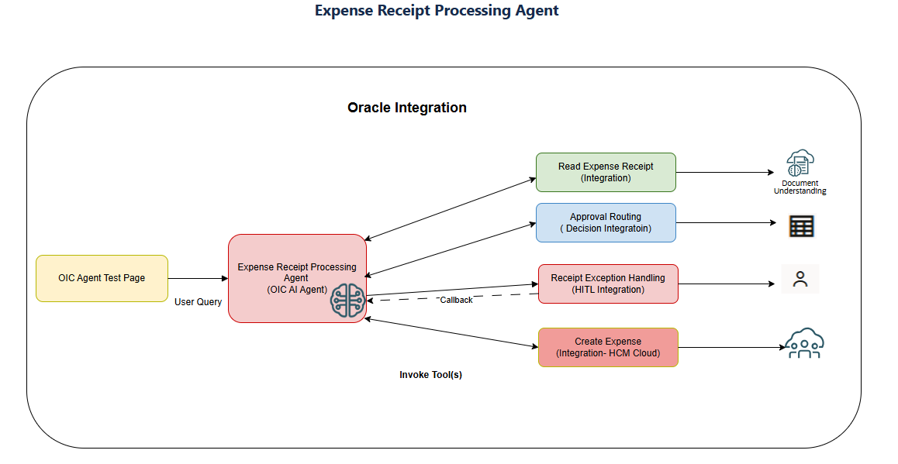
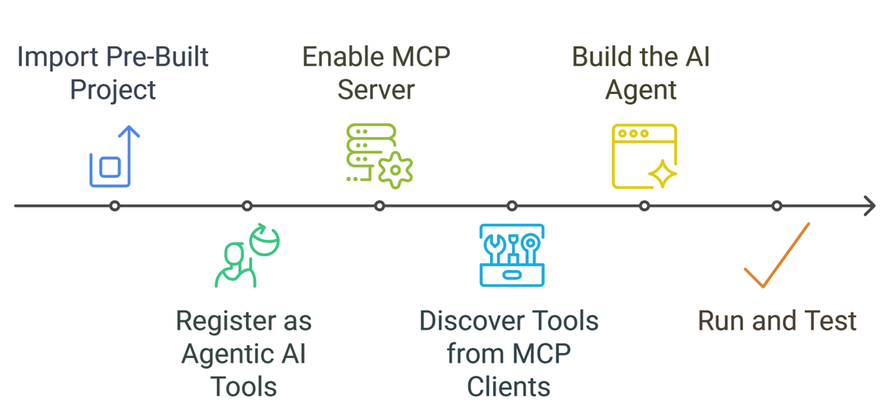

# Introduction

This expense agent use case demonstrates an intelligent, end-to-end automation flow that transforms raw expense receipts into validated expense records with minimal manual intervention. The agent reads receipt images from a file server and sends them to OCI Document Understanding for structured data extraction, while OCI GenAI assists in classifying the expense type with contextual accuracy. A decision service evaluates policy rules to determine whether approval is required; when explicit authorization is needed, a human-in-the-loop (HITL) step is triggered to maintain governance and compliance. Once validated, the agent creates the expense entry in Oracle HCM Cloud. The entire process is orchestrated through Oracle Integration, where an agent built using a ReAct-style pattern dynamically invokes the appropriate tools based on defined guidelines. This architecture combines AI-driven insight, rule-based decisioning, and enterprise workflow orchestration to deliver a scalable, auditable, and intelligent expense processing experience.

**Agentic AI** represents a paradigm shift in intelligent automation. Unlike traditional integration workflows that follow a fixed, predetermined sequence of steps, AI agents leverage Large Language Models (LLMs) to reason, adapt, and dynamically orchestrate multiple services based on real-time context. This approach is especially powerful in environments where requirements and scenarios vary, enabling systems to make informed decisions, follow defined guidelines, and execute the most appropriate actions autonomously. In this live lab, you will explore how agent-driven orchestration enhances flexibility, responsiveness, and decision quality compared to conventional rule-based integrations.

## Use Case: Intelligent Expense Automation with Agentic AI

**What is Intelligent Expense Automation with Agentic AI?**

The Intelligent Expense Automation with Agentic AI is a structured workflow that reviews employee expense submissions and supporting receipts on a case-by-case basis to ensure policy compliance, financial accuracy, and appropriate approvals. The process validates expense details against organizational policies, confirms that required documentation is provided, and determines whether escalation or human review is needed before reimbursement or posting.

Organizations typically rely on finance and expense management teams who:

Validate expense entries against corporate policies and limits

Verify receipt accuracy and supporting documentation

Ensure proper categorization and allocation of expenses

Communicate clarifications with employees and approvers

Identify compliance risks and opportunities for process improvement

Escalate exceptions requiring additional approval or audit review

**Business Challenge**

Traditional expense processing workflows often encounter several limitations:

***Manual and Time-Consuming:*** Finance teams manually review receipts, cross-check policies, and validate entries — a process that can significantly slow reimbursements and increase administrative workload.

***Inconsistency:*** Different reviewers may interpret expense policies differently, resulting in uneven enforcement and approval decisions.

***Resource Constraints:*** Limited finance staff can lead to backlogs, delaying reimbursements and increasing employee dissatisfaction.

***Delayed Insights:*** Slow processing reduces visibility into spending patterns, making it difficult to proactively manage budgets or detect policy violations.

***Complexity Management:*** Aggregating receipt data, expense classifications, approval rules, and audit checks across multiple systems is difficult with traditional siloed integrations, increasing the risk of errors and inefficiencies.

**The AI Agent Solution**

In this live lab, you’ll build an **Intelligent Expense Automation with Agentic AI** that:

**1. Read Expense Receipt** — Retrieves expense receipt images from a file server and uses AI-powered document understanding to extract structured expense details such as date, amount, merchant, and line items.

**2. Approval Required** — Applies AI reasoning and policy evaluation to determine whether the expense complies with organizational rules or requires managerial approval.

**3. HITL-Raise Approval Request** — Triggers a human-in-the-loop review when exceptions, policy violations, or confidence thresholds demand explicit authorization before proceeding.

**4. Create Expense in Oracle HCM** — Once validated, automatically creates the expense record in Oracle HCM, ensuring accurate categorization, audit traceability, and seamless downstream processing.

This agent demonstrates how AI reasoning, rule-based decisioning, and enterprise integration can work together to automate expense workflows while maintaining governance and compliance

## About this Workshop

You’ll build an **end-to-end AI Agent workflow** that automates intelligent expense processing. The workflow integrates specialized tools that work together to validate, govern, and record employee expenses:

- **Read Expense Receipt Tool** — Extracts structured expense data from receipt images using AI-powered document understanding.

- **Approval Required Tool** — Evaluates expense details against policy rules to determine whether approval is needed.

- **HITL-Raise Approval Request Tool** — Initiates a human-in-the-loop review when exceptions or policy thresholds require explicit authorization.

- **Create Expense in Oracle HCM Tool** — Automatically creates the validated expense record in Oracle HCM for downstream processing.

These integrations function as agentic AI tools that the agent dynamically orchestrates based on expense context, policy outcomes, and governance requirements, enabling a flexible, compliant, and intelligent automation workflow

**Technology Stack**

***Oracle Integration Cloud (OIC)*** - The platform where you'll build integrations, register tools, configure AI agents, and manage the complete workflow

***Large Language Models (LLM)*** - The AI engine powering agent reasoning and decision-making (we will use OpenAI as LLM provider)

***REST Adapter and HCM Cloud Adapter*** - For application connectivity

***Agentic AI Framework*** - Oracle Integration AI agent orchestration capabilities with built-in thinking patterns (ReAct, Plan and Execute)

***Model Context Protocol (MCP)*** - For exposing integrations as discoverable tools to external agent frameworks

**Workshop Flow**

1. ***Import Pre-Built Project*** - Start with a ready-made OIC project containing all five healthcare integrations already configured

2. ***Register as Agentic AI Tools*** - Convert each integration into an agentic AI tool with clear descriptions, identifiers, and parameter definitions

3. ***Enable MCP Server*** - Configure the project as an MCP server to expose tools to external agent frameworks

4. ***Discover Tools from MCP Clients*** - Verify tool discoverability from external applications using MCP protocol

5. ***Build the AI Agent*** - Create the Clinical Quality Assurance Agent, configure AI thinking patterns, add tools, and define agent behavior

6. ***Run and Test*** - Execute the agent with sample utilization review cases, monitor execution, and validate the complete workflow

**High level workflow of the Workshop**

Estimated Time: 2 hours

### Objectives

By completing this live lab, you will:

**Understand Agentic AI Concepts**
- Grasp the fundamental differences between traditional integrations (fixed workflow) and AI agents (adaptive reasoning)
- Learn how AI agents use Large Language Models to reason about which tools to use and in what order
- Understand the role of thinking patterns in agent decision-making

**Master Agentic AI Tool Registration**
- Register existing integrations as agentic AI tools in Oracle Integration
- Define clear tool identifiers, descriptions, and guidelines for LLM interpretation
- Map integration parameters to tool inputs that AI agents can invoke

**Configure and Discover Tools via MCP**
- Enable MCP server capabilities in an OIC project
- Understand how integrations become discoverable tools for external agent frameworks
- Verify tool discovery using MCP clients

**Build and Deploy AI Agents**
- Create a complete AI agent workflow in Oracle Integration
- Configure agent thinking patterns (ReAct or Plan and Execute)
- Add and orchestrate multiple agentic AI tools
- Define agent behaviors, guardrails, and execution parameters

**Test and Monitor Agent Execution**

- Run AI agents with sample inputs
- Monitor agent execution flows and tool invocations
- Validate agent reasoning and decision-making
- Troubleshoot agent behavior

**Knowledge Outcomes**

By the end of this workshop, you will have a comprehensive understanding of how to leverage OIC's Agentic AI features and capabilities.

1. Explain how AI agents differ from traditional integrations and when each is appropriate
2. Design integrations with agentic AI capabilities in mind
3. Register integrations as agentic AI tools with effective descriptions and guidelines
4. Configure MCP servers to expose tools to external frameworks
5. Build and deploy AI agents that orchestrate multiple integrations
6. Leverage thinking patterns for agent reasoning
7. Monitor and validate AI agent behavior
8. Apply agentic AI patterns to other business use cases

### Prerequisites

This lab assumes you have the following:

- Oracle Cloud Account with credits to provision services.

You may now **proceed to the next lab**.

## Learn More

* [Oracle Integration 3 Documentation](https://docs.oracle.com/en/cloud/paas/application-integration/index.html)
* [Oracle Integration 3 Agentic AI](https://docs.oracle.com/en/cloud/paas/application-integration/aiagents/get-started.html)

## Acknowledgements
- **Author** - Ankur Jain, Kishore Katta, Subhani Italapuram, Product Management, Oracle Integration
- **Last Updated By/Date** - Subhani Italapuram, Feb 2026
