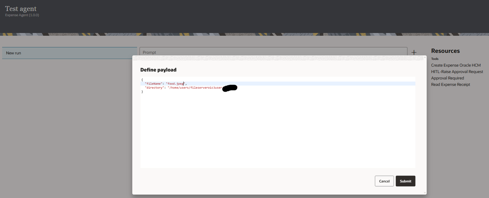
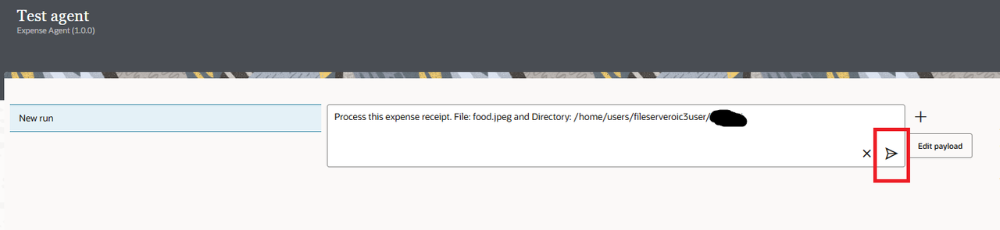
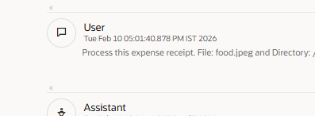
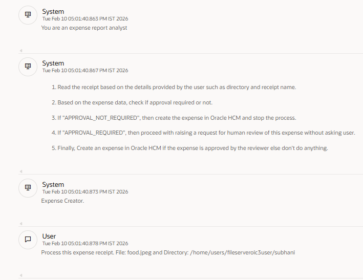
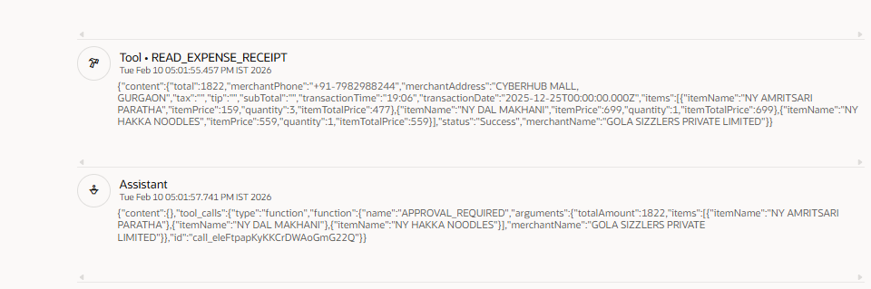
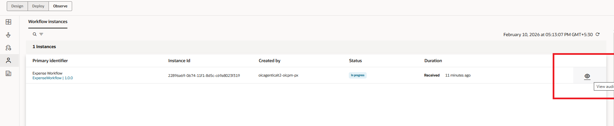
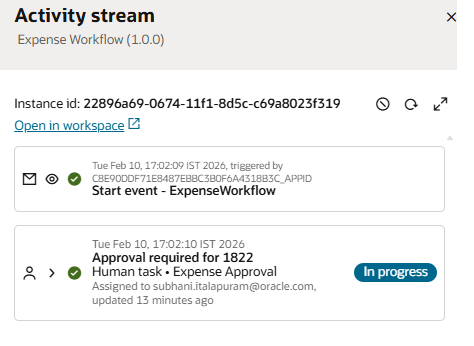
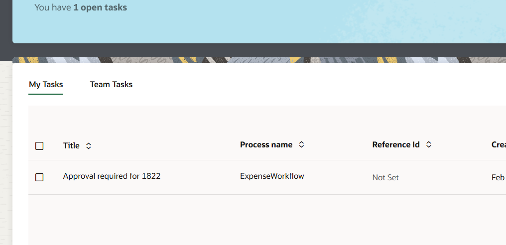
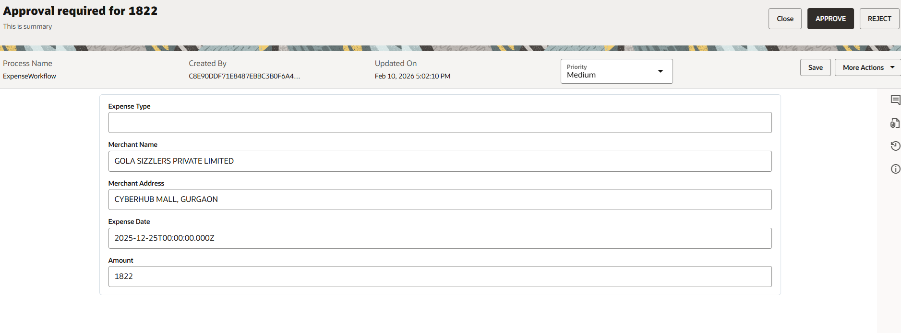
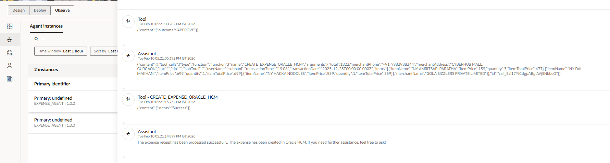

# Test AI Agent in OIC

## Introduction

In this final section, you'll execute your **Expense Agent** to validate the complete end-to-end workflow.

This is where all your prior work comes together:

- Your four integrations become active
- Your agentic AI tools are invoked intelligently
- Your thinking pattern guides expense reasoning
- Your LLM powers autonomous decision-making
- Your agent creates an expense record in the Oracle HCM Cloud

Estimated Time: 15 minutes

### Objectives

In this lab you will learn:

- How to Test OIC AI Agent

### Prerequisites

- All the previous labs completed successfully.
- Agent in Activated Status

## Task 1: Run and Test the AI Agent

1. In the left navigation pane, select **Projects**.

2. Select the **Intelligent Expense Automation with Agentic AI** project that you created.

3. In the left navigation pane, select **AI Agents** icon.

4. Run the agent
    - Copy food.jpeg and food_non_hitl.jpeg files to the File Server if not done. And You can get these two files from the downloaded artifacts.
    - In the Agents card, find the AI agent to run: **Expense Agent**
    - Click **Actions icon**, and select *Run*.

5. Test the agent.
    - In the Test Agent page, click on the prompt text area, system will show you the prompt template you created, select it, and enter the *filename* and *directory* to test the AI agent and click on Submit.

        

    - Click on the little run icon at the end of the User prompt text box.
        

    The progress bar displays and then you see agent actions.

    - Look at the agent actions.
        - **System:** indicates what you sent to the LLM in the system prompt. This includes the agent role, the agent guidelines, the AI agent pattern guidelines.
        - **User:** user indicates what you entered to send to the LLM.
        - **Tool:** shows response from the tool. You should see the audit report and quality assurance done for a specific Patient
        - **Assistant:** shows the agent reasoning. You should see in the reasoning that the agent needs to use the various tools. It waits for the tool execution to be completed.

    - You can also Navigate to the **Observe** tab in your project and Select **Agent** tab on the left pane. You will see the list of Agent Instances.

    - Click on **View Details** of eye icon next to your Agent to see the Agent **Activity Stream**.

    - **User** this is the User query
    
    - **System** this is what you configured to be sent the LLM.
    
    - **Tool** is the response from the tool
    
    - **Assistant** displays the report as per the format mentioned in Agent Guidelines.
    

## Task 2: Human approval

1. If human approval is required then, go to **Observe** tab, Click on **Human in the loop**
2. Click on *eye* icon of the instance.
    
3. Click on **Open in workspace**
    
4. The system opens the OPA workspace in a new window, select the task assigned to you and approve it.
    
5. Click on the link given under *Title* field and click on **APPROVE**
    
6. Refresh **Workflow instances** page and you should see the task status as *Completed*

## Task 3: Monitor the final result

1. Now, click on *AI Agents* tab and you should see the status of your agent as *Succeeded*
2. Go to *Activity Stream* and check all the messages and you should see the expense created in the HCM application
    

Congratulations! 🎉

You have successfully completed the *Intelligent Expense Automation with Agentic AI* Live Lab!

What You've Accomplished

- ✅ Understood agentic AI concepts and use case
- ✅ Imported project and configured connections
- ✅ Registered the integrations as agentic AI tools
- ✅ Built intelligent AI Agent
- ✅ Executed and validated agent with comprehensive test cases

## Learn More

- [Using Agentic AI](https://docs.oracle.com/en/cloud/paas/application-integration/aiagents/welcome-agentic-ai.html)

## Acknowledgements

- **Author** - Subhani Italapuram, Technical Director, Partner Enablement, Oracle Integration
- **Last Updated By/Date** - Subhani Italapuram, Feb 2026
