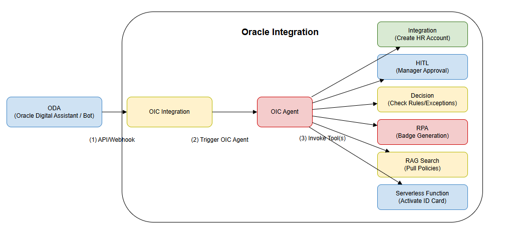
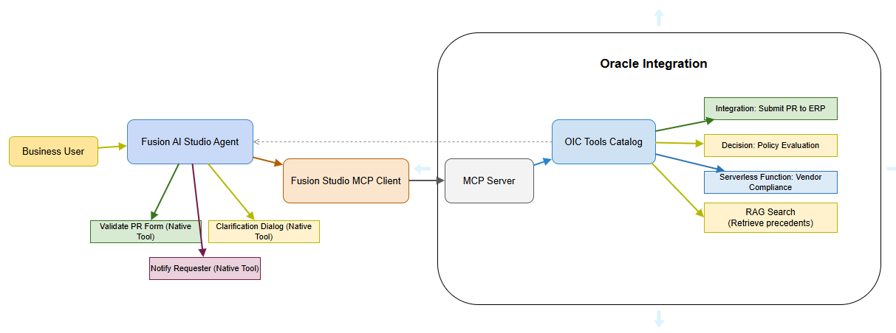
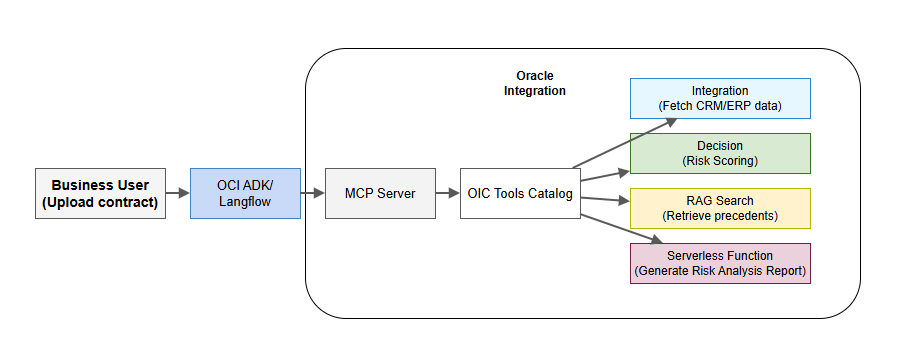
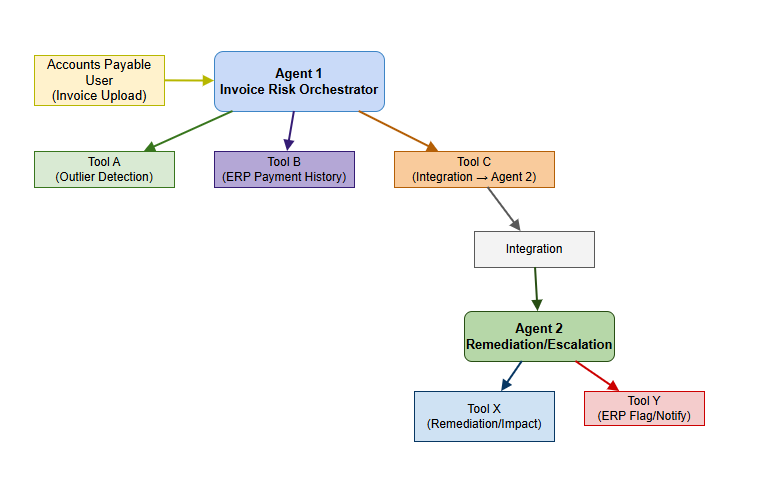

# Agentic AI Patterns in OIC

## Introduction

Enterprise integration has evolved beyond simple point-to-point connections. Today's organizations face increasingly complex challenges: automating multi-step business processes that involve decision-making, human oversight, exception handling, and integration with diverse systems. This is where Agentic AI design patterns come into play. An agentic AI design pattern combines autonomous agents—intelligent systems capable of perceiving their environment, making decisions, and taking actions—with integration, automation, and intelligence capabilities. Oracle Integration Cloud (OIC) provides the foundational tools and services that enable these patterns: integrations for connecting systems, decision engines for applying business rules, serverless functions for custom logic, Retrieval-Augmented Generation (RAG) for intelligent context, and Human-in-the-Loop (HITL) mechanisms for scenarios requiring human judgment. This section explores four core agentic AI design patterns that address real-world enterprise use cases. Whether you're automating employee onboarding, streamlining purchase requisitions, analyzing contracts, or assessing invoice risk, these patterns provide proven architectural approaches. Each pattern demonstrates how to orchestrate multiple OIC capabilities—integrations, decisions, serverless functions, and RAG—alongside AI agents from platforms like Oracle Digital Assistant (ODA), Fusion AI Studio, or third-party MCP clients. By understanding these patterns, you'll be equipped to architect solutions that are intelligent, scalable, auditable, and aligned with your organization's governance and compliance requirements.

Estimated Time: 15 minutes

### Objectives
In this lab, you will:
- Understand various Agentic AI Interaction Patterns with OIC

### Prerequisites
This lab is purely a knowledge and do not have any Prerequisites as such. Of course, requires a bit of Understanding on Fusion AI Studio, Oracle Integration and Third Party Agentic Frameworks, MCP etc.,

## Task 1: Understand Agentic AI Design Patterns Using OIC

### Pattern 1: Digital Assistant/Chat Client Invokes OIC Agent

#### Pattern Name
Conversational AI-Triggered Workflow Automation with HITL and Intelligent Enrichment

#### Use Case: Automated Employee Onboarding with Human Review

#### Overview

This pattern leverages a conversational interface (such as Oracle Digital Assistant) as the entry point for triggering complex, multi-stage business workflows. The agent orchestrates a series of OIC tools and services, intelligently handling both automated and human-driven decisions. This pattern is ideal when you need to combine the accessibility of chat-based interfaces with the robustness of enterprise integration and rule-based decision-making.

#### Pattern Flow

A business user initiates an onboarding request via a conversational interface (ODA). The agent receives the request and triggers an **OIC Integration** that connects to the HR system to create a user account with the necessary details. Once the account is provisioned, the agent invokes an **OIC Decision Service** that evaluates onboarding data against company policies, compliance rules, and exception criteria—such as department-specific requirements, budget approvals, or security clearances.

If the Decision Service identifies an exception or a policy violation, the agent activates a **Human-in-the-Loop (HITL) tool** that prompts a manager with context and decision options, ensuring human oversight where governance requires it. Upon manager approval, the agent orchestrates an **RPA tool** to automate physical or system-level tasks, such as generating security badges or provisioning access credentials.

Finally, the workflow invokes an **OIC Serverless Function** to activate identity cards or trigger downstream notification systems. Throughout this flow, the agent optionally queries a **RAG Search** service to retrieve relevant company policies, compliance guidelines, or onboarding templates, enriching both automated decisions and human prompts with contextual knowledge.

#### Key Benefits

- **Accessibility:** Conversational interfaces lower the barrier to entry; users can initiate complex workflows through natural language.
- **Intelligent Orchestration:** Agents coordinate multiple OIC services and external tools in a single, coherent flow.
- **Human Oversight:** HITL mechanisms ensure that exceptions, policy violations, or high-risk decisions receive appropriate human review.
- **Contextual Enrichment:** RAG integration allows the agent to reference company policies and historical data, improving decision accuracy and consistency.
- **Auditability:** Each step—integration calls, decisions, HITL approvals, and function executions—is logged and traceable.

#### When to Use This Pattern

- You have a process triggered by end-users through a conversational interface.
- The process involves multiple backend systems and decision points.
- Some decisions require human judgment or compliance review.
- You want to provide guided, intelligent assistance to users.

---

### Pattern 2: Fusion AI Studio Agent Invokes OIC Catalog Tools Using MCP

#### Pattern Name-
Agentic AI Platform Orchestrates Enterprise Tools via Model Context Protocol

#### Use Case: Purchase Requisition Automation

#### Overview

This pattern positions Oracle Fusion AI Studio (or similar intelligent AI platforms) as the orchestration hub, which validates, enriches, and routes business data through OIC tools exposed as catalog services via the Model Context Protocol (MCP). The MCP acts as a standardized interface that allows the AI agent to discover and invoke OIC capabilities as tools, creating a seamless, extensible ecosystem. This pattern is particularly powerful when you need the AI platform to make dynamic decisions about which tools to invoke and in what sequence.

#### Pattern Flow

A user creates and submits a Purchase Requisition (PR) through a Fusion AI Studio-powered application. The Studio agent first validates and enriches the requisition using its own built-in tools—checking that required fields (part number, quantity, description, vendor, justification) are populated and conform to expected formats. If fields are missing or ambiguous, the agent triggers a clarification dialog to guide the user.

Once the PR is validated, the Studio agent connects to the **OIC MCP Server**, establishing a dynamic workflow:

- The agent invokes the **OIC Integration Tool** (exposed via MCP) to submit the enriched requisition to the ERP system and awaits acknowledgment.
- It then calls the **OIC Decision Tool** (also exposed via MCP) to evaluate the PR against company policies, budget thresholds, and approval rules—the Decision Service returns routing instructions, approval status, or escalation configuration.
- If required by policy, the agent optionally invokes the **OIC Serverless Tool** (via MCP) to perform synchronous compliance checks, such as vendor validation or duplicate detection.

After receiving results from all OIC tools, the Studio agent continues its own logic—for example, notifying the requester of submission status, approval routing, or any compliance findings using in-Studio notification capabilities. The agent may also update the PR record in Fusion applications or log metadata for audit and analytics purposes.

#### Key Benefits

- **Standardized Tool Integration:** MCP provides a uniform, discoverable interface for OIC capabilities, reducing integration friction.
- **Dynamic Orchestration:** The AI agent decides which tools to invoke and when, allowing adaptive workflows based on runtime conditions.
- **Rich Validation & Enrichment:** Fusion AI Studio's native AI capabilities combine with OIC's enterprise robustness.
- **User Experience:** The agent provides guided, interactive experiences that validate inputs and explain decisions in context.
- **Extensibility:** New OIC tools can be published to MCP without requiring changes to Studio workflows; the agent discovers and uses them.

#### When to Use This Pattern

- You have a Fusion AI Studio or similar intelligent platform deployment.
- You want to use the AI platform as the primary orchestrator, with OIC as a catalog of reusable, standardized tools.
- Your workflows require intelligent validation, enrichment, and adaptive routing.
- You prioritize discoverability and loose coupling between the AI platform and backend services.

---

### Pattern 3: Third-Party MCP Client Orchestrates Synchronous OIC Tools via MCP Server

#### Pattern Name
Headless Agentic AI Engine Drives Enterprise Processes via OIC Tool Catalog

#### Use Case: Automated Contract Risk Analysis

#### Overview

This pattern employs a third-party agentic AI framework (such as Langflow, LangChain-based orchestrators, or custom agents) as the orchestration engine. The framework connects to an **OIC MCP Server** to discover and invoke OIC tools synchronously, executing a coordinated sequence of integrations, decisions, and serverless functions. This pattern is ideal for scenarios where you need a lightweight, flexible orchestration layer that is not tied to a specific enterprise AI platform, yet leverages OIC's breadth of capabilities.

#### Pattern Flow

A user uploads a contract document (in text or PDF format) through an analysis portal powered by a third-party agentic AI framework. The framework's agent orchestrates a series of OIC tools via the MCP Server:

- The agent first invokes the **OIC Integration Tool** to fetch supplementary data—such as client profiles, historical agreements, regulatory documents, or industry standards—enriching the contract analysis with enterprise context.
- Next, it calls the **OIC Decision Engine Tool** (exposed via MCP) to apply organizational policies, legal compliance rules, and risk frameworks against the contract's clauses and terms. The Decision Engine flags suspicious or unusual clauses (e.g., extreme indemnity clauses, one-sided penalty provisions, or non-standard payment terms) and returns a risk classification.
- In parallel or sequentially, the agent invokes the **RAG Search Tool** to locate similar contracts from the organization's repository, relevant legal opinions, regulatory guidance, or precedent analysis—providing the AI with domain-specific context to refine risk assessments.
- Finally, the agent calls an **OIC Serverless Function** that executes specialized contract analysis logic: extracting key clauses, monetary values, critical dates, and obligations; classifying risks by category (financial, legal, compliance); summarizing findings; and generating visualizations (e.g., clause presence matrices, monetary exposure heatmaps).

The agent receives the analysis output and compiles a clear, actionable summary report, complete with risk scores, visual aids, and decision support recommendations, which is returned to the user via the portal.

#### Key Benefits

- **Platform Agnosticism:** Third-party frameworks are not locked into proprietary enterprise platforms; they can orchestrate any OIC-exposed tools.
- **Lightweight & Flexible:** The orchestration layer remains independent, allowing rapid iteration and experimentation with AI agents.
- **Synchronous & Responsive:** Tool invocations are real-time and return results immediately, enabling interactive user experiences.
- **Composable Intelligence:** Complex analyses emerge from chaining simple, atomic OIC tools (integration, decision, function, RAG) in creative sequences.
- **Cost-Effective:** Organizations can leverage open-source or lightweight agentic frameworks without premium licensing.

#### When to Use This Pattern

- You prefer lightweight, open-source, or platform-agnostic orchestration engines.
- Your use case involves synchronous tool invocation with rapid feedback loops.
- You need maximum flexibility in composing AI workflows from reusable OIC capabilities.
- You want to experiment with multiple agentic AI frameworks without deep enterprise platform integration.

---

### Pattern 4: OIC Agent as a Tool—Multi-Agent Chained Pattern

#### Pattern Name
Hierarchical Agent Orchestration with OIC as a Delegated Service Provider

#### Use Case: ERP Invoice Risk Assessment using Multi-Agent Chained Pattern

#### Overview

This pattern recognizes OIC capabilities (integrations, decisions, serverless functions) as tools that can be invoked by one agentic AI system, which in turn invokes other agents as tools. This creates a hierarchical, multi-agent architecture where agents specialize in different concerns—risk analysis, remediation, escalation—and coordinate via OIC integrations. This pattern is ideal for high-volume, complex processes where risks and decisions cascade across multiple stages and require specialized agent expertise.

#### Scenario Context

A global enterprise receives thousands of vendor invoices. To reduce fraud, duplicate payments, and compliance violations, the ERP team implements an automated invoice risk assessment pipeline before invoices reach the finance team for approval.

#### Pattern Flow

**Agent 1: Invoice Risk Orchestrator**

The Invoice Risk Orchestrator is the first agent in the chain. It is registered with the following tools:

- **Tool A (Anomaly Analysis Serverless Function):** Analyzes invoice data—comparing it against historical patterns—to detect anomalies such as duplicate invoices, fraud signals, unusually high amounts, tax inconsistencies, or unusual vendor behavior. Returns a risk score and flagged anomalies.
- **Tool B (ERP Integration):** Queries the ERP system to fetch the vendor's payment history, status, credit rating, dispute record, and compliance standing. Integrates this data with the current invoice for contextual analysis.
- **Tool C (Agent Invocation Integration):** Connects to and invokes **Agent 2** (the Remediation & Escalation Agent), passing the risk assessment and invoice data as context.

**Agent 1 Workflow:** The Risk Orchestrator receives an incoming invoice, invokes Tool A to analyze it for anomalies, invokes Tool B to retrieve vendor history and context, aggregates the findings, and then invokes Tool C to delegate remediation and escalation decisions to Agent 2. The Orchestrator logs the risk assessment and passes results through the invoice pipeline.

**Agent 2: Remediation & Escalation Agent**

Invoked via Tool C's integration from Agent 1, the Remediation & Escalation Agent is registered with:

- **Tool X (Remediation Serverless Function):** Recommends corrective actions for flagged risks. For example, if the invoice is flagged as a potential duplicate, Tool X may recommend a manual review or suggest a hold pending vendor confirmation. It can simulate financial impact if the invoice is paid versus held, crafting escalation language and justification for the finance team. Returns remediation recommendations and impact analysis.
- **Tool Y (ERP Payment Blocking Integration):** Automatically updates the invoice status in the ERP system—flagging it for manual review, blocking payment, or placing it in a remediation queue. Ensures that risky invoices do not process automatically to payment without human review.

**Agent 2 Workflow:** Upon invocation, the Remediation & Escalation Agent receives risk data and invoice context from Agent 1. It invokes Tool X to determine appropriate remediation strategies based on risk severity and type. If high-risk, it invokes Tool Y to flag or block the invoice in the ERP system, triggering notifications to the finance team. It may also log detailed remediation recommendations and escalation justifications for audit and compliance purposes.

**End-to-End Flow:**

1. An invoice arrives
2. Agent 1 analyzes risk and fetches context
3. Agent 1 invokes Agent 2
4. Agent 2 recommends remediation and updates ERP
5. Invoice is flagged, blocked, or released based on risk tier
6. Finance team receives alerts and remediation recommendations
7. Manual review occurs before payment
8. Closed-loop audit trail is maintained

#### Key Benefits

- **Scalability:** Multi-agent architecture naturally distributes workload; specialized agents handle specific concerns (risk vs. remediation).
- **Separation of Concerns:** Each agent owns a distinct responsibility, reducing complexity and enabling independent evolution.
- **Chained Reasoning:** Agents can reference previous agent findings, building knowledge as they progress through the pipeline.
- **Rich Context:** OIC integrations continuously fetch fresh data from ERPs and external systems, ensuring agents have current information.
- **Compliance & Auditability:** Each agent's invocation, decision, and action is logged; audit trails are complete and defensible.
- **Flexibility:** Agents can be updated, replaced, or supplemented without disrupting the overall pipeline.

#### When to Use This Pattern

- You have high-volume, complex processes that naturally decompose into sequential, specialized steps.
- Multiple agents must collaborate, each with domain-specific expertise.
- You need rich audit trails and compliance documentation.
- Your process involves multiple stages of decision-making and intervention.
- Risk mitigation and escalation are critical concerns.

---

## Summary

These four agentic AI design patterns provide a toolkit for architecting intelligent, enterprise-grade automation using Oracle Integration Cloud. Whether orchestrated through conversational interfaces, AI platforms, headless frameworks, or multi-agent hierarchies, each pattern demonstrates how OIC's integrations, decisions, serverless functions, and RAG capabilities combine to create systems that are adaptive, intelligent, and compliant. Choose the pattern that aligns with your organizational architecture, user interface strategy, and governance requirements.

You may now **proceed to the next lab**.

## Learn More

* [Using OIC Agentic AI](https://docs.oracle.com/en/cloud/paas/application-integration/aiagents/welcome-agentic-ai.html)
* [Fusion AI Studio](https://www.oracle.com/in/news/announcement/oracle-introduces-ai-agent-studio-2025-03-20/)
* [Use OCI Gen AI ADK](https://docs.oracle.com/en-us/iaas/Content/generative-ai-agents/adk/api-reference/introduction.htm)

## Acknowledgements
* **Author** - Kishore Katta, Director Product Management - Oracle Integration
* **Last Updated By/Date** - Kishore Katta - Nov 2025
