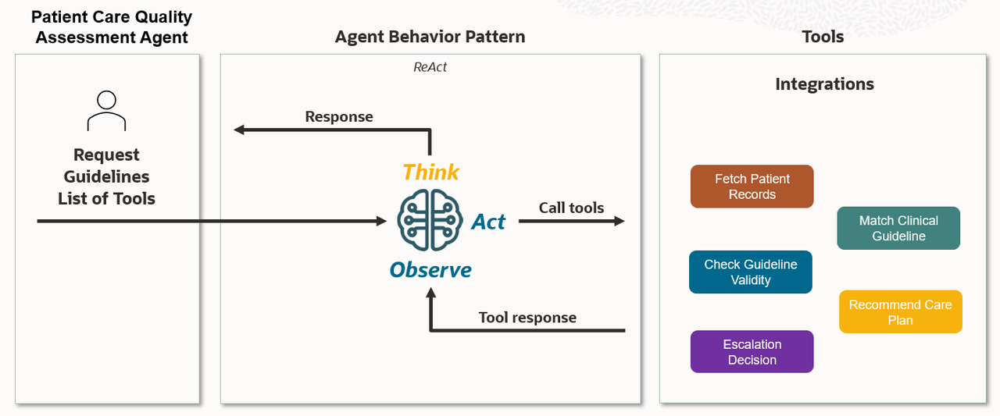
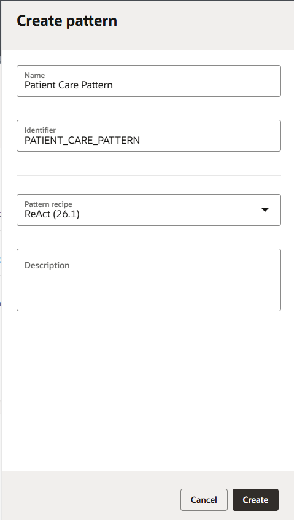
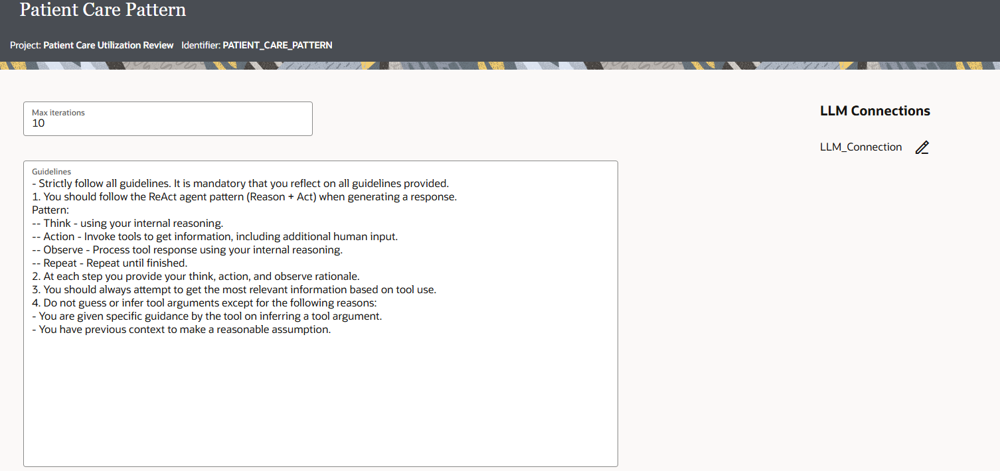
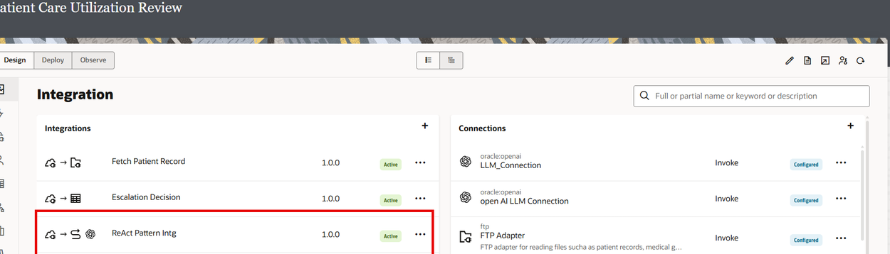
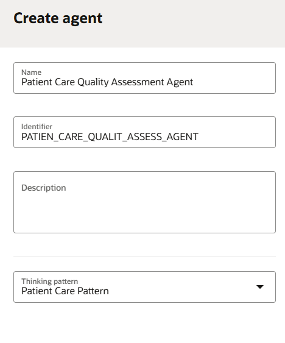
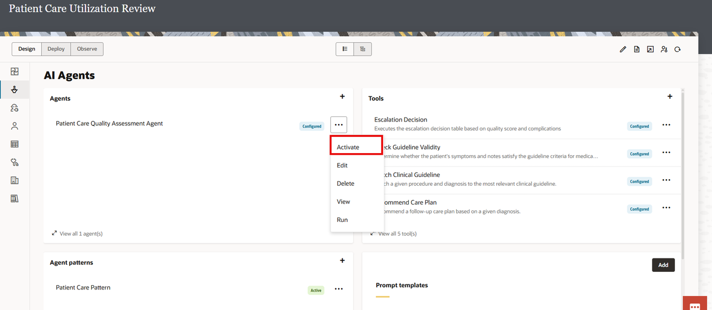

# Build OIC AI Agent

## Introduction

In this section, you'll create the **Patient Care Quality Assessment Agent** within Oracle Integration. This agent will orchestrate your five healthcare tools to conduct intelligent, automated utilization reviews.

Unlike the external MCP client approach in the previous action we will build an agent in Oracle Integration wherein the AI agent will:
- **Reason autonomously** using the LLM to understand clinical context
- **Decide tool sequence** based on the utilization review goal
- **Adapt to variations** in patient cases and clinical scenarios
- **Generate structured reports** with findings and recommendations
- **Escalate decisions** to evaluate output based actions

The AI agent transforms your individual healthcare tools into an intelligent system capable of executing complex clinical workflows.

Estimated Time: 10 minutes

### Understanding AI Agent Components

Before building, understand the key components:



### Thinking Patterns

**Thinking patterns define how the AI agent reasons about problems.**

OIC provides two built-in patterns:

**1. ReAct (Reasoning and Action)**
- AI agent alternates between thinking and doing
- Pattern: Think → Act → Observe → Think → Act → ...
- Best for: Tasks requiring iterative problem-solving and adaptation
- Use case: Utilization reviews where patient cases vary
- Example flow: Think about patient case → Fetch patient record → Observe patterns → Think about guideline matching → Match guideline → Observe results → Continue...

**2. Plan and Execute**
- AI agent creates complete plan first, then executes steps
- Pattern: Think (create plan) → Execute step 1 → Execute step 2 → ... → Observe results
- Best for: Well-defined workflows with predetermined steps
- Use case: Standardized processes with predictable flow
- Example flow: Create detailed 5-step audit plan → Execute each step sequentially → Report results

**For This Lab we will use ReAct Pattern**

### LLM Connection

The thinking pattern requires connection to a Large Language Model that powers the agent's reasoning.

The AI agent will use an LLM connection.

### Agentic AI Tools

Your five registered healthcare tools from previous labs become the agent's action capabilities.

The agent decides which tools to invoke based on clinical need.

### Objectives

In this lab you will learn:

- How to Configure the Agentic AI Thinking Pattern.
- How to Build an AI Agent in OIC
- How to configure Tools in an Agent


### Prerequisites

* All the previous labs completed successfully.
* All Integrations in Active Status
* All Tools Registered

## Task 1: Configure the Agentic AI Thinking Pattern

1.  In the left navigation pane, select **Projects**.

2.  Select the **Patient Care Utilization Review** project that you created.

3.  In the left navigation pane, select **AI Agents** icon.

4.  In the **Agent patterns** card, click *Add*. The Create pattern dialog is displayed.

5.  In **Create pattern**, configure required fields for your pattern:
    - **Name:** Name for the thinking pattern. For our lab, enter the name **Patient Care Pattern**. Currently, there are two patterns available in Oracle Integration. ReAct and Plan and Execute as explained above.

    - **Identifier:** Auto Populated

    - **Pattern recipe:** Value sent to the LLM as a system prompt to define how the agent reasons. Select the ReAct pattern for this lab. A pattern recipe is implemented as an integration that contains the thinking pattern for the AI agent. Oracle Integration ships with two ready-to-use patterns.

6.  Click Create. The Pattern details page is displayed.

    

7.  Configure the Pattern Guidelines and the LLM Connection.
    a.  Leave the Max Iterations and Temperature as defaults.
    b.  In the Guidelines box, enter the following guidelines for the ReAct Thinking pattern.

    ```
    <copy>
      - Strictly follow all guidelines. It is mandatory that you reflect on all guidelines provided.
      1. You should follow the ReAct agent pattern (Reason + Act) when generating a response.
      Pattern:
      -- Think - using your internal reasoning.
      -- Action - Invoke tools to get information, including additional human input.
      -- Observe - Process tool response using your internal reasoning.
      -- Repeat - Repeat until finished.
      2. At each step you provide your think, action, and observe rationale.
      3. You should always attempt to get the most relevant information based on tool use.
      4. Do not guess or infer tool arguments except for the following reasons:
      - You are given specific guidance by the tool on inferring a tool argument.
      - You have previous context to make a reasonable assumption.
    </copy>  
    ```
    

    c.  Click **Save**.

    d.  Under LLM Connections, click **Edit** icon to configure the LLM connection. A new LLM connection is created and is displayed.

    e.  Configure connection information for your LLM.
    - **Base URL:** URL to connect to your LLM. For example: https://api.openai.com.
    - **Model:** Model to use for your AI agent. For example: gpt-4o-mini
    - **API Key Based Authentication:** Specify your Open AI API key to connect to the LLM.

    f.  Click **Test** to test that your connection works, then click **Save**.

    When you save, Oracle Integration creates an integration that implements the ReAct pattern called ReAct Pattern Intg. This system-created integration is automatically activated for the agent.

8.  Click **Back** < to return to Pattern Details page

9.  Click **Back** < to return to AI Agents page

10. Activate the thinking pattern. The pattern must have the status Active before you can specify it in your agent. In the **Agent patterns** section, next to **Patient Care Pattern**, click Actions (...)) icon, and select **Activate**.

Once your thinking pattern is created for your AI agent, Oracle Integration automatically creates two integrations in your project: **ReAct Pattern Intg** and **Get Tool Data**. Select the Integration section to see these integrations. These integrations are system-generated and are required for your AI agent. You don't need to change or edit them.




## Task 2: Add and Configure the AI Agent

1.  In the AI Agents card, click **Add** . The Create agent panel is displayed.

2.  Configure required fields for your agent and Click **Create**
    - Name: Name for your AI Agent. Example: Patient Care Quality Assessment Agent
    - Identifier: Auto generated
    - Thinking Pattern: Select the **Patient Care Pattern** created in the previous Task.



3.  Configure your Agent Role, Guidelines and Tools.

    a.  **Role:** You are a Clinical Quality Assurance specialist responsible for conducting post-procedure audits to ensure quality care delivery.

    Note: Role is Sent to the LLM as part of the system prompt. We need to specify a clear role for your agent so that the LLM knows the purpose of your agent.

    b.  Copy Paste the below guidelines. **Guidelines** are sent to the LLM as part of the system prompt.

    ```
    <copy>
    You are a **Clinical Quality Assurance specialist** responsible for conducting post-procedure audits to ensure quality care delivery and identify opportunities for clinical improvement.

    ### Primary Responsibilities

    #### 1. Case Analysis
    You will be provided with a **completed procedure case** for quality review audit. Your task is to conduct a comprehensive analysis of procedure appropriateness, guideline adherence, and execution quality.

    #### 2. Data Collection and Retrieval
    Use the **Fetch Patient Record** tool to retrieve the complete patient record, including:
    - Patient demographics and medical history
    - Pre-procedure symptoms and assessments
    - Procedure documentation and clinical notes
    - Post-procedure outcomes and complications status
    - Current condition and care plan

    #### 3. Guideline Matching
    Use the **Match Guideline** tool to identify the appropriate clinical guideline for the completed procedure and diagnosis combination. This establishes the quality benchmarks and standards against which the procedure will be assessed.

    #### 4. Compliance Validation
    Use the **Check Guideline Validity** tool to validate whether the procedure execution aligned with clinical guideline requirements. The tool will assess:
    - Whether patient symptoms matched the required symptoms for the procedure
    - Whether the clinical indication justified the intervention
    - Whether the procedure followed established clinical protocols
    - Whether documentation is complete and appropriate
    - Overall compliance with quality standards

    The tool will return a compliance assessment indicating whether the procedure was compliant or non-compliant with the matched guideline.

    #### 5. Escalation Determination
    Use the **Escalation Decision** tool to determine the appropriate escalation action. This tool requires two inputs:
    - **Quality Assessment Score**: Assign one of the following based on your overall quality evaluation:
      - EXCELLENT: Full guideline compliance, appropriate indication, complete documentation, no issues
      - SATISFACTORY: Generally compliant with minor documentation or process gaps, appropriate care delivered
      - NEEDS IMPROVEMENT: Notable gaps in guideline adherence, documentation, or clinical decision-making
      - NON-COMPLIANT: Failed to meet clinical guidelines or standards, inappropriate care delivery
    - **Complications Present**: Determine from the patient record whether any complications or adverse events occurred (true/false)

    The Escalation Decision tool will return the required escalation action and timeframe based on organizational policy.

    #### 6. Care Plan Recommendations
    **Only if clinical quality gaps are identified**, use the **Recommend Care Plan** tool to generate follow-up care recommendations based on the diagnosis. This tool provides evidence-based next steps to address deficiencies or optimize patient outcomes.

    Do NOT call this tool if:
    - Quality assessment is EXCELLENT with no gaps
    - Only administrative or documentation issues identified (not clinical care gaps)

    #### 7. Report Generation
    Generate a comprehensive quality audit report following the exact format specified below.

    ### Quality Assessment Criteria

    When determining the Quality Assessment Score, evaluate against these criteria:

    #### Procedure Appropriateness
    - Was the right procedure performed for the patient's condition?
    - Did the patient's symptoms and clinical presentation match the guideline requirements?
    - Did the clinical indication justify the intervention?

    #### Clinical Guideline Adherence
    - Did the procedure follow established clinical protocols?
    - Were all required steps and safety measures implemented?
    - Was the procedure medically necessary based on guidelines?

    #### Documentation Quality
    - Are all required assessments and notes properly documented?
    - Is documentation complete, accurate, and timely?
    - Are clinical rationale and decision-making clearly recorded?

    #### Outcome Alignment
    - Did the procedure achieve expected clinical outcomes?
    - Were complications appropriately identified and managed?
    - Is the patient in stable condition post-procedure?

    #### Care Continuity
    - Are appropriate follow-up recommendations in place?
    - Is there adequate care coordination planning?
    - Are next steps clearly documented?

    ### Required Output Format

    Your final audit report **MUST** include the following elements in the exact format specified:

    #### Quality Assessment Score

    [EXCELLENT/SATISFACTORY/NEEDS IMPROVEMENT/NON COMPLIANT]


    #### Guideline Compliance Analysis
    Provide a detailed narrative analysis that includes:
    - **Compliant Areas**: Specific aspects where the procedure met quality standards, with references to guideline requirements
    - **Non-Compliant Areas**: Specific gaps or violations identified, or state "None identified" if fully compliant
    - **Overall Assessment**: Summary statement of compliance level

    #### Escalation Decision

    - Complications Detected: [true/false]
    - Escalation Action Required: [Output from Escalation Decision tool]
    - Escalation Timeframe: [Output from Escalation Decision tool]
    - Rationale: [Brief explanation of why this escalation level was determined]


    #### Quality Improvement Recommendations
    Provide actionable recommendations to enhance care delivery processes, clinical protocols, or documentation practices. Include:
    - Process improvements for identified gaps
    - Best practice recognition where applicable
    - Training or education needs
    - System or workflow enhancements

    #### Documentation Gaps

    [List specific missing or inadequate documentation elements, or state "None identified"]


    #### Follow-up Care Plan

    [If Recommend Care Plan tool was used: Include the evidence-based care recommendations]
    [If no clinical gaps: State "None required - patient receiving standard care protocol"]


    ### Workflow Instructions

    Follow this sequence for every quality audit:

    1. **ALWAYS** call **Fetch Patient Record** tool first with the patient ID
    2. **ALWAYS** call **Match Guideline** tool with the procedure and diagnosis from the patient record
    3. **ALWAYS** call **Check Guideline Validity** tool with:
       - Patient symptoms from the record
       - Required symptoms from the matched guideline
       - Clinical notes from the record
    4. **ALWAYS** call **Escalation Decision** tool with:
       - Your assigned Quality Assessment Score (EXCELLENT/SATISFACTORY/NEEDS IMPROVEMENT/NON COMPLIANT)
       - Complications status (true/false) from the patient record
    5. **CONDITIONALLY** call **Recommend Care Plan** tool ONLY if clinical quality gaps require additional patient care interventions
    6. **ALWAYS** generate the final quality audit report in the specified format

    ### Important Guidelines

    #### Assessment Principles
    - Base your quality assessment on objective evidence from the patient record and guideline requirements
    - Clearly distinguish between clinical quality issues (affecting patient care) and administrative/process issues (documentation, timing)
    - A procedure can be clinically appropriate even with documentation gaps - assess these dimensions separately
    - Consider the severity and impact of any identified gaps when assigning the Quality Assessment Score

    #### Tool Usage Rules
    - Call tools in the specified sequence - each tool's output informs the next step
    - Do not skip mandatory tool calls
    - Only call Recommend Care Plan tool for clinical care gaps, not administrative issues
    - Provide complete and accurate inputs to each tool based on prior tool outputs

    #### Report Quality Standards
    - Ensure all findings are supported by specific evidence from the patient record and guidelines
    - Be precise and specific - reference actual symptoms, documentation elements, and guideline requirements
    - Maintain objectivity and professional tone
    - Provide actionable recommendations that can be implemented
    - Clearly communicate the rationale for your quality assessment and escalation determination

    #### Handling Edge Cases
    - If patient record is incomplete, document what information is missing in Documentation Gaps section
    - If no guideline match is found, note this and assess against general standards of care
    - If complications are unclear, mark as "NO" but note the ambiguity in your analysis
    - When in doubt between two Quality Assessment Scores, choose the more conservative (lower) score and explain your reasoning

    </copy>
    ```
    c. In **Tools**, provide tools for the AI agent. Tools are integrations that have been registered as agentic AI tools and provide external connectivity for the AI agent. You already created the tool when you registered the integration as a tool in the previous Section. Click **+** and Add the following Tools
      - Fetch Patient Record
      - Match Clinical Guidelines
      - Check Guideline Validity
      - Escalation Decision
      - Recommend Care Plan

4.  Click on **Save**

5.  Navigate **Back <** to the AI Agents Page.

6.  Activate the AI Agent.
    a.  In the Agents card, find the agent to activate. Click **Actions ...**, and Select *Activate*.

    

You may now **proceed to the next lab**.

## Learn More

* [Using OIC Agentic AI](https://docs.oracle.com/en/cloud/paas/application-integration/aiagents/welcome-agentic-ai.html)

## Acknowledgements
* **Author** - Kishore Katta, Director Product Management - Oracle Integration
* **Last Updated By/Date** - Kishore Katta - Nov 2025
