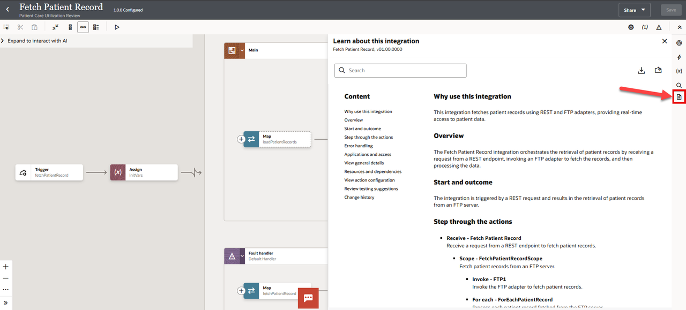
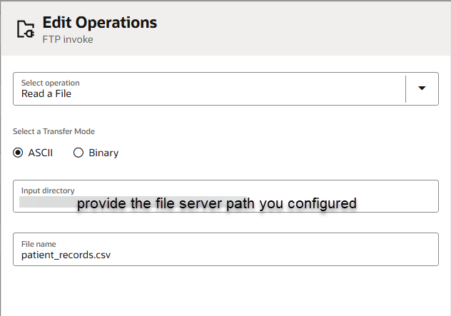
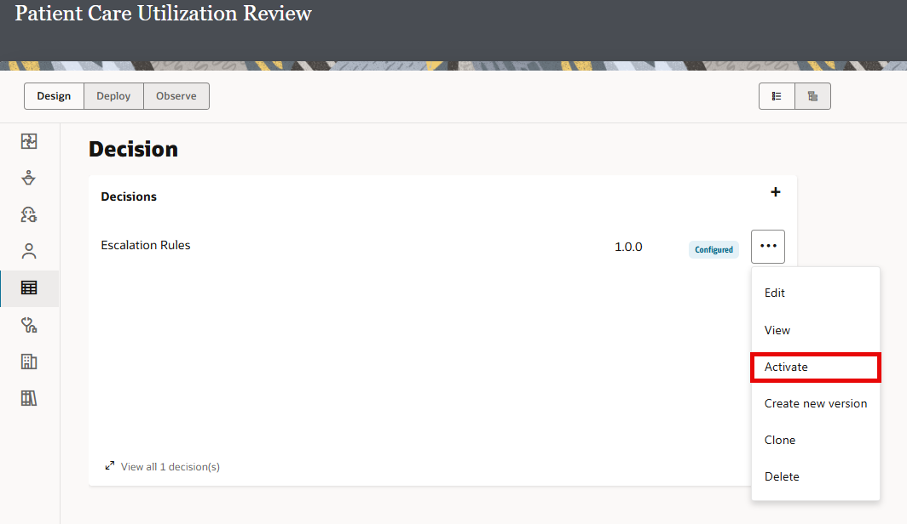
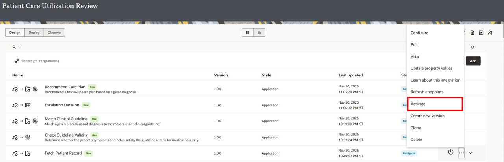
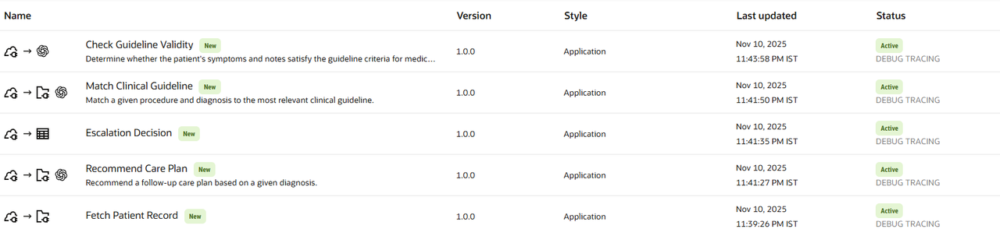

# Create a Project

## Introduction

In this section, you'll import the pre built patient utilization review project into your Oracle Integration environment and configure the necessary connections for the integrations. The project contains five integrations that will become agentic AI tools. To make these integrations functional. We will not be connecting to any external systems, this is a self contained project.

You'll need to configure three essential connections:

- FTP Adapter Connection - For retrieving patient data files from healthcare repositories
- REST Adapter Connection - For Trigger Interface
- OpenAI LLM Connection - For the AI agent's Large Language Model reasoning capabilities

By the end of this section, you'll have a fully operational project with all connections configured and tested, ready for agentic AI tool registration.

Estimated Time: 15 minutes

### Objectives

In this lab, you will:

* Import a Project

### Prerequisites

This lab assumes you have:

* All previous labs completed.
* [Download](https://objectstorage.us-phoenix-1.oraclecloud.com/p/pPTpr7j-uEqeREEidVSaOBtI8m8hafxYqXJpUiX9QmyUJ_3wYFwx_2yXc9JNhxGj/n/oicpm/b/oiclivelabs/o/oic3/core-competency/agentic-ai/lab_artifacts.zip) the Lab artifacts and unzip on your local computer. The lab artifacts contains a .car file (OIC Project) and few .csv and .json files which will act as data source for this usecase.

## Task 1: Import Project

1.  Login into Oracle Integration console.

2.  Navigate to the Projects Section. If you don't see the Projects option, you may need to expand the menu by clicking the hamburger icon (☰) at the top left.

3.  On the Projects page, look for an **Add** button in the top-right corner of the page. Click *Add* and Select *Import* action

    

4.  Locate the OIC project file **Patient\_Utilization\_Review.car** on your local computer. Refer the Prerequisites section above to download the artifacts. Drag the file and drop it into the upload area in the dialog

5.  Click on *Import*.

6.  Upon successful import, you should see Project Name: **Patient Care Utilization Review**

## Task 2: Explore the Imported Project

1.  Once inside the project, you should see the Project Overview page showing:

    - Project Name: Patient Utilization Review
    - Integrations section with the five integrations:
        - Fetch Patient Record : The Fetch Patient Record integration orchestrates the retrieval of patient records by receiving a request from a REST endpoint, invoking an FTP adapter to fetch the records, and then processing the data.
        - Match Clinical Guideline : The Match Clinical Guideline integration orchestrates the matching of clinical guidelines by receiving a procedure and diagnosis input, processing it using OpenAI, and then invoking FTP to load guidelines.
        - Check Guideline Validity : The Check Guideline Validity integration orchestrates the validation of patient symptoms and notes against guideline criteria for medical necessity, utilizing OpenAI and Oracle REST connections.
        - Escalation Decision : Executes the escalation decision table based on quality score and complications. The integration orchestrates the escalation decision service by receiving input, invoking the OIC Decision Service, and returning the decision outcome.
        - Recommend Care Plan : Recommend a follow-up care plan based on a given diagnosis. The integration orchestrates the creation of a care plan by receiving a diagnosis input, processing it using OpenAI, and then invoking FTP to fetch care recommendations.
    - Decisions
        - Escalation Rules : A decision table to determine the appropriate escalation action based on quality assessment score and complications present
    - Connections
        - REST Connection
        - FTP Adapter : This is the place where your clinical data files are stored
        - open AI LLM Connection : To summarize/reason the clinical quality assurance

TIP: Edit each integration and click on **Learn about the Integration** to understand the details of the integration flow.

## Task 3: Configure Connections

All the connections are in draft state. We will configure the connections used by the integration flows.

**REST Connection Configuration**

1.  Edit the REST Connection.

2.  Configure the Security Policy as ** OAuth 2.0 Or Basic Authentication**

3. Click on **Test** and *Save* the connection.

**FTP Adapter Connection Configuration**

Keep the following information handy. Note: Refer File Server Setup section
    - File Server IP Address.
    - File Server Port.
    - Your Oracle Integration username.
    - Your Oracle Integration password.

1.  Edit the FTP Adapter Connection.

2.  Configure the below properties in the connection properties page. Enter the following configurations you previously gathered from the File Server Settings page.  

    | Field                   | Value                                                 |
    |-------------------------|-------------------------------------------------------|
    | FTP Server Host Address | From File Server Settings - IP and Port Information   |
    | FPT Server Port         | From File Server Settings - IP and Port Information   |
    | SFTP Connection         | Yes                                                   |
    | Security                | FTP Server Access Policy                              |
    | Username                | Your Oracle Integration username                      |
    | Password                | Your Oracle Integration password                      |
    {: title="FTP Adapter Connection Properties"}

3. Confirm your Connection by clicking **Test**, then **Diagnose & Test**. You should see the *Connection File Server was tested successfully* confirmation message. Click **Save** and exit the Connection editor.

4. Click on **Test** and *Save* the connection.

**OpenAI LLM Adapter Connection Configuration**

1.  Edit the open AI LLM Adapter Connection.

2.  Configure the below properties in the connection properties page.

    | Field                   | Value                                                 |
    |-------------------------|-------------------------------------------------------|
    | Base URL                | **https://api.openai.com**                                |
    | Models                  | **gpt-4o-mini**                                           |
    | API Key                 | <You open ai API Key> Refer: https://platform.openai.com/api-keys   |
    {: title="OpenAI Adapter Connection Properties"}

3. Click on **Test** and *Save* the connection.

Verify that all the connections are in Configured state.

## Task 4: Configure FTP Adapter in the Imported Integrations

1.  [Download](https://objectstorage.us-phoenix-1.oraclecloud.com/p/pPTpr7j-uEqeREEidVSaOBtI8m8hafxYqXJpUiX9QmyUJ_3wYFwx_2yXc9JNhxGj/n/oicpm/b/oiclivelabs/o/oic3/core-competency/agentic-ai/lab_artifacts.zip) file and unzip if not already done

2.  Using an FTP Client of your choice, connect to FTP Server with the information from [File Server Setup](?lab=setup)

Note: The file server path that you would be using below is just a indicative. You may use any directory location of your choice that was already setup in previous lab and you should have access to it.

3.  There are 3 files in the **Data Source** folder. Upload the *care\_recommendations.json*, *medical\_guidelines.json*, *patient\_records.csv* files to the ftp directory ***<your configured file server path>*** for example: /upload/users/KK/in/patient-utilization-review

**Edit the Fetch Patient Record Integration**

a.  *Edit* the Fetch Patient Record Integration Flow. Select the *loadPatientRecords* FTP invoke activity. Select the three dots and Click on *Edit*.

b.  In the FTP Wizard navigate to the **Operations** page. In the Input Directory field, enter the ***<your configured file server path>***. Click *Next*.
    

c.  Complete the wizard by leaving the rest of the values as defaults and click *Finish*.

**Edit the Match Clinical Guideline Integration**

a.  *Edit* the Match Clinical Guideline Integration Flow. Select the *loadGuidelines* FTP invoke activity. Select the three dots and Click on *Edit*.

b.  In the FTP Wizard navigate to the **Operations** page. In the Input Directory field, enter ***<your configured file server path>***. Click *Next*.

c.  Complete the wizard by leaving the rest of the values as defaults and click *Finish*.

**Edit the Recommend Care Plan Integration**

a.  *Edit* the Recommend Care Plan Integration Flow. Select the *fetchCareRecommendations* FTP invoke activity. Select the three dots and Click on *Edit*.

b.  In the FTP Wizard navigate to the **Operations** page. In the Input Directory field, enter the ***<your configured file server path>***. Click *Next*.

c.  Complete the wizard by leaving the rest of the values as defaults and click *Finish*.

## Task 5: Activate Integrations and Decision

1.  In the **Patient Care Utilization Review** project, Design View select the **Decision** tab. You should see **Escalation Rules** decision listed.

2.  Click the (...) of the Escalation Rules decision, and Select *Activate* from the Action list.
    

3.  Navigate to the **Integrations** tab.

4.  Click the (...) of the **Fetch Patient Record** integration, and Select *Activate* from the Action list. You can also use the activate icon to activate the integration
    

5.  In the **Activate Integration** window select *Debug* and Click on *Activate*. The status changes to **Activate**.

6.  Similarly, activate the other integration flows.
    - Match Clinical Guideline
    - Check Guideline Validity
    - Escalation Decision
    - Recommend Care Plan

    
You may now **proceed to the next lab**.

## Learn More

* [Getting Started with Oracle Integration 3](https://docs.oracle.com/en/cloud/paas/application-integration/index.html)

* [About Projects](https://docs.oracle.com/en/cloud/paas/application-integration/integrations-user/integration-projects.html)

* [Activate Integration](https://docs.oracle.com/en/cloud/paas/application-integration/integrations-user/activate-and-deactivate-integrations.html)

* [Monitor Integration](https://docs.oracle.com/en/cloud/paas/application-integration/integrations-user/track-integration-instances.html#GUID-46A7C0A0-CBE4-4F1B-9B45-62A5AFA89D74)

* [Open AI Adapter](https://docs.oracle.com/en/cloud/paas/application-integration/openai-adapter/openai-adapter-capabilities.html)

## Acknowledgements

* **Author** - Kishore Katta, Director Product Management, Oracle Integration
* **Last Updated By/Date** - Kishore Katta, November 2025
